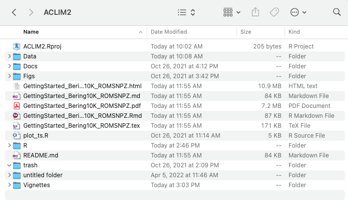
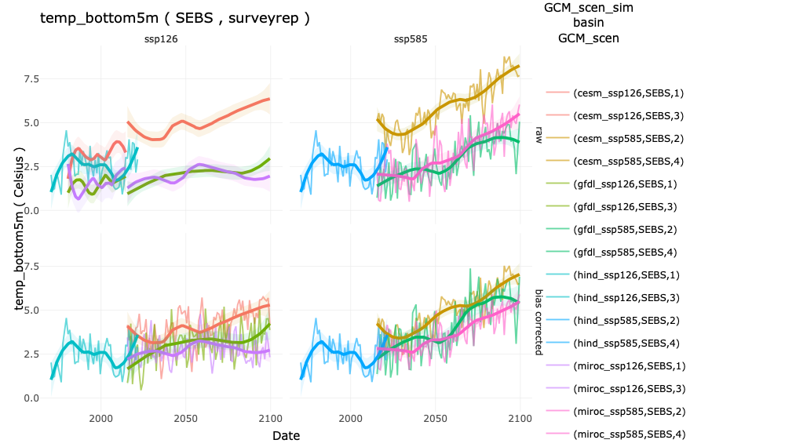
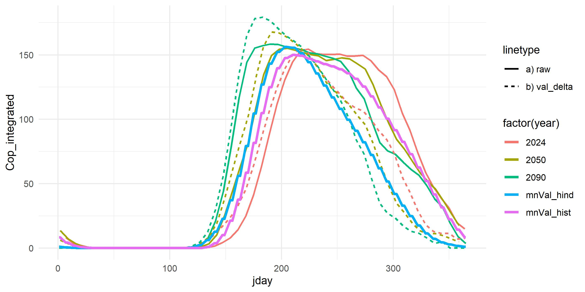
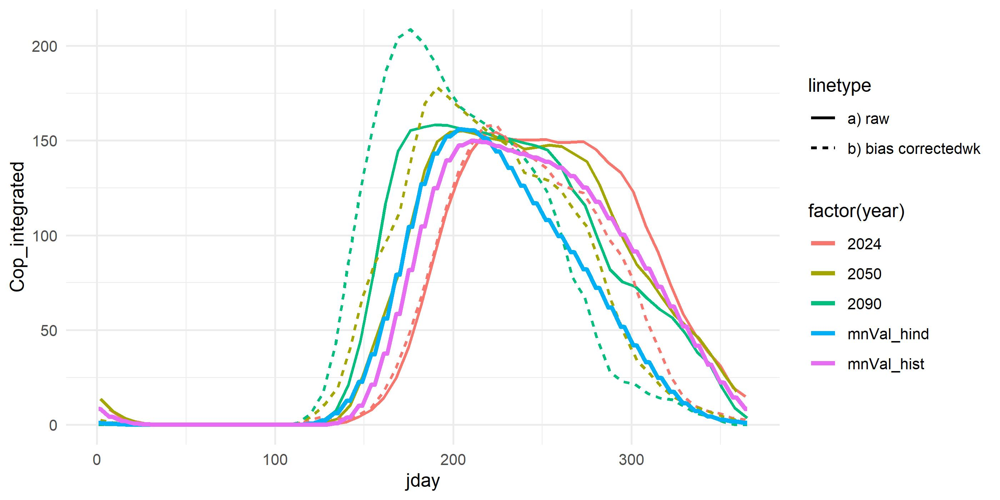
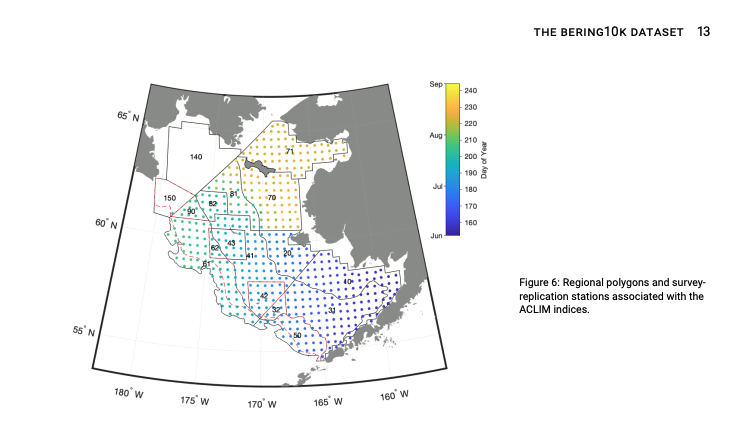

```{r startup, eval=TRUE, echo=FALSE, results='hide',message=FALSE}
 
 #source("R/make.R")       # loads packages, data, setup, etc.
 knitr::opts_chunk$set(echo = T, fig.align="center",warning = FALSE, message = FALSE)
 #knitr::opts_knit$set(root.dir = '../')
 #options(knitr.table.format = "latex")
 thisYr <- format(Sys.time(), "%Y")
 today  <- format(Sys.time(), "%b %d, %Y")
 
```

# Download the ACLIM2 repo & data

## Clone the ACLIM2 repo{.tabset}

To run this tutorial first clone the ACLIM2 repository to your local drive:

### Option 1: Use R  

This set of commands, run within R, downloads the ACLIM2 repository and unpacks it, with the ACLIM2 directory structrue being located in the specified `download_path`.  This also performs the folder renaming mentioned in Option 2.

```{r gitdwnld, eval = FALSE,echo =T}

    # Specify the download directory
    main_nm       <- "ACLIM2"

    # Note: Edit download_path for preference
    download_path <-  path.expand("~")
    dest_fldr     <- file.path(download_path,main_nm)
    url           <- "https://github.com/kholsman/ACLIM2/archive/main.zip"
    dest_file     <- file.path(download_path,paste0(main_nm,".zip"))
    
    download.file(url=url, destfile=dest_file)
    
    # unzip the .zip file (manually unzip if this doesn't work)
    setwd(download_path)
    unzip(dest_file, exdir = download_path,overwrite = T)
    
    #rename the unzipped folder from ACLIM2-main to ACLIM2
    file.rename(paste0(main_nm,"-main"), main_nm)
    setwd(main_nm)
    
    # Caption: Timeseries of season Aug East Bering Sea bottom temp or 400m temp (which ever is shallower)
    # for the 1955-2099 period. The simulations are forced using historical emission (1955 to 2014) and 
    # SSP1-2.6 scenario for future projection (2015 to 2099). A 1-year running mean is applied. Figures show,
    # in colors, CESM2-WACCM ensemble mean, in light grey, the spread of all the CMIP6 models, and in medium 
    # grey, and dark grey, 80% and 50% the spread of all the CMIP6 members, respectively. Left panel shows 
    # the mean values and right panel shows the anomalies relative to the 1980-2013 climatology.
    
    
```

### Option 2: Download the zipped repo  
Download the full zip archive directly from the [**ACLIM2 Repo**](https://github.com/kholsman/ACLIM2) using this link: [**https://github.com/kholsman/ACLIM2/archive/main.zip**](https://github.com/kholsman/ACLIM2/archive/main.zip), and unzip its contents while preserving directory structure. 

**Important!** If downloading from zip, please **rename the root folder** from `ACLIM2-main` (in the zipfile) to `ACLIM2` (name used in cloned copies) after unzipping, for consistency in the following examples.

Your final folder structure should look like this:

{ width=100%}

### Option 3: Use git commandline

If you have git installed and can work with it, this is the preferred method as it preserves all directory structure and can aid in future updating. Use this from a **terminal command line, not in R**, to clone the full ACLIM2 directory and sub-directories:

```{bash, eval = FALSE,echo =T}
    git clone https://github.com/kholsman/ACLIM2.git
```

---

## Get the data

<!-- **Step 1)[ can skip if not using .nc files directly] ** -->
<!-- * Go to the google drive and download the zipped file with the R data `2022_03_07_Rdata.zip`: -->

<!-- * [00_ACLIM_shared > 02_Data > Newest_Data(use this) > unzip_and_putin_Data_in_folder.zip](https://drive.google.com/drive/folders/11BQEfNEl9vvrN-V0LgS67XS4aLE9pNzz) -->

<!-- * Unzip the folder and move the contents of the zipped folder to your local folder `ACLIM2/Data/in`. -->

<!-- <!-- { width=50%} --> -->

<!-- **Step 2)** -->
* Go to the google drive and download the zipped file with the R ACLIM2 indices `ACLIM2_indices.zip`:

* [00_ACLIM_shared > 02_Data > Newest_Data(use this) > unzip_and_put_in_dat_out_folder_CMIP6](https://drive.google.com/drive/u/1/folders/1clPtrPCQMPcwqr8UE78_Sd2IGwyBuDcD)  

* [00_ACLIM_shared > 02_Data > Newest_Data(use this) > unzip_and_put_in_dat_out_folder_CMIP5](https://drive.google.com/drive/u/1/folders/1t_JqDBQU-Fyy5nvIYRAmVcqzWi4mq7mk)

* Unzip `K29P19_CMIP5.zip` or `K29P19_CMIP6.zip` files move the `K29P19_CMIP5` or `K29P19_CMIP6` folders to your local folder `ACLIM2/Data/out`. The result should be the following folder structure on your local computer:  
* `ACLIM2/Data/out/K29P19_CMIP6/allEBSmeans`: main folder with annual, monthly, seasonal, and survey replicated level 4 ACLIM indices
* `ACLIM2/Data/out/K29P19_CMIP6/BC_ACLIMregion`: Weekly x Strata based indices, including delta and bias corrected values (these are "rolled up" to become strata AREA weighted mean vals in the allEBSmeans folder).
* `ACLIM2/Data/out/K29P19_CMIP6/BC_ACLIMsurveyrep`: Survey replicated indices at each station, including delta and bias corrected values (these are "rolled up" to become average across station mean vals in the allEBSmeans folder).

* `ACLIM2/Data/out/K29P19_CMIP5/allEBSmeans`: as above but for CMIP5


<!-- { width=50%} -->


## Set up the Workspace

Open R() and used 'setwd()' to navigate to the root ACLIM2 folder (.e.g, ~/mydocuments/ACLIM2)

```{R  start, eval=TRUE, echo=T, results='show',message=FALSE}
    
    # set the workspace to your local ACLIM2 folder
    # e.g., "/Users/kholsman/Documents/GitHub/ACLIM2"
    # setwd( path.expand("~/Documents/GitHub/ACLIM2") )
   
    # --------------------------------------
    # SETUP WORKSPACE
    tmstp  <- format(Sys.time(), "%Y_%m_%d")
    main   <- getwd()  #"~/GitHub_new/ACLIM2"
    
    # loads packages, data, setup, etc.
    suppressWarnings(source("R/make.R"))
    
```

---


# Read this before you start

## Overview{.tabset}

The [**ACLIM2 github repository**](https://github.com/kholsman/ACLIM2) contains R code and Rdata files for working with netcdf-format data generated from the [**downscaled ROMSNPZ modeling**](https://beringnpz.github.io/roms-bering-sea) of the ROMSNPZ Bering Sea Ocean Modeling team; Drs. Hermann, Cheng, Kearney, Pilcher,Ortiz, and Aydin. The code and R resources described in this tutorial are maintained by [Kirstin Holsman](mailto:kirstin.holsman@noaa.gov) as part of NOAA's [**ACLIM project**](https://www.fisheries.noaa.gov/alaska/ecosystems/alaska-climate-integrated-modeling-project) for the Bering Sea. *See [Hollowed et al. 2020](https://www.frontiersin.org/articles/10.3389/fmars.2019.00775/full) for more information about the ACLIM project.*

---

This document provides an overview of accessing, plotting, and creating bias corrected indices for ACLIM2 based on CMIP6 (embargoed for ACLIM2 users until 2023) and CMIP5 (publicly available) simulations. This guide assumes analyses will take place in R() and that users have access to the data folder within the ACLIM2 shared drive. For more information also see the full tutorial ("GettingStarted_Bering10K_ROMSNPZ" available at the bottom of [**this repo page**](https://github.com/kholsman/ACLIM2).


**Important!** A few key things to know before getting started are detailed below. Please review this information before getting started.

## ROMSNPZ versions

**Important!** ACLIM1 CMIP5 and ACLIM2 CMIP5 and CMIP6 datasets use different base models.

There are two versions of the ROMSNPZ model:

1. ACLIM1 an older 10-depth layer model used for CMIP5 ("H-16")
2. ACLIM2 a new 30-depth layer model used for CMIP6 ("K20" or "K20P19")

The models are not directly comparable, therefore the projections should be bias corrected and recentered to baselines of hindcasts of each model (forced by "observed" climate conditions). i.e. CMIP5 and CMIP6 have corresponding hindcasts:

1. Hindcast for CMIP5 "H19"    -->  H16_CORECFS
2. Hindcast for CMIP5 "K20P19" -->  H16_CORECFS
2. Hindcast for CMIP6 "K20P19" -->  K20_CORECFS

In addition for CMIP6 "historical" runs are available for bias correcting. We will use those below.

For a list of the available simulations for ACLIM enter the following in R():
```{R, eval=TRUE, echo=T, results='show',message=FALSE}
    
    # list of the climate scenarios
    data.frame(sim_list)

```

## ROMSNPZ variables

For a list of the available variables from the ROMSNPZ:

```{R srvdef, eval=TRUE, echo=T, results='show',message=FALSE}
    
    # Metadata for variables
    (srvy_var_def[-(1:5),])

```

## Data outputs
**Important!** There are 2 types of post-processed data available for use in ACLIM.

The ROMSNPZ team has developed a process to provide standardized post-processed outputs from the large (and non-intuitive) ROMSNPZ grid. These have been characterized as:

1. Level 1 (original ROMSNPZ U,V, grid, not rotated or corrected)   
2. Level 2 (lat long bi-weekly high res versions, shouldn't be needed and are difficult to work with)  
3. **Level 3 indices (depth corrected and area weighted means for each model variable; i.e., what we will mostly use) **
    a. "ACLIMsurveyrep_":   groundifsh survey replicated (replicated in space and time)
    b. "ACLIMregion_":      weekly strata based averages
    
To get more information about each of these level 3 datasets enter this in R:

```{R, eval=TRUE, echo=T, results='show',message=FALSE}
    
    # Metadata for Weekly ("ACLIMregion_...") indices
    head(all_info1)
    
    # Metadata for Weekly ("ACLIMsurveyrep_...") indices
    head(all_info2)
    
```

# Indices & bias correction UPDATED{.tabset}

*Summary*

We recommend using the 'mn_val' column in the hindcast and either the 'val_biascorrected' or 'val_delta' column for projections. 

*use val_biascorrected' or 'val_delta'?*

This will depend in part on the index and scale you are working at. For fine scale (weekly strata, or station specific, or finer) we recommend using the 'val_delta', i.e., the delta method. For the ACLIM2 spring sprint we are recommending the 'val_biascorrected' in order to align modeling output.

However,at the larger pooled scales there is very little difference between the two but a sensitivity analysis may be needed to determine if the choice makes a profound difference in projections. Following an in depth analysis of the effects of bias correction at the finer scales of model output we found that bias correction via the Ho et al. method can result in artifacts that impact final indices in unsatisfactory ways. The effects do not emerge as frequently when data are pooled at the annual or basin-wide scale but do occur at finer scales, especially when areas or time-period have values in the hindcast but the corresponding historical runs have only small values, resulting in amplification that is not found in the raw projection to historical time-series comparison. However the Ho et al. approach is better at re-scaling variance between projections and the hindcast, and preserves a more parsimonious variance structure in projections. Whereas, the delta method assumes equal variance between the hindcast and projection models (during the overlapping reference years 1980:2013 when overall variance should match) and does do not adjust projections if the corresponding historical variance is larger or smaller than the hindcast sigma. Applying the delta method adjustment at the smallest possible resolution of the indices (weekly or by station) minimizes the effects of superimposing the variance structure of the historical time-series on the projection.

The average weekly strata value per or the average station value (for survey replicated indices) across the reference years 1980-2013 were calculated for the hindcast and corresponding historical runs to determine the mean hindcast and mean historical values for bias correction; 'mn_hind' and 'mn_hist', respectively. We used the mgcv package to smooth weekly values 'mgcv::gam(...bs="cc")') across all reference years to remove artifacts (e.g. divide by 0) in the average ($\bar{Y}^{hind}_{w,k}$ and $\bar{Y}^{hist}_{w,k}$) and variance ($\sigma^{hist}_{w,k}$ and $\sigma^{hind}_{w,k}$) terms were predicted from the gam (without error; example for $\bar{Y}^{hind}_{w,k}$):

$$ \bar{Y}^{hind}_{w,k} = \mu+s(w, k = .8n)+\epsilon~~and~~\epsilon\sim N(0,\sigma)$$

**Important!** Note: the delta adjustment and the bias corrections were done on "raw" values which in some cases results in negative values (or <0 or >1 for proportion variables like 'aice'). For these variables, values <0 were set to 0, >1 set to 1 as needed after (delta) bias correction. 

{width=75%}

*ACLIM2 Indices correction methods*

###Delta method
The next step creates ACLIM2 indices (i.e., Level4) based on the Level3 output for each hindcast, historical run, and CMIP6 projection. The script below delta adjusts or bias corrects each projected index using the corresponding historical run. (such that projections are $\Delta$ from historical mean values for the reference period ` deltayrs     <- 1980:2013` ).

**Important!** Note that for projections the 'mn_val' represents raw mean values, while 'val_delta' and 'val_biascorrected' are the adjusted values using scaling factor of 1 or SD_hind/SD_hist on a weekly basis (respectively).

Delta method correction was done on "raw" values which in some cases results in negative values (or <0 or >1 for proportion variables like 'aice'). For these variables, values <0 were set to 0, >1 set to 1 as needed after the delta adjustment. Delta method adjustments were conducted at the weekly level for strata specific data and at the station level for survey replicated indices:

Such that ($Y$):
  $${Y}^{fut'}_{t,k} =\bar{Y}^{hind}_{k,\bar{T}} +({Y}^{fut}_{t,k}-\bar{Y}^{hist}_{k,\bar{T}})$$
  
where $\bar{Y}^{fut'}_{y,k}$ is the bias corrected variable $k$ value for time-step $t$ (e.g., year, month, or season), $\bar{Y}^{hind}_{k,\bar{T}}$ is the mean value of the variable $k$ during the reference period $\bar{T}=[1980,2013]$ from the hindcast model, $\sigma^{hind}_{k,\bar{T}}$ is the standard deviation of the hindcast during the reference period $\bar{T}$, $\sigma^{hist}_{k,\bar{T}}$ is the standard deviation of the historical run during tje reference period, ${Y}^{fut}_{t,k}$ is the value of the variable from the projection at time-step $t$ and $\bar{Y}^{hist}_{k,\bar{T}}$ is the average value from the historical run during reference period $\bar{T}$.

<!-- Delta corrections use a scaling factor of 1 were logit for 'val' between 0 and 1 (e.g. aice) or log transformed for val >0 (e.g., zooplankton), delta corrected and then back transformed to normal space using the following correction: -->
<!--   $${Y}^{fut'}_{t,k} =\bar{Y}^{hind}_{k,\bar{T}} +\left( 1*({Y}^{fut}_{t,k}-\bar{Y}^{hist}_{k,\bar{T}})  \right )$$ -->
<!--   (note: for log and logit transformations a offset of 1e^-4 was used to avoid Inf or NA values: -->
<!--     $${Y_{adj} = ln(Y+1e^{-4})}$$ and $${Y' = e(Y'_{adj})-1e^{-4}}$$  -->

###Bias correction

Bias correction was done on "raw" values which in some cases results in negative values (or <0 or >1 for proportion variables like 'aice'). For these variables, values <0 were set to 0, >1 set to 1 as needed after bias correction. Bias correction adjustments were conducted at the weekly level for strata specific data and at the station level for survey replicated indices:

Such that ($Y$):
  $${Y}^{fut'}_{t,k} =\bar{Y}^{hind}_{k,\bar{T}} +\left( \frac{\sigma^{hind}_{k,\bar{T}}}{\sigma^{hist}_{k,\bar{T}}}*({Y}^{fut}_{t,k}-\bar{Y}^{hist}_{k,\bar{T}})  \right )$$
  
where $\bar{Y}^{fut'}_{y,k}$ is the bias corrected variable $k$ value for time-step $t$ (e.g., year, month, or season), $\bar{Y}^{hind}_{k,\bar{T}}$ is the mean value of the variable $k$ during the reference period $\bar{T}=[1980,2013]$ from the hindcast model, $\sigma^{hind}_{k,\bar{T}}$ is the standard deviation of the hindcast during the reference period $\bar{T}$, $\sigma^{hist}_{k,\bar{T}}$ is the standard deviation of the historical run during tje reference period, ${Y}^{fut}_{t,k}$ is the value of the variable from the projection at time-step $t$ and $\bar{Y}^{hist}_{k,\bar{T}}$ is the average value from the historical run during reference period $\bar{T}$.

For log-normally distributed variables($Y$):
  $${Y}^{fut'}_{y,k} =e^{\ln\bar{Y}^{hind}_{k,\bar{T}} +\left( \frac{\hat{\sigma}^{hind}_{k,\bar{T}}}{\hat{\sigma}^{hist}_{k,\bar{T}}}*(\ln{Y}^{fut}_{t,k}-\ln\bar{Y}^{hist}_{k,\bar{T}})  \right )}$$,
  where $\hat\sigma^{hist}_{k,\bar{T}}$ and $\hat\sigma^{hind}_{k,\bar{T}}$ are the standard deviation of the $\ln\bar{Y}^{hist}_{k,t}$ and $\ln\bar{Y}^{hind}_{k,t}$ during the reference period $\hat{T}$ (respectively).
  

## Weekly X strata indices

Uses the strata x weekly data ('ACLIMregion') to generate strata-specific averages in order to generate the strata area-weighted averages for each week $w$ each year $y$. 
  
  $$\bar{Y}_{k,y,w}= \frac{\sum^{n_s}_{l}(\frac{1}{n_i}\sum^{n_t}_{t}Y_{k,y,s,w,t})*A_s} {\sum^{n_s}_{s}{A_s}}$$, where $Y_{k,w,y,s,t}$ is the value of the variable $k$ in strata $s$ at time $t$ in year $y$, $A_s$ is the area of strata $s$, $n_i$ is the number of stations in strata $s$, and $n_s$ is the number of strata $s$ in each basin (NEBS or SEBS).
  
  $\bar{Y}_{w,y,k}$ was calculated for the hindcast, historical run, and projection time-series.  

Projections $\bar{Y}_{k,y,w}$ were *bias corrected* using the Ho et al. 2019 method and corresponding historical and hindcast values such that (and a scaling factor dependent on the variance of each):
  
  $$\bar{Y}^{fut'}_{k,y,w} =\bar{Y}^{hind}_{w,k} +\left( \frac{\sigma^{hind}_{w,k}}{\sigma^{hist}_{w,k}}*(\bar{Y}^{fut}_{k,y,w}-\bar{Y}^{hist}_{w,k})  \right )$$, where $\bar{Y}^{hist}_{w,k}$ and $\bar{Y}^{hind}_{w,k}$ are the average historical weekly values across years in the period (`r ref_years[1]` to `r rev(ref_years)[2]` ; adjustable in `R/setup.R`).
  
Projections $\bar{Y}_{k,y,w}$ were also *delta corrected* (assuming a scaling factor = 1) using the corresponding historical and hindcast values such that:
  
  $$\bar{Y}^{fut'}_{k,y,w} =\bar{Y}^{hind}_{w,k} +\left( \frac{1}{1}*(\bar{Y}^{fut}_{k,y,w}-\bar{Y}^{hist}_{w,k})  \right )$$, where $\bar{Y}^{hist}_{w,k}$ and $\bar{Y}^{hind}_{w,k}$ are the average historical weekly values across years in the period (`r ref_years[1]` to `r rev(ref_years)[2]` ; adjustable in `R/setup.R`).

## NESB & SEBS wide averaged indices

The average water column values for each variable from the ROMSNPZ model strata x weekly Level2 outputs ('ACLIMregion') were calculated and used to calculate the strata-area weighted mean value for the NEBS and SEBS weekly, monthly, seasonally, and annually. Similarly, for survey replicated ('ACLIMsurveyrep') Level2 outputs the average water column value for each variable at each station was calculated used to calculate the strata-area weighted mean value for the NEBS and SEBS annually. These indices were calculate for hindcast, historical, and projection scenarios, and used to bias correct the projections. More information on the methods for each can be found in the tabs below and the code in Appendix A following this section will re-generate the bias corrected indices. All of the bias corrected outputs can be found in the "Data/out/K20P19_CMIP6" folder. 

The same approach was applied to the weekly strata data such that weekly strata values were calculated as:

$$\bar{Y}_{k,y,s,w}= \sum^{n_s}_{l}(\frac{1}{n_i}\sum^{n_t}_{t}Y_{k,y,s,w,t})$$

  $$\bar{Y}^{fut'}_{k,s,y,w} =\bar{Y}^{hind}_{k,s,w} +\left( \frac{\sigma^{hind}_{k,s,w}}{\sigma^{hist}_{k,s,w}}*(\bar{Y}^{fut}_{k,s,y,w}-\bar{Y}^{hist}_{k,s,w})  \right )$$, where $\bar{Y}^{hist}_{k,s,w}$ and $\bar{Y}^{hind}_{k,s,w}$ are the average historical weekly values across years in the period (`r ref_years[1]` to `r rev(ref_years)[2]` ; adjustable in `R/setup.R`).Where the mean and variance terms were smoothed at the weekly and strata level (i.e., $$\bar{Y}^{hind}_{w,k}$$ was predicted from the following gam() without error)

$$ \bar{Y}^{hind}_{k,s,w} = \mu+s(w, k = .8n)+\epsilon ~~and~~\epsilon\sim N(0,\sigma) $$


{width=60%}  


{width=60%}


## Monthly indices  

Using the bias corrected weekly or strata x weekly indices, we then generated monthly indices for each month $m$ each year $y$.
  
 $$\bar{Y}_{k,y,m}= \frac{1}{n_w}\sum^{n_w}_{w}\bar{Y}_{k,y,w}$$, where $\bar{Y}_{w,y,k}$ are the weekly average indices for variable $k$ in year $y$ from the previous step ,$n_w$ is the number of weeks in each month $m$ as:
  
  $$\bar{Y}^{fut'}_{k,y,m} = \frac{1}{n_w}\sum^{n_w}_{w}\bar{Y}^{fut'}_{k,y,w}$$  
 for area weighted SEBS and NEBS bias corrected values. Similarly we used the following  for monthly strata values:  
 $$\bar{Y}^{fut'}_{k,s,y,m} = \frac{1}{n_w}\sum^{n_w}_{w}\bar{Y}^{fut'}_{k,s,y,w}$$  
 
 similarly NEBS and SEBS monthly averages and strata monthly averages for the hindcast were calculated as:
 
 $$\bar{Y}^{hind}_{k,y,m} = \frac{1}{n_w}\sum^{n_w}_{w}\bar{Y}^{hind}_{k,y,w}$$  
 
 $$\bar{Y}^{hind}_{k,s,y,m} = \frac{1}{n_w}\sum^{n_w}_{w}\bar{Y}^{hind}_{k,s,y,w}$$ 

## Seasonal indices  

Using the bias corrected weekly or strata x weekly indices, we then generated seasonal indices for each season $l$ each year $y$.
  
  $$\bar{Y}_{k,y,l}= \frac{1}{n_w}\sum^{n_w}_{w}\bar{Y}_{k,y,w}$$, where $\bar{Y}_{w,y,k}$ are the weekly average indices for variable $k$ in year $y$ from the previous step ,$n_w$ is the number of weeks in each seasonal $l$ as:
  
  $$\bar{Y}^{fut'}_{k,y,l} = \frac{1}{n_w}\sum^{n_w}_{w}\bar{Y}^{fut'}_{k,y,w}$$  
 for area weighted SEBS and NEBS bias corrected values. Similarly we used the following for seasonal strata values:  
 $$\bar{Y}^{fut'}_{k,s,y,l} = \frac{1}{n_w}\sum^{n_w}_{w}\bar{Y}^{fut'}_{k,s,y,w}$$  
 
 similarly NEBS and SEBS seasonal averages and strata seasonal averages for the hindcast were calculated as:
 
 $$\bar{Y}^{hind}_{k,y,l} = \frac{1}{n_w}\sum^{n_w}_{w}\bar{Y}^{hind}_{k,y,w}$$  
 
 $$\bar{Y}^{hind}_{k,s,y,l} = \frac{1}{n_w}\sum^{n_w}_{w}\bar{Y}^{hind}_{k,s,y,w}$$ 
  
## Annual indices  

Using the bias corrected weekly or strata x weekly indices, we then generated seasonal indices for  each year $y$.
  
  $$\bar{Y}_{k,y}= \frac{1}{n_w}\sum^{n_w}_{w}\bar{Y}_{k,y,w}$$, where $\bar{Y}_{w,y,k}$ are the weekly average indices for variable $k$ in year $y$ from the previous step ,$n_w$ is the number of weeks in each year $y$ as:
  
  $$\bar{Y}^{fut'}_{k,y} = \frac{1}{n_w}\sum^{n_w}_{w}\bar{Y}^{fut'}_{k,y,w}$$  
 for area weighted SEBS and NEBS bias corrected values. Similarly we used the following for annual strata values:  
 $$\bar{Y}^{fut'}_{k,s,y} = \frac{1}{n_w}\sum^{n_w}_{w}\bar{Y}^{fut'}_{k,s,y,w}$$  
 
 similarly NEBS and SEBS annual averages and strata annual averages for the hindcast were calculated as:
 
 $$\bar{Y}^{hind}_{k,y} = \frac{1}{n_w}\sum^{n_w}_{w}\bar{Y}^{hind}_{k,y,w}$$  
 
 $$\bar{Y}^{hind}_{k,s,y} = \frac{1}{n_w}\sum^{n_w}_{w}\bar{Y}^{hind}_{k,s,y,w}$$ 
  
## Annual survey rep. indices 

Uses the station specific survey replicated (in time and space) data ('ACLIMsurveyrep') to generate strata-specific averages in order to generate the strata area-weighted averages for each year $y$.
  
  $$\bar{Y}_{y,k}= \frac{\sum^{n_s}_{l}(\frac{1}{n_i}\sum^{n_i}_{i}Y_{k,y,s,i})*A_s} {\sum^{n_s}_{s}{A_s}}$$, where $Y_{k,y,s,i}$ is the value of the variable $k$ at station $i$ in strata $s$ in year $y$, $A_s$ is the area of strata $s$, $n_i$ is the number of stations in strata $s$, and $n_s$ is the number of strata $s$ in each basin (NEBS or SEBS).
  
  $\bar{Y}_{y,k}$ was calculated for the hindcast, historical run, and projection time-series. For projections $\bar{Y}_{y,k}$ was bias corrected using the corresponding historical and hindcast values such that:
  
  $$\bar{Y}^{fut'}_{y,k} =\bar{Y}^{hind}_{k} +\left( \frac{\sigma^{hind}_{k}}{\sigma^{hist}_{k}}*(\bar{Y}^{fut}_{y,k}-\bar{Y}^{hist}_{k})  \right )$$, where $\bar{Y}^{hind}_{k}$ and $\bar{Y}^{hist}_{k}$ are the average historical values across years in the reference period (`r ref_years[1]` to `r rev(ref_years)[2]` ; adjustable in `R/setup.R`).    

Appendix A includes the code used to generate the ACLIM2 indices and bias correct them. That code can be run to re-make the indices if you like but takes approx 30 mins a CMIP to run. 

# Plot & concat Indices {.tabset}

The following code will open an interactive shiny() app for exploring the indices. You can also view this online at (kkh2022.shinyapps.io/ACLIM2_indices)[https://kkh2022.shinyapps.io/ACLIM2_indices/].

```{r, eval=F, include=T,echo=T}
  suppressMessages(source("R/make.R"))  
  
  tmpwd<-getwd()
  setwd("R/shiny_aclim/ACLIM2_indices")  
  shiny::runApp("app.R")
  setwd(tmpwd)
  # alternatively you can extract the data you want using the get_var()function
  
  df <- get_var(typeIN = "annual",plotvar = "temp_bottom5m",plothist = F)
  
  df$plot
  head(df$dat)


```

{width=100%}

<!-- ## Annual indices -->

<!-- ```{r explore, eval=F, include=T,echo=T} -->
<!--     # -------------------------------------- -->
<!--     # SETUP WORKSPACE -->
<!--     main   <- getwd()  #"~/GitHub_new/ACLIM2" -->

<!--     # loads packages, data, setup, etc. -->
<!--     suppressMessages(source("R/make.R")) -->


<!--     # load the Indices: -->
<!--     fldr <- "Data/out/K20P19_CMIP6/allEBS_means" -->
<!--     dirlist <-grep ("annual", dir(fldr)) -->
<!--     for(d in dirlist) -->
<!--       load(file.path(fldr,d)) -->
<!--     hnd <- ACLIM_annual_fut_mn -->

<!-- ```` -->


<!-- # Special cases {.tabset} -->
## Continuous timeseries of hind + fut

```{r ts, eval=T, include=T,echo=T, results='hide',message=FALSE}
    
    suppressMessages(source("R/make.R"))  
 
    scens   <- c("ssp126", "ssp585")
    GCMs    <- c("miroc", "gfdl", "cesm" )
    
  # get the variable you want:
      df <- get_var( typeIN    = "annual", 
                     plotvar   = "temp_bottom5m",
                     bcIN      = c("raw","bias corrected"),
                     CMIPIN    = c("K20P19_CMIP5","K20P19_CMIP6"), 
                     plothist  = T,  # ignore the hist runs
                     removeyr1 = T)  # "Remove first year of projection ( burn in)")
      
      df$plot+coord_cartesian(ylim = c(0, 10))
      head(df$dat)
    
  # concat the hind and fut runs by removing years from projection
     stitchDate <- "2020-12-30"

  newdat <- stitchTS(dat = df$dat,
                   maxD  = stitchDate)
  
  # newdat has the full set of data
  # select miroc_ssp126
  head(newdat%>%dplyr::filter(GCM_scen==paste0(GCMs[1],"_",scens[1])))
  tail(newdat%>%dplyr::filter(GCM_scen==paste0(GCMs[1],"_",scens[1])))
  
  pp <- plotTS(newdat%>%mutate(mn_val=val_use) )
  pp
        
```

```{r, fig.width=8, fig.height=6, fig.fullwidth=TRUE, echo =T, eval=T}
 
  # plot it interactively
  plotly::ggplotly(pp)

```

## RKC indices (Andre)

The target indices for RKC include bottom temperature,SST, wind, and other indices during multiple larval phases and very specific station locations.

Two approaches were used
(1) generate strata-specific indices for spring and summer and fall
(2) generate averages across a subset of stations for summer replicated indicies


Hindcast values from 1970-2019 were stitched the operational hindcast (2019-2022) and ACLIM projections from 2022-2100 to generate the indices for CMIP5 and CMIP6.


```{r nrs, eval=F, include=T,echo=T, results='hide',message=FALSE}
  # to access these scripts go to https://github.com/kholsman/ACLIM2/tree/main/R/sub_scripts
 
suppressMessages(source("R/make.R"))
 source("R/sub_scripts/make_RKC_Indices_Andre.R")

# Check the Indices
  load("Data/out/PCOD_indices/PCOD_vars.Rdata")   
  load("Data/out/PCOD_indices/PCOD_vars_op.Rdata")   

  require(ggplot2)
  require(dplyr)
 
  load("Data/out/NRS_indices/NRS_vars_raw.Rdata")   
  load("Data/out/NRS_indices/NRS_vars_op_raw.Rdata")    
  NRS_vars_raw <- NRS_vars
  NRS_vars_op_raw <- NRS_vars_op
  rm(NRS_vars)
  rm(NRS_vars_op)
  load("Data/out/NRS_indices/NRS_vars.Rdata")   
  load("Data/out/NRS_indices/NRS_vars_op.Rdata")  
  
  unique(NRS_vars$var)
  unique(NRS_vars$scen)
  
  plot_var  <- "fracbelow2" #  plot_var  <- "temp_surface5m"
  plot_scen <- "ssp585"     # plot_scen <- "rcp45"
 
 
 dat_all <- rbind(
   NRS_vars_op%>%filter(var==plot_var,scen==plot_scen)%>%
     select(year,val_use, val_raw, val_biascorrected,val_delta,GCM_scen)%>%
     mutate(type="NRS_vars_op",op = "op",raw="corrected"),
   
   NRS_vars_op_raw%>%filter(var==plot_var,scen==plot_scen)%>%
     select(year,val_use, val_raw, val_biascorrected,val_delta,GCM_scen)%>%
     mutate(type="NRS_vars_op_raw",op = "op",raw="raw"),
   
   NRS_vars%>%filter(var==plot_var,scen==plot_scen)%>%
     select(year,val_use, val_raw, val_biascorrected,val_delta,GCM_scen)%>%
     mutate(type="NRS_vars",op = "not op",raw="corrected"),
   
   NRS_vars_raw%>%filter(var==plot_var,scen==plot_scen)%>%
     select(year,val_use, val_raw, val_biascorrected,val_delta,GCM_scen)%>%
     mutate(type="NRS_vars_raw",op = "not op",raw="raw"))
 
 
 # compare val_use and val_biascorrected (should be diff for raw):
 p1<- ggplot(dat = dat_all)+
    geom_line(aes(x=year, y=val_use,color=GCM_scen,linetype="val_use"),size=.7)+
    geom_line(aes(x=year, y=val_biascorrected,color=GCM_scen,linetype="val_biascorrected"),size=.8)+
    theme_minimal()+facet_grid(op~raw)+ylab("value")
 p1
 
 jpeg("Data/out/NRS_indices/raw_vs_not_NRS_1.jpg",width=8, height=6, res=350, units="in")
 p1
 dev.off()

 
  # compare val_delta and val_biascorrected (should be the same for all plots)
 p2<- ggplot(dat = dat_all)+
    geom_line(aes(x=year, y=val_biascorrected,color=GCM_scen,linetype="val_biascorrected"),size=.7)+
    geom_line(aes(x=year, y=val_delta,color=GCM_scen,linetype="val_delta"),size=.8)+
    theme_minimal()+facet_grid(op~raw)+ylab("value")
 p2
 
 jpeg("Data/out/NRS_indices/raw_vs_not_NRS_2.jpg",width=8, height=6, res=350, units="in")
 p2
 dev.off()
 
   # compare val_raw and val_use (should be different for "corrected" (not raw))
 p3<- ggplot(dat = dat_all)+
    geom_line(aes(x=year, y=val_use,color=GCM_scen,linetype="val_use"),size=.7)+
    geom_line(aes(x=year, y=val_raw,color=GCM_scen,linetype="val_raw"),size=.8)+
    theme_minimal()+facet_grid(op~raw)+ylab("value")
 p3
 
 jpeg("Data/out/NRS_indices/raw_vs_not_NRS_3.jpg",width=8, height=6, res=350, units="in")
 p3
 dev.off()
  
```    


## NRS indices (André)

The target indices for NRS include cold pool, bottom temperature, wind, SEBS and NEBS, during the growing season (May-August)  

*Cold pool (1.5degC)coverage in the northern nursery area based on summer bottom trawl survey data. Northern nursery area is approx strata 10& 20, however these are likely correlated with overall coldpool so we used the annual cp index.  
*Winds in the northern nursery area during the larval draft period (April1-June30) Cooper et al. 2019.  
*pH in the spawning grounds during Jan – March.   
*Summer (May-August) SST and BT in the SEBS  

Hindcast values from 1970-2019 were stitched the operational hindcast (2019-2022) and ACLIM projections from 2022-2100 to generate the indices for CMIP5 and CMIP6.


```{r nrs, eval=F, include=T,echo=T, results='hide',message=FALSE}
  # to access these scripts go to https://github.com/kholsman/ACLIM2/tree/main/R/sub_fun
 suppressMessages(source("R/make.R"))
 source("R/sub_scripts/make_NRS_indices.R")
 source("R/sub_scripts/make_NRS_indices_raw.R")
 source("R/sub_scripts/make_pcod_indices_Andre.R")

# Check the Indices
  load("Data/out/PCOD_indices/PCOD_vars.Rdata")   
  load("Data/out/PCOD_indices/PCOD_vars_op.Rdata")   

  require(ggplot2)
  require(dplyr)
 
  load("Data/out/NRS_indices/NRS_vars_raw.Rdata")   
  load("Data/out/NRS_indices/NRS_vars_op_raw.Rdata")    
  NRS_vars_raw <- NRS_vars
  NRS_vars_op_raw <- NRS_vars_op
  rm(NRS_vars)
  rm(NRS_vars_op)
  load("Data/out/NRS_indices/NRS_vars.Rdata")   
  load("Data/out/NRS_indices/NRS_vars_op.Rdata")  
  
  unique(NRS_vars$var)
  unique(NRS_vars$scen)
  
  plot_var  <- "fracbelow2" #  plot_var  <- "temp_surface5m"
  plot_scen <- "ssp585"     # plot_scen <- "rcp45"
 
 
 dat_all <- rbind(
   NRS_vars_op%>%filter(var==plot_var,scen==plot_scen)%>%
     select(year,val_use, val_raw, val_biascorrected,val_delta,GCM_scen)%>%
     mutate(type="NRS_vars_op",op = "op",raw="corrected"),
   
   NRS_vars_op_raw%>%filter(var==plot_var,scen==plot_scen)%>%
     select(year,val_use, val_raw, val_biascorrected,val_delta,GCM_scen)%>%
     mutate(type="NRS_vars_op_raw",op = "op",raw="raw"),
   
   NRS_vars%>%filter(var==plot_var,scen==plot_scen)%>%
     select(year,val_use, val_raw, val_biascorrected,val_delta,GCM_scen)%>%
     mutate(type="NRS_vars",op = "not op",raw="corrected"),
   
   NRS_vars_raw%>%filter(var==plot_var,scen==plot_scen)%>%
     select(year,val_use, val_raw, val_biascorrected,val_delta,GCM_scen)%>%
     mutate(type="NRS_vars_raw",op = "not op",raw="raw"))
 
 
 # compare val_use and val_biascorrected (should be diff for raw):
 p1<- ggplot(dat = dat_all)+
    geom_line(aes(x=year, y=val_use,color=GCM_scen,linetype="val_use"),size=.7)+
    geom_line(aes(x=year, y=val_biascorrected,color=GCM_scen,linetype="val_biascorrected"),size=.8)+
    theme_minimal()+facet_grid(op~raw)+ylab("value")
 p1
 
 jpeg("Data/out/NRS_indices/raw_vs_not_NRS_1.jpg",width=8, height=6, res=350, units="in")
 p1
 dev.off()

 
  # compare val_delta and val_biascorrected (should be the same for all plots)
 p2<- ggplot(dat = dat_all)+
    geom_line(aes(x=year, y=val_biascorrected,color=GCM_scen,linetype="val_biascorrected"),size=.7)+
    geom_line(aes(x=year, y=val_delta,color=GCM_scen,linetype="val_delta"),size=.8)+
    theme_minimal()+facet_grid(op~raw)+ylab("value")
 p2
 
 jpeg("Data/out/NRS_indices/raw_vs_not_NRS_2.jpg",width=8, height=6, res=350, units="in")
 p2
 dev.off()
 
   # compare val_raw and val_use (should be different for "corrected" (not raw))
 p3<- ggplot(dat = dat_all)+
    geom_line(aes(x=year, y=val_use,color=GCM_scen,linetype="val_use"),size=.7)+
    geom_line(aes(x=year, y=val_raw,color=GCM_scen,linetype="val_raw"),size=.8)+
    theme_minimal()+facet_grid(op~raw)+ylab("value")
 p3
 
 jpeg("Data/out/NRS_indices/raw_vs_not_NRS_3.jpg",width=8, height=6, res=350, units="in")
 p3
 dev.off()
  
```    


## monthly indices (Andy)

```{r ewe, eval=F, include=T,echo=T, results='hide',message=FALSE}

  suppressMessages(source("R/make.R"))
  
  # preview possible variables
  load(paste0("Data/out/K20P19_CMIP6/allEBS_means/ACLIM_monthly_hind_mn.Rdata"))
  varall  <- unique(ACLIM_monthly_hind$var)
  varall
  
  scens   <- c("ssp126","ssp585")
  GCMs    <- c("miroc","gfdl",  "cesm" )
  varlist <- c("temp_bottom5m","fracbelow2","uEast_surface5m")

  # get the variable you want:
  df <- get_var( typeIN    = "annual", 
                  CMIPIN    = "K20P19_CMIP6",
                  plotvar   = "uEast_surface5m",
                  bcIN      = "bias corrected",
                  plotbasin    = c("SEBS"),
                  GCMIN     = c("miroc" ,"gfdl" , "cesm" ),
                  plothist  = F,  # ignore the hist runs
                  removeyr1 = T)  #"Remove first year of projection ( burn in)")

  df <- get_var( typeIN    = "monthly", 
                 CMIPIN    = "K20P19_CMIP6",
                 monthIN   = 2,
                 plotvar   = "temp_bottom5m",
                 bcIN      = "bias corrected",
                 plothist  = F,  # ignore the hist runs
                 removeyr1 = T)  #"Remove first year of projection ( burn in)")


  head(df$dat)
  df$plot
  
  # concat the hind and fut runs by removing years from projection
  maxDin <- max(as.vector(df$dat%>%dplyr::filter(sim_type=="hind")%>%
                            ungroup()%>%dplyr::select(mnDate))[[1]])
  
  newdat <- stitchTS(dat = df$dat,
                   maxD  = maxDin)
  
  # newdat has the full set of data
  # select miroc_ssp126
  head(newdat%>%dplyr::filter(GCM_scen==paste0(GCMs[1],"_",scens[1])))
  tail(newdat%>%dplyr::filter(GCM_scen==paste0(GCMs[1],"_",scens[1])))

  newdat$mn_val <- newdat$val_delta
  newdat$units <- ""
  pp  <- ggplot(newdat)+
            geom_line(aes(x=mnDate,y=mn_val,color= GCM_scen, linetype = basin),
                      alpha = 0.6,show.legend = FALSE)+
            geom_smooth(aes(x=mnDate,y=mn_val,color= GCM_scen,
                            fill=GCM_scen,linetype = basin),alpha=0.1,
                        method="loess",formula='y ~ x',span = .5,show.legend=T)+
            theme_minimal() + 
            labs(x="Date",
                   y=paste(newdat$var[1],"(",newdat$units[1],")"),
                   subtitle = "",
                   legend = "",
                   title = paste(newdat$var[1],"(",newdat$basin[1],",",newdat$type[1],")"))+
          scale_color_discrete()+
          facet_grid(scen~.)
  pp
        
```

```{r, fig.width=8, fig.height=6, fig.fullwidth=TRUE, echo =T, eval=T}
  
  # plot it interactively
  plotly::ggplotly(pp)

```

## weekly indices (Jon)

```{r sizespec, eval=F, include=T,echo=T, results='hide',message=FALSE}

  suppressMessages(source("R/make.R"))
  
  # preview possible variables
  load(paste0("Data/out/K20P19_CMIP6/allEBS_means/ACLIM_weekly_hind_mn.Rdata"))
  varall  <- unique(ACLIM_weekly_hind$var)
  varall


  scens   <- c("ssp126","ssp585")
  GCMs    <- c("miroc","gfdl",  "cesm" )
  varlist <- c("temp_bottom5m","fracbelow2","uEast_surface5m")
  
  # get the variable you want:
  df <- get_var( typeIN    = "weekly", 
                 plotvar   = "temp_bottom5m",
                 bcIN      = "bias corrected",
                 plothist  = F,  # ignore the hist runs
                 removeyr1 = T)  #"Remove first year of projection ( burn in)")
  
  df$plot
  head(df$dat)
  
  ggplot(df$dat%>%filter(basin=="SEBS"))+ geom_line(aes(x=jday, y= mn_val, color=factor(year)))+facet_wrap(GCM_scen_sim~.)

  # concat the hind and fut runs by removing years from projection
  maxDin <- max(as.vector(df$dat%>%dplyr::filter(sim_type=="hind")%>%dplyr::select(mnDate))[[1]])
  
  newdat <- stitchTS(dat = df$dat,
                   maxD  = maxDin)
  
  # newdat has the full set of data
  # select miroc_ssp126
  head(newdat%>%dplyr::filter(GCM_scen==paste0(GCMs[1],"_",scens[1])))
  
  
  pp  <- ggplot(newdat)+
            geom_line(aes(x=mnDate,y=mn_val,color= GCM_scen, linetype = basin),
                      alpha = 0.6,show.legend = FALSE)+
            geom_smooth(aes(x=mnDate,y=mn_val,color= GCM_scen,
                            fill=GCM_scen,linetype = basin),alpha=0.1,
                        method="loess",formula='y ~ x',span = .5,show.legend=T)+
            theme_minimal() + 
            labs(x="Date",
                   y=paste(newdat$var[1],"(",newdat$units[1],")"),
                   subtitle = "",
                   legend = "",
                   title = paste(newdat$var[1],"(",newdat$basin[1],",",newdat$type[1],")"))+
          scale_color_discrete()+
          facet_grid(scen~.)
  # plot it
  pp
        
```

```{r, fig.width=8, fig.height=6, fig.fullwidth=TRUE, echo =T, eval=T}

  # plot it interactively
  plotly::ggplotly(pp)

```

## Salmon index (Ellen)

1. temperature_surface5m for months 9:10 and strata 70 & 71  
2. NW direction for months 5:6 and strata 71  
3. temperature_surface5m for months 7:10 and strata 90,61,62  

```{r salmon, eval=F, include=T,echo=T, results='hide',message=FALSE}
 # loads packages, data, setup, etc.
  suppressMessages( suppressWarnings(source("R/make.R")))

# get the variable you want:
      df <- get_var( typeIN    = "monthly", 
                     monthIN   = 9:10,
                     plotvar   = "temp_bottom5m",
                     bcIN      = c("raw","bias corrected"),
                     CMIPIN    = "K20P19_CMIP6", 
                     plothist  = T,  # ignore the hist runs
                     removeyr1 = T)  # "Remove first year of projection ( burn in)")
      
      df$plot+coord_cartesian(ylim = c(0, 7))
      head(df$dat)
    
  # concat the hind and fut runs by removing years from projection
     stitchDate <- "2020-12-30"

  newdat <- stitchTS(dat = df$dat,
                   maxD  = stitchDate)
  
  # newdat has the full set of data
  # select miroc_ssp126
  head(newdat%>%dplyr::filter(GCM_scen==paste0(GCMs[1],"_",scens[1])))
  tail(newdat%>%dplyr::filter(GCM_scen==paste0(GCMs[1],"_",scens[1])))
  
  pp <- plotTS(newdat )
  pp
        
```

## make CEATTLE indices (Kir)
```{r ceattle, eval=F, include=T,echo=T, results='hide',message=FALSE}
suppressMessages( suppressWarnings(source("R/make.R")))
source("R/sub_scripts/make_ceattle_indices.R")
source("R/sub_scripts/make_CEATTLE_dat_files.R")


# now jump down to make .dat file that is generic

```

## quick(er) bias correction for cell by cell data (Liz)

```{r highres1, eval=F, include=T,echo=T, results='hide',message=FALSE}
 #  setwd("D:/GitHub_cloud/ACLIM2")
 # loads packages, data, setup, etc.
  suppressMessages( suppressWarnings(source("R/make.R")))


# load the strata x weekly bias corrected values ("fut") for each gcm in the cmip6
  cmipfldr <- "K20P19_CMIP6"
  gcmcmipL <- c("B10K-K20P19_CMIP6_miroc",
                    "B10K-K20P19_CMIP6_gfdl",
                    "B10K-K20P19_CMIP6_cesm")
i<- 0
for(scen in c("ssp126","ssp585")){
  for (gcmcmip in gcmcmipL){
  i <- i+ 1
  cat(" -- loading ", gcmcmip, " ",scen,"\n")
  # extract gcm and cmip:
  
  mod   <- (strsplit(gcmcmip,"_")[[1]])[1]
  CMIP  <- strsplit(gcmcmip,"_")[[1]][2]
  GCM   <- strsplit(gcmcmip,"_")[[1]][3]
      
  # can be either ssp 126 or 585, the hist is only specific to the gcm (eg. cesm)
  load(file.path("Data/out",cmipfldr,"BC_ACLIMregion", paste0("ACLIMregion_",gcmcmip,"_",scen,"_BC_fut.Rdata")))
 
   # grab the mean strata x weekly values for bias correcting the grid
  sub_BC <- fut%>%
    dplyr::select(sim, var,  season,mo,wk,lognorm, basin, strata, mnVal_hind,mnVal_hist,sf_wk)%>%
    dplyr::distinct(sim, var, season,mo,wk,lognorm, basin, strata, mnVal_hind,mnVal_hist,sf_wk, .keep_all= TRUE)%>%
    mutate(GCM = GCM, CMIP=CMIP, mod = mod,scen =scen)%>%ungroup()
   #dplyr::summarize_at(c("mnVal_hind", "mnVal_hist","sf_wk"), mean, na.rm=T)
   if(i ==1){
     mnVal_lookup <- sub_BC
   }else{
     mnVal_lookup <- rbind(mnVal_lookup,sub_BC)
   }
    rm(list=c("sub_BC","fut"))
  }
}
  
  # check that there are 3 gcms x 2 scens:, vals are the same for both scens within a gcm:
    mnVal_lookup%>%filter(strata == 70,var=="aice", wk==1)

 
  # save the lookup table:
  if(!dir.exists(file.path("Data/out",cmipfldr,"mnVal_lookup")))
   dir.create(file.path("Data/out",cmipfldr,"mnVal_lookup"))
    
   fl <- file.path("Data/out",cmipfldr,"mnVal_lookup")
   nm <- paste(cmipfldr,"_BC_mnVal_lookup.Rdata",sep="_")
   save(mnVal_lookup,file=file.path(fl,nm))
   
   # now for CMIP5
   #----------------------------------------------------------------
   # load the strata x weekly bias corrected values ("fut") for each gcm in the cmip6
  cmipfldr <- "K20P19_CMIP5"
  gcmcmipL <- c("B10K-K20P19_CMIP5_MIROC",
                     "B10K-K20P19_CMIP5_GFDL",
                     "B10K-K20P19_CMIP5_CESM")
i<- 0
for(scen in c("rcp45","rcp85")){
  for (gcmcmip in gcmcmipL){
  i <- i+ 1
  cat(" -- loading ", gcmcmip, " ",scen)
  # extract gcm and cmip:
  
  mod   <- (strsplit(gcmcmip,"_")[[1]])[1]
  CMIP  <- strsplit(gcmcmip,"_")[[1]][2]
  GCM   <- strsplit(gcmcmip,"_")[[1]][3]
      
  # can be either ssp 126 or 585, the hist is only specific to the gcm (eg. cesm)
  load(file.path("Data/out",cmipfldr,"BC_ACLIMregion", paste0("ACLIMregion_",gcmcmip,"_",scen,"_BC_fut.Rdata")))
 
   # grab the mean strata x weekly values for bias correcting the grid
  sub_BC <- fut%>%
    dplyr::select(sim, var,  season,mo,wk,lognorm, basin, strata, mnVal_hind,mnVal_hist,sf_wk)%>%
    dplyr::distinct(sim, var, season,mo,wk,lognorm, basin, strata, mnVal_hind,mnVal_hist,sf_wk, .keep_all= TRUE)%>%
    mutate(GCM = GCM, CMIP=CMIP, mod = mod,scen =scen)%>%ungroup()
   #dplyr::summarize_at(c("mnVal_hind", "mnVal_hist","sf_wk"), mean, na.rm=T)
   if(i ==1){
     mnVal_lookup <- sub_BC
   }else{
     mnVal_lookup <- rbind(mnVal_lookup,sub_BC)
   }
    rm(list=c("sub_BC","fut"))
  }
}
  
  # check that there are 3 gcms:
    mnVal_lookup%>%filter(strata == 70,var=="aice", wk==1)

 
  # save the lookup table:
  if(!dir.exists(file.path("Data/out",cmipfldr,"mnVal_lookup")))
   dir.create(file.path("Data/out",cmipfldr,"mnVal_lookup"))
    
   fl <- file.path("Data/out",cmipfldr,"mnVal_lookup")
   nm <- paste(cmipfldr,"_BC_mnVal_lookup.Rdata",sep="_")
   save(mnVal_lookup,file=file.path(fl,nm))
      

        
```

Now with the lookup tables generated, combine with the cell by cell data and bias correct:

```{r highres2, eval=F, include=T,echo=T, results='hide',message=FALSE}
  #  setwd("D:/GitHub_cloud/ACLIM2")
  # loads packages, data, setup, etc.
  suppressMessages( suppressWarnings(source("R/make.R")))


  # load the strata x weekly bias corrected values ("fut") for each gcm in the cmip6
  cmipfldr <- "K20P19_CMIP6"
  fl <- file.path("Data/out",cmipfldr,"bc_mnVals")
   nm <- paste(cmipfldr,"_BC_mnVal_lookup.Rdata",sep="_")
  load(file.path(fl,nm))  # load mnVal_lookup
  
  # some dummy data
  liz_dat <- data.frame(var ="aice",
                        mn_val = inv.logit(rnorm(200,0, .4)),
                        strata = factor(70,levels = levels(mnVal_lookup$strata)),
                        cell = 1:200,
                        time = as.Date("1982-04-23"))
  
  
  liz_dat <- liz_dat%>%
    dplyr::mutate(tmptt =strptime(as.Date(time),format="%Y-%m-%d"))%>%
    dplyr::mutate(
      yr     = date_fun(tmptt,type="yr"), # first get week to match lookup
      mo     = date_fun(tmptt,type="mo"),
      jday   = date_fun(tmptt,type="jday"),
      season = date_fun(tmptt,type="season"),
      wk     = date_fun(tmptt,type="wk"))%>%select(-"tmptt")%>%
  left_join(mnVal_lookup)  # now merge with lookup:
  
  # Now bias correct based on which normlist val to use:
  log_adj <- 1e-4
  roundn  <- 5
      if(!any(liz_dat$lognorm%in%c("none","log","logit"))){
        stop("bias_correct_new_strata: problem with lognorm, must be 'none', 'log' or 'logit' for each var")
      }else{
        sdfun<-function(x){
          x[x==0]   <- 1
          x[x==Inf] <- 1
          x  
        }
        
        # normally distrib values:
        subA <- liz_dat%>%filter(lognorm=="none")%>%
          mutate(
          raw_val   = mn_val,
          mnval_adj = mn_val,
          #  sf_wk  = abs(  sdVal_hind/  sdVal_hist),
          #  sf_mo  = abs(  sdVal_hind_mo/  sdVal_hist_mo),
          #  sf_yr  = abs(  sdVal_hind_yr/  sdVal_hist_yr))%>%
          # mutate_at(c("sf_wk","sf_mo","sf_yr"),sdfun)%>%
          #mutate(
           val_delta =   mnVal_hind + (( mn_val-  mnVal_hist)),
           # val_bcmo  =   mnVal_hind + ( sf_mo*( mn_val- mnVal_hist)),
           # val_bcyr  =   mnVal_hind + ( sf_yr*( mn_val- mnVal_hist)),
           val_bcwk  =   mnVal_hind + ( sf_wk*( mn_val- mnVal_hist)))
        
        # 0-1 distributed values:
        subB<- liz_dat%>%filter(lognorm=="logit")%>%
          mutate(
          raw_val   = mn_val,
          mnval_adj = inv.logit(mn_val)-log_adj,
          #   sf_wk  = abs(  sdVal_hind/  sdVal_hist),
          #   sf_mo  = abs(  sdVal_hind_mo/  sdVal_hist_mo),
          #   sf_yr  = abs(  sdVal_hind_yr/  sdVal_hist_yr))%>%
          # mutate_at(c("sf_wk","sf_mo","sf_yr"),sdfun)%>%
          # mutate(
            val_delta =   round(inv.logit(mnVal_hind + (( mn_val-  mnVal_hist)))-log_adj,roundn),
            # val_bcmo  =   round(inv.logit(mnVal_hind + ( sf_mo*( mn_val- mnVal_hist)))-log_adj,roundn),
            # val_bcyr  =   round(inv.logit(mnVal_hind + ( sf_yr*( mn_val- mnVal_hist)))-log_adj,roundn),
            val_bcwk  =   round(inv.logit(mnVal_hind + ( sf_wk*( mn_val- mnVal_hist)))-log_adj,roundn))%>%
          mutate_at(c("val_delta","val_bcwk"),function(x){x[x<0]<-0;  x  })
          #mutate_at(c("val_delta","val_bcwk","val_bcmo","val_bcyr"),function(x){x[x<0]<-0;  x  })
    
        # log norm dist. values
        subC<- liz_dat%>%filter(lognorm=="log")%>%
          mutate(
          raw_val   = mn_val,
          mnval_adj = log(mn_val)-log_adj,
          # sf_wk  = abs(  sdVal_hind/  sdVal_hist),
          #   sf_mo  = abs(  sdVal_hind_mo/  sdVal_hist_mo),
          #   sf_yr  = abs(  sdVal_hind_yr/  sdVal_hist_yr))%>%
          # mutate_at(c("sf_wk","sf_mo","sf_yr"),sdfun)%>%
          # mutate(
            val_delta =   round(exp(mnVal_hind + (( mn_val-  mnVal_hist)))-log_adj,roundn),
            # val_bcmo  =   round(exp(mnVal_hind + ( sf_mo*( mn_val- mnVal_hist)))-log_adj,roundn),
            # val_bcyr  =   round(exp(mnVal_hind + ( sf_yr*( mn_val- mnVal_hist)))-log_adj,roundn),
             val_bcwk  =   round(exp(mnVal_hind + ( sf_wk*( mn_val- mnVal_hist)))-log_adj,roundn))%>%
          mutate_at(c("val_delta","val_bcwk"),function(x){x[x<0]<-0;  x  })
          # mutate_at(c("val_delta","val_bcwk","val_bcmo","val_bcyr"),function(x){x[x<0]<-0;  x  })
        
      }
    futout <- rbind(subA, subB, subC)%>%
      rename(
        # val_biascorrectedmo = val_bcmo,
        # val_biascorrectedyr = val_bcyr,
        val_biascorrectedwk = val_bcwk)%>%
      mutate(val_biascorrected = val_biascorrectedwk,
        mn_val=round(mnval_adj,roundn))%>%select(-mnval_adj)
    rm(list=c("subA","subB","subC"))
   

```

```{r, fig.width=8, fig.height=6, fig.fullwidth=TRUE, echo =T, eval=T}
 
  # plot it interactively
  plotly::ggplotly(pp)

```

<!-- ## NFS index (Jeremy ) -->

---

# Output to .dat file (ADMB/ TMB users)

For CEATTLE I create a .dat file that is read into the ADMB script. That .dat file includes the bias corrected values (e.g., bottom temperature in deg C) used for the bioenergetics and temperature-dependent growth functions as well as Z-score (scaled) values used as covariates on the recruitment function. The section below will step through that .dat file creation for a subset of variables as well as demo chunks of ADMB code for reading that into a ADMB based model.

## Use R to make .dat file using ACLIM suite
```{r makedat1, eval=F, include=T,echo=T}
 
# rm(list=ls())
# 1 -- create .dat filename & path
# 2 -- rescale (Z-score) data and get variables
# 3 -- write data to hind .dat file
# 3 -- write data to fut  .dat file

# 1 -- create .dat filename & path
# -------------------------------------
suppressMessages(source("R/make.R"))

# load the datafile:
load(file="Data/out/CEATTLE_indices/ceattle_vars_op.Rdata")
load(file="Data/out/CEATTLE_indices/ceattle_vars_wide_op.Rdata")

# switches 
thisYr <- format(Sys.time(), "%Y")
today  <- format(Sys.time(), "%b %d, %Y")
lastyr_hind <- 2021 #as.numeric(thisYr)  #2021
hind_yrs    <- 1979:2022   # define the years of your estimation model
fut_yrs     <- 2023:2099   # define the years of your projections
stitchDate     <- "2019-12-30"  # last date of the ACLIM hindcast
stitchDate_op  <- "2022-05-16"  #last operational hindcast date
log_adj      <- 1e-4
zscore_years <- 1980:2010  # years to recenter z score on
plotbasin    <- "SEBS"  

# Define the name for the .dat file
fn      <- "ACLIM2_CMIP6_short_delta_bc.dat"
fn_long <- "ACLIM2_CMIP6_delta_bc.dat"

archive_old <- T  # Archive the older version of the .dat file?
normlist    <- read.csv(file=file.path(Rdata_path,"../normlist.csv"))

CMIPS <- c("K20P19_CMIP6","K20P19_CMIP5")

source("R/sub_scripts/make_CEATTLE_dat_files.R")


### Here's a generic version that doesn't include nspp and overla[]
# generic .dat file

makeDat_hind(datIN             = hind%>%mutate(long_name=var), 
             outfile           = fndat_hind2,
             nsppIN            = NULL,
             overlapIN         = NULL, 
             nonScaled_covlist = c("temp_bottom5m","temp_surface5m"  ),
             Scaled_covlist    = unique(hind$var))

# generic .dat file
makeDat_fut( datIN       = fut%>%mutate(long_name=var),  
             hinddatIN         = hind, 
             outfile           = fndat_fut2,
             nsppIN            = NULL,
             last_nyrs_avg     = 10, 
             overlapIN         = NULL,  #(nspp,nsim+1,nyrs_fut) 
             overlap_hind      = NULL,
             nonScaled_covlist = c("temp_bottom5m","temp_surface5m"  ),
             Scaled_covlist    = unique(hind$var))


```

# APPENDIX A: Create & bias correct ACLIM2 indices


The following code shows how the ACLIM2 indices and bias correction was done. You do not need to re-run this (it is included so you can if you want to). To explore the indices skip to the next section.

```{r APPENDIXA, eval=F, include=T,echo=T}

  # --------------------------------------
  # SETUP WORKSPACE
  # rm(list=ls())
  # setwd("D:/GitHub_cloud/ACLIM2")
  # setwd("/Volumes/LaCie/GitHub_cloud/ACLIM2")
  # loads packages, data, setup, etc.
  source("R/sub_scripts/APPENDIX_A.R")

```

<!-- # APPENDIX B: Create & bias correct ACLIM2 indices to operational hindcast -->


<!-- The following code shows how the ACLIM2 indices and bias correction was done. You do not need to re-run this (it is included so you can if you want to). To explore the indices skep to the next section. -->

```{r annual_aclim_indices, eval=F, include=F,echo=T}
    # --------------------------------------
    # SETUP WORKSPACE
    # rm(list=ls())
    # setwd("../ACLIM2")
    # rm(list=ls()); setwd("D:/GitHub_cloud/ACLIM2")
    # loads packages, data, setup, etc.
    tmstp       <- "2022_10_17"
    suppressMessages(source("R/make.R"))
    tmstp       <- "2022_10_17"
    Rdata_path  <- paste0("../../romsnpz/",tmstp,"_Rdata")
    main        <- getwd()  #"~/GitHub_new/ACLIM2"
    tmstamp1    <- format(Sys.time(), "%Y%m%d")
    # tmstamp1  <- "20220428"
    
  #  rd_path   <- "Data/out/operationalHindForcast" 
    rd_path   <- file.path(getwd(),Rdata_path,"roms_for_public")
   
    
    
    update_OPhind  <- FALSE   # set to true to update hind and hindS; needed annually
    # update_proj  <- TRUE   # set to true to update fut; not needed
    # update_hist  <- TRUE   # set to true to update fut; not needed
    #  
    # the reference years for bias correcting in R/setup.R
    ref_years 
    
    # the year to z-score scale / delta in R/setup.R
    deltayrs 
    # the year to z-score scale / delta in R/setup.R
    deltayrs 
    data_path
    
    #load(file.path(Rdata_path,"../weekly_vars_C.Rdata"))
    load(file.path(Rdata_path,"weekly_vars.Rdata"))
    #load(file.path(Rdata_path,"../srvy_vars_C.Rdata"))
    load(file.path(Rdata_path,"srvy_vars.Rdata"))
    
    load(file.path(Rdata_path,"l3srvy_varlist.Rdata"))
    load(file.path(Rdata_path,"l3wk_varlist.Rdata"))
    load(file.path(Rdata_path,"l3srvy_varlist_H16.Rdata"))
    load(file.path(Rdata_path,"l3wk_varlist_H16.Rdata"))
    
    load(file.path(Rdata_path,"l2_vars.Rdata"))
    
    
    
    if(update_OPhind)
      source("R/sub_scripts/get_OpHindcast.R")
    if(!update_OPhind){
      load(file.path(rd_path,"l3wk_varlistOP.Rdata"))
      load(file.path(rd_path,"l3srvy_varlistOP.Rdata"))
    }
    l3wk_varlistOP
    l3srvy_varlistOP
    
    vl1   <- l3srvy_varlistOP #srvy_vars[!srvy_vars%in%rm_var_list]
    vl2   <- l3wk_varlistOP# weekly_vars[!weekly_vars%in%rm_wk_list]
    
    # add in largeZoop (gets generated in make_indices_region_new.R)
    vl <- c(unique(c(vl1,vl2)),"largeZoop_integrated")
   
    # Identify which variables would be normally 
    # distributed (i.e., can have negative values)
     normvl <- c( vl[grep("pH",vl)],
                  vl[grep("temp",vl)],
                  vl[grep("vNorth",vl)],
                  vl[grep("uEast",vl)])

    normlist <- data.frame(var = vl, lognorm = TRUE)
    normlist$lognorm[normlist$var%in%normvl] <- FALSE
    

    # generate indices and bias corrected projections 
    # This takes approx 30 mins each
    
     gcmcmipL <- c("B10K-K20P19_CMIP6_miroc",
                  "B10K-K20P19_CMIP6_gfdl",
                  "B10K-K20P19_CMIP6_cesm") 
    
     CMIP6_K20P19_Indices_operational <- suppressMessages(
                        makeACLIM2_Indices(
                        BC_target = "mn_val",
                        hind_sim  =  "OperationalHindcast",
                        histLIST  = paste0(gcmcmipL,"_historical"),
                        gcmcmipLIST = gcmcmipL, 
                        scenIN    = c("ssp126","ssp585"),
                        Rdata_pathIN = file.path(Rdata_path,"roms_for_public"),
                        regnm    = "ACLIMregion",
                        srvynm    = "ACLIMsurveyrep",
                        normlist_IN = normlist,
                        sim_listIN = sim_list[-grep("historical",sim_list)]))
    
     if("CMIP6_K20P19_Indices_operational"%in%ls()){                 
      saved <- FALSE
      saved <- save_indices(flIN = CMIP6_K20P19_Indices_operational, 
                   subfl = "allEBS_means",
                   post_txt = "_mn",
                   CMIP_fdlr ="CMIP6_K20P19_Indices_operational")
      fl <- "Data/out/CMIP6_K20P19_Indices_operational_list.Rdata"
      
      if(file.exists(fl)) file.remove(fl)
      save(CMIP6_K20P19_Indices_operational, file = fl)
       if(saved){
        rm(CMIP6_K20P19_Indices_operational)}else{
          stop("Indices not saved!")
        }
      gc()
     }
     
    # 30 layer model:
    # CMIP5 K20P19
    gcmcmipL2 <- c("B10K-K20P19_CMIP5_MIROC",
                   "B10K-K20P19_CMIP5_GFDL",
                   "B10K-K20P19_CMIP5_CESM")
    
    CMIP5_K20P19_Indices_operational <- suppressMessages(
                        makeACLIM2_Indices(
                        BC_target = "mn_val",
                        hind_sim  =  "OperationalHindcast",
                        histLIST  = gcmcmipL2,
                        gcmcmipLIST = gcmcmipL2,
                        scenIN    = c("rcp45","rcp85"),
                        normlist_IN = normlist,
                        Rdata_pathIN = file.path(Rdata_path,
                                                 "roms_for_public"),
                        regnm    = "ACLIMregion",
                        srvynm    = "ACLIMsurveyrep",
                        sim_listIN = sim_list[-grep("historical",sim_list)]))
    
    if("CMIP5_K20P19_Indices_operational"%in%ls()){
      saved <- FALSE
      saved <- save_indices(flIN = CMIP5_K20P19_Indices_operational, 
                     subfl = "allEBS_means",
                     post_txt = "_mn",
                     CMIP_fdlr ="CMIP5_K20P19_Indices_operational")
        
        fl <- "Data/out/CMIP5_K20P19_Indices_operational_list.Rdata"
        if(file.exists(fl)) file.remove(fl)
        save(CMIP5_K20P19_Indices_operational, file = fl)
        
        if(saved){
        rm(CMIP5_K20P19_Indices_operational)}else{
          stop("Indices not saved!")
        }
        gc()
    }

   # 10 layer model:
    # CMIP5 H16
    gcmcmipL2 <- c("B10K-H16_CMIP5_MIROC",
                   "B10K-H16_CMIP5_GFDL",
                   "B10K-H16_CMIP5_CESM") 
    CMIP5_H16_Indices_operational <- suppressMessages(
                        makeACLIM2_Indices(
                        BC_target = "mn_val",
                        hind_sim  =  "OperationalHindcast",
                        histLIST  = gcmcmipL2,
                        scenIN    = c("rcp45","rcp85"),
                        gcmcmipLIST = gcmcmipL2,
                        Rdata_pathIN = file.path(Rdata_path,"roms_for_public"),
                        sim_listIN = sim_list[-grep("historical",sim_list)]))
    if("CMIP5_H16_Indices_operational"%in%ls()){
      saved <- FALSE
      saved <- save_indices(flIN = CMIP5_H16_Indices_operational, 
                   subfl = "allEBS_means",
                   post_txt = "_mn",
                   CMIP_fdlr ="CMIP5_H16_Indices_operational")
     
      fl <- "Data/out/CMIP5_H16_Indices_operational_list.Rdata"
      if(file.exists(fl)) file.remove(fl)
      save(CMIP5_H16_Indices_operational, file = fl)
      if(saved){
        rm(CMIP5_H16_Indices_operational)}else{
          stop("Indices not saved!")
        }
      gc()
    }
    
    if(1==10){
      save(CMIP6_Indices, file = "Data/out/CMIP6_Indices_List.Rdata")
      save(CMIP5_K20_Indices, file = "Data/out/CMIP5_K20_Indices_List.Rdata")
      save(CMIP5_H16_Indices, file = "Data/out/CMIP5_H16_Indices_List.Rdata")
    }
         
```


{ width=75% }


# misc

## strata and station plots

{width=100%}
{width=70%}


{width=70%}


$$B0^k_{input}= \bar{B0}^k_{(2004:2014)}\left(\frac{B0^{a}_{2015}}{\bar{B0}^a_{(2004:2014)}}\right) $$
Where B0kinput is the unfished biomass used for setting inputs of  (e.g., B0ktarget = 0.4B0kinput) and is determined by re-scaling the spawning stock biomass from the status quo assessment in 2015 (B0a2015) to the average model spawning stock biomass for your model between 2004-2014  (i.e., B0k) using the average unfished biomass from the stock assessment model during the same period (B0a).


```{r makeReadME, echo=FALSE,eval=F, include =F}
#setwd("/Users/kholsman/Documents/GitHub/ACLIM2")
file.remove(paste0("index",".html"))
# update github
file.copy(from=paste0("ACLIM2_quickStart",".html"),to=paste0("index",".html"),overwrite=T)

# file.copy(from=paste0("ACLIM2_quickStart",".md"),to=paste0("README",".md"),overwrite=T)
# file.remove(paste0("README",".md"))

# source("R/make.R")
# copy and paste this into R window (won't work within markdown)
rmd2md(rmd_fl = "ACLIM2_quickStart",md_fl = "README")


```


