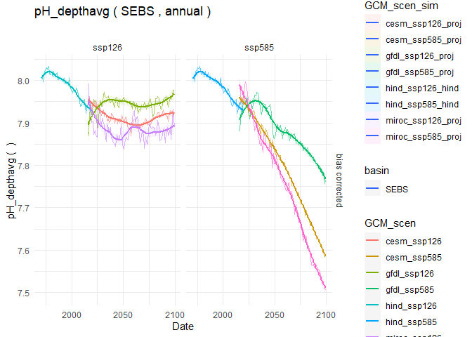
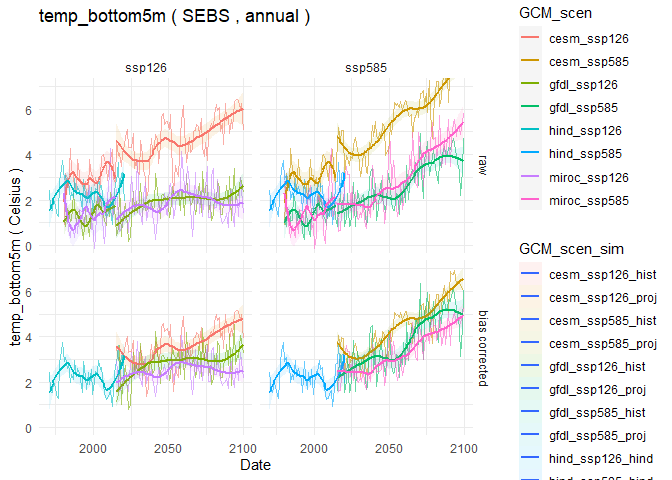
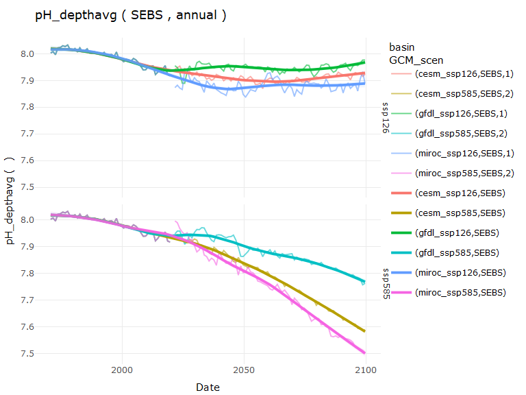
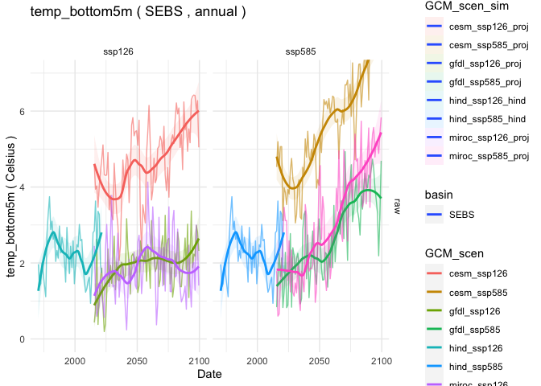
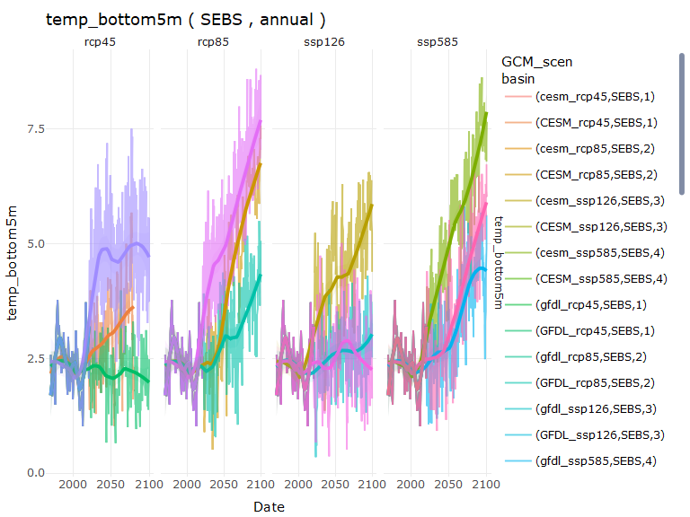
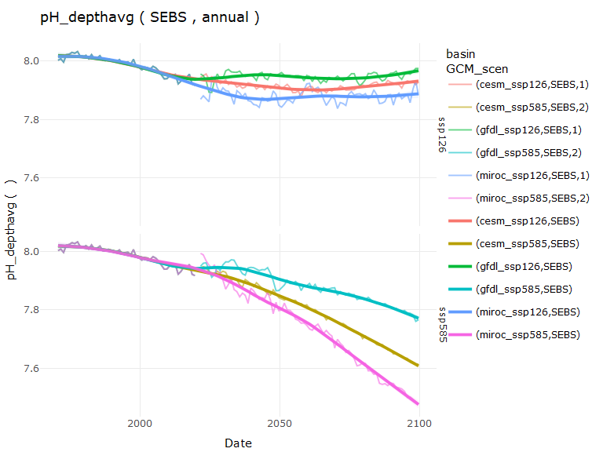

# Download the ACLIM2 repo & data

## Clone the ACLIM2 repo

To run this tutorial first clone the ACLIM2 repository to your local
drive:

### Option 1: Use R

This set of commands, run within R, downloads the ACLIM2 repository and
unpacks it, with the ACLIM2 directory structrue being located in the
specified `download_path`. This also performs the folder renaming
mentioned in Option 2.

``` r
    # Specify the download directory
    main_nm       <- "ACLIM2"

    # Note: Edit download_path for preference
    download_path <-  path.expand("~")
    dest_fldr     <- file.path(download_path,main_nm)
    
    url           <- "https://github.com/kholsman/ACLIM2/archive/main.zip"
    dest_file     <- file.path(download_path,paste0(main_nm,".zip"))
    download.file(url=url, destfile=dest_file)
    
    # unzip the .zip file (manually unzip if this doesn't work)
    setwd(download_path)
    unzip (dest_file, exdir = download_path,overwrite = T)
    
    #rename the unzipped folder from ACLIM2-main to ACLIM2
    file.rename(paste0(main_nm,"-main"), main_nm)
    setwd(main_nm)
    
    
# Caption: Timeseries of season Aug East Bering Sea bottom temp or 400m temp (which ever is shallower) for the 1955-2099 period. The simulations are forced using historical emission (1955 to 2014) and SSP1-2.6 scenario for future projection (2015 to 2099). A 1-year running mean is applied. Figures show, in colors, CESM2-WACCM ensemble mean, in light grey, the spread of all the CMIP6 models, and in medium grey, and dark grey, 80% and 50% the spread of all the CMIP6 members, respectively. Left panel shows the mean values and right panel shows the anomalies relative to the 1980-2013 climatology.
```

### Option 2: Download the zipped repo

Download the full zip archive directly from the [**ACLIM2
Repo**](https://github.com/kholsman/ACLIM2) using this link:
[**https://github.com/kholsman/ACLIM2/archive/main.zip**](https://github.com/kholsman/ACLIM2/archive/main.zip),
and unzip its contents while preserving directory structure.

**Important!** If downloading from zip, please **rename the root
folder** from `ACLIM2-main` (in the zipfile) to `ACLIM2` (name used in
cloned copies) after unzipping, for consistency in the following
examples.

Your final folder structure should look like this:


### Option 3: Use git commandline

If you have git installed and can work with it, this is the preferred
method as it preserves all directory structure and can aid in future
updating. Use this from a **terminal command line, not in R**, to clone
the full ACLIM2 directory and sub-directories:

``` bash
    git clone https://github.com/kholsman/ACLIM2.git
```

------------------------------------------------------------------------

## Get the data

<!-- **Step 1)[ can skip if not using .nc files directly] ** -->
<!-- * Go to the google drive and download the zipped file with the R data `2022_03_07_Rdata.zip`: -->
<!-- * [00_ACLIM_shared > 02_Data > Newest_Data(use this) > unzip_and_putin_Data_in_folder.zip](https://drive.google.com/drive/folders/11BQEfNEl9vvrN-V0LgS67XS4aLE9pNzz) -->
<!-- * Unzip the folder and move the contents of the zipped folder to your local folder `ACLIM2/Data/in`. -->
<!-- <!-- { width=50%} -->

–>

<!-- **Step 2)** -->

-   Go to the google drive and download the zipped file with the R
    ACLIM2 indices `ACLIM2_indices.zip`:

-   [00_ACLIM_shared > 02_Data > Newest_Data(use this) >
    unzip_and_put_in_dat_out_folder_CMIP6](https://drive.google.com/drive/u/1/folders/1clPtrPCQMPcwqr8UE78_Sd2IGwyBuDcD)

-   [00_ACLIM_shared > 02_Data > Newest_Data(use this) >
    unzip_and_put_in_dat_out_folder_CMIP5](https://drive.google.com/drive/u/1/folders/1t_JqDBQU-Fyy5nvIYRAmVcqzWi4mq7mk)

-   Unzip `K29P19_CMIP5.zip` or `K29P19_CMIP6.zip` files move the
    `K29P19_CMIP5` or `K29P19_CMIP6` folders to your local folder
    `ACLIM2/Data/out`. The result should be the following folder
    structure on your local computer:  

-   `ACLIM2/Data/out/K29P19_CMIP6/allEBSmeans`: main folder with annual,
    monthly, seasonal, and survey replicated level 4 ACLIM indices

-   `ACLIM2/Data/out/K29P19_CMIP6/BC_ACLIMregion`: Weekly x Strata based
    indices, including delta and bias corrected values (these are
    “rolled up” to become strata AREA weighted mean vals in the
    allEBSmeans folder).

-   `ACLIM2/Data/out/K29P19_CMIP6/BC_ACLIMsurveyrep`: Survey replicated
    indices at each station, including delta and bias corrected values
    (these are “rolled up” to become average across station mean vals in
    the allEBSmeans folder).

-   `ACLIM2/Data/out/K29P19_CMIP5/allEBSmeans`: as above but for CMIP5

<!-- { width=50%} -->

## Set up the Workspace

Open R() and used ‘setwd()’ to navigate to the root ACLIM2 folder (.e.g,
\~/mydocuments/ACLIM2)

``` r
    # set the workspace to your local ACLIM2 folder
    # e.g., "/Users/kholsman/Documents/GitHub/ACLIM2"
    # setwd( path.expand("~/Documents/GitHub/ACLIM2") )
   
    # --------------------------------------
    # SETUP WORKSPACE
    tmstp  <- format(Sys.time(), "%Y_%m_%d")
    main   <- getwd()  #"~/GitHub_new/ACLIM2"
    
    # loads packages, data, setup, etc.
    suppressWarnings(source("R/make.R"))
```

    ## ------------------------------
    ## ALIM2/R/setup.R settings 
    ## ------------------------------
    ## data_path            : D:/romsnpz/roms_for_public 
    ## Rdata_path           : D:/romsnpz/2022_10_17_Rdata/roms_for_public 
    ## redownload_level3_mox: FALSE 
    ## update.figs          : FALSE 
    ## load_gis             : FALSE 
    ## update.outputs       : TRUE 
    ## update.figs          : FALSE 
    ## dpiIN                : 150 
    ## update.figs          : FALSE 
    ## ------------------------------
    ## ------------------------------
    ## 
    ## The following datasets are public, please cite as Hermann et al. 2019 (v.H16) and Kearney et al. 2020 (v.K20) :
    ## B10K-H16_CMIP5_CESM_BIO_rcp85 
    ## B10K-H16_CMIP5_CESM_rcp45 
    ## B10K-H16_CMIP5_CESM_rcp85 
    ## B10K-H16_CMIP5_GFDL_BIO_rcp85 
    ## B10K-H16_CMIP5_GFDL_rcp45 
    ## B10K-H16_CMIP5_GFDL_rcp85 
    ## B10K-H16_CMIP5_MIROC_rcp45 
    ## B10K-H16_CMIP5_MIROC_rcp85 
    ## B10K-H16_CORECFS 
    ## B10K-K20_CORECFS 
    ## 
    ## The following datasets are still under embargo, please do not share outside of ACLIM:
    ## B10K-K20P19_CMIP6_cesm_historical 
    ## B10K-K20P19_CMIP6_cesm_ssp126 
    ## B10K-K20P19_CMIP6_cesm_ssp585 
    ## B10K-K20P19_CMIP6_gfdl_historical 
    ## B10K-K20P19_CMIP6_gfdl_ssp126 
    ## B10K-K20P19_CMIP6_gfdl_ssp585 
    ## B10K-K20P19_CMIP6_miroc_historical 
    ## B10K-K20P19_CMIP6_miroc_ssp126 
    ## B10K-K20P19_CMIP6_miroc_ssp585

------------------------------------------------------------------------

# Read this before you start

## Overview

The [**ACLIM2 github repository**](https://github.com/kholsman/ACLIM2)
contains R code and Rdata files for working with netcdf-format data
generated from the [**downscaled ROMSNPZ
modeling**](https://beringnpz.github.io/roms-bering-sea) of the ROMSNPZ
Bering Sea Ocean Modeling team; Drs. Hermann, Cheng, Kearney,
Pilcher,Ortiz, and Aydin. The code and R resources described in this
tutorial are maintained by [Kirstin
Holsman](mailto:kirstin.holsman@noaa.gov) as part of NOAA’s [**ACLIM
project**](https://www.fisheries.noaa.gov/alaska/ecosystems/alaska-climate-integrated-modeling-project)
for the Bering Sea. *See [Hollowed et
al. 2020](https://www.frontiersin.org/articles/10.3389/fmars.2019.00775/full)
for more information about the ACLIM project.*

------------------------------------------------------------------------

This document provides an overview of accessing, plotting, and creating
bias corrected indices for ACLIM2 based on CMIP6 (embargoed for ACLIM2
users until 2023) and CMIP5 (publicly available) simulations. This guide
assumes analyses will take place in R() and that users have access to
the data folder within the ACLIM2 shared drive. For more information
also see the full tutorial (“GettingStarted_Bering10K_ROMSNPZ” available
at the bottom of [**this repo
page**](https://github.com/kholsman/ACLIM2).

**Important!** A few key things to know before getting started are
detailed below. Please review this information before getting started.

## ROMSNPZ versions

**Important!** ACLIM1 CMIP5 and ACLIM2 CMIP5 and CMIP6 datasets use
different base models.

There are two versions of the ROMSNPZ model:

1.  ACLIM1 an older 10-depth layer model used for CMIP5 (“H-16”)
2.  ACLIM2 a new 30-depth layer model used for CMIP6 (“K20” or “K20P19”)

The models are not directly comparable, therefore the projections should
be bias corrected and recentered to baselines of hindcasts of each model
(forced by “observed” climate conditions). i.e. CMIP5 and CMIP6 have
corresponding hindcasts:

1.  Hindcast for CMIP5 “H19” –> H16_CORECFS
2.  Hindcast for CMIP5 “K20P19” –> H16_CORECFS
3.  Hindcast for CMIP6 “K20P19” –> K20_CORECFS

In addition for CMIP6 “historical” runs are available for bias
correcting. We will use those below.

For a list of the available simulations for ACLIM enter the following in
R():

``` r
    # list of the climate scenarios
    data.frame(sim_list)
```

    ##                              sim_list
    ## 1                    B10K-K20_CORECFS
    ## 2       B10K-H16_CMIP5_CESM_BIO_rcp85
    ## 3           B10K-H16_CMIP5_CESM_rcp45
    ## 4           B10K-H16_CMIP5_CESM_rcp85
    ## 5       B10K-H16_CMIP5_GFDL_BIO_rcp85
    ## 6           B10K-H16_CMIP5_GFDL_rcp45
    ## 7           B10K-H16_CMIP5_GFDL_rcp85
    ## 8          B10K-H16_CMIP5_MIROC_rcp45
    ## 9          B10K-H16_CMIP5_MIROC_rcp85
    ## 10                   B10K-H16_CORECFS
    ## 11       B10K-K20P19_CMIP5_CESM_rcp45
    ## 12       B10K-K20P19_CMIP5_CESM_rcp85
    ## 13       B10K-K20P19_CMIP5_GFDL_rcp45
    ## 14       B10K-K20P19_CMIP5_GFDL_rcp85
    ## 15      B10K-K20P19_CMIP5_MIROC_rcp45
    ## 16      B10K-K20P19_CMIP5_MIROC_rcp85
    ## 17  B10K-K20P19_CMIP6_cesm_historical
    ## 18      B10K-K20P19_CMIP6_cesm_ssp126
    ## 19      B10K-K20P19_CMIP6_cesm_ssp585
    ## 20  B10K-K20P19_CMIP6_gfdl_historical
    ## 21      B10K-K20P19_CMIP6_gfdl_ssp126
    ## 22      B10K-K20P19_CMIP6_gfdl_ssp585
    ## 23 B10K-K20P19_CMIP6_miroc_historical
    ## 24     B10K-K20P19_CMIP6_miroc_ssp126
    ## 25     B10K-K20P19_CMIP6_miroc_ssp585

## ROMSNPZ variables

For a list of the available variables from the ROMSNPZ:

``` r
    # Metadata for variables
    (srvy_var_def[-(1:5),])
```

    ##                    name
    ## 6                   Ben
    ## 7                DetBen
    ## 8                  Hsbl
    ## 9                IceNH4
    ## 10               IceNO3
    ## 11               IcePhL
    ## 12                 aice
    ## 13                 hice
    ## 14               shflux
    ## 15               ssflux
    ## 16       Cop_integrated
    ## 17        Cop_surface5m
    ## 18      EupO_integrated
    ## 19       EupO_surface5m
    ## 20      EupS_integrated
    ## 21       EupS_surface5m
    ## 22        Iron_bottom5m
    ## 23      Iron_integrated
    ## 24       Iron_surface5m
    ## 25       Jel_integrated
    ## 26        Jel_surface5m
    ## 27       MZL_integrated
    ## 28        MZL_surface5m
    ## 29      NCaO_integrated
    ## 30       NCaO_surface5m
    ## 31      NCaS_integrated
    ## 32       NCaS_surface5m
    ## 33         NH4_bottom5m
    ## 34       NH4_integrated
    ## 35        NH4_surface5m
    ## 36         NO3_bottom5m
    ## 37       NO3_integrated
    ## 38        NO3_surface5m
    ## 39       PhL_integrated
    ## 40        PhL_surface5m
    ## 41       PhS_integrated
    ## 42        PhS_surface5m
    ## 43  prod_Cop_integrated
    ## 44 prod_EupO_integrated
    ## 45 prod_EupS_integrated
    ## 46  prod_Eup_integrated
    ## 47  prod_Jel_integrated
    ## 48  prod_MZL_integrated
    ## 49 prod_NCaO_integrated
    ## 50 prod_NCaS_integrated
    ## 51  prod_NCa_integrated
    ## 52  prod_PhL_integrated
    ## 53  prod_PhS_integrated
    ## 54       salt_surface5m
    ## 55        temp_bottom5m
    ## 56      temp_integrated
    ## 57       temp_surface5m
    ## 58       uEast_bottom5m
    ## 59      uEast_surface5m
    ## 60      vNorth_bottom5m
    ## 61     vNorth_surface5m
    ##                               units
    ## 6                         mg C m^-2
    ## 7                         mg C m^-2
    ## 8                             meter
    ## 9                       mmol N m^-3
    ## 10                      mmol N m^-3
    ## 11                        mg C m^-3
    ## 12                                 
    ## 13                            meter
    ## 14                     watt meter-2
    ## 15                   meter second-1
    ## 16                    (mg C m^-3)*m
    ## 17                        mg C m^-3
    ## 18                    (mg C m^-3)*m
    ## 19                        mg C m^-3
    ## 20                    (mg C m^-3)*m
    ## 21                        mg C m^-3
    ## 22                  micromol Fe m-3
    ## 23              (micromol Fe m-3)*m
    ## 24                  micromol Fe m-3
    ## 25                    (mg C m^-3)*m
    ## 26                        mg C m^-3
    ## 27                    (mg C m^-3)*m
    ## 28                        mg C m^-3
    ## 29                    (mg C m^-3)*m
    ## 30                        mg C m^-3
    ## 31                    (mg C m^-3)*m
    ## 32                        mg C m^-3
    ## 33                      mmol N m^-3
    ## 34                  (mmol N m^-3)*m
    ## 35                      mmol N m^-3
    ## 36                      mmol N m^-3
    ## 37                  (mmol N m^-3)*m
    ## 38                      mmol N m^-3
    ## 39                    (mg C m^-3)*m
    ## 40                        mg C m^-3
    ## 41                    (mg C m^-3)*m
    ## 42                        mg C m^-3
    ## 43                   mg C m^-2 d^-1
    ## 44                   mg C m^-2 d^-1
    ## 45                   mg C m^-2 d^-1
    ## 46 (milligram carbon meter-3 d-1)*m
    ## 47                   mg C m^-2 d^-1
    ## 48                   mg C m^-2 d^-1
    ## 49                   mg C m^-2 d^-1
    ## 50                   mg C m^-2 d^-1
    ## 51 (milligram carbon meter-3 d-1)*m
    ## 52                   mg C m^-2 d^-1
    ## 53                   mg C m^-2 d^-1
    ## 54                                 
    ## 55                          Celsius
    ## 56                      (Celsius)*m
    ## 57                          Celsius
    ## 58                   meter second-1
    ## 59                   meter second-1
    ## 60                   meter second-1
    ## 61                   meter second-1
    ##                                                       longname
    ## 6                                Benthic infauna concentration
    ## 7                               Benthic detritus concentration
    ## 8                      depth of oceanic surface boundary layer
    ## 9                                   Ice ammonium concentration
    ## 10                                   Ice nitrate concentration
    ## 11                                     Ice algae concentration
    ## 12                             fraction of cell covered by ice
    ## 13                               average ice thickness in cell
    ## 14                                       surface net heat flux
    ## 15                           surface net salt flux, (E-P)*SALT
    ## 16          Small copepod concentration, integrated over depth
    ## 17                Small copepod concentration, surface 5m mean
    ## 18    Offshore euphausiid concentration, integrated over depth
    ## 19          Offshore euphausiid concentration, surface 5m mean
    ## 20    On-shelf euphausiid concentration, integrated over depth
    ## 21          On-shelf euphausiid concentration, surface 5m mean
    ## 22                          iron concentration, bottom 5m mean
    ## 23                   iron concentration, integrated over depth
    ## 24                         iron concentration, surface 5m mean
    ## 25              Jellyfish concentration, integrated over depth
    ## 26                    Jellyfish concentration, surface 5m mean
    ## 27       Microzooplankton concentration, integrated over depth
    ## 28             Microzooplankton concentration, surface 5m mean
    ## 29 Offshore large copepod concentration, integrated over depth
    ## 30       Offshore large copepod concentration, surface 5m mean
    ## 31 On-shelf large copepod concentration, integrated over depth
    ## 32       On-shelf large copepod concentration, surface 5m mean
    ## 33                      Ammonium concentration, bottom 5m mean
    ## 34               Ammonium concentration, integrated over depth
    ## 35                     Ammonium concentration, surface 5m mean
    ## 36                       Nitrate concentration, bottom 5m mean
    ## 37                Nitrate concentration, integrated over depth
    ## 38                      Nitrate concentration, surface 5m mean
    ## 39    Large phytoplankton concentration, integrated over depth
    ## 40          Large phytoplankton concentration, surface 5m mean
    ## 41    Small phytoplankton concentration, integrated over depth
    ## 42          Small phytoplankton concentration, surface 5m mean
    ## 43                  Cop net production rate, summed over depth
    ## 44                 EupO net production rate, summed over depth
    ## 45                 EupS net production rate, summed over depth
    ## 46     secondary production Euphausiids, integrated over depth
    ## 47                  Jel net production rate, summed over depth
    ## 48                  MZL net production rate, summed over depth
    ## 49                 NCaO net production rate, summed over depth
    ## 50                 NCaS net production rate, summed over depth
    ## 51      secondary production Neocalanus, integrated over depth
    ## 52                  PhL net production rate, summed over depth
    ## 53                  PhS net production rate, summed over depth
    ## 54                                   salinity, surface 5m mean
    ## 55                       potential temperature, bottom 5m mean
    ## 56                potential temperature, integrated over depth
    ## 57                      potential temperature, surface 5m mean
    ## 58           u-momentum component, geo-rotated, bottom 5m mean
    ## 59          u-momentum component, geo-rotated, surface 5m mean
    ## 60           v-momentum component, geo-rotated, bottom 5m mean
    ## 61          v-momentum component, geo-rotated, surface 5m mean

## Data outputs

**Important!** There are 2 types of post-processed data available for
use in ACLIM.

The ROMSNPZ team has developed a process to provide standardized
post-processed outputs from the large (and non-intuitive) ROMSNPZ grid.
These have been characterized as:

1.  Level 1 (original ROMSNPZ U,V, grid, not rotated or corrected)  
2.  Level 2 (lat long bi-weekly high res versions, shouldn’t be needed
    and are difficult to work with)  
3.  **Level 3 indices (depth corrected and area weighted means for each
    model variable; i.e., what we will mostly use) **
    1.  “ACLIMsurveyrep\_”: groundifsh survey replicated (replicated in
        space and time)
    2.  “ACLIMregion\_”: weekly strata based averages

To get more information about each of these level 3 datasets enter this
in R:

``` r
    # Metadata for Weekly ("ACLIMregion_...") indices
    head(all_info1)
```

    ##                            name
    ## 1 B10K-H16_CMIP5_CESM_BIO_rcp85
    ## 2     B10K-H16_CMIP5_CESM_rcp45
    ## 3     B10K-H16_CMIP5_CESM_rcp85
    ## 4 B10K-H16_CMIP5_GFDL_BIO_rcp85
    ## 5     B10K-H16_CMIP5_GFDL_rcp45
    ## 6     B10K-H16_CMIP5_GFDL_rcp85
    ##                      Type B10KVersion  CMIP
    ## 1 Weekly regional indices         H16 CMIP5
    ## 2 Weekly regional indices         H16 CMIP5
    ## 3 Weekly regional indices         H16 CMIP5
    ## 4 Weekly regional indices         H16 CMIP5
    ## 5 Weekly regional indices         H16 CMIP5
    ## 6 Weekly regional indices         H16 CMIP5
    ##    GCM   BIO Carbon_scenario
    ## 1 CESM  TRUE           rcp85
    ## 2 CESM FALSE           rcp45
    ## 3 CESM FALSE           rcp85
    ## 4 GFDL  TRUE           rcp85
    ## 5 GFDL FALSE           rcp45
    ## 6 GFDL FALSE           rcp85
    ##                 Start                 End nvars
    ## 1 2006-01-22 12:00:00 2099-12-27 12:00:00    59
    ## 2 2006-01-22 12:00:00 2081-02-16 12:00:00    59
    ## 3 2006-01-22 12:00:00 2099-12-27 12:00:00    59
    ## 4 2006-01-22 12:00:00 2099-12-27 12:00:00    59
    ## 5 2006-01-22 12:00:00 2099-12-27 12:00:00    59
    ## 6 2006-01-22 12:00:00 2099-12-27 12:00:00    59

``` r
    # Metadata for Weekly ("ACLIMsurveyrep_...") indices
    head(all_info2)
```

    ##                            name
    ## 1 B10K-H16_CMIP5_CESM_BIO_rcp85
    ## 2     B10K-H16_CMIP5_CESM_rcp45
    ## 3     B10K-H16_CMIP5_CESM_rcp85
    ## 4 B10K-H16_CMIP5_GFDL_BIO_rcp85
    ## 5     B10K-H16_CMIP5_GFDL_rcp45
    ## 6     B10K-H16_CMIP5_GFDL_rcp85
    ##                Type B10KVersion  CMIP  GCM
    ## 1 Survey replicated         H16 CMIP5 CESM
    ## 2 Survey replicated         H16 CMIP5 CESM
    ## 3 Survey replicated         H16 CMIP5 CESM
    ## 4 Survey replicated         H16 CMIP5 GFDL
    ## 5 Survey replicated         H16 CMIP5 GFDL
    ## 6 Survey replicated         H16 CMIP5 GFDL
    ##     BIO Carbon_scenario Start  End nvars
    ## 1  TRUE           rcp85  1970 2100    60
    ## 2 FALSE           rcp45  1970 2100    60
    ## 3 FALSE           rcp85  1970 2100    60
    ## 4  TRUE           rcp85  1970 2100    60
    ## 5 FALSE           rcp45  1970 2100    60
    ## 6 FALSE           rcp85  1970 2100    60

# Indices & bias correction UPDATED

*Summary*

We recommend using the ‘mn_val’ column in the hindcast and either the
‘val_biascorrected’ or ‘val_delta’ column for projections.

*use val_biascorrected’ or ‘val_delta’?*

This will depend in part on the index and scale you are working at. For
fine scale (weekly strata, or station specific, or finer) we recommend
using the ‘val_delta’, i.e., the delta method. For the ACLIM2 spring
sprint we are recommending the ‘val_biascorrected’ in order to align
modeling output.

However,at the larger pooled scales there is very little difference
between the two but a sensitivity analysis may be needed to determine if
the choice makes a profound difference in projections. Following an in
depth analysis of the effects of bias correction at the finer scales of
model output we found that bias correction via the Ho et al. method can
result in artifacts that impact final indices in unsatisfactory ways.
The effects do not emerge as frequently when data are pooled at the
annual or basin-wide scale but do occur at finer scales, especially when
areas or time-period have values in the hindcast but the corresponding
historical runs have only small values, resulting in amplification that
is not found in the raw projection to historical time-series comparison.
However the Ho et al. approach is better at re-scaling variance between
projections and the hindcast, and preserves a more parsimonious variance
structure in projections. Whereas, the delta method assumes equal
variance between the hindcast and projection models (during the
overlapping reference years 1980:2013 when overall variance should
match) and does do not adjust projections if the corresponding
historical variance is larger or smaller than the hindcast sigma.
Applying the delta method adjustment at the smallest possible resolution
of the indices (weekly or by station) minimizes the effects of
superimposing the variance structure of the historical time-series on
the projection.

The average weekly strata value per or the average station value (for
survey replicated indices) across the reference years 1980-2013 were
calculated for the hindcast and corresponding historical runs to
determine the mean hindcast and mean historical values for bias
correction; ‘mn_hind’ and ‘mn_hist’, respectively. We used the mgcv
package to smooth weekly values ‘mgcv::gam(…bs=“cc”)’) across all
reference years to remove artifacts (e.g. divide by 0) in the average
(*Ȳ*<sub>*w*, *k*</sub><sup>*h**i**n**d*</sup> and
*Ȳ*<sub>*w*, *k*</sub><sup>*h**i**s**t*</sup>) and variance
(*σ*<sub>*w*, *k*</sub><sup>*h**i**s**t*</sup> and
*σ*<sub>*w*, *k*</sub><sup>*h**i**n**d*</sup>) terms were predicted from
the gam (without error; example for
*Ȳ*<sub>*w*, *k*</sub><sup>*h**i**n**d*</sup>):

*Ȳ*<sub>*w*, *k*</sub><sup>*h**i**n**d*</sup> = *μ* + *s*(*w*,*k*=.8*n*) + *ϵ*  *a**n**d*  *ϵ* ∼ *N*(0,*σ*)

**Important!** Note: the delta adjustment and the bias corrections were
done on “raw” values which in some cases results in negative values (or
\<0 or \>1 for proportion variables like ‘aice’). For these variables,
values \<0 were set to 0, \>1 set to 1 as needed after (delta) bias
correction.

<figure>
<figcaption aria-hidden="true"><strong>Raw (top row) and bias corrected (bottom row)bottom temperature indices based on survey replicated Level3 outputs for the SEBS</strong></figcaption>
</figure>

*ACLIM2 Indices correction methods*

###Delta method The next step creates ACLIM2 indices (i.e., Level4)
based on the Level3 output for each hindcast, historical run, and CMIP6
projection. The script below delta adjusts or bias corrects each
projected index using the corresponding historical run. (such that
projections are *Δ* from historical mean values for the reference period
`deltayrs     <- 1980:2013` ).

**Important!** Note that for projections the ‘mn_val’ represents raw
mean values, while ‘val_delta’ and ‘val_biascorrected’ are the adjusted
values using scaling factor of 1 or SD_hind/SD_hist on a weekly basis
(respectively).

Delta method correction was done on “raw” values which in some cases
results in negative values (or \<0 or \>1 for proportion variables like
‘aice’). For these variables, values \<0 were set to 0, \>1 set to 1 as
needed after the delta adjustment. Delta method adjustments were
conducted at the weekly level for strata specific data and at the
station level for survey replicated indices:

Such that (*Y*):
*Y*<sub>*t*, *k*</sub><sup>*f**u**t*′</sup> = *Ȳ*<sub>*k*, *T̄*</sub><sup>*h**i**n**d*</sup> + (*Y*<sub>*t*, *k*</sub><sup>*f**u**t*</sup>−*Ȳ*<sub>*k*, *T̄*</sub><sup>*h**i**s**t*</sup>)

where *Ȳ*<sub>*y*, *k*</sub><sup>*f**u**t*′</sup> is the bias corrected
variable *k* value for time-step *t* (e.g., year, month, or season),
*Ȳ*<sub>*k*, *T̄*</sub><sup>*h**i**n**d*</sup> is the mean value of the
variable *k* during the reference period *T̄* = \[1980,2013\] from the
hindcast model, *σ*<sub>*k*, *T̄*</sub><sup>*h**i**n**d*</sup> is the
standard deviation of the hindcast during the reference period *T̄*,
*σ*<sub>*k*, *T̄*</sub><sup>*h**i**s**t*</sup> is the standard deviation
of the historical run during tje reference period,
*Y*<sub>*t*, *k*</sub><sup>*f**u**t*</sup> is the value of the variable
from the projection at time-step *t* and
*Ȳ*<sub>*k*, *T̄*</sub><sup>*h**i**s**t*</sup> is the average value from
the historical run during reference period *T̄*.

<!-- Delta corrections use a scaling factor of 1 were logit for 'val' between 0 and 1 (e.g. aice) or log transformed for val >0 (e.g., zooplankton), delta corrected and then back transformed to normal space using the following correction: -->
<!--   $${Y}^{fut'}_{t,k} =\bar{Y}^{hind}_{k,\bar{T}} +\left( 1*({Y}^{fut}_{t,k}-\bar{Y}^{hist}_{k,\bar{T}})  \right )$$ -->
<!--   (note: for log and logit transformations a offset of 1e^-4 was used to avoid Inf or NA values: -->
<!--     $${Y_{adj} = ln(Y+1e^{-4})}$$ and $${Y' = e(Y'_{adj})-1e^{-4}}$$  -->

###Bias correction

Bias correction was done on “raw” values which in some cases results in
negative values (or \<0 or \>1 for proportion variables like ‘aice’).
For these variables, values \<0 were set to 0, \>1 set to 1 as needed
after bias correction. Bias correction adjustments were conducted at the
weekly level for strata specific data and at the station level for
survey replicated indices:

Such that (*Y*):
$${Y}^{fut'}\_{t,k} =\\bar{Y}^{hind}\_{k,\\bar{T}} +\\left( \\frac{\\sigma^{hind}\_{k,\\bar{T}}}{\\sigma^{hist}\_{k,\\bar{T}}}\*({Y}^{fut}\_{t,k}-\\bar{Y}^{hist}\_{k,\\bar{T}})  \\right )$$

where *Ȳ*<sub>*y*, *k*</sub><sup>*f**u**t*′</sup> is the bias corrected
variable *k* value for time-step *t* (e.g., year, month, or season),
*Ȳ*<sub>*k*, *T̄*</sub><sup>*h**i**n**d*</sup> is the mean value of the
variable *k* during the reference period *T̄* = \[1980,2013\] from the
hindcast model, *σ*<sub>*k*, *T̄*</sub><sup>*h**i**n**d*</sup> is the
standard deviation of the hindcast during the reference period *T̄*,
*σ*<sub>*k*, *T̄*</sub><sup>*h**i**s**t*</sup> is the standard deviation
of the historical run during tje reference period,
*Y*<sub>*t*, *k*</sub><sup>*f**u**t*</sup> is the value of the variable
from the projection at time-step *t* and
*Ȳ*<sub>*k*, *T̄*</sub><sup>*h**i**s**t*</sup> is the average value from
the historical run during reference period *T̄*.

For log-normally distributed variables(*Y*):
$${Y}^{fut'}\_{y,k} =e^{\\ln\\bar{Y}^{hind}\_{k,\\bar{T}} +\\left( \\frac{\\hat{\\sigma}^{hind}\_{k,\\bar{T}}}{\\hat{\\sigma}^{hist}\_{k,\\bar{T}}}\*(\\ln{Y}^{fut}\_{t,k}-\\ln\\bar{Y}^{hist}\_{k,\\bar{T}})  \\right )}$$
, where *σ̂*<sub>*k*, *T̄*</sub><sup>*h**i**s**t*</sup> and
*σ̂*<sub>*k*, *T̄*</sub><sup>*h**i**n**d*</sup> are the standard deviation
of the ln *Ȳ*<sub>*k*, *t*</sub><sup>*h**i**s**t*</sup> and
ln *Ȳ*<sub>*k*, *t*</sub><sup>*h**i**n**d*</sup> during the reference
period *T̂* (respectively).

## Weekly X strata indices

Uses the strata x weekly data (‘ACLIMregion’) to generate
strata-specific averages in order to generate the strata area-weighted
averages for each week *w* each year *y*.

$$\\bar{Y}\_{k,y,w}= \\frac{\\sum^{n_s}\_{l}(\\frac{1}{n_i}\\sum^{n_t}\_{t}Y\_{k,y,s,w,t})\*A_s} {\\sum^{n_s}\_{s}{A_s}}$$
, where *Y*<sub>*k*, *w*, *y*, *s*, *t*</sub> is the value of the
variable *k* in strata *s* at time *t* in year *y*, *A*<sub>*s*</sub> is
the area of strata *s*, *n*<sub>*i*</sub> is the number of stations in
strata *s*, and *n*<sub>*s*</sub> is the number of strata *s* in each
basin (NEBS or SEBS).

*Ȳ*<sub>*w*, *y*, *k*</sub> was calculated for the hindcast, historical
run, and projection time-series.

Projections *Ȳ*<sub>*k*, *y*, *w*</sub> were *bias corrected* using the
Ho et al. 2019 method and corresponding historical and hindcast values
such that (and a scaling factor dependent on the variance of each):

$$\\bar{Y}^{fut'}\_{k,y,w} =\\bar{Y}^{hind}\_{w,k} +\\left( \\frac{\\sigma^{hind}\_{w,k}}{\\sigma^{hist}\_{w,k}}\*(\\bar{Y}^{fut}\_{k,y,w}-\\bar{Y}^{hist}\_{w,k})  \\right )$$
, where *Ȳ*<sub>*w*, *k*</sub><sup>*h**i**s**t*</sup> and
*Ȳ*<sub>*w*, *k*</sub><sup>*h**i**n**d*</sup> are the average historical
weekly values across years in the period (1980 to 2012 ; adjustable in
`R/setup.R`).

Projections *Ȳ*<sub>*k*, *y*, *w*</sub> were also *delta corrected*
(assuming a scaling factor = 1) using the corresponding historical and
hindcast values such that:

$$\\bar{Y}^{fut'}\_{k,y,w} =\\bar{Y}^{hind}\_{w,k} +\\left( \\frac{1}{1}\*(\\bar{Y}^{fut}\_{k,y,w}-\\bar{Y}^{hist}\_{w,k})  \\right )$$
, where *Ȳ*<sub>*w*, *k*</sub><sup>*h**i**s**t*</sup> and
*Ȳ*<sub>*w*, *k*</sub><sup>*h**i**n**d*</sup> are the average historical
weekly values across years in the period (1980 to 2012 ; adjustable in
`R/setup.R`).

## NESB & SEBS wide averaged indices

The average water column values for each variable from the ROMSNPZ model
strata x weekly Level2 outputs (‘ACLIMregion’) were calculated and used
to calculate the strata-area weighted mean value for the NEBS and SEBS
weekly, monthly, seasonally, and annually. Similarly, for survey
replicated (‘ACLIMsurveyrep’) Level2 outputs the average water column
value for each variable at each station was calculated used to calculate
the strata-area weighted mean value for the NEBS and SEBS annually.
These indices were calculate for hindcast, historical, and projection
scenarios, and used to bias correct the projections. More information on
the methods for each can be found in the tabs below and the code in
Appendix A following this section will re-generate the bias corrected
indices. All of the bias corrected outputs can be found in the
“Data/out/K20P19_CMIP6” folder.

The same approach was applied to the weekly strata data such that weekly
strata values were calculated as:

$$\\bar{Y}\_{k,y,s,w}= \\sum^{n_s}\_{l}(\\frac{1}{n_i}\\sum^{n_t}\_{t}Y\_{k,y,s,w,t})$$

$$\\bar{Y}^{fut'}\_{k,s,y,w} =\\bar{Y}^{hind}\_{k,s,w} +\\left( \\frac{\\sigma^{hind}\_{k,s,w}}{\\sigma^{hist}\_{k,s,w}}\*(\\bar{Y}^{fut}\_{k,s,y,w}-\\bar{Y}^{hist}\_{k,s,w})  \\right )$$
, where *Ȳ*<sub>*k*, *s*, *w*</sub><sup>*h**i**s**t*</sup> and
*Ȳ*<sub>*k*, *s*, *w*</sub><sup>*h**i**n**d*</sup> are the average
historical weekly values across years in the period (1980 to 2012 ;
adjustable in `R/setup.R`).Where the mean and variance terms were
smoothed at the weekly and strata level (i.e.,
*Ȳ*<sub>*w*, *k*</sub><sup>*h**i**n**d*</sup>
was predicted from the following gam() without error)

*Ȳ*<sub>*k*, *s*, *w*</sub><sup>*h**i**n**d*</sup> = *μ* + *s*(*w*,*k*=.8*n*) + *ϵ*  *a**n**d*  *ϵ* ∼ *N*(0,*σ*)

<figure>
<figcaption aria-hidden="true">Delta corrected copepods using gam smoothed historical and hindcast climatology</figcaption>
</figure>

<figure>
<figcaption aria-hidden="true">Bias corrected copepods using gam smoothed historical and hindcast climatology</figcaption>
</figure>

## Monthly indices

Using the bias corrected weekly or strata x weekly indices, we then
generated monthly indices for each month *m* each year *y*.

$$\\bar{Y}\_{k,y,m}= \\frac{1}{n_w}\\sum^{n_w}\_{w}\\bar{Y}\_{k,y,w}$$
, where *Ȳ*<sub>*w*, *y*, *k*</sub> are the weekly average indices for
variable *k* in year *y* from the previous step ,*n*<sub>*w*</sub> is
the number of weeks in each month *m* as:

$$\\bar{Y}^{fut'}\_{k,y,m} = \\frac{1}{n_w}\\sum^{n_w}\_{w}\\bar{Y}^{fut'}\_{k,y,w}$$
  
for area weighted SEBS and NEBS bias corrected values. Similarly we used
the following for monthly strata values:  
$$\\bar{Y}^{fut'}\_{k,s,y,m} = \\frac{1}{n_w}\\sum^{n_w}\_{w}\\bar{Y}^{fut'}\_{k,s,y,w}$$

similarly NEBS and SEBS monthly averages and strata monthly averages for
the hindcast were calculated as:

$$\\bar{Y}^{hind}\_{k,y,m} = \\frac{1}{n_w}\\sum^{n_w}\_{w}\\bar{Y}^{hind}\_{k,y,w}$$

$$\\bar{Y}^{hind}\_{k,s,y,m} = \\frac{1}{n_w}\\sum^{n_w}\_{w}\\bar{Y}^{hind}\_{k,s,y,w}$$

## Seasonal indices

Using the bias corrected weekly or strata x weekly indices, we then
generated seasonal indices for each season *l* each year *y*.

$$\\bar{Y}\_{k,y,l}= \\frac{1}{n_w}\\sum^{n_w}\_{w}\\bar{Y}\_{k,y,w}$$
, where *Ȳ*<sub>*w*, *y*, *k*</sub> are the weekly average indices for
variable *k* in year *y* from the previous step ,*n*<sub>*w*</sub> is
the number of weeks in each seasonal *l* as:

$$\\bar{Y}^{fut'}\_{k,y,l} = \\frac{1}{n_w}\\sum^{n_w}\_{w}\\bar{Y}^{fut'}\_{k,y,w}$$
  
for area weighted SEBS and NEBS bias corrected values. Similarly we used
the following for seasonal strata values:  
$$\\bar{Y}^{fut'}\_{k,s,y,l} = \\frac{1}{n_w}\\sum^{n_w}\_{w}\\bar{Y}^{fut'}\_{k,s,y,w}$$

similarly NEBS and SEBS seasonal averages and strata seasonal averages
for the hindcast were calculated as:

$$\\bar{Y}^{hind}\_{k,y,l} = \\frac{1}{n_w}\\sum^{n_w}\_{w}\\bar{Y}^{hind}\_{k,y,w}$$

$$\\bar{Y}^{hind}\_{k,s,y,l} = \\frac{1}{n_w}\\sum^{n_w}\_{w}\\bar{Y}^{hind}\_{k,s,y,w}$$

## Annual indices

Using the bias corrected weekly or strata x weekly indices, we then
generated seasonal indices for each year *y*.

$$\\bar{Y}\_{k,y}= \\frac{1}{n_w}\\sum^{n_w}\_{w}\\bar{Y}\_{k,y,w}$$
, where *Ȳ*<sub>*w*, *y*, *k*</sub> are the weekly average indices for
variable *k* in year *y* from the previous step ,*n*<sub>*w*</sub> is
the number of weeks in each year *y* as:

$$\\bar{Y}^{fut'}\_{k,y} = \\frac{1}{n_w}\\sum^{n_w}\_{w}\\bar{Y}^{fut'}\_{k,y,w}$$
  
for area weighted SEBS and NEBS bias corrected values. Similarly we used
the following for annual strata values:  
$$\\bar{Y}^{fut'}\_{k,s,y} = \\frac{1}{n_w}\\sum^{n_w}\_{w}\\bar{Y}^{fut'}\_{k,s,y,w}$$

similarly NEBS and SEBS annual averages and strata annual averages for
the hindcast were calculated as:

$$\\bar{Y}^{hind}\_{k,y} = \\frac{1}{n_w}\\sum^{n_w}\_{w}\\bar{Y}^{hind}\_{k,y,w}$$

$$\\bar{Y}^{hind}\_{k,s,y} = \\frac{1}{n_w}\\sum^{n_w}\_{w}\\bar{Y}^{hind}\_{k,s,y,w}$$

## Annual survey rep. indices

Uses the station specific survey replicated (in time and space) data
(‘ACLIMsurveyrep’) to generate strata-specific averages in order to
generate the strata area-weighted averages for each year *y*.

$$\\bar{Y}\_{y,k}= \\frac{\\sum^{n_s}\_{l}(\\frac{1}{n_i}\\sum^{n_i}\_{i}Y\_{k,y,s,i})\*A_s} {\\sum^{n_s}\_{s}{A_s}}$$
, where *Y*<sub>*k*, *y*, *s*, *i*</sub> is the value of the variable
*k* at station *i* in strata *s* in year *y*, *A*<sub>*s*</sub> is the
area of strata *s*, *n*<sub>*i*</sub> is the number of stations in
strata *s*, and *n*<sub>*s*</sub> is the number of strata *s* in each
basin (NEBS or SEBS).

*Ȳ*<sub>*y*, *k*</sub> was calculated for the hindcast, historical run,
and projection time-series. For projections *Ȳ*<sub>*y*, *k*</sub> was
bias corrected using the corresponding historical and hindcast values
such that:

$$\\bar{Y}^{fut'}\_{y,k} =\\bar{Y}^{hind}\_{k} +\\left( \\frac{\\sigma^{hind}\_{k}}{\\sigma^{hist}\_{k}}\*(\\bar{Y}^{fut}\_{y,k}-\\bar{Y}^{hist}\_{k})  \\right )$$
, where *Ȳ*<sub>*k*</sub><sup>*h**i**n**d*</sup> and
*Ȳ*<sub>*k*</sub><sup>*h**i**s**t*</sup> are the average historical
values across years in the reference period (1980 to 2012 ; adjustable
in `R/setup.R`).

Appendix A includes the code used to generate the ACLIM2 indices and
bias correct them. That code can be run to re-make the indices if you
like but takes approx 30 mins a CMIP to run.

# Plot & concat Indices

The following code will open an interactive shiny() app for exploring
the indices. You can also view this online at
(kkh2022.shinyapps.io/ACLIM2_indices)\[<https://kkh2022.shinyapps.io/ACLIM2_indices/>\].

``` r
  tmpwd<-getwd()
  setwd("R/shiny_aclim/ACLIM2_indices")  
  shiny::runApp("app.R")
  setwd(tmpwd)
  # alternatively you can extract the data you want using the get_var()function
  
  df <- get_var(typeIN = "annual",plotvar = "temp_bottom5m",plothist = F)
  
  df$plot
  head(df$dat)
```

<figure>
<figcaption aria-hidden="true">“Raw (top row) and bias corrected (bottom row)bottom temperature indices based on survey replicated Level3 outputs for the SEBS”</figcaption>
</figure>

<!-- ## Annual indices -->
<!-- ```{r explore, eval=F, include=T,echo=T} -->
<!--     # -------------------------------------- -->
<!--     # SETUP WORKSPACE -->
<!--     main   <- getwd()  #"~/GitHub_new/ACLIM2" -->
<!--     # loads packages, data, setup, etc. -->
<!--     suppressMessages(source("R/make.R")) -->
<!--     # load the Indices: -->
<!--     fldr <- "Data/out/K20P19_CMIP6/allEBS_means" -->
<!--     dirlist <-grep ("annual", dir(fldr)) -->
<!--     for(d in dirlist) -->
<!--       load(file.path(fldr,d)) -->
<!--     hnd <- ACLIM_annual_fut_mn -->
<!-- ```` -->
<!-- # Special cases {.tabset} -->

## Continuous timeseries of hind + fut

``` r
    suppressMessages(source("R/make.R"))  
 
    scens   <- c("ssp126", "ssp585")
    GCMs    <- c("miroc", "gfdl", "cesm" )
    
  # get the variable you want:
      df <- get_var( typeIN    = "annual", 
                     plotvar   = "temp_bottom5m",
                     bcIN      = c("raw","bias corrected"),
                     CMIPIN    = c("K20P19_CMIP5","K20P19_CMIP6"), 
                     plothist  = T,  # ignore the hist runs
                     removeyr1 = T)  # "Remove first year of projection ( burn in)")
      
      df$plot+coord_cartesian(ylim = c(0, 10))
```



``` r
      head(df$dat)
    
  # concat the hind and fut runs by removing years from projection
     stitchDate <- "2020-12-30"

  newdat <- stitchTS(dat = df$dat,
                   maxD  = stitchDate)
  
  # newdat has the full set of data
  # select miroc_ssp126
  head(newdat%>%dplyr::filter(GCM_scen==paste0(GCMs[1],"_",scens[1])))
  tail(newdat%>%dplyr::filter(GCM_scen==paste0(GCMs[1],"_",scens[1])))
  
  pp <- plotTS(newdat%>%mutate(mn_val=val_use) )
  pp
```



``` r
  # plot it interactively
  plotly::ggplotly(pp)
```



## NRS indices (André)

The target indices for NRS include cold pool, bottom temperature, wind,
SEBS and NEBS, during the growing season (May-August)

*Cold pool (1.5degC)coverage in the northern nursery area based on
summer bottom trawl survey data. Northern nursery area is approx strata
10& 20, however these are likely correlated with overall coldpool so we
used the annual cp index.  
*Winds in the northern nursery area during the larval draft period
(April1-June30) Cooper et al. 2019.  
*pH in the spawning grounds during Jan – March.  
*Summer (May-August) SST and BT in the SEBS

Hindcast values from 1970-2019 were stitched the operational hindcast
(2019-2022) and ACLIM projections from 2022-2100 to generate the indices
for CMIP5 and CMIP6.

``` r
  # to access these scripts go to https://github.com/kholsman/ACLIM2/tree/main/R/sub_fun

 source("R/sub_scripts/make_NRS_indices.R")
 source("R/sub_scripts/make_NRS_indices_raw.R")
```

## monthly indices (Andy)

``` r
  suppressMessages(source("R/make.R"))
  
  # preview possible variables
  load(paste0("Data/out/K20P19_CMIP6/allEBS_means/ACLIM_monthly_hind_mn.Rdata"))
  varall  <- unique(ACLIM_monthly_hind$var)
  varall
  
  scens   <- c("ssp126","ssp585")
  GCMs    <- c("miroc","gfdl",  "cesm" )
  varlist <- c("temp_bottom5m","fracbelow2","uEast_surface5m")

  # get the variable you want:
  df <- get_var( typeIN    = "annual", 
                  CMIPIN    = "K20P19_CMIP6",
                  plotvar   = "uEast_surface5m",
                  bcIN      = "bias corrected",
                  plotbasin    = c("SEBS"),
                  GCMIN     = c("miroc" ,"gfdl" , "cesm" ),
                  plothist  = F,  # ignore the hist runs
                  removeyr1 = T)  #"Remove first year of projection ( burn in)")

  df <- get_var( typeIN    = "monthly", 
                 CMIPIN    = "K20P19_CMIP6",
                 monthIN   = 2,
                 plotvar   = "temp_bottom5m",
                 bcIN      = "bias corrected",
                 plothist  = F,  # ignore the hist runs
                 removeyr1 = T)  #"Remove first year of projection ( burn in)")


  head(df$dat)
  df$plot
  
  # concat the hind and fut runs by removing years from projection
  maxDin <- max(as.vector(df$dat%>%dplyr::filter(sim_type=="hind")%>%
                            ungroup()%>%dplyr::select(mnDate))[[1]])
  
  newdat <- stitchTS(dat = df$dat,
                   maxD  = maxDin)
  
  # newdat has the full set of data
  # select miroc_ssp126
  head(newdat%>%dplyr::filter(GCM_scen==paste0(GCMs[1],"_",scens[1])))
  tail(newdat%>%dplyr::filter(GCM_scen==paste0(GCMs[1],"_",scens[1])))

  newdat$mn_val <- newdat$val_delta
  newdat$units <- ""
  pp  <- ggplot(newdat)+
            geom_line(aes(x=mnDate,y=mn_val,color= GCM_scen, linetype = basin),
                      alpha = 0.6,show.legend = FALSE)+
            geom_smooth(aes(x=mnDate,y=mn_val,color= GCM_scen,
                            fill=GCM_scen,linetype = basin),alpha=0.1,
                        method="loess",formula='y ~ x',span = .5,show.legend=T)+
            theme_minimal() + 
            labs(x="Date",
                   y=paste(newdat$var[1],"(",newdat$units[1],")"),
                   subtitle = "",
                   legend = "",
                   title = paste(newdat$var[1],"(",newdat$basin[1],",",newdat$type[1],")"))+
          scale_color_discrete()+
          facet_grid(scen~.)
  pp
```

``` r
  # plot it interactively
  plotly::ggplotly(pp)
```



## weekly indices (Jon)

``` r
  suppressMessages(source("R/make.R"))
  
  # preview possible variables
  load(paste0("Data/out/K20P19_CMIP6/allEBS_means/ACLIM_weekly_hind_mn.Rdata"))
  varall  <- unique(ACLIM_weekly_hind$var)
  varall


  scens   <- c("ssp126","ssp585")
  GCMs    <- c("miroc","gfdl",  "cesm" )
  varlist <- c("temp_bottom5m","fracbelow2","uEast_surface5m")
  
  # get the variable you want:
  df <- get_var( typeIN    = "weekly", 
                 plotvar   = "temp_bottom5m",
                 bcIN      = "bias corrected",
                 plothist  = F,  # ignore the hist runs
                 removeyr1 = T)  #"Remove first year of projection ( burn in)")
  
  df$plot
  head(df$dat)
  
  ggplot(df$dat%>%filter(basin=="SEBS"))+ geom_line(aes(x=jday, y= mn_val, color=factor(year)))+facet_wrap(GCM_scen_sim~.)

  # concat the hind and fut runs by removing years from projection
  maxDin <- max(as.vector(df$dat%>%dplyr::filter(sim_type=="hind")%>%dplyr::select(mnDate))[[1]])
  
  newdat <- stitchTS(dat = df$dat,
                   maxD  = maxDin)
  
  # newdat has the full set of data
  # select miroc_ssp126
  head(newdat%>%dplyr::filter(GCM_scen==paste0(GCMs[1],"_",scens[1])))
  
  
  pp  <- ggplot(newdat)+
            geom_line(aes(x=mnDate,y=mn_val,color= GCM_scen, linetype = basin),
                      alpha = 0.6,show.legend = FALSE)+
            geom_smooth(aes(x=mnDate,y=mn_val,color= GCM_scen,
                            fill=GCM_scen,linetype = basin),alpha=0.1,
                        method="loess",formula='y ~ x',span = .5,show.legend=T)+
            theme_minimal() + 
            labs(x="Date",
                   y=paste(newdat$var[1],"(",newdat$units[1],")"),
                   subtitle = "",
                   legend = "",
                   title = paste(newdat$var[1],"(",newdat$basin[1],",",newdat$type[1],")"))+
          scale_color_discrete()+
          facet_grid(scen~.)
  # plot it
  pp
```

``` r
  # plot it interactively
  plotly::ggplotly(pp)
```



## Salmon index (Ellen)

1.  temperature_surface5m for months 9:10 and strata 70 & 71  
2.  NW direction for months 5:6 and strata 71  
3.  temperature_surface5m for months 7:10 and strata 90,61,62

``` r
 # loads packages, data, setup, etc.
  suppressMessages( suppressWarnings(source("R/make.R")))

# get the variable you want:
      df <- get_var( typeIN    = "monthly", 
                     monthIN   = 9:10,
                     plotvar   = "temp_bottom5m",
                     bcIN      = c("raw","bias corrected"),
                     CMIPIN    = "K20P19_CMIP6", 
                     plothist  = T,  # ignore the hist runs
                     removeyr1 = T)  # "Remove first year of projection ( burn in)")
      
      df$plot+coord_cartesian(ylim = c(0, 7))
      head(df$dat)
    
  # concat the hind and fut runs by removing years from projection
     stitchDate <- "2020-12-30"

  newdat <- stitchTS(dat = df$dat,
                   maxD  = stitchDate)
  
  # newdat has the full set of data
  # select miroc_ssp126
  head(newdat%>%dplyr::filter(GCM_scen==paste0(GCMs[1],"_",scens[1])))
  tail(newdat%>%dplyr::filter(GCM_scen==paste0(GCMs[1],"_",scens[1])))
  
  pp <- plotTS(newdat )
  pp
```

## make CEATTLE indices (Kir)

``` r
source("R/sub_scripts/make_ceattle_indices.R")
# now jump down to make .dat file
```

## quick(er) bias correction for cell by cell data (Liz)

``` r
 #  setwd("D:/GitHub_cloud/ACLIM2")
 # loads packages, data, setup, etc.
  suppressMessages( suppressWarnings(source("R/make.R")))


# load the strata x weekly bias corrected values ("fut") for each gcm in the cmip6
  cmipfldr <- "K20P19_CMIP6"
  gcmcmipL <- c("B10K-K20P19_CMIP6_miroc",
                    "B10K-K20P19_CMIP6_gfdl",
                    "B10K-K20P19_CMIP6_cesm")
i<- 0
for(scen in c("ssp126","ssp585")){
  for (gcmcmip in gcmcmipL){
  i <- i+ 1
  cat(" -- loading ", gcmcmip, " ",scen,"\n")
  # extract gcm and cmip:
  
  mod   <- (strsplit(gcmcmip,"_")[[1]])[1]
  CMIP  <- strsplit(gcmcmip,"_")[[1]][2]
  GCM   <- strsplit(gcmcmip,"_")[[1]][3]
      
  # can be either ssp 126 or 585, the hist is only specific to the gcm (eg. cesm)
  load(file.path("Data/out",cmipfldr,"BC_ACLIMregion", paste0("ACLIMregion_",gcmcmip,"_",scen,"_BC_fut.Rdata")))
 
   # grab the mean strata x weekly values for bias correcting the grid
  sub_BC <- fut%>%
    dplyr::select(sim, var,  season,mo,wk,lognorm, basin, strata, mnVal_hind,mnVal_hist,sf_wk)%>%
    dplyr::distinct(sim, var, season,mo,wk,lognorm, basin, strata, mnVal_hind,mnVal_hist,sf_wk, .keep_all= TRUE)%>%
    mutate(GCM = GCM, CMIP=CMIP, mod = mod,scen =scen)%>%ungroup()
   #dplyr::summarize_at(c("mnVal_hind", "mnVal_hist","sf_wk"), mean, na.rm=T)
   if(i ==1){
     mnVal_lookup <- sub_BC
   }else{
     mnVal_lookup <- rbind(mnVal_lookup,sub_BC)
   }
    rm(list=c("sub_BC","fut"))
  }
}
  
  # check that there are 3 gcms x 2 scens:, vals are the same for both scens within a gcm:
    mnVal_lookup%>%filter(strata == 70,var=="aice", wk==1)

 
  # save the lookup table:
  if(!dir.exists(file.path("Data/out",cmipfldr,"mnVal_lookup")))
   dir.create(file.path("Data/out",cmipfldr,"mnVal_lookup"))
    
   fl <- file.path("Data/out",cmipfldr,"mnVal_lookup")
   nm <- paste(cmipfldr,"_BC_mnVal_lookup.Rdata",sep="_")
   save(mnVal_lookup,file=file.path(fl,nm))
   
   # now for CMIP5
   #----------------------------------------------------------------
   # load the strata x weekly bias corrected values ("fut") for each gcm in the cmip6
  cmipfldr <- "K20P19_CMIP5"
  gcmcmipL <- c("B10K-K20P19_CMIP5_MIROC",
                     "B10K-K20P19_CMIP5_GFDL",
                     "B10K-K20P19_CMIP5_CESM")
i<- 0
for(scen in c("rcp45","rcp85")){
  for (gcmcmip in gcmcmipL){
  i <- i+ 1
  cat(" -- loading ", gcmcmip, " ",scen)
  # extract gcm and cmip:
  
  mod   <- (strsplit(gcmcmip,"_")[[1]])[1]
  CMIP  <- strsplit(gcmcmip,"_")[[1]][2]
  GCM   <- strsplit(gcmcmip,"_")[[1]][3]
      
  # can be either ssp 126 or 585, the hist is only specific to the gcm (eg. cesm)
  load(file.path("Data/out",cmipfldr,"BC_ACLIMregion", paste0("ACLIMregion_",gcmcmip,"_",scen,"_BC_fut.Rdata")))
 
   # grab the mean strata x weekly values for bias correcting the grid
  sub_BC <- fut%>%
    dplyr::select(sim, var,  season,mo,wk,lognorm, basin, strata, mnVal_hind,mnVal_hist,sf_wk)%>%
    dplyr::distinct(sim, var, season,mo,wk,lognorm, basin, strata, mnVal_hind,mnVal_hist,sf_wk, .keep_all= TRUE)%>%
    mutate(GCM = GCM, CMIP=CMIP, mod = mod,scen =scen)%>%ungroup()
   #dplyr::summarize_at(c("mnVal_hind", "mnVal_hist","sf_wk"), mean, na.rm=T)
   if(i ==1){
     mnVal_lookup <- sub_BC
   }else{
     mnVal_lookup <- rbind(mnVal_lookup,sub_BC)
   }
    rm(list=c("sub_BC","fut"))
  }
}
  
  # check that there are 3 gcms:
    mnVal_lookup%>%filter(strata == 70,var=="aice", wk==1)

 
  # save the lookup table:
  if(!dir.exists(file.path("Data/out",cmipfldr,"mnVal_lookup")))
   dir.create(file.path("Data/out",cmipfldr,"mnVal_lookup"))
    
   fl <- file.path("Data/out",cmipfldr,"mnVal_lookup")
   nm <- paste(cmipfldr,"_BC_mnVal_lookup.Rdata",sep="_")
   save(mnVal_lookup,file=file.path(fl,nm))
```

Now with the lookup tables generated, combine with the cell by cell data
and bias correct:

``` r
  #  setwd("D:/GitHub_cloud/ACLIM2")
  # loads packages, data, setup, etc.
  suppressMessages( suppressWarnings(source("R/make.R")))


  # load the strata x weekly bias corrected values ("fut") for each gcm in the cmip6
  cmipfldr <- "K20P19_CMIP6"
  fl <- file.path("Data/out",cmipfldr,"bc_mnVals")
   nm <- paste(cmipfldr,"_BC_mnVal_lookup.Rdata",sep="_")
  load(file.path(fl,nm))  # load mnVal_lookup
  
  # some dummy data
  liz_dat <- data.frame(var ="aice",
                        mn_val = inv.logit(rnorm(200,0, .4)),
                        strata = factor(70,levels = levels(mnVal_lookup$strata)),
                        cell = 1:200,
                        time = as.Date("1982-04-23"))
  
  
  liz_dat <- liz_dat%>%
    dplyr::mutate(tmptt =strptime(as.Date(time),format="%Y-%m-%d"))%>%
    dplyr::mutate(
      yr     = date_fun(tmptt,type="yr"), # first get week to match lookup
      mo     = date_fun(tmptt,type="mo"),
      jday   = date_fun(tmptt,type="jday"),
      season = date_fun(tmptt,type="season"),
      wk     = date_fun(tmptt,type="wk"))%>%select(-"tmptt")%>%
  left_join(mnVal_lookup)  # now merge with lookup:
  
  # Now bias correct based on which normlist val to use:
  log_adj <- 1e-4
  roundn  <- 5
      if(!any(liz_dat$lognorm%in%c("none","log","logit"))){
        stop("bias_correct_new_strata: problem with lognorm, must be 'none', 'log' or 'logit' for each var")
      }else{
        sdfun<-function(x){
          x[x==0]   <- 1
          x[x==Inf] <- 1
          x  
        }
        
        # normally distrib values:
        subA <- liz_dat%>%filter(lognorm=="none")%>%
          mutate(
          raw_val   = mn_val,
          mnval_adj = mn_val,
          #  sf_wk  = abs(  sdVal_hind/  sdVal_hist),
          #  sf_mo  = abs(  sdVal_hind_mo/  sdVal_hist_mo),
          #  sf_yr  = abs(  sdVal_hind_yr/  sdVal_hist_yr))%>%
          # mutate_at(c("sf_wk","sf_mo","sf_yr"),sdfun)%>%
          #mutate(
           val_delta =   mnVal_hind + (( mn_val-  mnVal_hist)),
           # val_bcmo  =   mnVal_hind + ( sf_mo*( mn_val- mnVal_hist)),
           # val_bcyr  =   mnVal_hind + ( sf_yr*( mn_val- mnVal_hist)),
           val_bcwk  =   mnVal_hind + ( sf_wk*( mn_val- mnVal_hist)))
        
        # 0-1 distributed values:
        subB<- liz_dat%>%filter(lognorm=="logit")%>%
          mutate(
          raw_val   = mn_val,
          mnval_adj = inv.logit(mn_val)-log_adj,
          #   sf_wk  = abs(  sdVal_hind/  sdVal_hist),
          #   sf_mo  = abs(  sdVal_hind_mo/  sdVal_hist_mo),
          #   sf_yr  = abs(  sdVal_hind_yr/  sdVal_hist_yr))%>%
          # mutate_at(c("sf_wk","sf_mo","sf_yr"),sdfun)%>%
          # mutate(
            val_delta =   round(inv.logit(mnVal_hind + (( mn_val-  mnVal_hist)))-log_adj,roundn),
            # val_bcmo  =   round(inv.logit(mnVal_hind + ( sf_mo*( mn_val- mnVal_hist)))-log_adj,roundn),
            # val_bcyr  =   round(inv.logit(mnVal_hind + ( sf_yr*( mn_val- mnVal_hist)))-log_adj,roundn),
            val_bcwk  =   round(inv.logit(mnVal_hind + ( sf_wk*( mn_val- mnVal_hist)))-log_adj,roundn))%>%
          mutate_at(c("val_delta","val_bcwk"),function(x){x[x<0]<-0;  x  })
          #mutate_at(c("val_delta","val_bcwk","val_bcmo","val_bcyr"),function(x){x[x<0]<-0;  x  })
    
        # log norm dist. values
        subC<- liz_dat%>%filter(lognorm=="log")%>%
          mutate(
          raw_val   = mn_val,
          mnval_adj = log(mn_val)-log_adj,
          # sf_wk  = abs(  sdVal_hind/  sdVal_hist),
          #   sf_mo  = abs(  sdVal_hind_mo/  sdVal_hist_mo),
          #   sf_yr  = abs(  sdVal_hind_yr/  sdVal_hist_yr))%>%
          # mutate_at(c("sf_wk","sf_mo","sf_yr"),sdfun)%>%
          # mutate(
            val_delta =   round(exp(mnVal_hind + (( mn_val-  mnVal_hist)))-log_adj,roundn),
            # val_bcmo  =   round(exp(mnVal_hind + ( sf_mo*( mn_val- mnVal_hist)))-log_adj,roundn),
            # val_bcyr  =   round(exp(mnVal_hind + ( sf_yr*( mn_val- mnVal_hist)))-log_adj,roundn),
             val_bcwk  =   round(exp(mnVal_hind + ( sf_wk*( mn_val- mnVal_hist)))-log_adj,roundn))%>%
          mutate_at(c("val_delta","val_bcwk"),function(x){x[x<0]<-0;  x  })
          # mutate_at(c("val_delta","val_bcwk","val_bcmo","val_bcyr"),function(x){x[x<0]<-0;  x  })
        
      }
    futout <- rbind(subA, subB, subC)%>%
      rename(
        # val_biascorrectedmo = val_bcmo,
        # val_biascorrectedyr = val_bcyr,
        val_biascorrectedwk = val_bcwk)%>%
      mutate(val_biascorrected = val_biascorrectedwk,
        mn_val=round(mnval_adj,roundn))%>%select(-mnval_adj)
    rm(list=c("subA","subB","subC"))
```

``` r
  # plot it interactively
  plotly::ggplotly(pp)
```



<!-- ## NFS index (Jeremy ) -->

------------------------------------------------------------------------

# Output to .dat file (ADMB/ TMB users)

For CEATTLE I create a .dat file that is read into the ADMB script. That
.dat file includes the bias corrected values (e.g., bottom temperature
in deg C) used for the bioenergetics and temperature-dependent growth
functions as well as Z-score (scaled) values used as covariates on the
recruitment function. The section below will step through that .dat file
creation for a subset of variables as well as demo chunks of ADMB code
for reading that into a ADMB based model.

## Use R to make .dat file using ACLIM suite

``` r
# rm(list=ls())
# 1 -- create .dat filename & path
# 2 -- rescale (Z-score) data and get variables
# 3 -- write data to hind .dat file
# 3 -- write data to fut  .dat file

# 1 -- create .dat filename & path
# -------------------------------------
suppressMessages(source("R/make.R"))

# load the datafile:
load(file="Data/out/CEATTLE_indices/ceattle_vars_op.Rdata")
load(file="Data/out/CEATTLE_indices/ceattle_vars_wide_op.Rdata")

# switches 
thisYr <- format(Sys.time(), "%Y")
today  <- format(Sys.time(), "%b %d, %Y")
lastyr_hind <- 2021 #as.numeric(thisYr)  #2021
hind_yrs    <- 1979:2022   # define the years of your estimation model
fut_yrs     <- 2023:2099   # define the years of your projections
stitchDate     <- "2019-12-30"  # last date of the ACLIM hindcast
stitchDate_op  <- "2022-05-16"  #last operational hindcast date
log_adj      <- 1e-4
zscore_years <- 1980:2010  # years to recenter z score on
plotbasin    <- "SEBS"  

# Define the name for the .dat file
fn      <- "ACLIM2_CMIP6_short_delta_bc.dat"
fn_long <- "ACLIM2_CMIP6_delta_bc.dat"

archive_old <- T  # Archive the older version of the .dat file?
normlist    <- read.csv(file=file.path(Rdata_path,"../normlist.csv"))

outpath     <- "Data/out/ADMB_datfiles"
if(!dir.exists(outpath)) dir.create(outpath)

# define hind and fut data files
fndat_hind  <- file.path(outpath,paste("KKHhind_",fn,sep=""))
fndat_fut   <- file.path(outpath,paste("KKHfut_",fn,sep=""))

fndat_hind_long  <- file.path(outpath,paste("KKHhind_",fn_long,sep=""))
fndat_fut_long   <- file.path(outpath,paste("KKHfut_",fn_long,sep=""))

fndat_hind2 <- file.path(outpath,paste("hind_",fn,sep=""))
fndat_fut2  <- file.path(outpath,paste("fut_",fn,sep=""))

# create and archive .dat files
outfile    <- fndat_fut
if(file.exists(outfile)&archive_old){   
  # archive older version
  archivefl <- paste0(substr(outfile,start=1,stop=nchar(outfile)-4),
                      format(Sys.time(), "%Y%m%d_%H%M%S"),".dat")
  file.rename(outfile, archivefl)
  #file.remove(outfile)
}

file.create(outfile)
outfile  <- fndat_hind
if(file.exists(outfile)&archive_old){   
  # archive older version
  archivefl <- paste0(substr(outfile,start=1,stop=nchar(outfile)-4),
                      format(Sys.time(), "%Y%m%d_%H%M%S"),".dat")
  file.rename(outfile, archivefl)
  #file.remove(outfile)
}
file.create(outfile)


# 2 -- rescale (Z-score) data and get variables
# ----------------------------------------------
CMIPS <- c("K20P19_CMIP6","K20P19_CMIP5")

# preview possible variables
varall  <- unique(ceattle_vars_op$var)
varall


# vars
ceattle_vars_op
ceattle_vars_wide_op

grpby2 <- c("type","var","basin",
               "year","sim","sim_type",
               "bc")
    
#define hind and fut:
hind <- ceattle_vars_op%>%filter(year%in%hind_yrs,sim_type=="hind")%>%
  ungroup()

mnhind <- hind%>%
  group_by(season,var,basin)%>%
  summarize(mnhind = mean(val_use,na.rm=T),
         sdhind = sd(val_use, na.rm=T))%>%ungroup()
hind <- hind%>%left_join(mnhind)%>%
  mutate(val_use_scaled = (val_use-mnhind)/sdhind)%>%
    select(all_of(c(grpby2,"val_use","val_use_scaled")))%>%distinct()%>%
              ungroup()


hind <- hind%>%full_join(expand.grid(year= hind_yrs, var = unique(hind$var)))
  

fut  <- ceattle_vars_op%>%
  filter(year%in%fut_yrs)
    
#temporary fix: Add Large Zoop for CESM RCP85
tmp_fut <-fut%>%filter(GCM_scen=="cesm_rcp85")
grplist<-c("NCaS_integrated","EupS_integrated")

if(length(grep("largeZoop_integrated",unique(tmp_fut$var_raw)) )==0){
  tmp_futA <- tmp_fut[grep(grplist[1],tmp_fut$var),]
  tmp_futB <- tmp_fut[grep(grplist[2],tmp_fut$var),]
  tmp_futA$var2 <- grplist[1] 
  tmp_futB$var2 <- grplist[2] 
   sumat<-c("val_use","mnVal_hind","val_delta","val_biascorrected",
            "val_raw","mn_val")
   tmp_var_zoop    <- rbind(tmp_futA,tmp_futB)%>%
      dplyr::filter(var2%in%c("NCaS_integrated","EupS_integrated"))%>%
      dplyr::group_by(
        var,
        season,
        type,
        basin,
        year,
        sim,
        gcmcmip,
        GCM,
        scen,
        sim_type,
        bc,
        GCM_scen,
        GCM_scen_sim, 
        CMIP,
        GCM2,
        GCM2_scen_sim,
        jday,mnDate,var_raw,lognorm,var2)%>%
     summarise_at(all_of(sumat),mean,na.rm=T)%>%
     mutate(var_raw="largeZoop_integrated",
            var = paste0(season,"_largeZoop_integrated"))%>%select(-var2)%>%
      summarise_at(all_of(sumat),sum,na.rm=T)%>%relocate(names(fut))%>%
      distinct()
   
   fut <- rbind(fut, tmp_var_zoop)
     
}
  fut  <- fut%>%left_join(mnhind)%>%
    mutate(val_use_scaled = (val_use-mnhind)/sdhind)%>%ungroup()

data.frame(fut%>%filter(var=="Winter_largeZoop_integrated",GCM_scen=="cesm_rcp85"))
data.frame(fut%>%ungroup()%>%group_by(GCM_scen)%>%summarise(count = length(var)))
  
fut <- fut%>%full_join(expand.grid(year= fut_yrs,
                                   var = unique(fut$var),
                                   GCM_scen = unique(fut$GCM_scen)))
data.frame(fut%>%ungroup()%>%group_by(GCM_scen)%>%summarise(count = length(var)))
  data.frame(fut%>%filter(var=="Winter_largeZoop_integrated",GCM_scen=="cesm_rcp85"))

# now identify which covars are highly correlated

  d_wide   <- ceattle_vars_op%>%
      filter(year<=lastyr_hind)%>%
      left_join(mnhind)%>%
      mutate(val_use_scaled = (val_use-mnhind)/sdhind)%>%ungroup()%>%
      group_by(across(all_of(grpby2)))%>%
      summarize_at(all_of(c("val_use_scaled")), mean, na.rm=T)%>%
      tidyr::pivot_wider(names_from = "var", values_from = "val_use_scaled")

  # calculate correlations and display in column format

  # define columns with meta data:
  col_meta <- which(colnames(d_wide)%in%grpby2)
  d_wide_dat <-d_wide[,-col_meta]
  num_col  <- ncol(d_wide[,-col_meta])
  out_indx <- which(upper.tri(diag(num_col))) 
  cor_cols <- d_wide_dat%>%
    do(melt(cor(.,
                method="spearman", 
                use="pairwise.complete.obs"),
            value.name="cor")[out_indx,])
  
  corr     <- cor(na.omit(d_wide_dat))
  
  long_dat <- reshape2::melt(corr,variable.name = "variable") %>% 
    as.data.frame() 
  
  # plot co variation between variables
  corplot <- long_dat %>%arrange(value)%>%
    ggplot(aes(x=Var1, y=Var2, fill=value)) + 
    geom_raster() + 
    scale_fill_viridis_c()+
    theme_minimal()+
    theme(axis.text.x = element_text(angle = 90))
  
  jpeg(filename = file.path("Data/out/CEATTLE_indices/CEATTLE_indicescorplot.jpg"),
           width=8,height=7,units="in",res=350)
  print(corplot)
  dev.off()

  # # remove those where cov is high (temp by season and cold pool by season)
  # subset <- long_dat$>$filter(abs(value)<0.6)

# 3 -- write data to hind .dat file
# ------------------------------------


# CEATTLE uses a spp overlap index - you can skip this

overlapdat <- data.frame(
  atf_OL=c(0.9391937,0.8167094,0.808367,0.5926875,0.7804481,0.5559549,
           0.4006931,0.5881404,0.7856776,0.511565,0.6352048,0.5583476,
           0.5792738,0.5417657,0.8212887,0.6287613,0.4536608,0.6587292,
           0.4884194,0.8289379,0.4399257,0.5950167,0.6388434,0.6111834,
           0.8742649,0.7868746,0.8024257,0.6227457,0.4956742,0.4347917,
           0.4791108,0.4369006,0.5613625,0.4353015),
  south_OL=c(0.9980249,0.9390368,0.9959974,0.6130846,0.951234,0.5851891,
             0.4934879,0.641471,0.9809618,0.5596813,0.7196964,0.6754698,
             0.5774808,0.6041351,0.9406521,0.7949525,0.5306435,0.7977694,
             0.5345031,0.9879945,0.5079171,0.7148121,0.8997132,0.7340859,
             0.9962068,0.9627235,0.998043,0.8111,0.6087638,0.513057,0.5492621,
             0.4971361,0.665453,0.5969653)
)


includeOverlap <- F
overlap        <- matrix(1,3,length(sort(unique(hind$year))))
overlap_fut    <- array(1,c(3,length(unique(fut$GCM_scen))+1,length(sort(unique(fut$year)))))
if(includeOverlap){
  overlap[3,] <- overlapIN
  overlap[3,][overlap[3,]>1]<-1 #covs$BT2to6/covs$BT0to6
}

# replace NA values with the mean 
shortlist <- c("Summer_temp_bottom5m","Winter_temp_bottom5m",
               "Winter_pH_depthavg","Summer_oxygen_bottom5m",
               "Summer_temp_surface5m",
               "Spring_Cop_integrated",
               "Fall_largeZoop_integrated")
hind_short <- hind%>%mutate(long_name=var)%>%
               filter(var%in%shortlist)
# Kir's .dat file
makeDat_hind(datIN   = hind_short, 
             outfile = fndat_hind,
             value2use = "val_use",
             value2use_scaled = "val_use_scaled",
             NAVal     = "mean",  
             nsppIN    = 3,
             overlapIN = overlap, 
             nonScaled_covlist = c("Summer_temp_bottom5m","Summer_temp_surface5m"),
             Scaled_covlist    = unique(hind_short$var))

makeDat_fut( datIN             = fut%>%mutate(long_name=var)%>%
               filter(var%in%shortlist), 
             hinddatIN         = hind%>%mutate(long_name=var)%>%
               filter(var%in%shortlist),
             outfile           = fndat_fut,
             value2use         = "val_use",
             value2use_scaled  = "val_use_scaled",
             NAVal             = "mean", 
             nsppIN            = 3,
             last_nyrs_avg     = 10, 
             overlapIN         = overlap_fut,  #(nspp,nsim+1,nyrs_fut) 
             overlap_hind      = overlap,
             nonScaled_covlist = c("Summer_temp_bottom5m","Summer_temp_surface5m"),
             Scaled_covlist    = unique(hind_short$var))

# Kir's .dat file
makeDat_hind(datIN   = hind%>%mutate(long_name=var), 
             outfile = fndat_hind_long,
             value2use = "val_use",
             value2use_scaled = "val_use_scaled",
             NAVal     = "mean",  
             nsppIN    = 3,
             overlapIN = overlap, 
             nonScaled_covlist = c("Summer_temp_bottom5m","Summer_temp_surface5m"),
             Scaled_covlist    = unique(hind$var))

makeDat_fut( datIN             = fut%>%mutate(long_name=var), 
             hinddatIN         = hind%>%mutate(long_name=var),
             outfile           = fndat_fut_long,
             value2use         = "val_use",
             value2use_scaled  = "val_use_scaled",
             NAVal             = "mean", 
             nsppIN            = 3,
             last_nyrs_avg     = 10, 
             overlapIN         = overlap_fut,  #(nspp,nsim+1,nyrs_fut) 
             overlap_hind      = overlap,
             nonScaled_covlist = c("Summer_temp_bottom5m","Summer_temp_surface5m"),
             Scaled_covlist    = unique(hind$var))


### Here's a generic version that doesn't include nspp and overla[]
# generic .dat file

makeDat_hind(datIN             = hind%>%mutate(long_name=var), 
             outfile           = fndat_hind2,
             nsppIN            = NULL,
             overlapIN         = NULL, 
             nonScaled_covlist = c("temp_bottom5m","temp_surface5m"  ),
             Scaled_covlist    = unique(hind$var))

# generic .dat file
makeDat_fut( datIN       = fut%>%mutate(long_name=var),  
             hinddatIN         = hind, 
             outfile           = fndat_fut2,
             nsppIN            = NULL,
             last_nyrs_avg     = 10, 
             overlapIN         = NULL,  #(nspp,nsim+1,nyrs_fut) 
             overlap_hind      = NULL,
             nonScaled_covlist = c("temp_bottom5m","temp_surface5m"  ),
             Scaled_covlist    = unique(hind$var))
```

# APPENDIX A: Create & bias correct ACLIM2 indices

The following code shows how the ACLIM2 indices and bias correction was
done. You do not need to re-run this (it is included so you can if you
want to). To explore the indices skip to the next section.

``` r
  # --------------------------------------
  # SETUP WORKSPACE
  # rm(list=ls())
  # setwd("D:/GitHub_cloud/ACLIM2")
  # setwd("/Volumes/LaCie/GitHub_cloud/ACLIM2")
  # loads packages, data, setup, etc.
  source("R/sub_scripts/APPENDIX_A.R")
```

<!-- # APPENDIX B: Create & bias correct ACLIM2 indices to operational hindcast -->
<!-- The following code shows how the ACLIM2 indices and bias correction was done. You do not need to re-run this (it is included so you can if you want to). To explore the indices skep to the next section. -->

<figure>
<figcaption aria-hidden="true">September large zooplankton integrated concentration</figcaption>
</figure>

# misc

## strata and station plots


<figure>
<figcaption aria-hidden="true">Sub-region designations for survey replicated L3 indices</figcaption>
</figure>

$$B0^k\_{input}= \\bar{B0}^k\_{(2004:2014)}\\left(\\frac{B0^{a}\_{2015}}{\\bar{B0}^a\_{(2004:2014)}}\\right) $$
Where B0kinput is the unfished biomass used for setting inputs of (e.g.,
B0ktarget = 0.4B0kinput) and is determined by re-scaling the spawning
stock biomass from the status quo assessment in 2015 (B0a2015) to the
average model spawning stock biomass for your model between 2004-2014
(i.e., B0k) using the average unfished biomass from the stock assessment
model during the same period (B0a).
