```{r startup, eval=TRUE, echo=FALSE, results='hide',message=FALSE}
 
 #source("R/make.R")       # loads packages, data, setup, etc.
 knitr::opts_chunk$set(echo = T, fig.align="center")
 thisYr <- format(Sys.time(), "%Y")
 today  <- format(Sys.time(), "%b %d, %Y")
 
     # --------------------------------------
    # SETUP WORKSPACE

    tmstp  <- format(Sys.time(), "%Y_%m_%d")
    main   <- getwd()  #"~/GitHub_new/ACLIM2"
    
    # loads packages, data, setup, etc.
    suppressWarnings(source("R/make.R"))
    
    # --------------------------------------
    
   
 
```


<!-- ```{r, echo=FALSE, fig.align='center'} -->
<!--  -->
<!-- ``` -->


 is maintained by **[Kirstin Holsman](mailto:kirstin.holsman@noaa.gov)**, Alaska Fisheries Science Center, NOAA Fisheries, Seattle WA. Multiple programs and projects have supported the production and sharing of the suite of Bering10K hindcasts and projections. *Last updated: `r today`*](Figs/logos2.jpg){ width=100%}


# 1. Overview

This repository contains R code and Rdata files for working with netcdf-format data generated from the [**downscaled ROMSNPZ modeling**](https://beringnpz.github.io/roms-bering-sea) of the ROMSNPZ Bering Sea Ocean Modeling team; Drs. Hermann, Cheng, Kearney, Pilcher,Ortiz, and Aydin. The code and R resources described in this tutorial are publicly available through the [**ACLIM2 github repository**](https://github.com/kholsman/ACLIM2) maintained by [Kirstin Holsman](mailto:kirstin.holsman@noaa.gov) as part of NOAA's [**ACLIM project**](https://www.fisheries.noaa.gov/alaska/ecosystems/alaska-climate-integrated-modeling-project) for the Bering Sea. *See [Hollowed et al. 2020](https://www.frontiersin.org/articles/10.3389/fmars.2019.00775/full) for more information about the ACLIM project.*


## 1.1. Resources

We **strongly recommend** reviewing the following documentation before using the data in order to understand the origin of the indices and their present level of skill and validation, which varies considerably across indices and in space and time:

  * [**The Bering10K Dataset documentation (pdf)**](https://zenodo.org/record/4586950/files/Bering10K_dataset_documentation.pdf): A pdf describing the dataset, including full model descriptions, inputs for specific results, and a tutorial for working directly with the ROMS native grid (Level 1 outputs).
  
  * [**Bering10K Simulaton Variables (xlsx)**](https://zenodo.org/record/4586950/files/Bering10K_simulation_variables.xlsx?download=1): A spreadsheet listing all simulations and the archived output variables associated with each, updated periodically as new simulations are run or new variables are made available. 
  
  * A [**collection**](https://beringnpz.github.io/roms-bering-sea/B10K-dataset-docs/) of Bering10K ROMSNPZ model documentation (including the above files) is maintained by [Kelly Kearney](mailto:kelly.kearney@noaa.gov) and will be regularly updated with new documentation and publications.
  
    
## 1.2 Guildlines for use and citation of the data

The data described here are published and publicly available for use, except as explicitly noted. However, for novel uses of the data, it is **strongly recommended** that you consult with and consider including at least one author from the ROMSNPZ team (Drs. Hermann, Cheng, Kearney, Pilcher, Aydin, Ortiz).  There are multiple spatial and temporal caveats that are best described in discussions with the authors of these data and inclusion as co-authors will facilitate appropriate application and interpretation.

### 1.2.1. The Bering 10K Model (v. H16) with 10 depth layers  

The H16 model is the original BSIERP era 10 depth layer model with a 10 Km grid. This version was used in ACLIM1.0 to dynamically downscaled 3 global scale general circulation models (GCMs) under two CMIP ([Coupled Model Intercomparison Project](https://www.wcrp-climate.org/wgcm-cmip)]) phase 5 representative carbon pathways (RCP): RCP 4.5 or "moderate global carbon mitigation" and RCP 8.5 "high baseline global carbon emissions". Details of the model and projections can be found in:

* **Hindcast (1979-2012; updated to 2018 during ACLIM 1.0):**  

  Hermann, A. J., G. A. Gibson, N. A. Bond, E. N. Curchitser, K. Hedstrom, W. Cheng, M. Wang, E. D. Cokelet, P. J. Stabeno, and K. Aydin. 2016. Projected future biophysical states of the Bering Sea. Deep Sea Research Part II: Topical Studies in Oceanography 134:30–47. [doi:10.1016/j.dsr2.2015.11.001](http://dx.doi.org/10.1016/j.dsr2.2015.11.001 "doi:10.1016/j.dsr2.2015.11.001")

* **Projections of the H16 10 layer model using CMIP5 scenarios:** 

  Hermann, A. J., G. A. Gibson, W. Cheng, I. Ortiz, K. Aydin, M. Wang, A. B. Hollowed, K. K. Holsman, and S. Sathyendranath. 2019. Projected biophysical conditions of the Bering Sea to 2100 under multiple emission scenarios. ICES Journal of Marine Science 76:1280–1304. [doi:10.1093/icesjms/fsz043](https://academic.oup.com/icesjms/article/76/5/1280/5477847?login=true "doi:10.1093/icesjms/fsz043")

### 1.2.2. The Bering 10K Model (v. K20) with 30 depth layers and other advancements

The Bering10K model was subsequently updated by Kearney et al. 2020 (30 layer and other NPZ updates) and Pilcher et al .2019 (OA and O2 dynamics) and this version is used for the projections in ACLIM2.0 under the most recent CMIP phase 6.  

* **Hindcast (1979-2020 hindcast with OA dynamics used in ACLIM 2.0):**  

  Kearney, K., A. Hermann, W. Cheng, I. Ortiz, and K. Aydin. 2020. A coupled pelagic-benthic-sympagic biogeochemical model for the Bering Sea: documentation and validation of the BESTNPZ model (v2019.08.23) within a high-resolution regional ocean model. Geoscientific Model Development 13:597–650. [doi:10.5194/gmd-13-597-2020](https://doi.org/10.5194/gmd-13-597-2020)
  
  Pilcher, D. J., D. M. Naiman, J. N. Cross, A. J. Hermann, S. A. Siedlecki, G. A. Gibson, and J. T. Mathis. 2019. Modeled Effect of Coastal Biogeochemical Processes, Climate Variability, and Ocean Acidification on Aragonite Saturation State in the Bering Sea. Frontiers in Marine Science 5:1–18. [doi: 10.3389/fmars.2018.00508](https://www.frontiersin.org/articles/10.3389/fmars.2018.00508/full)
  
# 2. Installation

## 2.1 Minimal Install  

A minimal R install (for Sections 3.2 and 4.1 only) requires installing the `ncdf4`, `devtools` libraries (available on CRAN), and `thredds` R library through its github site:

``` {r install_light, eval = FALSE,echo =T}
    install.packages("devtools")
    install.packages("ncdf4")
    devtools::install_github("bocinsky/thredds")
```    

Note that each of these has multiple sub-dependent libraries and may take several minutes to install. *The full install below includes installation of these packages, so you don't need to perform this step if you perform the full install.*

## 2.2 Full install  

The full install consists of the full directory structure in the ACLIM2 Repo; this includes a substantial set of resource files including shape files and data for performing Bering Sea spatial analysis in R.  This will eventually become a library package, but currently requires manual downloading of the full directory structure from github. The full install may take up to **1GB of disk space** (initial download ~12MB).

### Option 1: Clone the repository  

If you have git installed and can work with it, this is the preferred method as it preserves all directory structure and can aid in future updating. Use this from a **terminal command line, not in R**, to clone the full ACLIM2 directory and subdirectories:

```{bash, eval = FALSE,echo =T}
    git clone https://github.com/kholsman/ACLIM2.git
```

### Option 2: Download the repository  
Download the full zip archive directly from the [**ACLIM2 Repo**](https://github.com/kholsman/ACLIM2) using this link: [**https://github.com/kholsman/ACLIM2/archive/main.zip**](https://github.com/kholsman/ACLIM2/archive/main.zip), and unzip its contents while preserving directory structure. ***Important:*** 
if downloading from zip, please **rename the root folder** from `ACLIM2-main` (in the zipfile) to `ACLIM2` (name used in cloned copies) after unzipping, for consistency in the following examples.


### Option 3: Use R to download the repository  

This set of commands, run within R, downloads the ACLIM2 repository and unpacks it, with the ACLIM2 directory structrue being located in the specified `download_path`.  This also performs the folder renaming mentioned in Option 2.

```{r gitdwnld, eval = FALSE,echo =T}
    # Specify the download directory
    main_nm       <- "ACLIM2"

    # Note: Edit download_path for preference
    download_path <- path.expand("~/desktop")
    dest_fldr     <- file.path(download_path,main_nm)
    
    url           <- "https://github.com/kholsman/ACLIM2/archive/main.zip"
    dest_file     <- file.path(download_path,paste0(main_nm,".zip"))
    download.file(url=url, destfile=dest_file)
    
    # unzip the .zip file
    setwd(download_path)
    unzip (dest_file, exdir = "./",overwrite = T)
    
    #rename the unzipped folder from ACLIM2-main to ACLIM2
    file.rename(paste0(main_nm,"-main"), main_nm)
    setwd(main_nm)
```

## 2.3 Set up envionment and get shapefiles (full install)

The remainder of this tutorial was tested in RStudio. This may work in "plain" R, but is untested.  If you are using RStudio, open `ACLIM2.Rproj` in Rstudio. If using R, use `setwd()` to get to the main ACLIM2 directory. Then run:

``` {r setup_main,include=TRUE, eval = TRUE,echo = T, results='hide',message=FALSE}
    # --------------------------------------
    # SETUP WORKSPACE
    tmstp  <- format(Sys.time(), "%Y_%m_%d")
    main   <- getwd()  #"~/GitHub_new/ACLIM2
    source("R/make.R")
    source("R/sub_scripts/load_maps.R")  # skip this for faster load
    # --------------------------------------
```

The `R/make.R` command will install missing libraries (including those listed under the minimal install) and download and process multiple shapefiles for geographic analysis, it takes several minutes depending on bandwidth.  


# 3. Get ROMSNPZ data

The ROMSNPZ team has been working with [Roland Schweitzer](mailto:roland.schweitzer@noaa.gov) and [Peggy Sullivan](mailto:peggy.sullivan@noaa.gov) to develop the ACLIM Live Access Server (LAS) to publicly host the published CMIP5 hindcasts and downscaled projections. This server is in beta testing phase and can be accessed at the following links:

* [LAS custom ROMSNPZ data exploration, query, mapping, and plotting tool](https://data.pmel.noaa.gov/aclim/las/ "Live Access Server")

* [ERDAPP ACLIM data access tool](https://data.pmel.noaa.gov/aclim/erddap/)

* [THREDDS ACLIM direct data access](https://data.pmel.noaa.gov/aclim/thredds/)

Currently, the public data includes hindcasts & CMIP5 climate projections. 

## 3.1 Available data

  * `Level1` : (full grid, native ROMS coordinates, full suite of variables).
  * `Level2` : (full grid, rotated to lat lon from the native ROMSNPZ grid, weekly averages)
    * `Bottom 5m` : subset of variables from the bottom 5 m of the water column
    * `Surface 5m` : subset of variables for the surface 5 m of the water column
    * `Integrated`: watercolumn integrated averages or totals for various variables
  * `Level3`: two post-processed datasets 
      * `ACLIMsurveyrep-x.nc.`: Survey replicated (variables "sampled" at the average location and date that each groundfish survey is sampled)*(Note that the resampling stations need to be removed before creating bottom temperature maps)*  
     * `ACLIMregion-xnc.`:weekly variables averaged for each survey strata *(Note that area (km2) weighting should be used to combine values across multiple strata)*
     
For all files the general naming convention of the folders is:
`B10K-[ROMSNPZ version]_[CMIP]_[GCM]_[carbon scenario]`. For example, the CMIP5 set of indices was downscaled using the H16 (Hermann et al. 2016) version of the ROMSNPZ. Three models were used to force boundary conditions( MIROC, CESM, and GFDL) under 2 carbon scenarios RCP 8.5 and RCP 4.5. So to see an individual trajectory we might look in the level3 (timeseries indices) folder under `B10K-H16_CMIP5_CESM_rcp45`, which would be the B10K version H16 of the CMIP5 CESM model under RCP4.5.

## 3.2 Access using minimal installation

The [ACLIM Thredds server](https://data.pmel.noaa.gov/aclim/thredds/) provides a directory structure and filenames/paths for individual hindcasts and projections.  The latest hindcast, using the naming scheme described above, is `B10K-K20_CORECFS`.  Clicking through the directory shows organization by Level (Levels 1-3), possibly a subdirectory for variable type (depends on Level), then finally a catalog page with metadata and the OPENDAP address. 

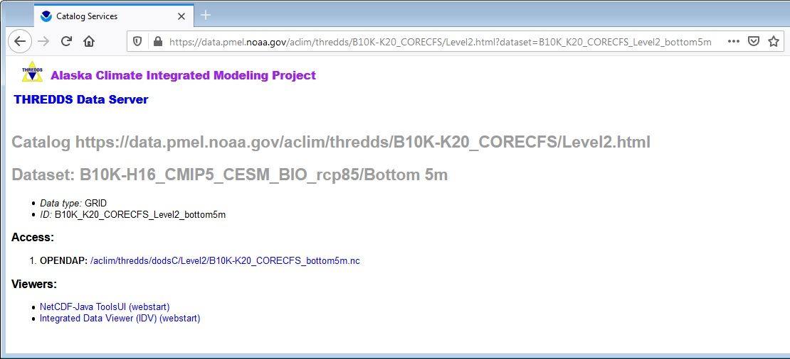{ width=100% }

The OPENDAP address (ending in .nc) is used to open a connection between R and the nc files associated with that data:

```{r minimal, include=TRUE, eval=F ,echo = TRUE, results='hide',message=FALSE}
    # Only required libraries for direct extraction - works in plain R
    library(ncdf4)
    library(thredds)                          

    # Note: Still ironing out inconsistencies in naming scheme for datasets -
    # browse to metadata on thredds server to check current names.

    # PMEL thredds server (for all available data)
    url_base <- "https://data.pmel.noaa.gov/aclim/thredds/"

    # List available runs for whole server
    tds_list_datasets(url_base)

    # Dataset address for hindcast Level2 data
    dataset  <- "B10K-K20_CORECFS/Level2.html"
 
    # List available data for Level2 hindcast
    tds_list_datasets(paste(url_base,dataset,sep=""))

    # Opendap address for bottom 5 meter layer
    opendap  <- "dodsC/Level2/B10K-K20_CORECFS_bottom5m.nc"

    # Open ncdf4 connection with dataset
    nc_handle <- nc_open(paste(url_base,opendap,sep="")) 

    # Show metadata from this dataset
    nc_handle

    # Close the connection
    nc_close(nc_handle)

```

## 3.3 Access using ACLIM package

The below code will extract variables from the Level 2 and Level 3 netcdf files (`.nc`) and save them as compressed `.Rdata` files on your local `r Rdata_path` folder. 

### 3.3.1 Setup up the R worksace

First let's get the workspace set up, will we step through an example downloading the hindcast and a single projection (CMIP5 MIROC rcp8.5) but you can loop the code below to download the full set of CMIP5 projections.

```{r thredds,include=TRUE, eval = TRUE,echo = TRUE, results='hide',message=FALSE}

    # --------------------------------------
    # SETUP WORKSPACE
    # rm(list=ls())
    tmstp  <- format(Sys.time(), "%Y_%m_%d")
    main   <- getwd()  #"~/GitHub_new/ACLIM2
    source("R/make.R")
    # --------------------------------------
  
```  

Let's take a look at the available online datasets:

```{r preview,include=T, eval=T, echo=T}

    # preview the datasets on the server:
    url_list <- tds_list_datasets(thredds_url = ACLIM_data_url)
    
    #display the full set of datasets:
    cat(paste(url_list$dataset,"\n"))
    
```    
  


### 3.3.2 Download Level 2 data

First we will explore the Level 2 bottom temperature data on the [ACLIM Thredds server](https://data.pmel.noaa.gov/aclim/thredds/) using the H16 hindcast and the H16 (CMIP5) projection for MIROC under rcp8.5. The first step is to get the data urls:
   
```{r thredds_getURLs, include=T,eval=T,echo=T}
                           
   # define the simulation to download:
    cmip <- "CMIP5"     # Coupled Model Intercomparison Phase
    GCM  <- "MIROC"     # Global Circulation Model
    rcp  <- "rcp85"     # future carbon scenario
    mod  <- "B10K-H16"  # ROMSNPZ model
    hind <- "CORECFS"   # Hindcast
    
    # define the projection simulation:
    proj  <- paste0(mod,"_",cmip,"_",GCM,"_",rcp)
    hind  <- paste0(mod,"_",hind)
    
    # get the url for the projection and hindcast datasets:
    proj_url       <- url_list[url_list$dataset == paste0(proj,"/"),]$path
    hind_url       <- url_list[url_list$dataset == paste0(hind,"/"),]$path
    
    # preview the projection and hindcast data and data catalogs (Level 1, 2, and 3):
    proj_datasets  <- tds_list_datasets(thredds_url = proj_url)
    hind_datasets  <- tds_list_datasets(thredds_url = hind_url)
    
    # get url for the projection and hindcast Level 2 and Level 3 catalogs
    proj_l2_cat    <- proj_datasets[proj_datasets$dataset == "Level 2/",]$path
    proj_l3_cat    <- proj_datasets[proj_datasets$dataset == "Level 3/",]$path
    hind_l2_cat    <- hind_datasets[hind_datasets$dataset == "Level 2/",]$path
    hind_l3_cat    <- hind_datasets[hind_datasets$dataset == "Level 3/",]$path
    hind_l2_cat
```


Now that we have the URLs let's take a look at the available Level2 datasets:

* `Bottom 5m`   : bottom water temperature at 5 meters
* `Surface 5m`  : surface water temperature in the first 5 meters
* `Integrated`  : Integrated water column averages for various NPZ variables

```{r thredds_l2_url, include=T,eval=T,echo=T}
    
    # preview the projection and hindcast Level 2 datasets:
    proj_l2_datasets  <- tds_list_datasets(proj_l2_cat)
    hind_l2_datasets  <- tds_list_datasets(hind_l2_cat)
    proj_l2_datasets$dataset
    
    # get url for bottom temperature:
    proj_l2_BT_url    <- proj_l2_datasets[proj_l2_datasets$dataset == "Bottom 5m",]$path
    hind_l2_BT_url    <- hind_l2_datasets[hind_l2_datasets$dataset == "Bottom 5m",]$path
    proj_l2_BT_url
                         
```

We can't preview the Level 3 datasets in the same way but they are identical to those in the google drive and include two datasets

* `ACLIMsurveyrep_B10K-H16_CMIP5_CESM_BIO_rcp85.nc`  : NMFS Groundfish summer NBS and EBS survey replicated values for 60+ variables
* `ACLIMregion_B10K-H16_CMIP5_CESM_BIO_rcp85.nc`     : weekly strata averages for 60+ variables

```{r vars, include=T,echo=T,eval=F}   

    weekly_vars  # list of possible variables in the ACLIMregion_ files 

```

Now we can download a subset of the Level2 data (full 10KM Lat Lon re-gridded data), here with an example of sampling on Aug 1 of each year:

```{r thredds_l2, include=T,echo=T,eval=F}   
    
   # Currently available Level 2 variables
    dl     <- proj_l2_datasets$dataset  # datasets

   # variable list
   svl <- list(
          'Bottom 5m' = "temp",
          'Surface 5m' = "temp",
          'Integrated' = c("EupS","Cop","NCaS") ) 
       
    
    # preview the variables, timesteps, and lat lon in each dataset:
    l2_info <- scan_l2(ds_list = dl,sim_list = "B10K-H16_CORECFS" )
    
    names(l2_info)
    l2_info[["Bottom 5m"]]$vars
    l2_info[["Surface 5m"]]$vars
    l2_info[["Integrated"]]$vars
    max(l2_info[["Integrated"]]$time_steps)
    l2_info[["Integrated"]]$years
    
    
    # Simulation list:
    # --> --> Tinker:add additional projection scenarios here
    sl <- c(hind, proj)

    # Currently available Level 2 variables
    dl     <- proj_l2_datasets$dataset  # datasets
    
    # variables to pull from each data set
    # --> --> Tinker: try subbing in other Integrated variables 
    # (l2_info[["Integrated"]]$vars) into the third list vector 
    svl <- list(
      'Bottom 5m' = "temp",
      'Surface 5m' = "temp",
      'Integrated' = c("EupS","Cop","NCaS") ) 
   
    
    # Let's sample the model years as close to Aug 1 as the model timesteps run:
    # --> --> Tinker - try a different date
    tr          <- c("-08-1 12:00:00 GMT") 
    
    # grab nc files from the aclim server and convert to rdatafiles with the ID Aug1
    get_l2(
      ID          = "_Aug1",
      overwrite   =  T,
      ds_list     = dl,
      trIN        = tr,
      sub_varlist = svl,  
      sim_list    = sl  )
        
```

### 3.3.3 Download Level 3 data

Now let's grab some of the Level 3 data and store it in the `r Rdata_path` folder. This is comparatively faster because Level 3 files are already post-processed to be in the ACLIM indices format and are relatively small:

```{r thredds_l3, include=T,echo=T,eval=F}                           
    
    # Simulation list:
    # --> --> Tinker:add additional projection scenarios here
    sl <- c(hind, proj)
    
    # variable list
    # --> --> Tinker:add additional variables to varlist
    vl <- c(
              "temp_bottom5m",    # bottom temperature,
              "NCaS_integrated",  # Large Cop
              "Cop_integrated",   # Small Cop
              "EupS_integrated")  # Shelf  euphausiids
    
    # convert  nc files into a long data.frame for each variable
    # three options are:
    # ------------------------------------
    
    # opt 1: access nc files remotely (fast, less local storage needed)
    get_l3(web_nc = TRUE, download_nc = F,
          varlist = vl,sim_list = sl)
    
    # opt 2:  download nc files then access locallly:
    get_l3(web_nc = TRUE, download_nc = T,
          local_path = file.path(local_fl,"aclim_thredds"),
          varlist = vl,sim_list = sl)
    
     # opt 3:  access existing nc files locally:
    get_l3(web_nc = F, download_nc = F,
          local_path = file.path(local_fl,"aclim_thredds"),
          varlist = vl,sim_list = sl)

```

### 3.3.4 Download Level 3 CMIP6 (ACLIM only for now)

Go to the shared google drive and dowload the CMIP6 data into your ACLIM2 local folder:

[00_ACLIM_shared>02_Data>Newest>roms_for_aclim](https://drive.google.com/drive/folders/1ljACM6cgMD7M14lzvozZyTP4tMBnf_S4)
and put in your local folder under:
`Data/in/roms_for_aclim`

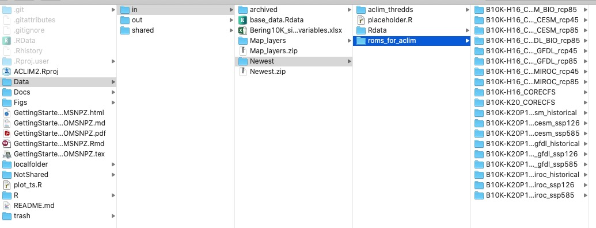


# 4. Explore indices & plot the data  

## 4.1. Data exploration with the minimal installation

Let's look at some data from the Level 2 bottom temperature records, using the threadds and ncdf4 libraries:

```{r minimal_cp, include=TRUE, eval=F ,echo = TRUE, results='hide',message=FALSE}

   library(ncdf4)
   library(thredds)  

   # Open connection to Level 2 bottom 5 meter layer
   url_base <- "https://data.pmel.noaa.gov/aclim/thredds/"
   opendap  <- "dodsC/Level2/B10K-K20_CORECFS_bottom5m.nc"
   nc       <- nc_open(paste(url_base,opendap,sep=""))

   # Examination of the nc object shows variables such as temperature (temp)
   #        float temp[xi_rho,eta_rho,ocean_time]   
   #            long_name: time-averaged potential temperature, bottom 5m mean
   #            units: Celsius
   #            time: ocean_time
   #            coordinates: lon_rho lat_rho ocean_time
   #            field: temperature, scalar, series
   #            _FillValue: 9.99999993381581e+36
   #            cell_methods: s_rho: mean

   # temp has three dimensions - xi_rho, eta_rho, and ocean_time
   # Now we make vectors of each axis.
   xi_axis  <- seq(1,182) # Hardcoded axis length
   eta_axis <- seq(1,258) # Hardcoded axis length

   # time units in GMT: seconds since 1900-01-01 00:00:00
   t_axis   <- ncvar_get(nc,"ocean_time")
   time_axis <- as.POSIXct(t_axis, origin = "1900-01-01", tz = "GMT")

   # Make two dates to find in the data
   date1 <- ISOdate(year=2010, month=7, day=1, hour = 12, tz = "GMT")
   date2 <- ISOdate(year=2019, month=7, day=1, hour = 12, tz = "GMT")

   # Which time index is closest to those dates?
   timerec1 <- which.min(abs(time_axis - date1))
   timerec2 <- which.min(abs(time_axis - date2))

   # Center time of the closest weekly average
   time_axis[timerec1]
   time_axis[timerec2]

   # Get full xi, eta grid (count=-1) for two time slices
   # Get one record starting at desired timerec.  
   # Careful (easy to grab too much data, if count and start are missing
   # it will grab all the data).
   temp1 <- ncvar_get(nc, "temp", start=c(1,1,timerec1), count=c(-1,-1,1))
   temp2 <- ncvar_get(nc, "temp", start=c(1,1,timerec2), count=c(-1,-1,1))

   # Plot comparison (not checking scale here)
   par(mfrow=c(1,2))
   image(temp1)
   image(temp2)

   # Get lat/lon for better mapping - getting whole variable 
   lats <- ncvar_get(nc,"lat_rho")
   lons <- ncvar_get(nc,"lon_rho")

   # Visualizing the coordinate transformation 
   plot(lons,lats)

   # Let's flag water <2 degrees C
   par(mfrow=c(1,2))
   plot(lons,lats,col=ifelse(temp1<2,"blue","green"),main="2010")
   plot(lons,lats,col=ifelse(temp2<2,"blue","green"),main="2019")

   # Close the connection
   nc_close(nc)

```
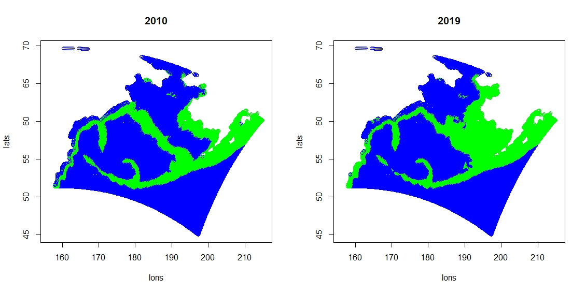{ width=100%}

## 4.2. Level 3 indices

Level 3 indices can be used to generate seasonal, monthly, and annual indices (like those reported in [Reum et al. 2020)](https://www.frontiersin.org/articles/10.3389/fmars.2020.00124/full), [Holsman et al. 2020)](http://dx.doi.org/10.1038/s41467-020-18300-3). In the section below we explore these indices in more detail using R, including using (2) above to generate weekly, monthly, and seasonal indices (e.g. Fall Zooplankton) for use in biological models. In section 3 below we explore these indices in more detail using R, including using (2) above to generate weekly, monthly, and seasonal indices (e.g. Fall Zooplankton) for use in biological models. The following examples show how to analyze and plot the ACLIM indices from the .Rdata files created in the previous step 3. Please be sure to coordinate with ROMSNPZ modeling team members to ensure data is applied appropriately. 

### 4.2.1 Explore Level 3 data catalog

Once the base files and setup are loaded you can explore the index types. Recall that in each scenario folder there are two indices saved within the `Level3` subfolders:

1) `ACLIMsurveyrep_B10K-x.nc` contains summer groundfish trawl "survey replicated" indices (using mean date and lat lon) *(Note that the resampling stations need to be removed before creating bottom temperature maps)*  
2) `ACLIMregion_B10K-x.nc`: contains weekly "strata" values *(Note that area weighting should be used to combine values across multiple strata)*

First run the below set of code to set up the workspace:

```{r explore, eval=T, echo=T,results='hide',message=FALSE}
    
    # --------------------------------------
    # SETUP WORKSPACE
    tmstp  <- format(Sys.time(), "%Y_%m_%d")
    main   <- getwd()  #"~/GitHub_new/ACLIM2
    source("R/make.R")
    # --------------------------------------
    
    # list of the scenario x GCM downscaled ACLIM indices
    for(k in aclim)
     cat(paste(k,"\n"))
    
    embargoed # not yet public or published
    public    # published runs (CMIP5)
    
    # get some info about a scenario:
    all_info1
    all_info2
   
    # variables in each of the two files:
    srvy_vars
    weekly_vars
  
    #summary tables for variables
    srvy_var_def
    weekly_var_def
    
    # explore stations in the survey replicated data:
    head(station_info)
  
 
```

### 4.2.2 Level 3: Spatial indices (survey replicated)

Let's start b exploring the survey replicated values for each variable. Previous steps generated the Rdata files that are stored in the `ACLIMsurveyrep_B10K-[version_CMIPx_GCM_RCP].Rdata` in each corresponding simulation folder. 

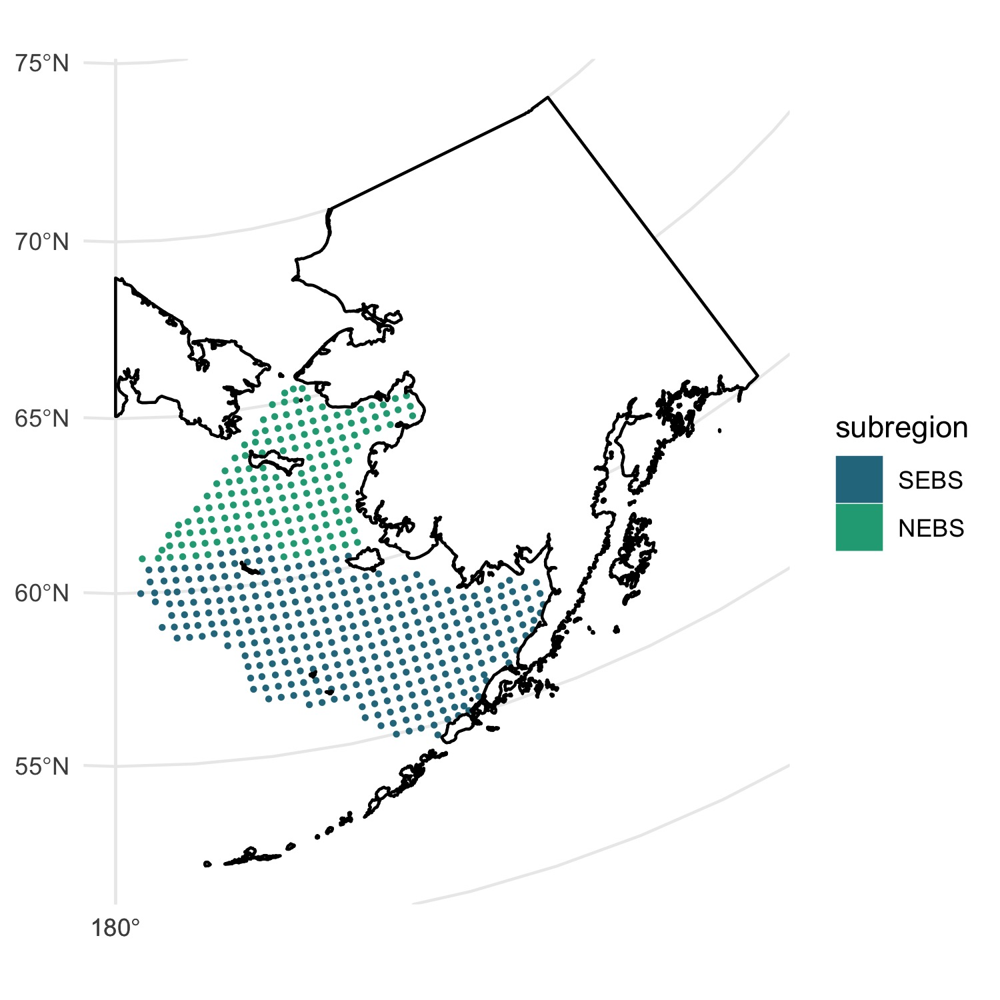{ width=50%}
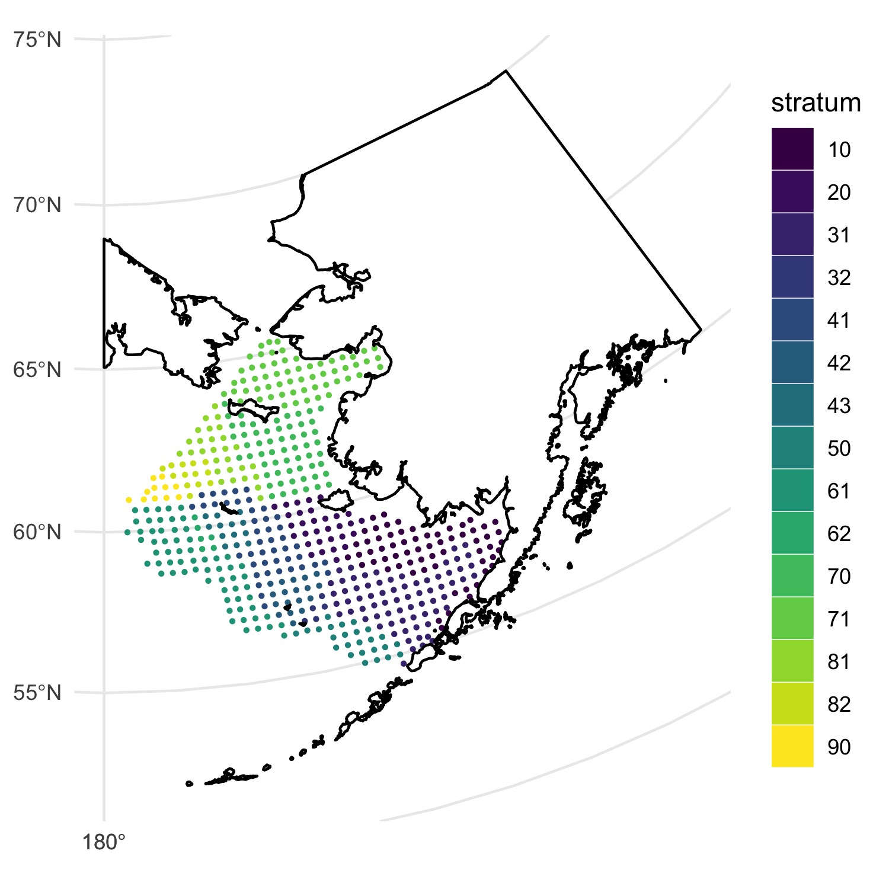{ width=50%}

The code segment below will recreate the above figures.*Note that if this is the first time through it may take 3-5 mins to load the spatial packages and download the files from the web (first time through only).*
```{r readncfiles_srvy, eval=F, echo=T, results='hide'}
    
   # if load_gis is set to FALSE in R/setup.R (default) 
   # we will need to load the gis layers and packages
   # if this is the first time through this would be a good time
   # to grab a coffee...
   
   source("R/sub_scripts/load_maps.R")
  
   # first convert the station_info object into a shapefile for mapping:
   station_sf         <- convert2shp(station_info)
   station_sf$stratum <- factor(station_sf$stratum)
   
   # plot the stations:
   p <- plot_stations_basemap(sfIN = station_sf,
                              fillIN = "subregion",
                              colorIN = "subregion") + 
     scale_color_viridis_d(begin = .2,end=.6) +
     scale_fill_viridis_d(begin  = .2,end=.6)
  
   if(update.figs){
     p
     ggsave(file=file.path(main,"Figs/stations_NS.jpg"),width=5,height=5)
    }

   p2 <- plot_stations_basemap(sfIN = station_sf,fillIN = "stratum",colorIN = "stratum") + 
     scale_color_viridis_d() +
     scale_fill_viridis_d()
   
   if(update.figs){
     p2
   ggsave(file=file.path(main,"Figs/stations.jpg"),width=5,height=5)}
```


# 5. Hindcasts  

There are two model versions of hindcasts available for comparison. The Hermann et al. 2016 H16 10 depth layer model and the Kearney et al. 2020 30 depth layer model. Both are resolved spatially at a ~10km grid cell. 

## 5.1. Level 3 hindcasts

Level 3 hindcast products inculde survey replicated station data and strata averaged weekly values. The code below will explore these in more detail.

### 5.1.1. Level 3 hindcasts: spatial patterns

Now let's explore the survey replicated data in more detail and use to plot bottom temperature.

```{r explore_srvy1, eval=F, echo=T, results='hide',message=FALSE}
    # run this line if load_gis is set to F in R/setup.R:
    source("R/sub_scripts/load_maps.R")  

    # preview the l3 data for the hindcast:
    tt <- all_info1%>%filter(name =="B10K-K20_CORECFS")
    tt <- seq(as.numeric(substring(tt$Start,1,4)),
              as.numeric(substring(tt$End,1,4)),10)
    
    # now create plots of average BT during four time periods
    time_seg   <- list( '1970-1980' = c(1970:1980),
                        '1980-1990' = c(1980:1990),
                        '1990-2000' = c(1990:2000),
                        '2000-2010' = c(2000:2010),
                        '2010-2020' = c(2010:2020))
  
    # lists the possible variables
    srvy_vars  # lists the possible variables
    
    # specify the variables to plot
    vl        <- c(
                  "temp_bottom5m",
                  "NCaS_integrated", # Large Cop
                  "Cop_integrated",  # Small Cop
                  "EupS_integrated") # Euphausiids
    
    # assign the simulation to download
    # --> Tinker: try selecting a different set of models to compare
    sim        <-"B10K-K20_CORECFS" 
    
    # open a "region" or strata specific nc file
    fl         <- file.path(sim,paste0(srvy_txt,sim,".Rdata"))
     
    # create local rdata files (opt 1)
    if(!file.exists(file.path(Rdata_path,fl)))
      get_l3(web_nc = TRUE, download_nc = F,
          varlist = vl,sim_list =sim )
    
    # load object 'ACLIMsurveyrep'
    load(file.path(main,Rdata_path,fl))   
    
    
    # Collate mean values across timeperiods and simulations
    # -------------------------------------------------------
    ms <- c("B10K-H16_CORECFS","B10K-K20_CORECFS" )
   
    # Loop over model set
    for(sim in ms){
     fl         <- file.path(sim,paste0(srvy_txt,sim,".Rdata"))
     
    if(!file.exists( file.path(Rdata_path,fl)) )
      get_l3(web_nc = TRUE, download_nc = F,
          varlist = vl,sim_list =sim )
    }
      
    # get the mean values for the time blocks from the rdata versions
    # will throw "implicit NA" errors that can be ignored
    mn_var_all <- get_mn_rd(modset = ms,
                            names  = c("H16","K20") ,
                            varUSE = "temp_bottom5m")
    # --> Tinker:           varUSE = "EupS_integrated") 
    
    # convert results to a shapefile
    mn_var_sf  <- convert2shp(mn_var_all%>%filter(!is.na(mnval)))
    lab_t      <- "Bering10K CORECFS hindcast"
    
    p_hind_3         <- plot_stations_basemap(sfIN = mn_var_sf,
                                fillIN = "mnval",
                                colorIN = "mnval",
                                sizeIN=.3) +
      facet_grid(simulation~time_period)+
      scale_color_viridis_c()+
      scale_fill_viridis_c()+
      guides(
        color =  guide_legend(title="Bottom T (degC)"),
        fill  =  guide_legend(title="Bottom T (degC)")) +
      ggtitle(lab_t)
   
    # This is slow but it works (repeat dev.new() twice if in Rstudio)...
    dev.new()
    p_hind_3
    
    if(update.figs)  
      ggsave(file=file.path(main,"Figs/mn_hindcast_BT.jpg"),width=8,height=6)
```


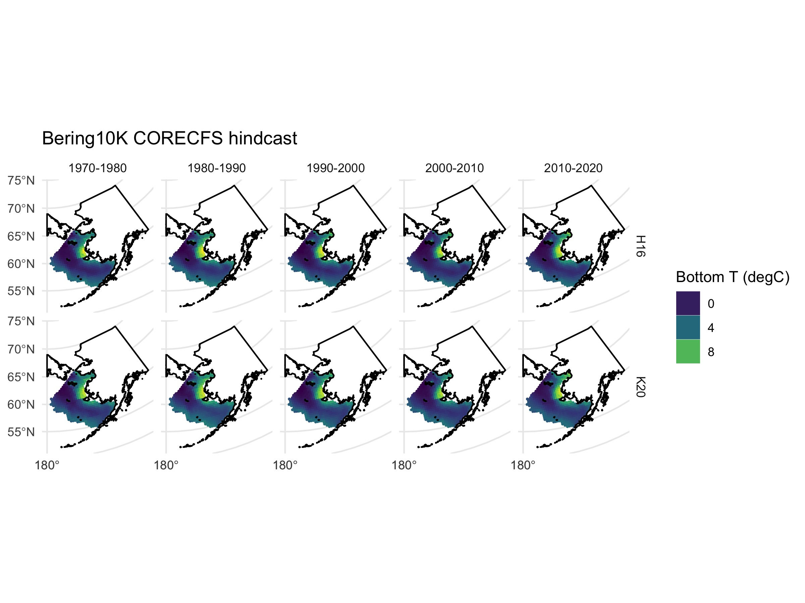{ width=100% }
Now let's look at the Marine Heatwave conditions in 2018 and compare that to the average conditions prior to 2010:

```{r MHW_plot, eval=F, echo=T}
    # now create plots of average BT during four time periods
    time_seg   <- list( '1970-2010' = c(1970:2010),
                        '2018-2018' = c(2018:2018))
  
    # assign the simulation to download
    sim        <- "B10K-K20_CORECFS" 
    
    # open a "region" or strata specific nc file
    fl         <- file.path(sim,paste0(srvy_txt,sim,".Rdata"))
     
    # load object 'ACLIMsurveyrep'
    load(file.path(main,Rdata_path,fl))   
      
    # get the mean values for the time blocks from the rdata versions
    mn_var_all <- get_mn_rd(modset = "B10K-K20_CORECFS",
                            varUSE = "temp_bottom5m")
    
    # convert results to a shapefile
    mn_var_sf  <- convert2shp(mn_var_all%>%filter(!is.na(mnval)))
    lab_t      <- "Bering10K CORECFS hindcast"
    
    p_mhw      <- plot_stations_basemap(sfIN = mn_var_sf,
                                fillIN = "mnval",
                                colorIN = "mnval",
                                sizeIN=.3) +
      facet_grid(simulation~time_period)+
      scale_color_viridis_c()+
      scale_fill_viridis_c()+
      guides(
        color =  guide_legend(title="Bottom T (degC)"),
        fill  =  guide_legend(title="Bottom T (degC)")) +
      ggtitle(lab_t)
   
    # This is slow but it works (repeat dev.new() twice if in Rstudio)...
    dev.new(width=4,height=3)
    p_mhw
    
    if(update.figs)  
      ggsave(file=file.path(main,"Figs/mn_hindcast_mhw.jpg"),width=4,height=3)
```
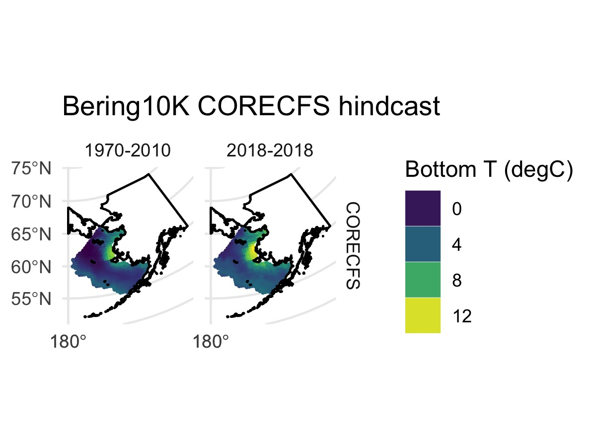{ width=100% }

### 5.1.2. Level 3 hindcasts: Weekly strata averages

The next set of indices to will explore are the weekly strata-specific values for each variable.These are stored in the `ACLIMregion_B10K-[version_CMIPx_GCM_RCP].nc` in each scenario folder. 

```{r hind_weekly, eval=F, echo=T}
    
   
    # View an individual variable (e.g., Bottom Temp)
    # -------------------------------------------------------
    weekly_vars

    # assign the simulation to download
    sim        <- "B10K-K20_CORECFS" 
    
    # define a "region" or strata specific nc file
    fl         <- file.path(sim,paste0(reg_txt,sim,".Rdata"))
    

    vl        <- c(
                  "temp_bottom5m",
                  "NCaS_integrated", # Large Cop
                  "Cop_integrated",  # Small Cop
                  "EupS_integrated") # Euphausiids
    
    # create local rdata files (opt 1)
    if(!file.exists(file.path(Rdata_path,fl)))
      get_l3(web_nc = TRUE, download_nc = F,
          varlist = vl,sim_list = sim)
    
 
    # load object 'ACLIMregion' for bottom temperature
    load(file.path(main,Rdata_path,fl))  
    tmp_var    <- ACLIMregion%>%filter(var == "temp_bottom5m")
    
   # now plot the data:
   p4_hind <- ggplot(data = tmp_var) + 
     geom_line(aes(x=time,y=val,color= strata),alpha=.8)+
     facet_grid(basin~.)+
     ylab(tmp_var$units[1])+
     ggtitle( paste(sim,tmp_var$var[1]))+
     theme_minimal()
   p4_hind
   
    if(update.figs)  
      ggsave(file=file.path(main,"Figs/hind_weekly_bystrata.jpg"),width=8,height=5)

   
   # To get the average value for a set of strata, weight the val by the area:
   mn_NEBS <- getAVGnSUM(strataIN = NEBS_strata, dataIN = tmp_var)
   mn_NEBS$basin = "NEBS"
   mn_SEBS <-getAVGnSUM(strataIN = SEBS_strata, dataIN = tmp_var)
   mn_SEBS$basin = "SEBS"
   
   p5_hind <- ggplot(data = rbind(mn_NEBS,mn_SEBS)) + 
      geom_line(aes(x=time,y=mn_val,color=basin),alpha=.8)+
      geom_smooth(aes(x=time,y=mn_val,color=basin),
                  formula = y ~ x, se = T)+
      facet_grid(basin~.)+
      scale_color_viridis_d(begin=.4,end=.8)+
      ylab(tmp_var$units[1])+
      ggtitle( paste(sim,mn_NEBS$var[1]))+
     
      theme_minimal()
  p5_hind
  if(update.figs)  
    ggsave(file=file.path(main,"Figs/hind_weekly_byreg.jpg"),width=8,height=5)

 
```

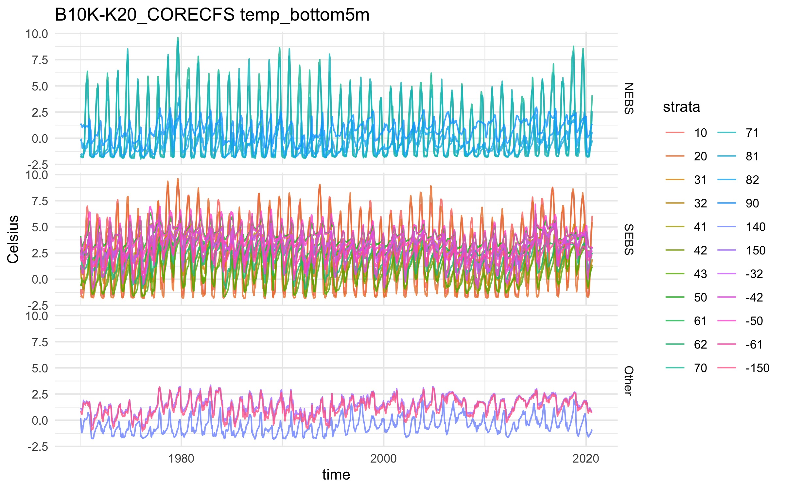{ width=90% }

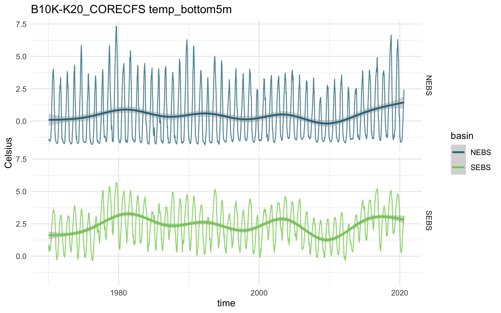{ width=90% }

### 5.1.3. Level 3 hindcasts: Seasonal averages
Now using a similar approach get the seasonal mean values for a variable:
```{r seasonal averages, eval=F, include=T,echo=T}
    
    # assign the simulation to download
      sim        <- "B10K-K20_CORECFS" 
   

    # Set up seasons (this follows Holsman et al. 2020)
      seasons <- data.frame(mo = 1:12, 
                   season =factor("",
                     levels=c("Winter","Spring","Summer","Fall")))
      seasons$season[1:3]   <- "Winter"
      seasons$season[4:6]   <- "Spring"
      seasons$season[7:9]   <- "Summer"
      seasons$season[10:12] <- "Fall"
    
       
    vl <- c(
                  "temp_bottom5m",
                  "NCaS_integrated", # Large Cop
                  "Cop_integrated",  # Small Cop
                  "EupS_integrated") # Euphausiids
    
    # create local rdata files (opt 1)
    if(!file.exists(file.path(Rdata_path,fl)))
      get_l3(web_nc = TRUE, download_nc = F,
          varlist = vl,sim_list = sim)
    
    # open a "region" or strata specific  file
    fl      <- file.path(sim,paste0(reg_txt,sim,".Rdata"))
    load(file.path(main,Rdata_path,fl))
    
    # get large zooplankton as the sum of euph and NCaS
    tmp_var    <- ACLIMregion%>%
      filter(var%in%vl[c(2,3)])%>%
      group_by(time,strata,strata_area_km2,basin)%>%
      group_by(time,
             strata,
             strata_area_km2,
             basin,
             units)%>%
      summarise(val =sum(val))%>%
      mutate(var       = "Zoop_integrated",
             long_name ="Total On-shelf 
             large zooplankton concentration, 
             integrated over depth (NCa, Eup)")
    
    rm(ACLIMregion)
    head(tmp_var)
    
    # define some columns for year mo and julian day
    tmp_var$yr     <- strptime(as.Date(tmp_var$time),
                               format="%Y-%m-%d")$year + 1900
    tmp_var$mo     <- strptime(as.Date(tmp_var$time),
                               format="%Y-%m-%d")$mon  + 1
    tmp_var$jday   <- strptime(as.Date(tmp_var$time),
                               format="%Y-%m-%d")$yday + 1
    tmp_var$season <- seasons[tmp_var$mo,2]
    
    # To get the average value for a set of strata, weight the val by the area: (slow...)
    mn_NEBS_season <- getAVGnSUM(
      strataIN = NEBS_strata,
      dataIN = tmp_var,
      tblock=c("yr","season"))
    mn_NEBS_season$basin = "NEBS"
    
    mn_SEBS_season <- getAVGnSUM(
      strataIN = SEBS_strata, 
      dataIN = tmp_var,
      tblock=c("yr","season"))
    mn_SEBS_season$basin = "SEBS"
    
   plot_data      <- rbind(mn_NEBS_season,mn_SEBS_season)
    
   # plot Fall values:
   p6_hind <- ggplot(data = plot_data%>%filter(season=="Fall") ) + 
      geom_line(   aes(x = yr,y = mn_val,color=basin),alpha=.8)+
      geom_smooth( aes(x = yr,y = mn_val,color=basin),
                  formula = y ~ x, se = T)+
      facet_grid(basin~.)+
      scale_color_viridis_d(begin=.4,end=.8)+
      ylab(tmp_var$units[1])+
      ggtitle( paste(sim,"Fall",mn_NEBS_season$var[1]))+
      theme_minimal()
  p6_hind
  
  
  if(update.figs)  
    ggsave(file=file.path(main,"Figs/Hind_Fall_large_Zoop.jpg"),width=8,height=5)
  
```

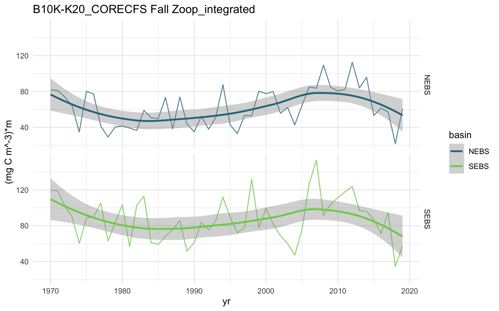{ width=75% }

### 5.1.4. Level 3 hindcasts: Monthly averages

Using the same approach we can get monthly averages for a given variable:

```{r monthly averages hind, eval=F, include=T,echo=T}
    
    # To get the average value for a set of strata, weight the val by the area: (slow...)
    mn_NEBS_season <- getAVGnSUM(
      strataIN = NEBS_strata,
      dataIN   = tmp_var,
      tblock   = c("yr","mo"))
    mn_NEBS_season$basin = "NEBS"
    
    mn_SEBS_season <- getAVGnSUM(
      strataIN = SEBS_strata, 
      dataIN = tmp_var,
      tblock=c("yr","mo"))
    mn_SEBS_season$basin = "SEBS"
    
    plot_data      <- rbind(mn_NEBS_season,mn_SEBS_season)
    
   # plot Fall values:
   p7_hind <- ggplot(data = plot_data%>%filter(mo==9) ) + 
      geom_line(   aes(x = yr,y = mn_val,color=basin),alpha=.8)+
      geom_smooth( aes(x = yr,y = mn_val,color=basin),
                  formula = y ~ x, se = T)+
      facet_grid(basin~.)+
      scale_color_viridis_d(begin=.4,end=.8)+
      ylab(tmp_var$units[1])+
      ggtitle( paste(aclim[2],"Sept.",mn_NEBS_season$var[1]))+
      theme_minimal()
   dev.new()
  p7_hind
  
  if(update.figs)  
    ggsave(file=file.path(main,"Figs/Hind_Sept_large_Zoop.jpg"),width=8,height=5)
```

 
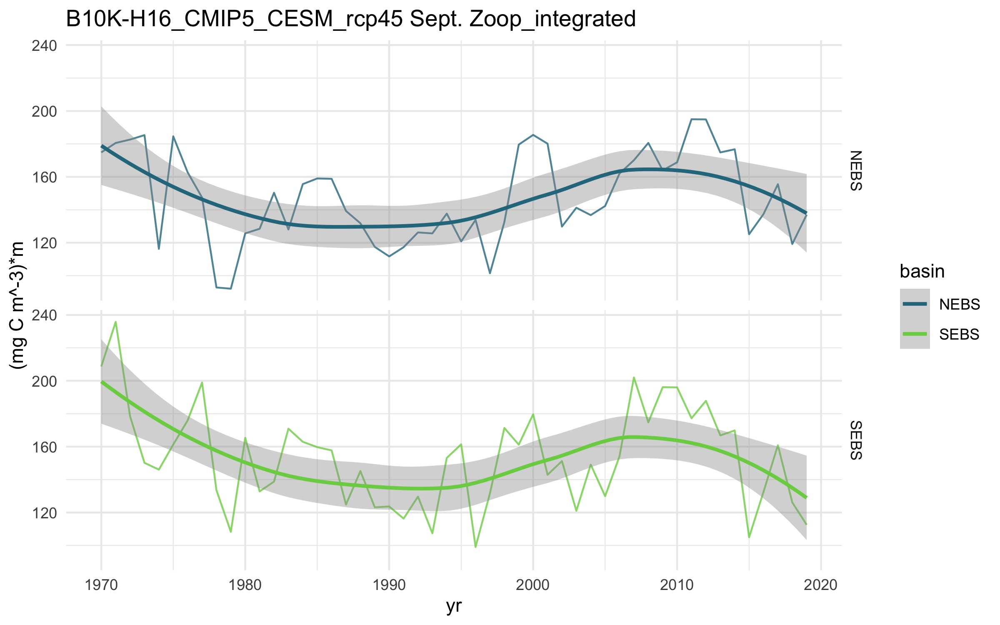{ width=75% }

## 5.2. Level 2 hindcasts

Level 2 data can be explored in the same way as the above indices but we will focus in the section below on a simple spatial plot and temporal index. The advantage of Level2 inidces is in the spatial resolution and values outside of the survey area. 

### 5.2.1. Level 2 hindcasts: Custom spatial indices 

As we did in section 5.1.1. let's create spatial plots of hindcast time periods for Aug 1 of each year:

```{r explore_L2_space hind, eval=F, echo=T}
    # run this line if load_gis is set to F in R/setup.R:
    source("R/sub_scripts/load_maps.R")  

    # now create plots of average BT during four time periods
    time_seg   <- list( '1970-1980' = c(1970:1980),
                        '1980-1990' = c(1980:1990),
                        '1990-2000' = c(1990:2000),
                        '2000-2010' = c(2000:2010),
                        '2010-2020' = c(2010:2020))
    
     # preview the datasets on the server:
     tds_list_datasets(thredds_url = ACLIM_data_url)
  
    # assign the simulation to download
    # --> Tinker: try selecting a different set of models to compare
    sim        <- "B10K-K20_CORECFS" 
    #ms <- c("B10K-H16_CORECFS","B10K-K20_CORECFS" )
    
    # Currently available Level 2 variables
    dl     <- proj_l2_datasets$dataset  # datasets
    
    svl    <- list(
                'Bottom 5m' = "temp",
                'Surface 5m' = "temp",
                'Integrated' = c("EupS","Cop","NCaS") )
    
    # Let's sample the model years as close to Aug 1 as the model timesteps run:
    tr          <- c("-08-1 12:00:00 GMT") 
    
    # the full grid is large and takes a longtime to plot, so let's subsample the grid every 4 cells
   
    IDin       <- "_Aug1_subgrid"
    var_use    <- "_bottom5m_temp"
    
    # open a "region" or strata specific nc file
    fl         <- file.path(main,Rdata_path,sim,"Level2",
                            paste0(sim,var_use,IDin,".Rdata"))
    
   # load data from level 2 nc files (approx <10sec)
    startTime = Sys.time()
    if(!file.exists(file.path(Rdata_path,fl))){
      get_l2(
        ID          = "_1990_subgrid",
        overwrite   = T,
        xi_rangeIN  = seq(1,182,10),
        eta_rangeIN = seq(1,258,10),
        ds_list     = dl[1],  # must be same length as sub_varlist
        trIN        = tr,
        yearsIN     = 1990,
        sub_varlist = list('Bottom 5m' = "temp" ),  
        sim_list    = sim  )
    }
    endTime  = Sys.time()
    endTime  - startTime
    
    # load data from level 2 nc files for all years and vars (yearsIN = NULL by default)
    #       NOTE: THIS IS SLOOOOOW..~ 2 min
    startTime2 = Sys.time()
    if(!file.exists(file.path(Rdata_path,fl))){
      get_l2(
        ID          = IDin,
        overwrite   = T,
        xi_rangeIN  = seq(1,182,10),
        eta_rangeIN = seq(1,258,10),
        ds_list     = dl,
        trIN        = tr,
        sub_varlist = svl,  
        sim_list    = sim  )
    }
    endTime2  = Sys.time()
    endTime2  - startTime2
    
    # load R data file
    load(fl)   # temp
    
    # there are smarter ways to do this;looping because 
    # we don't want to mess it up but this is slow...
    i <-1
    data_long <- data.frame(latitude = as.vector(temp$lat),
                       longitude = as.vector(temp$lon),
                       val = as.vector(temp$val[,,i]),
                       time = temp$time[i],
                       year = substr( temp$time[i],1,4),stringsAsFactors = F
                       )
    
    for(i in 2:dim(temp$val)[3])
      data_long <- rbind(data_long,
                          data.frame(latitude = as.vector(temp$lat),
                           longitude = as.vector(temp$lon),
                           val = as.vector(temp$val[,,i]),
                           time = temp$time[i],
                           year = substr( temp$time[i],1,4),stringsAsFactors = F)
                       )
    
    
    # get the mean values for the time blocks from the rdata versions
    # may throw "implicit NA" errors that can be ignored
    tmp_var <-data_long # get mean var val for each time segment
    j<-0
    for(i in 1:length(time_seg)){
      if(length( which(as.numeric(tmp_var$year)%in%time_seg[[i]] ))>0){
        j <- j +1
        mn_tmp_var <- tmp_var%>%
          filter(year%in%time_seg[[i]],!is.na(val))%>%
          group_by(latitude, longitude)%>%
          summarise(mnval = mean(val,rm.na=T))
        
        mn_tmp_var$time_period <- factor(names(time_seg)[i],levels=names(time_seg))
        
      if(j == 1) mn_var <- mn_tmp_var
      if(j >  1) mn_var <- rbind(mn_var,mn_tmp_var)
       rm(mn_tmp_var)
      }
    }
    
    # convert results to a shapefile
    L2_sf  <- convert2shp(mn_var%>%filter(!is.na(mnval)))
    
    p9_hind     <- plot_stations_basemap(sfIN = L2_sf,
                                fillIN = "mnval",
                                colorIN = "mnval",
                                sizeIN=.6) +
      #facet_wrap(.~time_period,nrow=2,ncol=3)+
      facet_grid(.~time_period)+
      scale_color_viridis_c()+
      scale_fill_viridis_c()+
      guides(
        color =  guide_legend(title="Bottom T (degC)"),
        fill  =  guide_legend(title="Bottom T (degC)")) +
      ggtitle(paste(sim,var_use,IDin))
   
    # This is slow but it works (repeat dev.new() twice if in Rstudio)...
    dev.new()
    p9_hind
    
    if(update.figs)  
      ggsave(file=file.path(main,"Figs/Hind_sub_grid_mn_BT_Aug1.jpg"),width=8,height=4)
  
    # graphics.off()
 
```


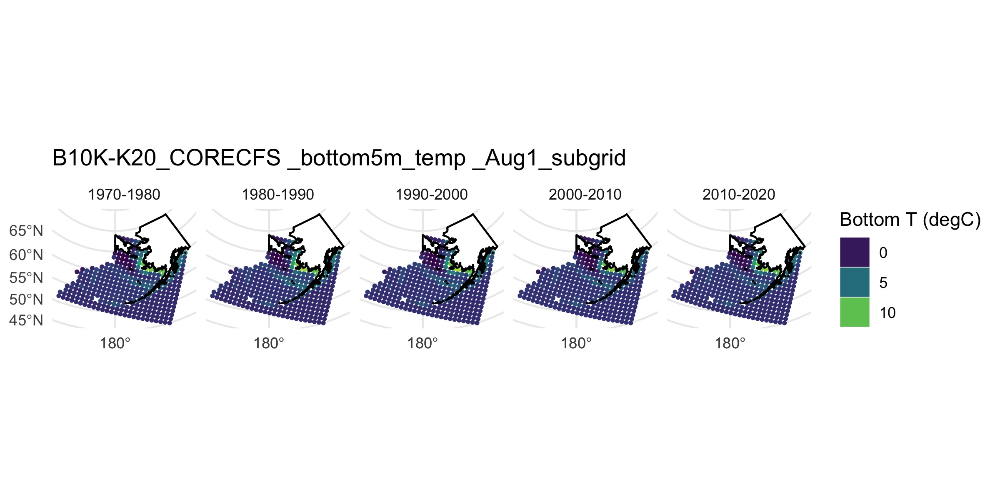{ width=100% }


### 5.2.2. Level 2 hindcasts: M2 mooring comparison

As final hindcast comparison, let's look a surface temperature from observations vs the H16 and K20 model versions of the hindcast:


```{r M2 Mooring hind, eval=F, echo=T}
    # M2_lat <- (56.87°N, -164.06°W)
    # 56.877    -164.06 xi = 99    eta= 62
    IDin       <- "_2013_M2"
    var_use    <- "_surface5m_temp"
    
    # get data from M2 data page:
      pmelM2_url <-"https://www.ncei.noaa.gov/data/oceans/ncei/ocads/data/0157599/"
      yr_dat     <- "M2_164W_57N_Apr2019_May2019.csv"
      yr_dat     <- "M2_164W_57N_May2013_Sep2013.csv"
        
    # preview the datasets on the server:
      temp <- tempfile()
      download.file(paste0(pmelM2_url,yr_dat),temp)
      #M2data <- read.csv(temp,skip=4,stringsAsFactors = F)
      M2data <- read.csv(temp,skip=0,stringsAsFactors = F)
      
      unlink(temp)

    # convert date and time to t 
      M2data$t <-as.POSIXct(paste0(M2data$Date," ",M2data$Time,":00"),"%m/%d/%Y %H:%M:%S",
                             origin =   "1900-01-01 00:00:00",
                             tz = "GMT")
    
    # open a "region" or strata specific nc file
    fl         <- file.path(main,Rdata_path,sim,"Level2",
                            paste0(sim,var_use,IDin,".Rdata"))

    # assign the simulation to download
    sim        <- "B10K-K20_CORECFS" 
    
    # Let's sample the model years as close to Aug 1 as the model timesteps run:
    #tr          <- c("-08-1 12:00:00 GMT") 
    tr          <- substring(M2data$t,5,20)
    # the full grid is large and takes a longtime to plot, so let's subsample the grid every 4 cells
   
    
   # load data from level 2 nc files (grab a coffee, takes a few mins)
    if(!file.exists(file.path(Rdata_path,fl))){
      get_l2(
        ID          = IDin,
        overwrite   = T,
        xi_rangeIN  = 99,
        eta_rangeIN = 62,
        ds_list     = dl[2],  # must be same length as sub_varlist
        trIN        = tr,
        yearsIN     = 2013,
        sub_varlist = list('Surface 5m' = "temp" ),  
        sim_list    = c("B10K-H16_CORECFS","B10K-K20_CORECFS" )  )
    }
    
    # load R data file
     # open a "region" or strata specific nc file
    sim <- "B10K-H16_CORECFS"
    fl         <- file.path(main,Rdata_path,sim,"Level2",
                            paste0(sim,var_use,IDin,".Rdata"))
    load(fl)   # temp
    
    # there are smarter ways to do this;looping because 
    # we don't want to mess it up but this is slow...
    i <-1
    data_long <- data.frame(latitude = as.vector(temp$lat),
                       longitude = as.vector(temp$lon),
                       val = as.vector(temp$val[,,i]),
                       sim  = sim,
                       time = temp$time[i],
                       year = substr( temp$time[i],1,4),stringsAsFactors = F
                       )
    
    for(i in 2:dim(temp$val)[3])
      data_long <- rbind(data_long,
                          data.frame(latitude = as.vector(temp$lat),
                           longitude = as.vector(temp$lon),
                           val = as.vector(temp$val[,,i]),
                           sim  = sim,
                           time = temp$time[i],
                           year = substr( temp$time[i],1,4),stringsAsFactors = F)
                       )
     # open a "region" or strata specific nc file
    sim <- "B10K-K20_CORECFS"
    fl2         <- file.path(main,Rdata_path,sim,"Level2",
                            paste0(sim,var_use,IDin,".Rdata"))
    load(fl2)   # temp
    for(i in 1:dim(temp$val)[3])
      data_long <- rbind(data_long,
                          data.frame(latitude = as.vector(temp$lat),
                           longitude = as.vector(temp$lon),
                           val = as.vector(temp$val[,,i]),
                           sim  = sim,
                           time = temp$time[i],
                           year = substr( temp$time[i],1,4),stringsAsFactors = F)
                       )
    
    plotM2_dat        <- M2data%>%dplyr::select(SST = SST..C.,Date = t)
    plotM2_dat$sim    <- factor("Obs",levels=c("Obs","B10K-H16_CORECFS","B10K-K20_CORECFS"))
    plotM2_dat        <- plotM2_dat%>%filter(SST>-99)
    plotroms_dat      <- data_long%>%dplyr::select(SST = val,Date = time,sim)
    plotroms_dat$sim  <- factor(plotroms_dat$sim,levels=c("Obs","B10K-H16_CORECFS","B10K-K20_CORECFS"))
    plotdat           <- rbind(plotM2_dat,plotroms_dat)
   
    p10_hind     <- ggplot(plotdat) +
      geom_line(   aes(x=Date,y=SST,color=sim),alpha=.8)+
      # geom_smooth( aes(x = Date,y = SST,color=sim),
      #             formula = y ~ x, se = T)+
      scale_color_viridis_d(begin=.9,end=.2)+
      ylab(tmp_var$units[1])+
      ggtitle( "Bering M2 Mooring: 2013 SST")+
      theme_minimal()
   
    # This is slow but it works (repeat dev.new() twice if in Rstudio)...
    dev.new()
    p10_hind
    
    if(update.figs)  
      ggsave(file=file.path(main,"Figs/Hind_M2_SST.jpg"),width=8,height=4)
  
    # graphics.off()
 
```

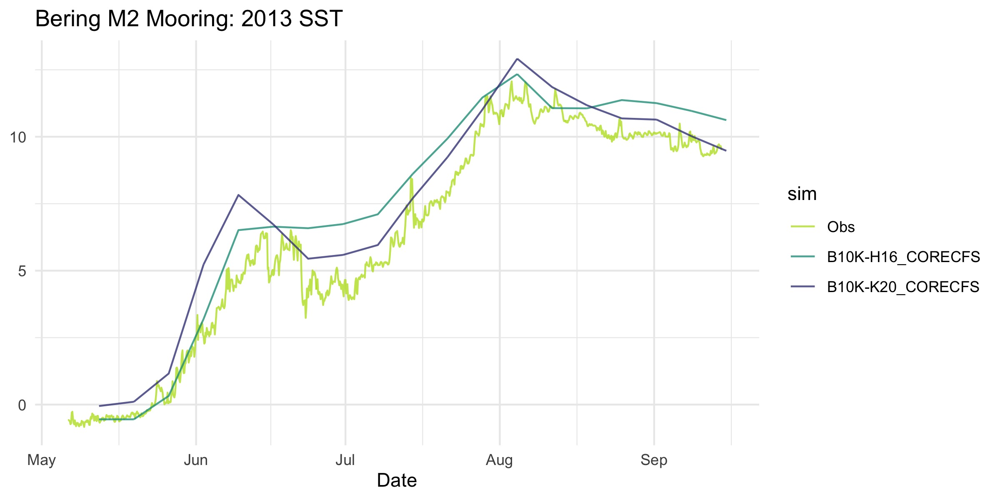{width=90%}

# 6. Projections  

The ACLIM project utilizes the full "suite" of Bering10K model hindcasts and projections, summarized in the following table. These represent downscaled models hindcast and projections whereby boundary conditions of the high resolution Bering10K model are forced by the coarser resolution General Circulation Models (GCM) run under Coupled Model Intercomparison Project (CMIP) phase 5 (5th IPCC Assessment Report) or phase 6 (6th IPCC Assessment Report; "AR") global carbon mitigation scenarios. Hindcasts are similarly forced at the boundaries from global scale climate reanalysis CORE and CFS products (see sections 1-5). For full details see the [Kearney 2021 Tech. Memo](https://beringnpz.github.io/roms-bering-sea/assets/DRAFT_NOAA-TM-AFSC-415.pdf).

## Table 1: Summary of ROMSNPZ downscaled model runs 
CMIP| GCM    |Scenario    |Def              |Years      |Model |Source|Status
--|--|------|--------|---------   | ---------------|----------|------|------|
||CORECFS  |Reanalysis| Hindcast        |1970 - 2018|H16        |IEA/ACLIM      |Public
||CORECFS  |Reanalysis | Hindcast        |1970 - 2020|K20       |MAPP/IEA/ACLIM|Public
5 | GFDL    |RCP 4.5    | Med. mitigation |2006 - 2099|H16      |ACLIM/FATE |Public
5 | GFDL    |RCP 8.5    | High baseline   |2006 - 2099|H16      |ACLIM/FATE |Public
5 | GFDL    |RCP 8.5bio*| High baseline   |2006 - 2099|H16      |ACLIM/FATE |Public
5 | MIROC   |RCP 4.5    | Med. mitigation |2006 - 2099|H16      |ACLIM/FATE |Public
5 | MIROC   |RCP 8.5    | High baseline   |2006 - 2099|H16      |ACLIM/FATE |Public
5 | CESM    |RCP 4.5    | Med. mitigation |2006 - 2099|H16      |ACLIM/FATE |Public
5 | CESM    |RCP 8.5    | High baseline   |2006 - 2080|H16      |ACLIM/FATE |Public
5 | CESM    |RCP 8.5bio*| High baseline   |2006 - 2099|H16      |ACLIM/FATE |Public
6| CESM     |SSP585     | High baseline   |2014 - 2099|K20P19   |ACLIM2/RTAP|Embargo
6| CESM     |SSP126     | High Mitigation |2014 - 2099|K20P19   |ACLIM2/RTAP|Embargo
6| CESM     |Historical | Historical      |1980 - 2014|K20P19   |ACLIM2/RTAP|Embargo
6| GFDL     |SSP585     | High baseline   |2014 - 2099|K20P19   |ACLIM2/RTAP|Embargo
6| GFDL     |SSP126     | High Mitigation |2014 - 2099|K20P19   |ACLIM2/RTAP|Embargo
6| GFDL     |Historical | Historical      |1980 - 2014|K20P19   |ACLIM2/RTAP|Embargo
6| MIROC    |SSP585     | High baseline   |2014 - 2099|K20P19   |ACLIM2/RTAP|Embargo
6| MIROC    |SSP126     | High Mitigation |2014 - 2099|K20P19   |ACLIM2/RTAP|Embargo
6| MIROC    |Historical | Historical      |1980 - 2014|K20P19   |ACLIM2/RTAP|Embargo  
*"bio" = nutrient forcing on boundary conditions

## 6.1. Level 3 projections

### 6.1.1. Level 3 projections: spatial patterns

Now let's explore the survey replicated data in more detail and use to plot bottom temperature.

```{r explore_srvy, eval=F, echo=T}
    
    # now create plots of average BT during four time periods
    time_seg   <- list( '2010-2020' = c(2010:2020),
                        '2021-2040' = c(2021:2040),
                        '2041-2060' = c(2041:2060),
                        '2061-2080' = c(2061:2080),
                        '2081-2099' = c(2081:2099))
    
    # lists the possible variables
    srvy_vars
    
    # specify the variables to plot
    vl        <- c(
                  "temp_bottom5m",
                  "NCaS_integrated", # Large Cop
                  "Cop_integrated",  # Small Cop
                  "EupS_integrated") # Euphausiids
    
    # View possible simulations:
    head(aclim)
    
    # assign the simulation to download
    # --> Tinker: try selecting a different set of models to compare
    sim        <-"B10K-H16_CMIP5_MIROC_rcp85" 
     sim        <-"B10K-H16_CMIP5_CESM_rcp85"
    
    # open a "region" or strata specific nc file
    fl         <- file.path(sim,paste0(srvy_txt,sim,".Rdata"))
    
    # create local rdata files 
    if(!file.exists(file.path(Rdata_path,fl)))
      get_l3(web_nc = TRUE, download_nc = F,
          varlist = vl,sim_list =sim )
    
    # load object 'ACLIMsurveyrep'
    load(file.path(main,Rdata_path,fl))   
     
    
    # Collate mean values across timeperiods and simulations
    # -------------------------------------------------------
    m_set      <- c(9,7,8)
    ms         <- aclim[m_set]
    
    # Loop over model set
    for(sim in ms){
     fl         <- file.path(sim,paste0(srvy_txt,sim,".Rdata"))
    
      # download & convert .nc files that are not already in Rdata folder
      if(!file.exists( file.path(Rdata_path,fl)) )
        get_l3(web_nc = TRUE, download_nc = F,
            varlist = vl,sim_list =sim )
       
      
    }
      
    # get the mean values for the time blocks from the rdata versions
    # will throw "implicit NA" errors that can be ignored
    mn_var_all <- get_mn_rd(modset = ms ,varUSE="temp_bottom5m")
    
    # convert results to a shapefile
    mn_var_sf  <- convert2shp(mn_var_all%>%filter(!is.na(mnval)))
    lab_t      <- ms[2]%>%stringr::str_remove("([^-])")
    
    p3         <- plot_stations_basemap(sfIN = mn_var_sf,
                                fillIN = "mnval",
                                colorIN = "mnval",
                                sizeIN=.3) +
      facet_grid(simulation~time_period)+
      scale_color_viridis_c()+
      scale_fill_viridis_c()+
      guides(
        color =  guide_legend(title="Bottom T (degC)"),
        fill  =  guide_legend(title="Bottom T (degC)")) +
      ggtitle(lab_t)
   
    # This is slow but it works (repeat dev.new() twice if in Rstudio)...
    dev.new()
    p3
    
    if(update.figs)  
      ggsave(file=file.path(main,"Figs/mn_BT.jpg"),width=8,height=6)
  
    # graphics.off()
 
```


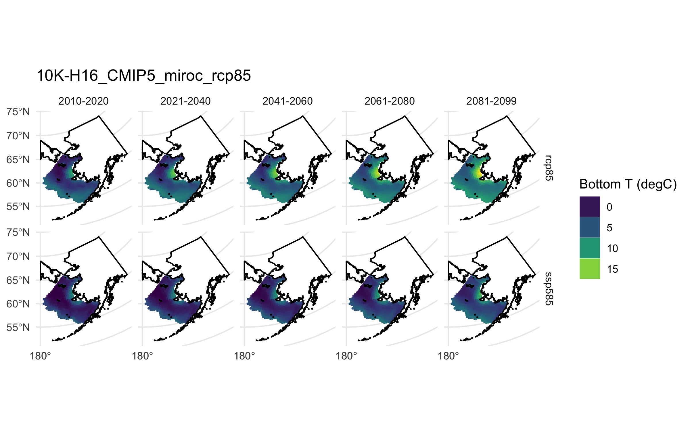  

### 6.1.2. Level 3 projections: Weekly strata averages

The next set of indices to will explore are the weekly strata-specific values for each variable.These are stored in the `ACLIMregion_B10K-[version_CMIPx_GCM_RCP].nc` in each scenario folder. 

```{r readncfiles_weekly, eval=F, echo=T}
    
   
    # View an individual variable (e.g., Bottom Temp)
    # -------------------------------------------------------
    weekly_vars
    aclim
    sim        <-"B10K-H16_CMIP5_MIROC_rcp85" 
    
    # open a "region" or strata specific nc file
    fl         <- file.path(sim,paste0(reg_txt,sim,".Rdata"))
    
    var_use   <- "temp_bottom5m"
    # tinker: var_use <- "Cop_integrated"
    
    vl        <- c(
                  "temp_bottom5m",
                  "NCaS_integrated", # Large Cop
                  "Cop_integrated",  # Small Cop
                  "EupS_integrated") # Euphausiids
    
    # create local rdata files (opt 1)
    if(!file.exists(file.path(Rdata_path,fl)))
      get_l3(web_nc = TRUE, download_nc = F,
          varlist = vl,sim_list = sim)
    
    # load object 'ACLIMregion'
    load(file.path(main,Rdata_path,fl))  
    tmp_var    <- ACLIMregion%>%filter(var == var_use)
    
   # now plot the data:
   
   p4 <- ggplot(data = tmp_var) + 
     geom_line(aes(x=time,y=val,color= strata),alpha=.8)+
     facet_grid(basin~.)+
     ylab(tmp_var$units[1])+
     ggtitle( paste(sim,tmp_var$var[1]))+
     theme_minimal()
   p4
    if(update.figs)  ggsave(file=file.path(main,"Figs/weekly_bystrata.jpg"),width=8,height=5)

   
   # To get the average value for a set of strata, weight the val by the area:
   mn_NEBS <- getAVGnSUM(strataIN = NEBS_strata, dataIN = tmp_var)
   mn_NEBS$basin = "NEBS"
   mn_SEBS <-getAVGnSUM(strataIN = SEBS_strata, dataIN = tmp_var)
   mn_SEBS$basin = "SEBS"
   
   p5 <- ggplot(data = rbind(mn_NEBS,mn_SEBS)) + 
      geom_line(aes(x=time,y=mn_val,color=basin),alpha=.8)+
      geom_smooth(aes(x=time,y=mn_val,color=basin),
                  formula = y ~ x, se = T)+
      facet_grid(basin~.)+
      scale_color_viridis_d(begin=.4,end=.8)+
      ylab(tmp_var$units[1])+
      ggtitle( paste(sim,mn_NEBS$var[1]))+
     
      theme_minimal()
  p5
  if(update.figs)  
    ggsave(file=file.path(main,"Figs/weekly_byreg.jpg"),width=8,height=5)

 
```

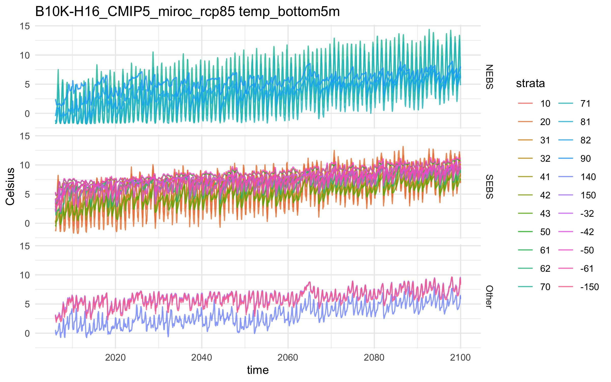{ width=90% }

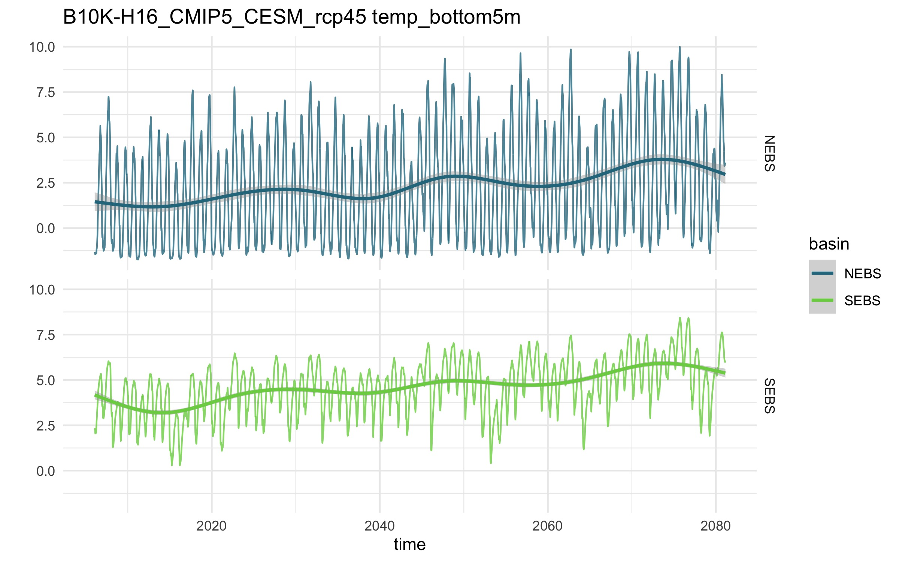{ width=90% }

### 6.1.3. Level 3 projections: Seasonal averages

Now using a similar approach get the monthly mean values for a variable:
```{r seasonal averages proj, eval=F, include=T,echo=T}
    
     sim <-"B10K-H16_CMIP5_MIROC_rcp85" 

    # Set up seasons (this follows Holsman et al. 2020)
      seasons <- data.frame(mo = 1:12, 
                   season =factor("",
                     levels=c("Winter","Spring","Summer","Fall")))
      seasons$season[1:3]   <- "Winter"
      seasons$season[4:6]   <- "Spring"
      seasons$season[7:9]   <- "Summer"
      seasons$season[10:12] <- "Fall"
    
       
    vl <- c(
                  "temp_bottom5m",
                  "NCaS_integrated", # Large Cop
                  "Cop_integrated",  # Small Cop
                  "EupS_integrated") # Euphausiids
    
    # open a "region" or strata specific  file
    fl      <- file.path(sim,paste0(reg_txt,sim,".Rdata"))
    
    # create local rdata files (opt 1)
    if(!file.exists(file.path(Rdata_path,fl)))
      get_l3(web_nc = TRUE, download_nc = F,
          varlist = vl,sim_list = sim)
    
    load(file.path(main,Rdata_path,fl))
    
    # get large zooplankton as the sum of euph and NCaS
    tmp_var    <- ACLIMregion%>%
      filter(var%in%vl[c(2,3)])%>%
      group_by(time,strata,strata_area_km2,basin)%>%
      group_by(time,
             strata,
             strata_area_km2,
             basin,
             units)%>%
      summarise(val =sum(val))%>%
      mutate(var       = "Zoop_integrated",
             long_name ="Total On-shelf 
             large zooplankton concentration, 
             integrated over depth (NCa, Eup)")
    
    rm(ACLIMregion)
    head(tmp_var)
    
    tmp_var$yr     <- strptime(as.Date(tmp_var$time),
                               format="%Y-%m-%d")$year + 1900
    tmp_var$mo     <- strptime(as.Date(tmp_var$time),
                               format="%Y-%m-%d")$mon  + 1
    tmp_var$jday   <- strptime(as.Date(tmp_var$time),
                               format="%Y-%m-%d")$yday + 1
    tmp_var$season <- seasons[tmp_var$mo,2]
    
    # To get the average value for a set of strata, weight the val by the area: (slow...)
    mn_NEBS_season <- getAVGnSUM(
      strataIN = NEBS_strata,
      dataIN = tmp_var,
      tblock=c("yr","season"))
    mn_NEBS_season$basin = "NEBS"
    mn_SEBS_season <- getAVGnSUM(
      strataIN = SEBS_strata, 
      dataIN = tmp_var,
      tblock=c("yr","season"))
    mn_SEBS_season$basin = "SEBS"
    
   plot_data      <- rbind(mn_NEBS_season,mn_SEBS_season)
    
   # plot Fall values:
   p6 <- ggplot(data = plot_data%>%filter(season=="Fall") ) + 
      geom_line(   aes(x = yr,y = mn_val,color=basin),alpha=.8)+
      geom_smooth( aes(x = yr,y = mn_val,color=basin),
                  formula = y ~ x, se = T)+
      facet_grid(basin~.)+
      scale_color_viridis_d(begin=.4,end=.8)+
      ylab(tmp_var$units[1])+
      ggtitle( paste(sim,"Fall",mn_NEBS_season$var[1]))+
      theme_minimal()
  p6
  
  
  if(update.figs)  
    ggsave(file=file.path(main,"Figs/Fall_large_Zoop.jpg"),width=8,height=5)
  
```

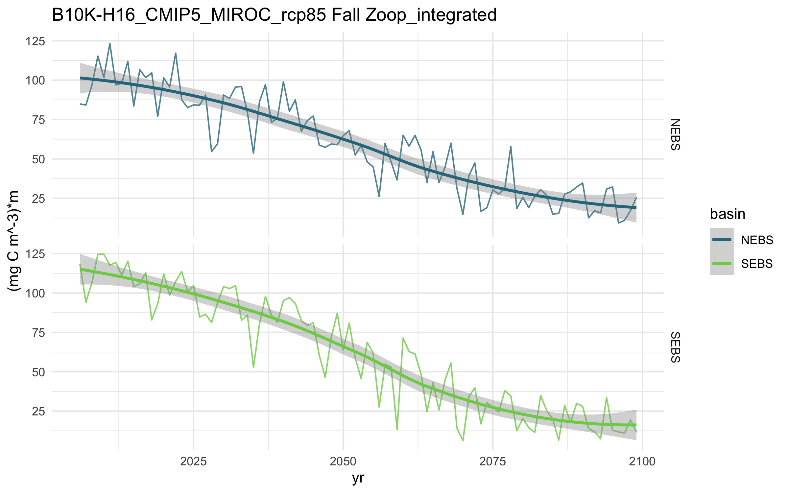{ width=90% }
Now using a similar approach get the monthly mean values for a variable across CMIP6 ssps:

```{r seasonal averages proj ssp, eval=F, include=T,echo=T}

sim_set <-c("B10K-K20_CORECFS",
            "B10K-K20P19_CMIP6_miroc_historical",
            "B10K-K20P19_CMIP6_miroc_ssp126",
            "B10K-K20P19_CMIP6_miroc_ssp585")

# Set up seasons (this follows Holsman et al. 2020)
seasons <- data.frame(mo = 1:12, 
                      season =factor("",
                                     levels=c("Winter","Spring","Summer","Fall")))
seasons$season[1:3]   <- "Winter"
seasons$season[4:6]   <- "Spring"
seasons$season[7:9]   <- "Summer"
seasons$season[10:12] <- "Fall"


vl <- c(
  "temp_bottom5m",
  "NCaS_integrated", # Large Cop
  "Cop_integrated",  # Small Cop
  "EupS_integrated") # Euphausiids

ii<-0
# open a "region" or strata specific  file
for(sim in sim_set){
  ii <- ii + 1
  fl      <- file.path(sim,paste0(reg_txt,sim,".Rdata"))
  
  # get local files from CMIP6 google drive folder copied to local Data/in
  if(!file.exists(file.path(Rdata_path,fl)))
    get_l3(web_nc = FALSE, download_nc = F,
           local_path = file.path(local_fl,"roms_for_aclim"),
           varlist = vl,sim_list = sim)
  load(file.path(main,Rdata_path,fl))

  # get large zooplankton as the sum of euph and NCaS
  tmp_var    <- ACLIMregion%>%
    filter(var%in%vl[c(2,3)])%>%
    group_by(time,strata,strata_area_km2,basin)%>%
    group_by(time,
             strata,
             strata_area_km2,
             basin,
             units)%>%
    summarise(val =sum(val))%>%
    mutate(var       = "Zoop_integrated",
           long_name ="Total On-shelf 
               large zooplankton concentration, 
               integrated over depth (NCa, Eup)")
  rm(fl)
  rm(ACLIMregion)
  head(tmp_var)
  
  tmp_var$yr     <- strptime(as.Date(tmp_var$time),
                             format="%Y-%m-%d")$year + 1900
  tmp_var$mo     <- strptime(as.Date(tmp_var$time),
                             format="%Y-%m-%d")$mon  + 1
  tmp_var$jday   <- strptime(as.Date(tmp_var$time),
                             format="%Y-%m-%d")$yday + 1
  tmp_var$season <- seasons[tmp_var$mo,2]
  
  tmp_var$sim    <- sim
  if(ii == 1)
    plot_data <- tmp_var
  if(ii > 1)
    plot_data <- rbind(plot_data, tmp_var)
  rm(tmp_var)
  
}

 # # To get the average value for a set of strata by week, weight the val by the area:
 #   mn_NEBS <- getAVGnSUM( bysim = T,
 #      strataIN = NEBS_strata,
 #      dataIN = plot_data)
 #   mn_NEBS$basin = "NEBS"
 #  
 #  mn_SEBS <-getAVGnSUM( bysim = T,
 #      strataIN = SEBS_strata,
 #      dataIN = plot_data)
 #   mn_SEBS$basin = "SEBS"
 # 
   
# To get the average value for a set of strata, weight the val by the area: (slow...)
mn_NEBS_season <- getAVGnSUM(
  bysim = T,
  strataIN = NEBS_strata,
  dataIN = plot_data,
  tblock=c("yr","season"))
mn_NEBS_season$basin = "NEBS"

mn_SEBS_season <- getAVGnSUM(
  bysim = T,
  strataIN = SEBS_strata, 
  dataIN = plot_data,
  tblock=c("yr","season"))
mn_SEBS_season$basin = "SEBS"

plot_data_2      <- rbind(mn_NEBS_season,mn_SEBS_season)

# plot Fall values:
p6v2 <- ggplot(data = plot_data_2%>%filter(season=="Fall") ) + 
  geom_line(   aes(x = yr,y = mn_val,color=sim),alpha=.8)+
  geom_smooth( aes(x = yr,y = mn_val,color=sim),
               formula = y ~ x, se = T)+
  facet_grid(basin~.)+
  scale_color_viridis_d(begin=.2,end=.8)+
  ylab(plot_data_2$units[1])+
  ggtitle( paste(sim,"Fall",mn_NEBS_season$var[1]))+
  theme_minimal()
p6v2


if(update.figs)  
  ggsave(file=file.path(main,"Figs/Fall_large_Zoop_bySSP.jpg"),width=8,height=5)
```

These results demonstrate the importance and challenge of bias correcting projections to hindcasts or historical runs.

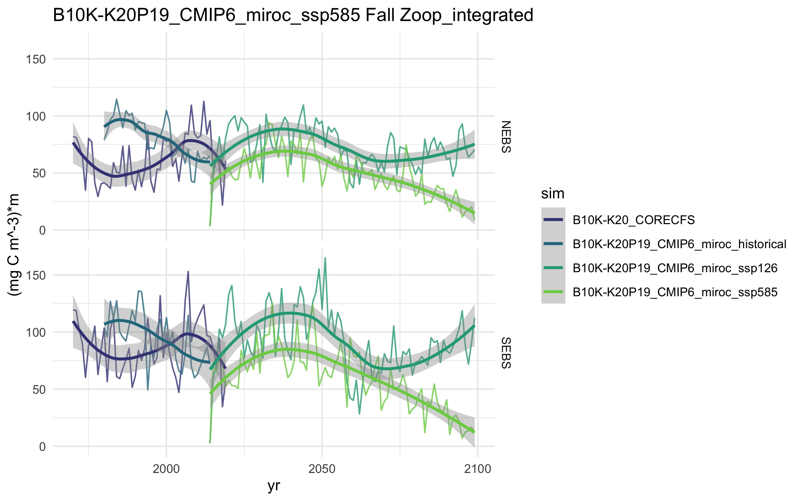{ width=90% }

### 6.1.4. Level 3 Projections: Monthly averages
Using the same approach we can get monthly averages for a given variable:

```{r monthly averages, eval=F, include=T,echo=T}
    
    # To get the average value for a set of strata, weight the val by the area: (slow...)
    mn_NEBS_season <- getAVGnSUM(
      strataIN = NEBS_strata,
      dataIN   = tmp_var,
      tblock   = c("yr","mo"))
    mn_NEBS_season$basin = "NEBS"
    
    mn_SEBS_season <- getAVGnSUM(
      strataIN = SEBS_strata, 
      dataIN = tmp_var,
      tblock=c("yr","mo"))
    mn_SEBS_season$basin = "SEBS"
    
    plot_data      <- rbind(mn_NEBS_season,mn_SEBS_season)
    
   # plot Fall values:
   p7 <- ggplot(data = plot_data%>%filter(mo==9) ) + 
      geom_line(   aes(x = yr,y = mn_val,color=basin),alpha=.8)+
      geom_smooth( aes(x = yr,y = mn_val,color=basin),
                  formula = y ~ x, se = T)+
      facet_grid(basin~.)+
      scale_color_viridis_d(begin=.4,end=.8)+
      ylab(tmp_var$units[1])+
      ggtitle( paste(aclim[2],"Sept.",mn_NEBS_season$var[1]))+
      theme_minimal()
  print(p7)
  
  if(update.figs)  
    ggsave(file=file.path(main,"Figs/Sept_large_Zoop.jpg"),width=8,height=5)
```

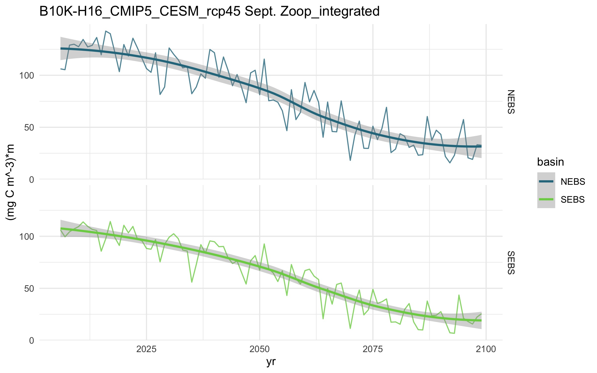{ width=90% }

Finally we can use this approach to plot the monthly averages and look for phenological shifts:
```{r phenology, eval=F, include=T,echo=T}

  # or average in 4 time slices by mo:
  # now create plots of average BT during four time periods
    time_seg   <- list( '2010-2020' = c(2010:2020),
                        '2021-2040' = c(2021:2040),
                        '2041-2060' = c(2041:2060),
                        '2061-2080' = c(2061:2080),
                        '2081-2099' = c(2081:2099))
    
    plot_data$ts <-names(time_seg)[1]
    for(tt in 1:length((time_seg)))
      plot_data$ts[plot_data$yr%in%(time_seg[[tt]][1]:time_seg[[tt]][2])]<-names(time_seg)[tt]
    
    plot_data2 <- plot_data%>%
      group_by(var,mo,units,long_name,basin, ts)%>%
      summarize(mn_val2 = mean(mn_val))
   
  # now plot phenological shift:
   p8 <- ggplot(data = plot_data2 ) + 
      geom_line(   aes(x = mo,y = mn_val2,color=ts),alpha=.8,size=0)+
      geom_smooth( aes(x = mo,y = mn_val2,color=ts),
                  formula = y ~ x, se = F)+
      facet_grid(basin~.)+
      scale_color_viridis_d(begin=.9,end=.2)+
      ylab(tmp_var$units[1])+
      ggtitle( paste(aclim[2],mn_NEBS_season$var[1]))+
      theme_minimal()
  p8
  if(update.figs)  
    ggsave(file=file.path(main,"Figs/PhenShift_large_Zoop.jpg"),width=8,height=5)
  
```

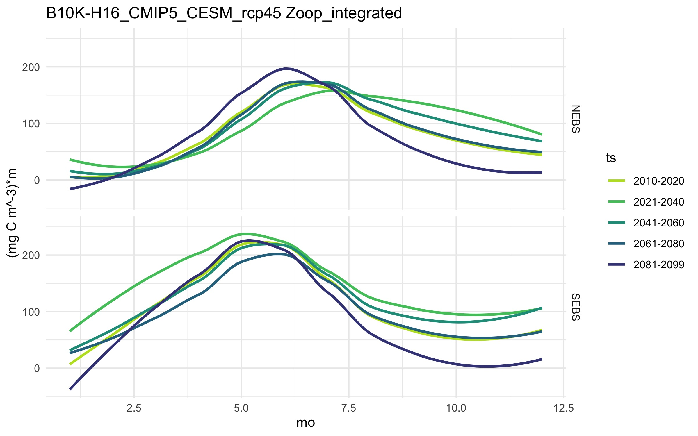{ width=90% }

## 6.2. Level 2 projections

Level 2 data can be explored in the same way as the above indices but we will focus in the section below on a simple spatial plot and temporal index. The advantage of Level2 inidces is in the spatial resolution and values outside of the survey area. 

### 6.2.1 Level 2 projections: Custom spatial indices 

```{r explore_L2_space, eval=F, echo=T}
    
   # define four time periods
    time_seg   <- list( '2010-2020' = c(2000:2020),
                        '2021-2040' = c(2021:2040),
                        '2041-2060' = c(2041:2060),
                        '2061-2080' = c(2061:2080),
                        '2081-2099' = c(2081:2099))
  
    # View an individual variable (e.g., Bottom Temp)
    # -------------------------------------------------------
    head(srvy_vars)
    head(aclim)
    
    # assign the simulation to download
    # --> --> Tinker: try selecting a different set of models to compare
    sim        <-"B10K-H16_CMIP5_MIROC_rcp85" 
    
    svl <- list(
      'Bottom 5m' = "temp",
      'Surface 5m' = "temp",
      'Integrated' = c("EupS","Cop","NCaS") ) 
   
    # Currently available Level 2 variables
    dl     <- proj_l2_datasets$dataset  # datasets
   
    
    # Let's sample the model years as close to Aug 1 as the model timesteps run:
    tr          <- c("-08-1 12:00:00 GMT") 
    
    # the full grid is large and takes a longtime to plot, so let's subsample the grid every 4 cells
   
    IDin       <- "_Aug1_subgrid"
    var_use    <- "_bottom5m_temp"
    
    # open a "region" or strata specific nc file
    fl         <- file.path(main,Rdata_path,sim,"Level2",
                            paste0(sim,var_use,IDin,".Rdata"))
    
    # load object 'ACLIMsurveyrep'
    if(!file.exists(file.path(Rdata_path,fl)))
      get_l2(
        ID          = IDin,
        xi_rangeIN  = seq(1,182,10),
        eta_rangeIN = seq(1,258,10),
        ds_list     = dl,
        trIN        = tr,
        sub_varlist = svl,  
        sim_list    = sim  )
    
    # load R data file
    load(fl)   # temp
    
    # there are smarter ways to do this;looping because 
    # we don't want to mess it up but this is slow...
    i <-1
    data_long <- data.frame(latitude = as.vector(temp$lat),
                       longitude = as.vector(temp$lon),
                       val = as.vector(temp$val[,,i]),
                       time = temp$time[i],
                       year = substr( temp$time[i],1,4),stringsAsFactors = F
                       )
    for(i in 2:dim(temp$val)[3])
      data_long <- rbind(data_long,
                          data.frame(latitude = as.vector(temp$lat),
                           longitude = as.vector(temp$lon),
                           val = as.vector(temp$val[,,i]),
                           time = temp$time[i],
                           year = substr( temp$time[i],1,4),stringsAsFactors = F)
                       )
    
    
    # get the mean values for the time blocks from the rdata versions
    # will throw "implicit NA" errors that can be ignored
    tmp_var <-data_long # get mean var val for each time segment
    j<-0
    for(i in 1:length(time_seg)){
      if(length( which(as.numeric(tmp_var$year)%in%time_seg[[i]] ))>0){
        j <- j +1
         mn_tmp_var <- tmp_var%>%
          filter(year%in%time_seg[[i]],!is.na(val))%>%
          group_by(latitude, longitude)%>%
          summarise(mnval = mean(val,rm.na=T))
        
        mn_tmp_var$time_period = factor(names(time_seg)[i],levels=names(time_seg))
      if(j == 1) mn_var <- mn_tmp_var
      if(j >  1) mn_var <- rbind(mn_var,mn_tmp_var)
       rm(mn_tmp_var)
      }
    }
    
    # convert results to a shapefile
    L2_sf  <- convert2shp(mn_var%>%filter(!is.na(mnval)))
    
    p9     <- plot_stations_basemap(sfIN = L2_sf,
                                fillIN = "mnval",
                                colorIN = "mnval",
                                sizeIN=.6) +
      facet_grid(.~time_period)+
      scale_color_viridis_c()+
      scale_fill_viridis_c()+
      guides(
        color =  guide_legend(title="Bottom T (degC)"),
        fill  =  guide_legend(title="Bottom T (degC)")) +
      ggtitle(paste(sim,var_use,IDin))
   
    # This is slow but it works (repeat dev.new() twice if in Rstudio)...
    dev.new()
    p9
    
    if(update.figs)  
      ggsave(file=file.path(main,"Figs/sub_grid_mn_BT_Aug1.jpg"),width=8,height=6)
  
    # graphics.off()
 
```


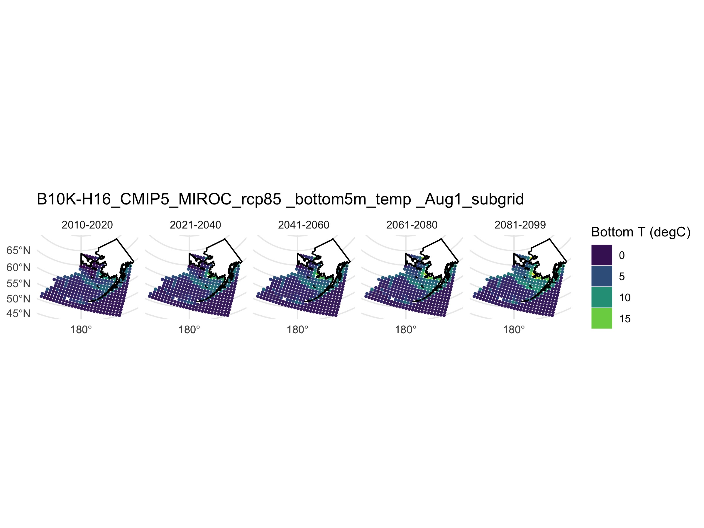{ width=100% }

<!-- ## 4.2 Level 2: -->
<!-- ### 3.2.1 Explore Level 2 data catalog -->

<!-- ### 3.2.2 Custom spatial indices  -->

<!-- ### 3.2.2 Custom temporal indices  -->


<!-- # 5. Tinker: example applications -->
<!-- # 5.1 Recruitment ~f(ACLIM indices) -->
<!-- # 5.2 Spatial overlap ~f(spp dist, aclim indices) -->

# 7. Funding and acknowledgments

Multiple NOAA programs provided support for ACLIM and Bering Seasons projects including Fisheries and the Environment (FATE), Stock Assessment Analytical Methods (SAAM) Science and Technology North Pacific Climate Regimes and Ecosystem Productivity, the Integrated Ecosystem Assessment Program (IEA), the NOAA Modeling, Analysis, Predictions and Projections (MAPP) Program, the NOAA Economics and Social Analysis Division, NOAA Research Transition Acceleration Program (RTAP), the Alaska Fisheries Science Center (ASFC), the Office of Oceanic and Atmospheric Research (OAR) and the National Marine Fisheries Service (NMFS). Additional support was provided through the North Pacific Research Board (NPRB).

This repository is a scientific product and is not official communication of the National Oceanic and Atmospheric Administration, or the United States Department of Commerce. All NOAA GitHub project code is provided on an ‘as is’ basis and the user assumes responsibility for its use. Any claims against the Department of Commerce or Department of Commerce bureaus stemming from the use of this GitHub project will be governed by all applicable Federal law. Any reference to specific commercial products, processes, or services by service mark, trademark, manufacturer, or otherwise, does not constitute or imply their endorsement, recommendation or favoring by the Department of Commerce. The Department of Commerce seal and logo, or the seal and logo of a DOC bureau, shall not be used in any manner to imply endorsement of any commercial product or activity by DOC or the United States Government.

# 8. Helpful links and further reading  

## 8.1 Citations for GCMs and carbon scenarios

### CMIP3 (BSIERP global climate model runs)
Meehl, G. A., C. Covey, T. Delworth, M. Latif, B. McAvaney, J. F. B. Mitchell, R. J. Stouffer, and K. E. Taylor, 2007: The WCRP CMIP3 multimodel dataset: A new era in climate change research. Bull. Amer. Meteor. Soc., 88, 1383–1394.

### CMIP5 (ACLIM global climate model runs)
Taylor, K. E., R. J. Stouffer, and G. A. Meehl, 2012:Anoverview of CMIP5 and the experiment design. Bull. Amer. Meteor. Soc., 93, 485–498.

### CMIP6 and SSPs (ACLIM2 global climate model runs)
ONeill, B. C., C. Tebaldi, D. P. van Vuuren, V. Eyring, P. Friedlingstein, G. Hurtt, R. Knutti, E. Kriegler, J.-F. Lamarque, J. Lowe, G. A. Meehl, R. Moss, K. Riahi, and B. M. Sanderson. 2016. The Scenario Model Intercomparison Project (ScenarioMIP) for CMIP6. Geoscientific Model Development 9:3461–3482.


## 8.2 Weblinks for further reading

* Explore annual indices of downscaled projections for the EBS: [**ACLIM indices**](https://kholsman.shinyapps.io/aclim/ "ACLIM Shiny tool")

* To view climate change projections from CMIP5 (eventually CMIP6):[**ESRL climate change portal **](https://www.esrl.noaa.gov/psd/ipcc/ocn/ "ESRL climate change portal")


## 8.3 Additional information on Hindcast and Projection Models (needs updating)

### CORE-CFSR (1976-2020) 

This is the hindcast for the Bering Sea and is a combination of the reconstructed climatology from the [**CLIVAR**](http://portal.aoos.org/bering-sea.php#module-metadata/5626a0b6-7d79-11e3-ac17-00219bfe5678/0756e6c2-a8e2-40af-aa3d-22051ed68067) Co-ordinated Ocean-Ice Reference Experiments (CORE) Climate Model (1969-2006) the [**NCEP**](http://portal.aoos.org/bering-sea.php#module-metadata/f8cb79f6-7d59-11e3-a6ee-00219bfe5678/2deb2eca-f3f5-4eda-a132-112468711de7) Climate Forecast System Reanalysis is a set of re-forecasts carried out by NOAA's National Center for Environmental Prediction (NCEP). See [**CFS-R**](http://cfs.ncep.noaa.gov/cfsr/) for more info.

### [CCCMA](http://www.cccma.ec.gc.ca/diagnostics/cgcm3/cgcm3.shtml)(2006-2039; AR4 SRES A1B) 

Developed by the Canadian Centre for Climate Modelling and Analysis, this is also known as the CGCM3/T47 model. This model showed the greatest warming over time compared to other models tested by PMEL. See more data the [**AOOS:CCCMA portal**](http://portal.aoos.org/bering-sea.php#module-metadata/4f706756-7d57-11e3-bce5-00219bfe5678/ffa1bcc1-288d-4f8e-912e-500a618b241a).

### [ECHOG](http://www-pcmdi.llnl.gov/ipcc/model_documentation/ECHO-G.pdf)(2006-2039; AR4 SRES A1B)
The ECHO-G model from the Max Planck Institute in Germany This model showed the least warming over time compared to other models tested by PMEL. See more data the <a href="http://portal.aoos.org/bering-sea.php#module-metadata/18ffa59c-7d7a-11e3-82a4-00219bfe5678/f2e5592b-28d2-483d-8ef8-52aa18f6e3dc">AOOS:ECHO-G portal</a>.

### [GFDL](http://www.gfdl.noaa.gov/earth-system-model) (2006-2100; AR5 RCP 4.5, 8.5, SSP126,SSP585) 

The NOAA Geophysical Fluid Dynamics Laboratory [**GFDL**](http://www.gfdl.noaa.gov) has lead development of the first Earth System Models (ESMs), which like physical climate models, are based on an atmospheric circulation model coupled with an oceanic circulation model, with representations of land, sea ice and iceberg dynamics; ESMs additionally incorporate interactive biogeochemistry, including the carbon cycle. The ESM2M model used in this project is an evolution of the prototype EMS2.1 model, where pressure-based vertical coordinates are used along the developmental path of GFDL's Modular Ocean Model version 4.1 and where the land model is more adavanced (LM3) than in the previous ESM2.1

### [MIROC](www.cger.nies.go.jp/publications/report/i073/I073.pdf)(2006-2039; AR4 SRES A1B; 2006-2100 RCP4.5, RCP8.5, SSP585, SSP126) 

The Model for Interdisciplinary Research on Climate (MIROC)-M model developed by a <a href="www.cger.nies.go.jp">consortium of agencies in Japan</a> []. Compared to other models tested by PMEL, MIROC-M was intermediate in degree of warming over the Bering Sea shelf for the first half of the 21st century. See more data the <a href="http://portal.aoos.org/bering-sea.php#module-metadata/68ea728a-7d7a-11e3-823b-00219bfe5678/bb0d0b5e-878f-4ebb-8985-0d0e6aefe71f">AOOS:MIROC portal</a>.


<!-- ### ACLIM_data & ACLIM_scripts -->

<!-- This folder contains the most recent queries from the BEAST based on the scripts in [ACLIM_scripts]("https://github.com/kholsman/ACLIM/ACLIM_scripts"). The queries create annual indices (e.g., mean summer bottom temperature for the EBS survey area) which are station specific(Station_modelname) and based on the mean sampling date for each station, or based on weekly values (under folder [weekly]("https://github.com/kholsman/ACLIM/ACLIM_data/ROMS_NPZ_queries/weekly"); are "clipped to the survey area"). -->
<!-- These indices were cleaned and aggregated in the .Rdata file `ROMSNPZ_indices.Rdata` using the script `createROMSNPZ.R`. -->


```{r makeReadME, echo=FALSE,eval=F, include =F}

 # copy and paste this into R window (won't work within markdown)
 rmd2md(rmd_fl = "GettingStarted_Bering10K_ROMSNPZ",md_fl = "README")

```


```{R downloadMOX, include=FALSE, echo=FALSE, eval=FALSE}
    
    # --------------------------------------
    # SETUP WORKSPACE

    tmstp  <- format(Sys.time(), "%Y_%m_%d")
    main   <- getwd()  #"~/GitHub_new/ACLIM2"
    
    # loads packages, data, setup, etc.
    source("R/make.R")
    
    # --------------------------------------  
  
    ### To re download data from mox (Kirstin) switch "redownload_level3_mox" to TRUE in setup.R
  
    # Accessing ROMSNPZ on mox (hyak UW)
    # If you have a UW ID and are authorized on 
    # hyak (can do this through myUW.com, under settings>computing):
    
    remote_main  <- "/gscratch/bumblereem/roms_for_public"  
    remotefolder  <- paste0("kkari@mox.hyak.uw.edu:",remote_main) 
    fldr_mox      <- read.csv("Data/in/fldr_mox_list.csv",header=F,stringsAsFactors=F)
   
    if(redownload_level3_mox){
      if(dir.exists(remote_main)){
        #copy current folder to archived, delete folder, and make new empty one
        system (paste0("cp -R ",
                       localfolder,"  ",
                       localfolder,"/../../archived/",
                       remote_fl,tmstp))
        
        txt<- paste0( "rm -r ",localfolder)
        system(txt)  
        dir.create(localfolder)
        
      }
    # This file downloads the .nc level 3 indices from MOX to the local drive
    #in terminal:
    # open new screen (ctrl A+D to exit; screen -r to return screen -ls to see list)
    ## screen 
    ## ssh kkari@mox.hyak.uw.edu
    ## password : J bday + Josie’s dog (cap S on both) +!! 
    ## ls ../../bumblereem/roms_for_public  #publically available files
    ## ls ../../bumblereem/roms_for_public/B10K-K20_CORECFS/Level3
  
    # open terminal (faster) and copy the last line or run it in system
  
    cat((paste0("rsync -avz --progress --include='**/Level*/*ACLIM*.nc' --include='*/' --exclude='*' ",remotefolder," ",local_fl)))
    cat( (paste0("rsync -avz --progress --include='**/Level3/*coldpool*.nc' --include='*/' --exclude='*' ",remotefolder," ",local_fl)))
      cat( (paste0("rsync -avz --progress --include='**/Level3/*forecast*.nc' --include='*/' --exclude='*' ",remotefolder," ",local_fl)))
      
    # -------------------------------------  
    # IN TERMINAL:
    # -------------------------------------  
      # copy paste into local terminal (from cat above)
    rsync -avz --progress --include='**/Level*/*ACLIM*.nc' --include='*/' --exclude='*' kkari@mox.hyak.uw.edu:/gscratch/bumblereem/roms_for_public /Users/kholsman/GitHub_new/ACLIM2/Data/in/Newest
   
     rsync -avz --progress --include='**/Level3/*coldpool*.nc' --include='*/' --exclude='*' kkari@mox.hyak.uw.edu:/gscratch/bumblereem/roms_for_public /Users/kholsman/GitHub_new/ACLIM2/Data/in/Newest
   
     rsync -avz --progress --include='**/Level3/*forecast*.nc' --include='*/' --exclude='*' kkari@mox.hyak.uw.edu:/gscratch/bumblereem/roms_for_public /Users/kholsman/GitHub_new/ACLIM2/Data/in/Newest
     .xlsx
     rsync -avz --progress --include='*Bering10K_simulation_variables*.xlsx' --include='*/' --exclude='*' kkari@mox.hyak.uw.edu:/gscratch/bumblereem/roms_for_public /Users/kholsman/GitHub_new/ACLIM2/Data/in/Newest
     rsync -avz --progress --include='*AFSC_groundfish_survey*.xlsx' --include='*/' --exclude='*' kkari@mox.hyak.uw.edu:/gscratch/bumblereem/roms_for_public /Users/kholsman/GitHub_new/ACLIM2/Data/in/Newest
     
    # -------------------------------------  
    #
    # ------------------------------------- 
    
    # Now rename the roms_for_public to roms_for_aclim
      
      remote_fl
      file.rename(file.path(local_fl,remote_fl),localfolder)
      
   #  # R doesn't like this  (use copy paste into terminal above)
   #   system( (paste0("rsync -avz --dry-run --include='**/Level*/*ACLIM*.nc' --include='*/' --exclude='*' ",remotefolder," ",localfolder)) )
   # 
   # # system( (paste0("rsync -avz --progress ",remotefolder," ",localfolder)))
   # 
   #  system( (paste0("rsync -avz --progress --include='**/Level*/*ACLIM*.nc' --include='*/' --exclude='*' ",remotefolder," ",localfolder)))
  
    
  }
 
```
