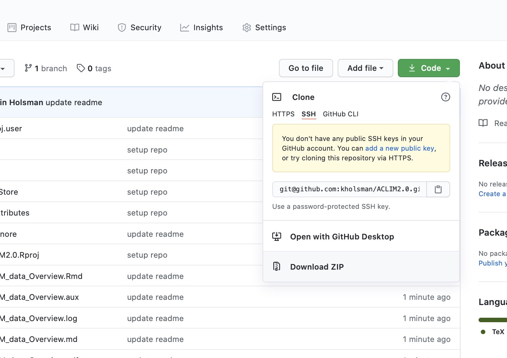
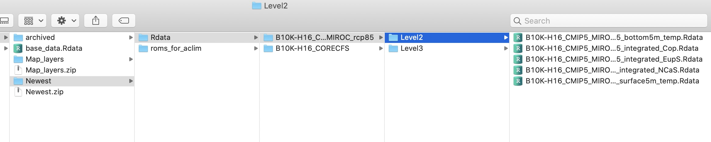
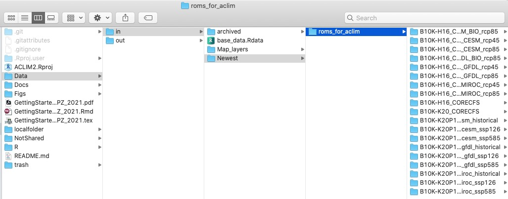

<!-- ```{r, echo=FALSE, fig.align='center'} -->
<!-- include_graphics("Figs/ACLIM_logo.jpg") -->
<!-- ``` -->

<figure>
<figcaption>.</figcaption>
</figure>

**Getting Started with ACLIM Bering10K ROMSNPZ Level3 indices**  
**(FOR INTERNAL ACLIM USE ONLY)**  
[**ACLIM Repo:
github.com/kholsman/ACLIM2**](https://github.com/kholsman/ACLIM2 "ACLIM2 Repo")  
Repo maintained by:  
Kirstin Holsman  
Alaska Fisheries Science Center  
NOAA Fisheries, Seattle WA  
**[kirstin.holsman@noaa.gov](kirstin.holsman@noaa.gov)**  
*Last updated: Feb 27, 2021*

1. ACLIM data and code Overview
===============================

This is an overview of ACLIM plotting code and “canned” Rdata files
generated from the downscaled ROMSNPZ modeling work ACLIM modelers Drs.
Hermann, Cheng, Kearney,Pilcher, and Aydin. Dr. Kelly Kearney has
recently dedicated significant time and energy towards organizing and
documenting the ROMSNPZ output, especially as it pertains to the ACLIM
project. We strongly recommend reviewing this
[**documentation**](https://beringnpz.github.io/roms-bering-sea/B10K-dataset-docs/)
before using the data in order to understand the origin of the indices
and their present level of skill and validation, which varies
considerably across indices and in space and time.

The Bering10K ROMSNPZ documentation can be accessed on the main
[**documentation**](https://beringnpz.github.io/roms-bering-sea/B10K-dataset-docs/)
webpage. The webpage is maintained by Kelly Kearney and regularly
updated with new documentation, including the following core documents
(also linked in the
[**00\_ACLIM\_shared/02\_Data**](https://drive.google.com/drive/u/0/folders/0Bx7wdZllbuF9eDJndkhCS2EwQUk)
folder):

[**The Bering10K Dataset
documentation**](https://drive.google.com/file/d/1GlITTIvbs2gRBMNIxdDI15cZU6mH4ckg/view):
A pdf describing the dataset, including:

1.  A description of the various simulations (base model versions,
    parent model forcing datasets, and biological modules) and the
    output naming scheme for each.

2.  A tutorial on working with the curvilinear, sigma-coordinate ROMS
    spatial grid, aimed at those who will be working with data on the
    native grid.

3.  An overview of the ACLIM index dataset; this is a set of time series
    derived from the Bering10K output and intended for Alaska Climate
    Integrated Modeling (ACLIM) collaborators.

[**Bering10K Simulaton
Variables**](https://drive.google.com/file/d/1C1FCxRMBm0uBv2wEKwrGfHmLnjt_gFvG/view):
A spreadsheet listing all simulations and the archived output variables
associated with each, updated periodically as new simulations are run or
new variables are made available. Note that this includes both data
available on both public and private servers (see below). Please also
see the Literature page for a list scientific publications related to
the model, including model description and skill assessment.

1.1. Downscaled models and carbon scenarios
-------------------------------------------

The full ACLIM “suite” of models include are summarized in the following
table of downscaled models based on boundary conditions forced by
General Circulation Models (GCM) run under Coupled Model Intercomparison
Project (CMIP) phase 5 (5th IPCCAssessment Report) or phase 6 (6th IPCC
Assessment Report; “AR”) global carbon mitigation scenarios. For full
details see the Kearney 2021 Tech. Memo.

### Table 1: Summary of ROMSNPZ downscaled model runs

| CMIP | GCM     | Scenario     | Def             | Years       | Model  | Status      | Source  |     |
|------|---------|--------------|-----------------|-------------|--------|-------------|---------|-----|
| 5    | GFDL    | RCP 4.5      | Med. mitigation | 2006 - 2099 | H16    | ACLIM/FATE  | Public  |     |
| 5    | GFDL    | RCP 8.5      | High baseline   | 2006 - 2099 | H16    | ACLIM/FATE  | Public  |     |
| 5    | GFDL    | RCP 8.5bio\* | High baseline   | 2006 - 2099 | H16    | ACLIM/FATE  | Public  |     |
| 5    | MIROC   | RCP 4.5      | Med. mitigation | 2006 - 2099 | H16    | ACLIM/FATE  | Public  |     |
| 5    | MIROC   | RCP 8.5      | High baseline   | 2006 - 2099 | H16    | ACLIM/FATE  | Public  |     |
| 5    | CESM    | RCP 4.5      | Med. mitigation | 2006 - 2099 | H16    | ACLIM/FATE  | Public  |     |
| 5    | CESM    | RCP 8.5      | High baseline   | 2006 - 2080 | H16    | ACLIM/FATE  | Public  |     |
| 5    | CESM    | RCP 8.5bio\* | High baseline   | 2006 - 2099 | H16    | ACLIM/FATE  | Public  |     |
|      | CORECFS | Reanalysis   | Hindcast        | 1970 - 2018 | H16    | ACLIM       | Public  |     |
|      | CORECFS | Reanalysis   | Hindcast        | 1970 - 2020 | K20    | ACLIM2/RTAP | Public  |     |
| 6    | CESM    | SSP585       | High baseline   | 2014 - 2099 | K20P19 | ACLIM2/RTAP | Embargo |     |
| 6    | CESM    | SSP126       | High Mitigation | 2014 - 2099 | K20P19 | ACLIM2/RTAP | Embargo |     |
| 6    | CESM    | Historical   | Historical      | 1980 - 2014 | K20P19 | ACLIM2/RTAP | Embargo |     |
| 6    | GFDL    | SSP585       | High baseline   | 2014 - 2099 | K20P19 | ACLIM2/RTAP | Embargo |     |
| 6    | GFDL    | SSP126       | High Mitigation | 2014 - 2099 | K20P19 | ACLIM2/RTAP | Embargo |     |
| 6    | GFDL    | Historical   | Historical      | 1980 - 2014 | K20P19 | ACLIM2/RTAP | Embargo |     |
| 6    | MIROC   | SSP585       | High baseline   | 2014 - 2099 | K20P19 | ACLIM2/RTAP | Embargo |     |
| 6    | MIROC   | SSP126       | High Mitigation | 2014 - 2099 | K20P19 | ACLIM2/RTAP | Embargo |     |
| 6    | MIROC   | Historical   | Historical      | 1980 - 2014 | K20P19 | ACLIM2/RTAP | Embargo |     |

\*“bio” = nutrient forcing on boundary conditions

1.2. Guildlines for use and citation of the data
------------------------------------------------

It is strongly recommended that you include at least one (ideally
multiple) authors from the ROMSNPZ team (Drs. Hermann, Cheng, Kearney,
Pilcher) as co-author on your paper if you are linking to this data,
this is especially the case for the CMIP6 data. There are multiple
spatial and temporal caveats that are best described in discussions with
the authors of these data and inclusion as co-authors will facilitate
appropriate application and interpretation of the ROMSNPZ data.

### 1.2.1. The Bering 10K Model (v. H16) with 10 depth layers:

The H16 model is the original BSIERP era 10 depth layer model with a 10
Km grid. This version was used in ACLIM1.0 to dynamically downscaled 3
global circulation models (GCMs) under two CMIP5 representative carbon
pathways (RCP): RCP 4.5 or “moderate global carbon mitigation” and RCP
8.5 “high baseline global carbon emissions”. Details of the model and
projections can be found in:

-   **Hindcast (1979-2012; updated to 2018 during ACLIM 1.0):**

    Hermann, A. J., G. A. Gibson, N. A. Bond, E. N. Curchitser, K.
    Hedstrom, W. Cheng, M. Wang, E. D. Cokelet, P. J. Stabeno, and K.
    Aydin. 2016. Projected future biophysical states of the Bering Sea.
    Deep Sea Research Part II: Topical Studies in Oceanography
    134:30–47.[doi:10.1016/j.dsr2.2015.11.001](http://dx.doi.org/10.1016/j.dsr2.2015.11.001 "doi:10.1016/j.dsr2.2015.11.001")

-   **Projections of the H16 10 layer model using CMIP5 scenarios:**

    Hermann, A. J., G. A. Gibson, W. Cheng, I. Ortiz, K. Aydin, M.
    Wang, A. B. Hollowed, K. K. Holsman, and S. Sathyendranath. 2019.
    Projected biophysical conditions of the Bering Sea to 2100 under
    multiple emission scenarios. ICES Journal of Marine Science
    76:1280–1304.[doi:10.1093/icesjms/fsz043](https://academic.oup.com/icesjms/article/76/5/1280/5477847?login=true "doi:10.1093/icesjms/fsz043"))

### 1.2.2. The Bering 10K Model (v. K20) with 30 depth layers and other advancements:

The Bering10K model was subsequently updated by Kearney et al. 2020 (30
layer and other NPZ updates) and Pilcher et al.2019 (OA and O2 dynamics)
and this version is used for the projections in ACLIM2.0 under CMIP6.

-   **Hindcast (1979-2020 hindcast with OA dynamics used in ACLIM
    2.0):**

    Kearney, K., A. Hermann, W. Cheng, I. Ortiz, and K. Aydin. 2020. A
    coupled pelagic-benthic-sympagic biogeochemical model for the Bering
    Sea: documentation and validation of the BESTNPZ model (v2019.08.23)
    within a high-resolution regional ocean model. Geoscientific Model
    Development 13:597–650.

    Pilcher, D. J., D. M. Naiman, J. N. Cross, A. J. Hermann, S. A.
    Siedlecki, G. A. Gibson, and J. T. Mathis. 2019. Modeled Effect of
    Coastal Biogeochemical Processes, Climate Variability, and Ocean
    Acidification on Aragonite Saturation State in the Bering Sea.
    Frontiers in Marine Science 5:1–18.

-   **Projections of the K20 30 layer model using CMIP6 scenarios:**

    Hermann et al. in prep  
    Cheng et al. in prep  
    Kearney et al. in prep  
    Pilcher et al. in prep (CMIP5 K20 projections) (ACLIM indices avail
    by permission only)

2. Get ACLIM code (Step 1)
==========================

**IMPORTANT**  
The ACLIM indices and ROMSNPZ simulations are stored as netcdf files
(.nc) format in the Data folder of the ACLIM shared google drive
(section 2.3) or available on the new PMEL web-based portal (see section
2.2 below). Please note that while the CMIP5 set is now public (Hermann
et al. 2019) **the CMIP6 suite is under embargo for QAQC and should not
be shared outside of the ACLIM group**. Al, Wei, Kelly, Darren, and
Kerim are in the process of synthesizing and publishing the CMIP6 data
(goal is spring 2021 for submission), following those publications the
data will be made accessible to the public via the PMEL data portal, as
is the case for the CMIP5 data and public hindcasts.

First clone the [**ACLIM ROMSNPZ Repo:
github.com/kholsman/ACLIM2**](https://github.com/kholsman/ACLIM2 "ACLIM2 Repo").
This code will load and explore the netcdf (.nc) files in R and produce
plots and standardized outputs for ACLIM analyses. Some standardized
tools are included as functions in this repo including spatial averaging
for seasonal, monthly and annual indices (e.g., Fall zooplankton
biomass), as well as bias correction for projections (see Holsman et
al. 2020 and Reum et al. 2020 for ACLIM 1.0 bias correction methods).
The repo also includes a Rshiny interactive exploratory graphing tool
which can be viewed online [**at this
link**](https://kholsman.shinyapps.io/aclim/).

### 2.1 Option 1: Use R to download from ACLIM2 github repo:

``` r
    # Specify the download directory
    main_nm       <- "ACLIM2"
    download_path <- path.expand("~/desktop")
    dest_fldr     <- file.path(download_path,main_nm)
    
    url           <- "https://github.com/kholsman/ACLIM2/archive/main.zip"
    dest_file     <- file.path(download_path,paste0(main_nm,".zip"))
    download.file(url=url, destfile=dest_file)
    
    # unzip the .zip file
    setwd(download_path)
    unzip (dest_file, exdir = "./",overwrite = T)
    
    #rename the unzipped folder from ACLIM2-main to ACLIM2
    file.rename(paste0(main_nm,"-main"), main_nm)
    setwd(main_nm)
```

If you have Rstudio installed you can double click on the ACLIM2.Rproj
and use Rstudio to manage your plotting and files (recommended).

### 2.2 Option 2: Manually download from ACLIM2 github repo

Select `Download ZIP` from the upper right hand side of the repo page
:[**github.com/kholsman/ACLIM2**](https://github.com/kholsman/ACLIM2 "ACLIM2 Repo")
and save it to your local directory: `~[YOURPATH]/ACLIM2`.



3. Get Data (Step 2)
====================

The naming convention of the folders is:
`B10K-[ROMSNPZ version]_[CMIP]_[GCM]_[carbon scenario]`.For example, the
CMIP5 set of indices was downscaled using the H16 (Hermann et al. 2016)
version of the ROMSNPZ. Three models were used to force boundary
conditions( MIROC, CESM, and GFDL) under 2 carbon scenarios RCP 8.5 and
RCP 4.5. So to see an individual trajectory we might look in the level3
(timeseries indices) folder under `B10K-H16_CMIP5_CESM_rcp45`, which
would be the B10K version H16 of the CMIP5 CESM model under RCP4.5.

3.2 Public web-based ACLIM data (hindcasts & CMIP5 projections)
---------------------------------------------------------------

The naming convention of the folders is:
`B10K-[ROMSNPZ version]_[CMIP]_[GCM]_[carbon scenario]`.For example, the
CMIP5 set of indices was downscaled using the H16 (Hermann et al. 2016)
version of the ROMSNPZ. Three models were used to force boundary
conditions( MIROC, CESM, and GFDL) under 2 carbon scenarios RCP 8.5 and
RCP 4.5. So to see an individual trajectory we might look in the level3
(timeseries indices) folder under `B10K-H16_CMIP5_CESM_rcp45`, which
would be the B10K version H16 of the CMIP5 CESM model under RCP4.5.

This option is available for Level3 and Level 2 CMIP5 public data, it is
not yet available for the embargoed CMIP6 data but eventually will be
used to host that as well.

The ROMSNPZ team has been working with [Roland
Schweitzer](roland.schweitzer@noaa.gov) and [Peggy
Sullivan](peggy.sullivan@noaa.gov) to develop the ACLIM Live Access
Server (LAS) to publicly host the published CMIP5 hindcasts and
downscaled projections. This server is in beta testing phase and can be
accessed at the following links:

-   [LAS custom ROMSNPZ data exploration, query, mapping, and plotting
    tool](https://data.pmel.noaa.gov/aclim/las/ "Live Access Server")

-   [ERDAPP ACLIM data access
    tool](https://data.pmel.noaa.gov/aclim/erddap/)

-   [THREDDS ACLIM direct access to Level 2 and 3 netcdf
    files](https://data.pmel.noaa.gov/aclim/thredds/)

### 2.2.1. Grab L2 and L3 data from ACLIM Thredds server

The code below will step through downloading L3 data from the Thredds
server as well as quering the L2 (large files) on the server and saving
a subset of the data to your local `~/ACLIM2/Data/out` folder.

First let’s get the workspace set up, will we step through an example
downloading the hindcast and a single projection (CMIP5 MIROC rcp8.5)
but you can loop the code below to download the full set of CMIP5
projections.

``` r
    # first load packages and setup:
    tmstp  <- format(Sys.time(), "%Y_%m_%d")
    main   <- getwd()    # should be your local path e.g., "~/GitHub_new/ACLIM2"
    
    # loads packages, data, and setup:
    source("R/make.R") 
    
    # create a directory for our new indices 
    if(!dir.exists("Data/in/Newest/Rdata")) dir.create("Data/in/Newest/Rdata")
    
    # specify the root URL:
    ACLIM_data_url <- "https://data.pmel.noaa.gov/aclim/thredds/"
    
    # define the threddds url
    aclim_thredds <- "https://data.pmel.noaa.gov/aclim/thredds/"
```

Let’s take a look at the availble datasets:

``` r
    # preview the datasets on the server:
    url_list <- tds_list_datasets(thredds_url = ACLIM_data_url)
    
    #display the full set of datasets:
    cat(paste(url_list$dataset,"\n"))
```

    ## Constants/ 
    ##  B10K-H16_CMIP5_CESM_BIO_rcp85/ 
    ##  B10K-H16_CMIP5_CESM_rcp45/ 
    ##  B10K-H16_CMIP5_CESM_rcp85/ 
    ##  B10K-H16_CMIP5_GFDL_BIO_rcp85/ 
    ##  B10K-H16_CMIP5_GFDL_rcp45/ 
    ##  B10K-H16_CMIP5_GFDL_rcp85/ 
    ##  B10K-H16_CMIP5_MIROC_rcp45/ 
    ##  B10K-H16_CMIP5_MIROC_rcp85/ 
    ##  B10K-H16_CORECFS/ 
    ##  B10K-K20_CORECFS/ 
    ##  files/

First we will explore the Level 2 bottom temperature data on the [ACLIM
Thredds server](https://data.pmel.noaa.gov/aclim/thredds/) using the H16
hindcast and the H16 (CMIP5) projection for MIROC under rcp8.5. The
first step is to get the data urls:

``` r
   # define the simulation to download:
    cmip <- "CMIP5"     # Coupled Model Intercomparison Phase
    GCM  <- "MIROC"     # Global Circulation Model
    rcp  <- "rcp85"     # future carbon scenario
    mod  <- "B10K-H16"  # ROMSNPZ model
    hind <- "CORECFS"   # Hindcast
    
    # define the projection simulation:
    proj  <- paste0(mod,"_",cmip,"_",GCM,"_",rcp)
    hind  <- paste0(mod,"_",hind)
    
    # get the url for the projection and hindcast datasets:
    proj_url       <- url_list[url_list$dataset == paste0(proj,"/"),]$path
    hind_url       <- url_list[url_list$dataset == paste0(hind,"/"),]$path
    
    # preview the projection and hindcast data and data catalogs (Level 1, 2, and 3):
    proj_datasets  <- tds_list_datasets(thredds_url = proj_url)
    hind_datasets  <- tds_list_datasets(thredds_url = hind_url)
    
    # get url for the projection and hindcast Level 2 and Level 3 catalogs
    proj_l2_cat   <- proj_datasets[proj_datasets$dataset == "Level 2/",]$path
    proj_l3_cat   <- proj_datasets[proj_datasets$dataset == "Level 3/",]$path
    hind_l2_cat   <- hind_datasets[hind_datasets$dataset == "Level 2/",]$path
    hind_l3_cat   <- hind_datasets[hind_datasets$dataset == "Level 3/",]$path
    hind_l2_cat
```

    ## [1] "https://data.pmel.noaa.gov/aclim/thredds/B10K-H16_CORECFS/Level2.html"

Now that we have the URLs let’s take a look at the available Level2
datasets (currently temperature only, other variables available by
request to [Kelly Kearney](kelly.kearney@noaa.gov):

-   `Bottom 5m` : bottom water temperature at 5 meters
-   `Surface 5m` : surface water temperature in the first 5 meters
-   `Integrated` : Integrated water column averages for various NPZ
    variables

``` r
    # preview the projection and hindcast Level 2 datasets:
    proj_l2_datasets  <- tds_list_datasets(proj_l2_cat)
    hind_l2_datasets  <- tds_list_datasets(hind_l2_cat)
    proj_l2_datasets$dataset
```

    ## [1] "Bottom 5m"  "Surface 5m" "Integrated"

``` r
    # get url for bottom temperature:
    proj_l2_BT_url   <- proj_l2_datasets[proj_l2_datasets$dataset == "Bottom 5m",]$path
    hind_l2_BT_url   <- hind_l2_datasets[hind_l2_datasets$dataset == "Bottom 5m",]$path
    proj_l2_BT_url
```

    ## [1] "https://data.pmel.noaa.gov/aclim/thredds/B10K-H16_CMIP5_MIROC_rcp85/Level2.html?dataset=B10K-H16_CMIP5_MIROC_rcp85_Level2_bottom5m"

We can’t preview the Level 3 datasets in the same way but they are
identical to those in the google drive and include two datasets

-   `ACLIMsurveyrep_B10K-H16_CMIP5_CESM_BIO_rcp85.nc` : NMFS Groundfish
    summer NBS and EBS survey replicated values for 60+ variables
-   `ACLIMregion_B10K-H16_CMIP5_CESM_BIO_rcp85.nc` : weekly strata
    averages for 60+ variables

``` r
    weekly_vars  # list of possible variables in the ACLIMregion_ files 
```

    ##  [1] "region_area"          "Ben"                 
    ##  [3] "DetBen"               "Hsbl"                
    ##  [5] "IceNH4"               "IceNO3"              
    ##  [7] "IcePhL"               "aice"                
    ##  [9] "hice"                 "shflux"              
    ## [11] "ssflux"               "Cop_integrated"      
    ## [13] "Cop_surface5m"        "EupO_integrated"     
    ## [15] "EupO_surface5m"       "EupS_integrated"     
    ## [17] "EupS_surface5m"       "Iron_bottom5m"       
    ## [19] "Iron_integrated"      "Iron_surface5m"      
    ## [21] "Jel_integrated"       "Jel_surface5m"       
    ## [23] "MZL_integrated"       "MZL_surface5m"       
    ## [25] "NCaO_integrated"      "NCaO_surface5m"      
    ## [27] "NCaS_integrated"      "NCaS_surface5m"      
    ## [29] "NH4_bottom5m"         "NH4_integrated"      
    ## [31] "NH4_surface5m"        "NO3_bottom5m"        
    ## [33] "NO3_integrated"       "NO3_surface5m"       
    ## [35] "PhL_integrated"       "PhL_surface5m"       
    ## [37] "PhS_integrated"       "PhS_surface5m"       
    ## [39] "prod_Cop_integrated"  "prod_EupO_integrated"
    ## [41] "prod_EupS_integrated" "prod_Eup_integrated" 
    ## [43] "prod_Jel_integrated"  "prod_MZL_integrated" 
    ## [45] "prod_NCaO_integrated" "prod_NCaS_integrated"
    ## [47] "prod_NCa_integrated"  "prod_PhL_integrated" 
    ## [49] "prod_PhS_integrated"  "salt_surface5m"      
    ## [51] "temp_bottom5m"        "temp_integrated"     
    ## [53] "temp_surface5m"       "uEast_bottom5m"      
    ## [55] "uEast_surface5m"      "vNorth_bottom5m"     
    ## [57] "vNorth_surface5m"     "fracbelow0"          
    ## [59] "fracbelow1"           "fracbelow2"

Now let’s grab some of the Level 3 and Level 2 data and store it in the
`Data/in/Newest/Rdata` folder. We’ll start with Level 3 since those
files are already post-processed to be in the ACLIM indices format and
are relatively small:

``` r
    # define the dataset sub names:   
    weekly_flnm     <- "ACLIMregion"
    survey_rep_flnm <- "ACLIMsurveyrep"
    
    # Tinker:add additional projection scenarios here
    proj_list       <- proj    

    
    # Tinker:add additional variables to varlist
    varlist         <- c(
                          "temp_bottom5m",    # bottom temperature,
                          "NCaS_integrated",  # Large Cop
                          "Cop_integrated",   # Small Cop
                          "EupS_integrated")  # Shelf  euphausiids
    
              
    # now grab dattat for the hindcast and projection sets:
    for(m in c(hind, proj)){
      
      TYPE <- 1
     
      # create the simulation Level3 folder (and overwrite it if overwrite is set to T)
      if(!dir.exists(paste0("Data/in/Newest/Rdata/",m)))
        dir.create((paste0("Data/in/Newest/Rdata/",m)))
      if(!dir.exists(paste0("Data/in/Newest/Rdata/",m,"/Level3")))
        dir.create((paste0("Data/in/Newest/Rdata/",m,"/Level3")))
      
      for(d in c(weekly_flnm,survey_rep_flnm)){
          
          # create filename:
          tmp_fl <- paste0(d,"_",m)
          
          # create the temporary URL
          tmpURL <- paste0(paste0(ACLIM_data_url,"dodsC/",m,"/Level3/"),d,"_",m,".nc")
          
          # open the netcdf file remotely
          nc     <- nc_open(tmpURL)
          
          # convert the nc files into a long data.frame for each variable
          i <- 0
          for(v in varlist){
            i <- i + 1
            tmp_var0      <- convert2df(ncIN = nc, type = TYPE, varIN = v)
            tmp_var0$sim  <- tmp_fl
            if(i == 1)
              tmp_var     <- tmp_var0
            if(i != 1)
              tmp_var     <- rbind(tmp_var,tmp_var0)
            rm(tmp_var0)
          }
          
          # close the nc file
          nc_close(nc)
          
          # rename the object
          eval(parse(text =paste0(d,"<-tmp_var") ))
          
          # save the nc file in the Data/in/Newest/Rdata/ [ simulation]/Level3 folder
          tmp_path <- file.path( paste0("Data/in/Newest/Rdata/",m,"/Level3"),
                                 paste0(tmp_fl,".Rdata"))
          eval(parse(text =paste0("save(",d,", file=tmp_path)")))
          TYPE     <-  TYPE + 1
      }
    }
```

Now we can do the same thing and download a subset of the Level2 data
(full 10KM Lat Lon re-gridded data), here with an example of sampling on
Aug 1 of each year:

``` r
    # Tinker:add additional projection scenarios here
    proj_list  <- proj    

    # Currently available Level 2 variables
    ds_list     <- proj_l2_datasets$dataset  # datasets
    sub_varlist <- list(
                      "temp",
                      "temp",
                      c("EupS","Cop","NCaS") )  # variables to pull from each data set
    # Tinker: try subbing in other Integrated variables (3rd in the list) 
    
    # Let's sample the model years as close to Aug 1 as the model timesteps run:
    tr         <- c("-08-1 12:00:00 GMT") 
    
    # now grab dattat for the hindcast and projection sets:
    for(m in c(hind, proj)){
      
      # create the simulation Level3 folder (and overwrite it if overwrite is set to T)
      if(!dir.exists(paste0("Data/in/Newest/Rdata/",m)))
        dir.create((paste0("Data/in/Newest/Rdata/",m)))
      if(!dir.exists(paste0("Data/in/Newest/Rdata/",m,"/Level2")))
        dir.create((paste0("Data/in/Newest/Rdata/",m,"/Level2")))
        
      for(d in 1:length(ds_list)){
            
            # create filename:
            tmp_fl <- paste0(d,"_",m)
            
            # get the url for the simulation
            m_url       <- url_list[url_list$dataset == paste0(m,"/"),]$path
            
            # preview the projection and hindcast data and data catalogs (Level 1, 2, and 3):
            m_datasets  <- tds_list_datasets(thredds_url = m_url)
            
            # get Level 2 .nc file URL
            m_l2_cat       <- m_datasets[m_datasets$dataset == "Level 2/",]$path
            m_l2_datasets  <- tds_list_datasets(m_l2_cat)
            m_l2_vT_url    <- m_l2_datasets[m_l2_datasets$dataset == ds_list[d],]$path
            m_flnm         <- strsplit(m_l2_vT_url,split="dataset=")[[1]][2]
            m_flnm         <- stringr::str_replace(m_flnm,"Level2_","")
            if(ds_list[d] =="Surface 5m") m_flnm         <- stringr::str_replace(m_flnm,"surface_5m","surface5m")
            tmpURL         <- paste0(paste0(ACLIM_data_url,"dodsC/Level2/"),m_flnm,".nc")
            
            # open the netcdf file remotely
            nc     <- nc_open(tmpURL)
            
            # available variables:
            names(nc$var)
            
            time_steps  <- as.POSIXct(
                    nc$var[[ sub_varlist[[d]][1] ]]$dim[[3]]$vals, 
                    origin = substr(ncIN$var[["temp"]]$dim[[3]]$units,15,36),
                    tz = "GMT") 
            
            # get years in simulation
            yrs    <- sort(unique(substr(time_steps,1,4)))
            tmp_tr <-  paste0(yrs,tr)
            
            # subset the lat and lon values
            lat    <- ncvar_get(nc, varid = "lat_rho")
            lon    <- ncvar_get(nc, varid = "lon_rho")
            #M2 <- (56.87°N, -164.06°W)
            
            for(var_get in sub_varlist[[d]]){
               # convert the nc files into a long data.frame for each variable
               tmp_var      <- get_level2(
                                            ncIN = nc, 
                                            varIN = var_get,     
                                            # Tinker: try extracting other vars like "NO3", or "uEast"
                                            xi_range  = 1:182,   
                                            eta_range = 1:258, 
                                            time_range  = tmp_tr)
              
                # rename the object
                eval(parse(text =paste0(var_get,"<-tmp_var") ))
              
                # save the nc file in the Data/in/Newest/Rdata/ [ simulation]/Level3 folder
                tmp_path <- file.path( paste0("Data/in/Newest/Rdata/",m,"/Level2"),paste0(m_flnm,"_",var_get,".Rdata"))
                eval(parse(text =paste0("save(",var_get,", file=tmp_path)")))
                eval(parse(text =paste0("rm(",var_get,")") ))
            }
            # close the nc file
            nc_close(nc)
      }
      
  }
```

<figure>
<figcaption>The final folder structure on your local drive in <code>Data/in/Newest</code> should look something like this.</figcaption>
</figure>

3.2. (*ACLIM members Only*) Access CMIP6 (embargoed) L3 data
------------------------------------------------------------

Public CMIP5 and embargoed CMIP6 Level 3 netcdf (.nc) files are saved in
the shared ACLIM data folder (note: Level 2 files are too large for the
google drive but are available by request from [Kelly
Kearney](kelly.kearney@noaa.gov).

**IMPORTANT** Please note that while the CMIP5 set is now public
(Hermann et al. 2019; section 2.2) **the CMIP6 suite is under embargo
for QAQC and should not be shared outside of the ACLIM group**. The
ROMSNPZ team (Drs. Hermann, Cheng, Kearney, Pilcher, Adyin) are in the
process of synthesizing and publishing the CMIP6 data (goal is spring
2021 for submission), following those publications the data will be made
accessible to the public via the PMEL data portal, as is the case for
the CMIP5 data and public hindcasts. The ROMSNPZ team has made these
runs available to ACLIM2 members in order to accelerate coupling to
biological and social and economic models, thus out of professional
courtesy please do not publish the data without permission from **all**
ROMSNPZ team members, it is strongly advised that some or multiple
ROMSNPZ team members be included as co-authors to ensure proper
application and use of the ROMSNPZ data.

For most applications you can use the ACLIM level3 post-processed
indices available on the shared ACLIM drive in the root google drive
data folder:
[**00\_ACLIM\_shared\>02\_DATA**](https://drive.google.com/drive/u/0/folders/0Bx7wdZllbuF9eDJndkhCS2EwQUk "00_ACLIM_shared>02_DATA").

The `Newest` folder is organized by Bering10K version, General
Circulation Model (GCM) and carbon scenario,
e.g. `B10K-H16_CMIP5_CESM_rcp45`. Within each folder the following
subfolders are:

-   `Level1`: (Empty; not copied from Mox)
-   `Level2`: (Empty; not copied from Mox)
-   `Level3`: 2 files (`ACLIMsurveyrep_B10K-x.nc` and
    `ACLIMregion_B10K-x.nc` )

1.  `ACLIMsurveyrep_B10K-x.nc` contains summer groundfish trawl “survey
    replicated” indices (using mean date and lat lon) *(Note that the
    resampling stations need to be removed before creating bottom
    temperature maps)*  
2.  `ACLIMregion_B10K-x.nc`: contains weekly “strata” values *(Note that
    area weighting should be used to combine values across multiple
    strata)*

<!-- { width=40% } -->

There are two folders that need to be copied into the ACLIM2 folder on
your computer under \``~[YOURPATH]/ACLIM2/Data/in/`:

1.  [**00\_ACLIM\_shared\>02\_DATA\>Newest**](https://drive.google.com/drive/u/0/folders/0Bx7wdZllbuF9eDJndkhCS2EwQUk "00_ACLIM_shared>02_DATA>Newest").
    This folder contains a folder called `roms_for_aclim` with all the
    ACLIM Level3 indices for model simulations available to ACLIM
    members.

2.  [**00\_ACLIM\_shared\>02\_DATA\>Map\_layers.zip**](https://drive.google.com/drive/u/0/folders/0Bx7wdZllbuF9eDJndkhCS2EwQUk "00_ACLIM_shared>02_DATA>Map_layers").
    This file needs to be unzipped after you download it to your local
    folder. It contains (large) base maps for the code below including
    `shp_files` and `geo_tif` folders.

<figure>
<figcaption>Your local <code>ACLIM2/Data</code> directory should look something like this when you are done downloading the data and unzipping it.</figcaption>
</figure>

Now let’s convert these to level3 rdata files (as in section 2.2)

``` r
    # first load packages and setup:
    tmstp  <- format(Sys.time(), "%Y_%m_%d")
    main   <- getwd()    # should be your local path e.g., "~/GitHub_new/ACLIM2"
    
    # loads packages, data, and setup:
    source("R/make.R") 
    
    # create a directory for our new indices 
    if(!dir.exists("Data/in/Newest/Rdata")) dir.create("Data/in/Newest/Rdata")
    
    # define the simulation to download:
    cmip <- "CMIP6"     # Coupled Model Intercomparison Phase
    GCM  <- "MIROC"     # Global Circulation Model
    rcp  <- "ssp585"     # future carbon scenario
    mod_h  <- "B10K-K20"  # ROMSNPZ model
    mod_p  <- "B10K-K20P19"  # ROMSNPZ model
    hind <- "CORECFS"   # Hindcast
    
    # define the projection simulation:
    proj  <- paste0(mod_p,"_",cmip,"_",GCM,"_",rcp)
    hind  <- paste0(mod_h,"_",hind)
    
    # define the dataset sub names:   
    weekly_flnm     <- "ACLIMregion"
    survey_rep_flnm <- "ACLIMsurveyrep"
    
    # Tinker:add additional projection scenarios here
    proj_list       <- proj    

    
    # Tinker:add additional variables to varlist
    varlist         <- c(
                          "temp_bottom5m",    # bottom temperature,
                          "NCaS_integrated",  # Large Cop
                          "Cop_integrated",   # Small Cop
                          "EupS_integrated")  # Shelf  euphausiids
    
              
    # now grab dattat for the hindcast and projection sets:
    for(m in c(hind, proj)){
      
      TYPE <- 1
     
      # create the simulation Level3 folder (and overwrite it if overwrite is set to T)
      if(!dir.exists(paste0("Data/in/Newest/Rdata/",m)))
        dir.create((paste0("Data/in/Newest/Rdata/",m)))
      if(!dir.exists(paste0("Data/in/Newest/Rdata/",m,"/Level3")))
        dir.create((paste0("Data/in/Newest/Rdata/",m,"/Level3")))
      
      for(d in c(weekly_flnm,survey_rep_flnm)){
          
          # create filename:
          tmp_fl <- paste0(d,"_",m)
          
          # create the temporary URL
          tmppath <- paste0(paste0("Data/in/Newest/roms_for_aclim/",m,"/Level3/"),d,"_",m,".nc")
          
          # open the netcdf file remotely
          nc     <- nc_open(tmppath)
          
          # convert the nc files into a long data.frame for each variable
          i <- 0
          for(v in varlist){
            i <- i + 1
            tmp_var0      <- convert2df(ncIN = nc, type = TYPE, varIN = v)
            tmp_var0$sim  <- tmp_fl
            if(i == 1)
              tmp_var     <- tmp_var0
            if(i != 1)
              tmp_var     <- rbind(tmp_var,tmp_var0)
            rm(tmp_var0)
          }
          
          # close the nc file
          nc_close(nc)
          
          # rename the object
          eval(parse(text =paste0(d,"<-tmp_var") ))
          
          # save the nc file in the Data/in/Newest/Rdata/ [ simulation]/Level3 folder
          tmp_path <- file.path( paste0("Data/in/Newest/Rdata/",m,"/Level3"),
                                 paste0(tmp_fl,".Rdata"))
          eval(parse(text =paste0("save(",d,", file=tmp_path)")))
          TYPE     <-  TYPE + 1
      }
    }
```

4. Derive indices & plot data
=============================

4.1 Level 3 indices:
--------------------

Level 3 indices can be used to generate seasonal, monthly, and annual
indices (like those reported in [Reum et
al. 2020)](https://www.frontiersin.org/articles/10.3389/fmars.2020.00124/full),
[Holsman et al. 2020)](http://dx.doi.org/10.1038/s41467-020-18300-3). In
section 3 below we explore these indices in more detail using R,
including using (2) above to generate weekly, monthly, and seasonal
indices (e.g. Fall Zooplankton) for use in biological models. In section
3 below we explore these indices in more detail using R, including using
(2) above to generate weekly, monthly, and seasonal indices (e.g. Fall
Zooplankton) for use in biological models.

Please be sure to coordinate with ROMSNPZ modeling team members to
ensure data is applied appropriately. If you need access to the raw
ROMSNPZ files (netcdf, non-regridded large files located on MOX). Please
contact [**Al Hermann**](albert.j.hermann@noaa.gov) or [**Kelly
Kearney**](kelly.kearney@noaa.gov).

The following examples show how to analyze and plot the ACLIM indices
from their stored netcdf (.nc) format in the Data folder of the ACLIM
shared google drive. Please note that while the CMIP5 set is now public
(Hermann et al. 2019) **the CMIP6 suite is under embargo for QAQC and
should not be shared outside of the ACLIM group**. Al, Wei, Kelly,
Darren, and Kerim are in the process of synthesizing and publishing the
CMIP6 data (goal is spring 2021 for submission), following those
publications the data will be made accessible to the public via the PMEL
data portal, as is the case for the CMIP5 data and public hindcasts. It
is strongly recommended that you include at least one (ideally multiple)
authors from the ROMSNPZ team as co-author on your paper if you are
linking to this data, this is especially the case for the CMIP6 data.
There are multiple spatial and temporal caveats that are best described
in discussions with the authors of these data and inclusion as
co-authors will facilitate appropriate application and interpretation of
the ROMSNPZ data.

### 4.1.1 Explore Level 3 data catalog

Once the base files and setup are loaded you can explore the index
types. Recall that in each scenario folder there are two indices saved
within the `Level3` subfolders:

1.  `ACLIMsurveyrep_B10K-x.nc` contains summer groundfish trawl “survey
    replicated” indices (using mean date and lat lon) *(Note that the
    resampling stations need to be removed before creating bottom
    temperature maps)*  
2.  `ACLIMregion_B10K-x.nc`: contains weekly “strata” values *(Note that
    area weighting should be used to combine values across multiple
    strata)*

First run the below set of code to set up the workspace:

``` r
    tmstp  <- format(Sys.time(), "%Y_%m_%d")
    main   <- getwd()  #"~/GitHub_new/ACLIM2"
    
    # loads packages, data, setup, etc.
    source("R/make.R")
    
    # list of the scenario x GCM downscaled ACLIM indices
    for(k in aclim)
     cat(paste(k,"\n"))
    
    embargoed # not yet public or published
    public    # published runs (CMIP5)
    
    # get some info about a scenario:
  
    all_info1 <- info(model_list=aclim,type=1)
    all_info2 <- info(model_list=aclim,type=2)
    all_info1
    all_info2
   
    # variables in each of the two files:
    srvy_vars
    weekly_vars
  
    #summary tables for variables
    srvy_var_def
    weekly_var_def
    
    # explore stations in the survey replicated data:
    head(station_info)
```

### 4.1.2 Spatial indices (survey replicated)

Let’s start b exploring the survey replicated values for each variable.
Steps 2 and 3 generated the Rdata files that are stored in the
`ACLIMsurveyrep_B10K-[version_CMIPx_GCM_RCP].Rdata` in each
corresponding simulation folder.


The code segment below will recreate the above figures.

``` r
   # first convert the station_info object into a shapefile for mapping:
   station_sf         <- convert2shp(station_info)
   station_sf$stratum <- factor(station_sf$stratum)
   
   # plot the stations:
   p <- plot_stations_basemap(sfIN = station_sf,fillIN = "subregion",colorIN = "subregion") + 
     scale_color_viridis_d(begin = .4,end=.6) +
     scale_fill_viridis_d(begin = .4,end=.6)
  
   if(update.figs){
     p
     ggsave(file="Figs/stations_NS.jpg",width=5,height=5)}

   p2 <- plot_stations_basemap(sfIN = station_sf,fillIN = "stratum",colorIN = "stratum") + 
     scale_color_viridis_d() +
     scale_fill_viridis_d()
   
   if(update.figs){
     p2
   ggsave(file="Figs/stations.jpg",width=5,height=5)}
```

Now let’s explore the survey replicated data in more detail and use it
to create a cold pool index for each simulation and hindcast scenario x
model x CMIP combination.

``` r
    # now create plots of average BT during four time periods
    time_seg   <- list('2010-2020' = c(2010:2020),
                        '2021-2040' = c(2021:2040),
                        '2041-2060' = c(2041:2060),
                        '2061-2080' = c(2061:2080),
                        '2081-2099' = c(2081:2099))
  
    # View an individual variable (e.g., Bottom Temp)
    # -------------------------------------------------------
    srvy_vars
    aclim
    sim <-"B10K-K20P19_CMIP6_miroc_ssp585" 
    Rdata_path <- "/Users/kholsman/GitHub_new/ACLIM2/Data/in/Newest/Rdata"
    
    # open a "region" or strata specific nc file
    fl      <- file.path(sim,paste0(srvy_txt,sim,".Rdata"))
    
    # load object 'ACLIMsurveyrep'
    load(file.path(Rdata_path,fl))   
    
    # Collate mean values across timeperiods and simulations
    # -------------------------------------------------------
    m_set      <- c(18,19)
    ms         <- aclim[m_set]
    ms         <- c("B10K-H16_CMIP5_miroc_rcp85","B10K-K20P19_CMIP6_miroc_ssp585")
    
    # get the mean values for the time blocks
    mn_var_all <- get_mn_rd(modset = ms ,varUSE="temp_bottom5m")
    
    # convert results to a shapefile
    mn_var_sf  <- convert2shp(mn_var_all%>%filter(!is.na(mnval)))
    lab_t       <- ms[1]%>%stringr::str_remove("([^-])")
    
    p3         <- plot_stations_basemap(sfIN = mn_var_sf,
                                fillIN = "mnval",
                                colorIN = "mnval",
                                sizeIN=.3) +
      facet_grid(simulation~time_period)+
      scale_color_viridis_c()+
      scale_fill_viridis_c()+
      guides(
        color =  guide_legend(title="Bottom T (degC)"),
        fill  =  guide_legend(title="Bottom T (degC)")) +
      ggtitle(lab_t)
   
    # This is slow but it works (repeat dev.new() twice if in Rstudio)...
    dev.new()
    p3
    
    if(update.figs)  ggsave(file="Figs/mn_BT.jpg",width=8,height=5)
  
    graphics.off()
```


### 4.1.3 Temporal indices (Weekly strata averages)

The next set of indices to will explore are the weekly strata-specific
values for each variable.These are stored in the
`ACLIMregion_B10K-[version_CMIPx_GCM_RCP].nc` in each scenario folder.

``` r
    # list of the scenario x GCM downscaled ACLIM indices
    for(k in aclim)
      cat(paste(k,"\n")

    # View an individual variable (e.g., Bottom Temp)
    # -------------------------------------------------------
    weekly_vars
    aclim
    sim <-"B10K-K20P19_CMIP6_miroc_ssp585" 
    Rdata_path <- "/Users/kholsman/GitHub_new/ACLIM2/Data/in/Newest/Rdata"
    
    # open a "region" or strata specific nc file
    fl      <- file.path(sim,paste0(reg_txt,sim,".Rdata"))
    
    # load object 'ACLIMregion'
    load(file.path(Rdata_path,fl))  
    tmp_var <- ACLIMregion
    
   # now plot the data:
   
   p4 <- ggplot(data = tmp_var) + 
     geom_line(aes(x=time,y=val,color= strata),alpha=.8)+
     facet_grid(basin~.)+
     ylab(tmp_var$units[1])+
     ggtitle( sim%>%stringr::str_remove("([^-])") )+
     theme_minimal()
   p4
   
   # To get the average value for a set of strata, weight the val by the area:
   mn_NEBS <- getAVGnSUM(strataIN = NEBS_strata, dataIN = tmp_var)
   mn_NEBS$basin = "NEBS"
   mn_SEBS <-getAVGnSUM(strataIN = SEBS_strata, dataIN = tmp_var)
   mn_SEBS$basin = "SEBS"
   
   p5 <- ggplot(data = rbind(mn_NEBS,mn_SEBS)) + 
      geom_line(aes(x=time,y=mn_val,color=basin),alpha=.8)+
      geom_smooth(aes(x=time,y=mn_val,color=basin),
                  formula = y ~ x, se = T)+
      facet_grid(basin~.)+
      scale_color_viridis_d(begin=.4,end=.8)+
      ylab(tmp_var$units[1])+
      ggtitle( paste(aclim[2],mn_NEBS$var[1]))+
      theme_minimal()
  p5
  if(update.figs)  ggsave(file="Figs/weekly_byreg.jpg",width=8,height=5)
```

<figure>
<figcaption>Weekly indcices by sub-region</figcaption>
</figure>

### 4.1.4 Create seasonal averages

Now using a similar approach get the monthly mean values for a variable:

``` r
    sim <-"B10K-K20P19_CMIP6_miroc_ssp585" 

    # Set up seasons (this follows Holsman et al. 2020)
      seasons <- data.frame(mo = 1:12, 
                   season =factor("",
                     levels=c("Winter","Spring","Summer","Fall")))
      seasons$season[1:3]   <- "Winter"
      seasons$season[4:6]   <- "Spring"
      seasons$season[7:9]   <- "Summer"
      seasons$season[10:12] <- "Fall"
    
       
    varlist <- c(
                  "temp_bottom5m",
                  "NCaS_integrated", # Large Cop
                  "Cop_integrated",  # Small Cop
                  "EupS_integrated") # Euphausiids
    
    # open a "region" or strata specific  file
    fl      <- file.path(sim,paste0(reg_txt,sim,".Rdata"))
    load(file.path(Rdata_path,fl))
    
    tmp_var1     <- ACLIMregion%>%
      filter(var%in%varlist[1])%>%
      group_by(time,strata,strata_area_km2,basin)
    
     tmp_var3     <- ACLIMregion%>%
      filter(var%in%varlist[3])%>%
      group_by(time,strata,strata_area_km2,basin)
    
    tmp_var     <-merge(tmp_var1,tmp_var3,
                        by=c("strata",
                             "strata_area_km2"
                             ,"time","basin"))
    tmp_var     <-tmp_var%>%
      mutate(val      = val.x + val.y ,units = units.x,
             var       = "Zoop_integrated",
             long_name ="Total On-shelf 
             large zooplankton concentration, 
             integrated over depth (NCa, Eup)")%>%
      select(time,
             strata,
             strata_area_km2,
             basin,
             var,
             val, 
             units,
             long_name)
    rm(ACLIMregion)
    head(tmp_var)
    
    tmp_var$yr     <- strptime(as.Date(tmp_var$time),
                               format="%Y-%m-%d")$year + 1900
    tmp_var$mo     <- strptime(as.Date(tmp_var$time),
                               format="%Y-%m-%d")$mon  + 1
    tmp_var$jday   <- strptime(as.Date(tmp_var$time),
                               format="%Y-%m-%d")$yday + 1
    tmp_var$season <- seasons[tmp_var$mo,2]
    
    # To get the average value for a set of strata, weight the val by the area: (slow...)
    mn_NEBS_season <- getAVGnSUM(
      strataIN = NEBS_strata,
      dataIN = tmp_var,
      tblock=c("yr","season"))
    mn_NEBS_season$basin = "NEBS"
    mn_SEBS_season <- getAVGnSUM(
      strataIN = SEBS_strata, 
      dataIN = tmp_var,
      tblock=c("yr","season"))
    mn_SEBS_season$basin = "SEBS"
    
    plot_data      <- rbind(mn_NEBS_season,mn_SEBS_season)
    
   # plot Fall values:
   p6 <- ggplot(data = plot_data%>%filter(season=="Fall") ) + 
      geom_line(   aes(x = yr,y = mn_val,color=basin),alpha=.8)+
      geom_smooth( aes(x = yr,y = mn_val,color=basin),
                  formula = y ~ x, se = T)+
      facet_grid(basin~.)+
      scale_color_viridis_d(begin=.4,end=.8)+
      ylab(tmp_var$units[1])+
      ggtitle( paste(sim,"Fall",mn_NEBS_season$var[1]))+
      theme_minimal()
  p6
  
  
  if(update.figs)  
    ggsave(file="Figs/Fall_large_Zoop.jpg",width=8,height=5)
```

<figure>
<figcaption>Large fall zooplankton integrated concentration</figcaption>
</figure>

### 4.1.5 Create monthly averages

Using the same approach we can get monthly averages for a given
variable:

``` r
    # To get the average value for a set of strata, weight the val by the area: (slow...)
    mn_NEBS_season <- getAVGnSUM(
      strataIN = NEBS_strata,
      dataIN = tmp_var,
      tblock=c("yr","mo"))
    mn_NEBS_season$basin = "NEBS"
    mn_SEBS_season <- getAVGnSUM(
      strataIN = SEBS_strata, 
      dataIN = tmp_var,
      tblock=c("yr","mo"))
    mn_SEBS_season$basin = "SEBS"
    
    plot_data      <- rbind(mn_NEBS_season,mn_SEBS_season)
    
   # plot Fall values:
   p7 <- ggplot(data = plot_data%>%filter(mo==9) ) + 
      geom_line(   aes(x = yr,y = mn_val,color=basin),alpha=.8)+
      geom_smooth( aes(x = yr,y = mn_val,color=basin),
                  formula = y ~ x, se = T)+
      facet_grid(basin~.)+
      scale_color_viridis_d(begin=.4,end=.8)+
      ylab(tmp_var$units[1])+
      ggtitle( paste(aclim[2],"Sept.",mn_NEBS_season$var[1]))+
      theme_minimal()
  p7
  
  if(update.figs)  
    ggsave(file="Figs/Sept_large_Zoop.jpg",width=8,height=5)
```

<figure>
<figcaption>September large zooplankton integrated concentration</figcaption>
</figure>

<!-- ### 2.2.6 Create the ACLIM annual indices of seasonal and survey replicated values -->
<!-- ```{r} -->
<!-- ``` -->
<!-- ### 2.2.7. Save ACLIM indices as Rdata object in `Data/out` folder. -->
<!-- ```{r} -->
<!-- ``` -->

4.2 Level 2:
------------

### 3.2.1 Explore Level 2 data catalog

### 3.2.2 Custom temporal indices

### 3.2.3 Custom spatial indices

5. Tinker: example applications
===============================

5.1 Recruitment \~f(ACLIM indices)
==================================

5.2 Spatial overlap \~f(spp dist, aclim indices)
================================================

6. Funding and acknowledgments (needs updating):
================================================

### PLEASE Include a statement like the following one in your acknowledgements section:

*This study is part of NOAA’s Alaska Climate Integrated Modeling project
(ACLIM) and FATE project XXXX. We would like to that the entire ACLIM
team including `[add specific names]` for feedback and discussions on
the broader application of this work. Multiple NOAA National Marine
Fisheries programs provided support for ACLIM including Fisheries and
the Environment (FATE), Stock Assessment Analytical Methods (SAAM)
Science and Technology North Pacific Climate Regimes and Ecosystem
Productivity, the Integrated Ecosystem Assessment Program (IEA), the
NOAA Economics and Social Analysis Division, NOAA Research Transition
Acceleration Program (RTAP), the Alaska Fisheries Science Center (ASFC),
the Office of Oceanic and Atmospheric Research (OAR) and the National
Marine Fisheries Service (NMFS). The scientific views, opinions, and
conclusions expressed herein are solely those of the authors and do not
represent the views, opinions, or conclusions of NOAA or the Department
of Commerce.*

### For some of the integrated papers the following maybe should also be added:

*Additionally, the International Council for the Exploration of the Sea
(ICES) and the North Pacific Marine Science Organization (PICES)
provided support for Strategic Initiative for the Study of Climate
Impacts on Marine Ecosystems (SI-CCME) workshops, which facilitated
development of the ideas presented in this paper. The scientific views,
opinions, and conclusions expressed herein are solely those of the
authors and do not represent the views, opinions, or conclusions of
NOAA, the Department of Commerce, ICES, or PICES.*

7. Helpful links and further reading:
=====================================

7.1 Citations for GCMs and carbon scenarios:
--------------------------------------------

### CMIP3 (BSIERP global climate model runs):

Meehl, G. A., C. Covey, T. Delworth, M. Latif, B. McAvaney, J. F. B.
Mitchell, R. J. Stouffer, and K. E. Taylor, 2007: The WCRP CMIP3
multimodel dataset: A new era in climate change research. Bull. Amer.
Meteor. Soc., 88, 1383–1394.

### CMIP5 (ACLIM global climate model runs):

Taylor, K. E., R. J. Stouffer, and G. A. Meehl, 2012:Anoverview of CMIP5
and the experiment design. Bull. Amer. Meteor. Soc., 93, 485–498.

### CMIP6 and SSPs (ACLIM2 global climate model runs):

ONeill, B. C., C. Tebaldi, D. P. van Vuuren, V. Eyring, P.
Friedlingstein, G. Hurtt, R. Knutti, E. Kriegler, J.-F. Lamarque, J.
Lowe, G. A. Meehl, R. Moss, K. Riahi, and B. M. Sanderson. 2016. The
Scenario Model Intercomparison Project (ScenarioMIP) for CMIP6.
Geoscientific Model Development 9:3461–3482.

7.2 Weblinks for further reading:
---------------------------------

-   Explore annual indices of downscaled projections for the EBS:
    [**ACLIM
    indices**](https://kholsman.shinyapps.io/aclim/ "ACLIM Shiny tool")

-   To view climate change projections from CMIP5 (eventually
    CMIP6):[**ESRL climate change portal
    **](https://www.esrl.noaa.gov/psd/ipcc/ocn/ "ESRL climate change portal")

7.3 Additional information on Hindcast and Projection Models (needs updating)
-----------------------------------------------------------------------------

### CORE-CFSR (1976-2012)

This is the hindcast for the Bering Sea and is a combination of the
reconstructed climatology from the
[**CLIVAR**](http://portal.aoos.org/bering-sea.php#module-metadata/5626a0b6-7d79-11e3-ac17-00219bfe5678/0756e6c2-a8e2-40af-aa3d-22051ed68067)
Co-ordinated Ocean-Ice Reference Experiments (CORE) Climate Model
(1969-2006) the
[**NCEP**](http://portal.aoos.org/bering-sea.php#module-metadata/f8cb79f6-7d59-11e3-a6ee-00219bfe5678/2deb2eca-f3f5-4eda-a132-112468711de7)
Climate Forecast System Reanalysis is a set of re-forecasts carried out
by NOAA’s National Center for Environmental Prediction (NCEP). See
[**CFS-R**](http://cfs.ncep.noaa.gov/cfsr/) for more info.

### [CCCMA](http://www.cccma.ec.gc.ca/diagnostics/cgcm3/cgcm3.shtml)(2006-2039; AR4 SRES A1B)

Developed by the Canadian Centre for Climate Modelling and Analysis,
this is also known as the CGCM3/T47 model. This model showed the
greatest warming over time compared to other models tested by PMEL. See
more data the [**AOOS:CCCMA
portal**](http://portal.aoos.org/bering-sea.php#module-metadata/4f706756-7d57-11e3-bce5-00219bfe5678/ffa1bcc1-288d-4f8e-912e-500a618b241a).

### [ECHOG](http://www-pcmdi.llnl.gov/ipcc/model_documentation/ECHO-G.pdf)(2006-2039; AR4 SRES A1B)

The ECHO-G model from the Max Planck Institute in Germany This model
showed the least warming over time compared to other models tested by
PMEL. See more data the
<a href="http://portal.aoos.org/bering-sea.php#module-metadata/18ffa59c-7d7a-11e3-82a4-00219bfe5678/f2e5592b-28d2-483d-8ef8-52aa18f6e3dc">AOOS:ECHO-G
portal</a>.

### [GFDL](http://www.gfdl.noaa.gov/earth-system-model) (2006-2100; AR5 RCP 4.5, 8.5, SSP126,SSP585)

The NOAA Geophysical Fluid Dynamics Laboratory
[**GFDL**](http://www.gfdl.noaa.gov) has lead development of the first
Earth System Models (ESMs), which like physical climate models, are
based on an atmospheric circulation model coupled with an oceanic
circulation model, with representations of land, sea ice and iceberg
dynamics; ESMs additionally incorporate interactive biogeochemistry,
including the carbon cycle. The ESM2M model used in this project is an
evolution of the prototype EMS2.1 model, where pressure-based vertical
coordinates are used along the developmental path of GFDL’s Modular
Ocean Model version 4.1 and where the land model is more adavanced (LM3)
than in the previous ESM2.1

### [MIROC](www.cger.nies.go.jp/publications/report/i073/I073.pdf)(2006-2039; AR4 SRES A1B; 2006-2100 RCP4.5, RCP8.5, SSP585, SSP126)

The Model for Interdisciplinary Research on Climate (MIROC)-M model
developed by a <a href="www.cger.nies.go.jp">consortium of agencies in
Japan</a> \[\]. Compared to other models tested by PMEL, MIROC-M was
intermediate in degree of warming over the Bering Sea shelf for the
first half of the 21st century. See more data the
<a href="http://portal.aoos.org/bering-sea.php#module-metadata/68ea728a-7d7a-11e3-823b-00219bfe5678/bb0d0b5e-878f-4ebb-8985-0d0e6aefe71f">AOOS:MIROC
portal</a>.

<!-- ### ACLIM_data & ACLIM_scripts -->
<!-- This folder contains the most recent queries from the BEAST based on the scripts in [ACLIM_scripts]("https://github.com/kholsman/ACLIM/ACLIM_scripts"). The queries create annual indices (e.g., mean summer bottom temperature for the EBS survey area) which are station specific(Station_modelname) and based on the mean sampling date for each station, or based on weekly values (under folder [weekly]("https://github.com/kholsman/ACLIM/ACLIM_data/ROMS_NPZ_queries/weekly"); are "clipped to the survey area"). -->
<!-- These indices were cleaned and aggregated in the .Rdata file `ROMSNPZ_indices.Rdata` using the script `createROMSNPZ.R`. -->
