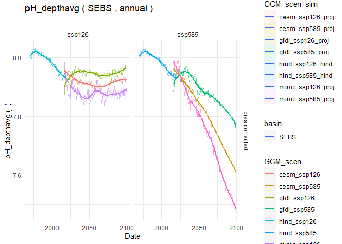
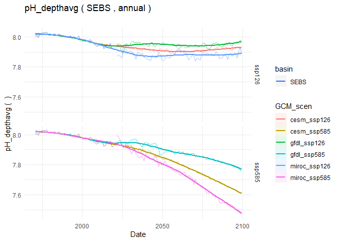

# Download the ACLIM2 repo & data

## Clone the ACLIM2 repo

To run this tutorial first clone the ACLIM2 repository to your local
drive:

### Option 1: Use R

This set of commands, run within R, downloads the ACLIM2 repository and
unpacks it, with the ACLIM2 directory structrue being located in the
specified `download_path`. This also performs the folder renaming
mentioned in Option 2.

``` r
    # Specify the download directory
    main_nm       <- "ACLIM2"

    # Note: Edit download_path for preference
    download_path <-  path.expand("~")
    dest_fldr     <- file.path(download_path,main_nm)
    
    url           <- "https://github.com/kholsman/ACLIM2/archive/main.zip"
    dest_file     <- file.path(download_path,paste0(main_nm,".zip"))
    download.file(url=url, destfile=dest_file)
    
    # unzip the .zip file (manually unzip if this doesn't work)
    setwd(download_path)
    unzip (dest_file, exdir = download_path,overwrite = T)
    
    #rename the unzipped folder from ACLIM2-main to ACLIM2
    file.rename(paste0(main_nm,"-main"), main_nm)
    setwd(main_nm)
```

### Option 2: Download the zipped repo

Download the full zip archive directly from the [**ACLIM2
Repo**](https://github.com/kholsman/ACLIM2) using this link:
[**https://github.com/kholsman/ACLIM2/archive/main.zip**](https://github.com/kholsman/ACLIM2/archive/main.zip),
and unzip its contents while preserving directory structure.

**Important!** If downloading from zip, please **rename the root
folder** from `ACLIM2-main` (in the zipfile) to `ACLIM2` (name used in
cloned copies) after unzipping, for consistency in the following
examples.

Your final folder structure should look like this:


### Option 3: Use git commandline

If you have git installed and can work with it, this is the preferred
method as it preserves all directory structure and can aid in future
updating. Use this from a **terminal command line, not in R**, to clone
the full ACLIM2 directory and sub-directories:

``` bash
    git clone https://github.com/kholsman/ACLIM2.git
```

------------------------------------------------------------------------

## Get the data

**Step 1)** \* Go to the google drive and download the zipped file with
the R data `2022_03_07_Rdata.zip`:

-   [00_ACLIM_shared \> 02_Data \> Newest_Data(use this) \>
    2022_05_16_unzip_and_putIN_Data_in_folder.zip](https://drive.google.com/drive/folders/11BQEfNEl9vvrN-V0LgS67XS4aLE9pNzz)

-   Unzip the folder and move the contents of the zipped folder to your
    local folder `ACLIM2/Data/in`.

<!-- { width=50%} -->

**Step 2)** \* Go to the google drive and download the zipped file with
the R ACLIM2 indices `ACLIM2_indices.zip`:

-   [00_ACLIM_shared \> 02_Data \> Newest_Data(use this) \>
    2022_05_16_unzip_and_putIN_Data_out_folder](https://drive.google.com/drive/folders/11BQEfNEl9vvrN-V0LgS67XS4aLE9pNzz)

-   Unzip the folder and move the contents of the zipped folder to your
    local folder `ACLIM2/Data/out`.

<!-- { width=50%} -->

## Set up the Workspace

Open R() and used ‘setwd()’ to navigate to the root ACLIM2 folder (.e.g,
\~/mydocuments/ACLIM2)

``` r
    # set the workspace to your local ACLIM2 folder
    # e.g., "/Users/kholsman/Documents/GitHub/ACLIM2"
    # setwd( path.expand("~/Documents/GitHub/ACLIM2") )
   
    # --------------------------------------
    # SETUP WORKSPACE
    tmstp  <- format(Sys.time(), "%Y_%m_%d")
    main   <- getwd()  #"~/GitHub_new/ACLIM2"
    
    # loads packages, data, setup, etc.
    suppressWarnings(source("R/make.R"))
```

    ## ------------------------------
    ## ALIM2/R/setup.R settings 
    ## ------------------------------
    ## data_path            : /Volumes/LaCie/romsnpz/roms_for_public 
    ## Rdata_path           : /Volumes/LaCie/romsnpz/2022_05_16_Rdata/roms_for_public 
    ## redownload_level3_mox: FALSE 
    ## update.figs          : FALSE 
    ## load_gis             : FALSE 
    ## update.outputs       : TRUE 
    ## update.figs          : FALSE 
    ## dpiIN                : 150 
    ## update.figs          : FALSE 
    ## ------------------------------
    ## ------------------------------
    ## 
    ## The following datasets are public, please cite as Hermann et al. 2019 (v.H16) and Kearney et al. 2020 (v.K20) :
    ## B10K-H16_CMIP5_CESM_BIO_rcp85 
    ## B10K-H16_CMIP5_CESM_rcp45 
    ## B10K-H16_CMIP5_CESM_rcp85 
    ## B10K-H16_CMIP5_GFDL_BIO_rcp85 
    ## B10K-H16_CMIP5_GFDL_rcp45 
    ## B10K-H16_CMIP5_GFDL_rcp85 
    ## B10K-H16_CMIP5_MIROC_rcp45 
    ## B10K-H16_CMIP5_MIROC_rcp85 
    ## B10K-H16_CORECFS 
    ## B10K-K20_CORECFS 
    ## 
    ## The following datasets are still under embargo, please do not share outside of ACLIM:
    ## B10K-K20P19_CMIP6_cesm_historical 
    ## B10K-K20P19_CMIP6_cesm_ssp126 
    ## B10K-K20P19_CMIP6_cesm_ssp585 
    ## B10K-K20P19_CMIP6_gfdl_historical 
    ## B10K-K20P19_CMIP6_gfdl_ssp126 
    ## B10K-K20P19_CMIP6_gfdl_ssp585 
    ## B10K-K20P19_CMIP6_miroc_historical 
    ## B10K-K20P19_CMIP6_miroc_ssp126 
    ## B10K-K20P19_CMIP6_miroc_ssp585

------------------------------------------------------------------------

# Read this before you start

## Overview

The [**ACLIM2 github repository**](https://github.com/kholsman/ACLIM2)
contains R code and Rdata files for working with netcdf-format data
generated from the [**downscaled ROMSNPZ
modeling**](https://beringnpz.github.io/roms-bering-sea) of the ROMSNPZ
Bering Sea Ocean Modeling team; Drs. Hermann, Cheng, Kearney,
Pilcher,Ortiz, and Aydin. The code and R resources described in this
tutorial are maintained by [Kirstin
Holsman](mailto:kirstin.holsman@noaa.gov) as part of NOAA’s [**ACLIM
project**](https://www.fisheries.noaa.gov/alaska/ecosystems/alaska-climate-integrated-modeling-project)
for the Bering Sea. *See [Hollowed et
al. 2020](https://www.frontiersin.org/articles/10.3389/fmars.2019.00775/full)
for more information about the ACLIM project.*

------------------------------------------------------------------------

This document provides an overview of accessing, plotting, and creating
bias corrected indices for ACLIM2 based on CMIP6 (embargoed for ACLIM2
users until 2023) and CMIP5 (publicly available) simulations. This guide
assumes analyses will take place in R() and that users have access to
the data folder within the ACLIM2 shared drive. For more information
also see the full tutorial (“GettingStarted_Bering10K_ROMSNPZ” available
at the bottom of [**this repo
page**](https://github.com/kholsman/ACLIM2).

**Important!** A few key things to know before getting started are
detailed below. Please review this information before getting started.

## ROMSNPZ versions

**Important!** ACLIM1 CMIP5 and ACLIM2 CMIP5 and CMIP6 datasets use
different base models.

There are two versions of the ROMSNPZ model:

1.  ACLIM1 an older 10-depth layer model used for CMIP5 (“H-16”)
2.  ACLIM2 a new 30-depth layer model used for CMIP6 (“K20” or “K20P19”)

The models are not directly comparable, therefore the projections should
be bias corrected and recentered to baselines of hindcasts of each model
(forced by “observed” climate conditions). i.e. CMIP5 and CMIP6 have
corresponding hindcasts:

1.  Hindcast for CMIP5 “H19” –\> H16_CORECFS
2.  Hindcast for CMIP5 “K20P19” –\> H16_CORECFS
3.  Hindcast for CMIP6 “K20P19” –\> K20_CORECFS

In addition for CMIP6 “historical” runs are available for bias
correcting. We will use those below.

For a list of the available simulations for ACLIM enter the following in
R():

``` r
    # list of the climate scenarios
    data.frame(sim_list)
```

    ##                              sim_list
    ## 1                    B10K-K20_CORECFS
    ## 2       B10K-H16_CMIP5_CESM_BIO_rcp85
    ## 3           B10K-H16_CMIP5_CESM_rcp45
    ## 4           B10K-H16_CMIP5_CESM_rcp85
    ## 5       B10K-H16_CMIP5_GFDL_BIO_rcp85
    ## 6           B10K-H16_CMIP5_GFDL_rcp45
    ## 7           B10K-H16_CMIP5_GFDL_rcp85
    ## 8          B10K-H16_CMIP5_MIROC_rcp45
    ## 9          B10K-H16_CMIP5_MIROC_rcp85
    ## 10                   B10K-H16_CORECFS
    ## 11       B10K-K20P19_CMIP5_CESM_rcp45
    ## 12       B10K-K20P19_CMIP5_CESM_rcp85
    ## 13       B10K-K20P19_CMIP5_GFDL_rcp45
    ## 14       B10K-K20P19_CMIP5_GFDL_rcp85
    ## 15      B10K-K20P19_CMIP5_MIROC_rcp45
    ## 16      B10K-K20P19_CMIP5_MIROC_rcp85
    ## 17  B10K-K20P19_CMIP6_cesm_historical
    ## 18      B10K-K20P19_CMIP6_cesm_ssp126
    ## 19      B10K-K20P19_CMIP6_cesm_ssp585
    ## 20  B10K-K20P19_CMIP6_gfdl_historical
    ## 21      B10K-K20P19_CMIP6_gfdl_ssp126
    ## 22      B10K-K20P19_CMIP6_gfdl_ssp585
    ## 23 B10K-K20P19_CMIP6_miroc_historical
    ## 24     B10K-K20P19_CMIP6_miroc_ssp126
    ## 25     B10K-K20P19_CMIP6_miroc_ssp585

## ROMSNPZ variables

For a list of the available variables from the ROMSNPZ:

``` r
    # Metadata for variables
    (srvy_var_def[-(1:5),])
```

    ##                    name                            units
    ## 6                   Ben                        mg C m^-2
    ## 7                DetBen                        mg C m^-2
    ## 8                  Hsbl                            meter
    ## 9                IceNH4                      mmol N m^-3
    ## 10               IceNO3                      mmol N m^-3
    ## 11               IcePhL                        mg C m^-3
    ## 12                 aice                                 
    ## 13                 hice                            meter
    ## 14               shflux                     watt meter-2
    ## 15               ssflux                   meter second-1
    ## 16       Cop_integrated                    (mg C m^-3)*m
    ## 17        Cop_surface5m                        mg C m^-3
    ## 18      EupO_integrated                    (mg C m^-3)*m
    ## 19       EupO_surface5m                        mg C m^-3
    ## 20      EupS_integrated                    (mg C m^-3)*m
    ## 21       EupS_surface5m                        mg C m^-3
    ## 22        Iron_bottom5m                  micromol Fe m-3
    ## 23      Iron_integrated              (micromol Fe m-3)*m
    ## 24       Iron_surface5m                  micromol Fe m-3
    ## 25       Jel_integrated                    (mg C m^-3)*m
    ## 26        Jel_surface5m                        mg C m^-3
    ## 27       MZL_integrated                    (mg C m^-3)*m
    ## 28        MZL_surface5m                        mg C m^-3
    ## 29      NCaO_integrated                    (mg C m^-3)*m
    ## 30       NCaO_surface5m                        mg C m^-3
    ## 31      NCaS_integrated                    (mg C m^-3)*m
    ## 32       NCaS_surface5m                        mg C m^-3
    ## 33         NH4_bottom5m                      mmol N m^-3
    ## 34       NH4_integrated                  (mmol N m^-3)*m
    ## 35        NH4_surface5m                      mmol N m^-3
    ## 36         NO3_bottom5m                      mmol N m^-3
    ## 37       NO3_integrated                  (mmol N m^-3)*m
    ## 38        NO3_surface5m                      mmol N m^-3
    ## 39       PhL_integrated                    (mg C m^-3)*m
    ## 40        PhL_surface5m                        mg C m^-3
    ## 41       PhS_integrated                    (mg C m^-3)*m
    ## 42        PhS_surface5m                        mg C m^-3
    ## 43  prod_Cop_integrated                   mg C m^-2 d^-1
    ## 44 prod_EupO_integrated                   mg C m^-2 d^-1
    ## 45 prod_EupS_integrated                   mg C m^-2 d^-1
    ## 46  prod_Eup_integrated (milligram carbon meter-3 d-1)*m
    ## 47  prod_Jel_integrated                   mg C m^-2 d^-1
    ## 48  prod_MZL_integrated                   mg C m^-2 d^-1
    ## 49 prod_NCaO_integrated                   mg C m^-2 d^-1
    ## 50 prod_NCaS_integrated                   mg C m^-2 d^-1
    ## 51  prod_NCa_integrated (milligram carbon meter-3 d-1)*m
    ## 52  prod_PhL_integrated                   mg C m^-2 d^-1
    ## 53  prod_PhS_integrated                   mg C m^-2 d^-1
    ## 54       salt_surface5m                                 
    ## 55        temp_bottom5m                          Celsius
    ## 56      temp_integrated                      (Celsius)*m
    ## 57       temp_surface5m                          Celsius
    ## 58       uEast_bottom5m                   meter second-1
    ## 59      uEast_surface5m                   meter second-1
    ## 60      vNorth_bottom5m                   meter second-1
    ## 61     vNorth_surface5m                   meter second-1
    ##                                                       longname
    ## 6                                Benthic infauna concentration
    ## 7                               Benthic detritus concentration
    ## 8                      depth of oceanic surface boundary layer
    ## 9                                   Ice ammonium concentration
    ## 10                                   Ice nitrate concentration
    ## 11                                     Ice algae concentration
    ## 12                             fraction of cell covered by ice
    ## 13                               average ice thickness in cell
    ## 14                                       surface net heat flux
    ## 15                           surface net salt flux, (E-P)*SALT
    ## 16          Small copepod concentration, integrated over depth
    ## 17                Small copepod concentration, surface 5m mean
    ## 18    Offshore euphausiid concentration, integrated over depth
    ## 19          Offshore euphausiid concentration, surface 5m mean
    ## 20    On-shelf euphausiid concentration, integrated over depth
    ## 21          On-shelf euphausiid concentration, surface 5m mean
    ## 22                          iron concentration, bottom 5m mean
    ## 23                   iron concentration, integrated over depth
    ## 24                         iron concentration, surface 5m mean
    ## 25              Jellyfish concentration, integrated over depth
    ## 26                    Jellyfish concentration, surface 5m mean
    ## 27       Microzooplankton concentration, integrated over depth
    ## 28             Microzooplankton concentration, surface 5m mean
    ## 29 Offshore large copepod concentration, integrated over depth
    ## 30       Offshore large copepod concentration, surface 5m mean
    ## 31 On-shelf large copepod concentration, integrated over depth
    ## 32       On-shelf large copepod concentration, surface 5m mean
    ## 33                      Ammonium concentration, bottom 5m mean
    ## 34               Ammonium concentration, integrated over depth
    ## 35                     Ammonium concentration, surface 5m mean
    ## 36                       Nitrate concentration, bottom 5m mean
    ## 37                Nitrate concentration, integrated over depth
    ## 38                      Nitrate concentration, surface 5m mean
    ## 39    Large phytoplankton concentration, integrated over depth
    ## 40          Large phytoplankton concentration, surface 5m mean
    ## 41    Small phytoplankton concentration, integrated over depth
    ## 42          Small phytoplankton concentration, surface 5m mean
    ## 43                  Cop net production rate, summed over depth
    ## 44                 EupO net production rate, summed over depth
    ## 45                 EupS net production rate, summed over depth
    ## 46     secondary production Euphausiids, integrated over depth
    ## 47                  Jel net production rate, summed over depth
    ## 48                  MZL net production rate, summed over depth
    ## 49                 NCaO net production rate, summed over depth
    ## 50                 NCaS net production rate, summed over depth
    ## 51      secondary production Neocalanus, integrated over depth
    ## 52                  PhL net production rate, summed over depth
    ## 53                  PhS net production rate, summed over depth
    ## 54                                   salinity, surface 5m mean
    ## 55                       potential temperature, bottom 5m mean
    ## 56                potential temperature, integrated over depth
    ## 57                      potential temperature, surface 5m mean
    ## 58           u-momentum component, geo-rotated, bottom 5m mean
    ## 59          u-momentum component, geo-rotated, surface 5m mean
    ## 60           v-momentum component, geo-rotated, bottom 5m mean
    ## 61          v-momentum component, geo-rotated, surface 5m mean

## Data outputs

**Important!** There are 2 types of post-processed data available for
use in ACLIM.

The ROMSNPZ team has developed a process to provide standardized
post-processed outputs from the large (and non-intuitive) ROMSNPZ grid.
These have been characterized as:

1.  Level 1 (original ROMSNPZ U,V, grid, not rotated or corrected)  
2.  Level 2 (lat long bi-weekly high res versions, shouldn’t be needed
    and are difficult to work with)  
3.  **Level 3 indices (depth corrected and area weighted means for each
    model variable; i.e., what we will mostly use) **
    1.  “ACLIMsurveyrep\_”: groundifsh survey replicated (replicated in
        space and time)
    2.  “ACLIMregion\_”: weekly strata based averages

To get more information about each of these level 3 datasets enter this
in R:

``` r
    # Metadata for Weekly ("ACLIMregion_...") indices
    head(all_info1)
```

    ##                            name                    Type B10KVersion  CMIP  GCM   BIO
    ## 1 B10K-H16_CMIP5_CESM_BIO_rcp85 Weekly regional indices         H16 CMIP5 CESM  TRUE
    ## 2     B10K-H16_CMIP5_CESM_rcp45 Weekly regional indices         H16 CMIP5 CESM FALSE
    ## 3     B10K-H16_CMIP5_CESM_rcp85 Weekly regional indices         H16 CMIP5 CESM FALSE
    ## 4 B10K-H16_CMIP5_GFDL_BIO_rcp85 Weekly regional indices         H16 CMIP5 GFDL  TRUE
    ## 5     B10K-H16_CMIP5_GFDL_rcp45 Weekly regional indices         H16 CMIP5 GFDL FALSE
    ## 6     B10K-H16_CMIP5_GFDL_rcp85 Weekly regional indices         H16 CMIP5 GFDL FALSE
    ##   Carbon_scenario               Start                 End nvars
    ## 1           rcp85 2006-01-22 12:00:00 2099-12-27 12:00:00    59
    ## 2           rcp45 2006-01-22 12:00:00 2081-02-16 12:00:00    59
    ## 3           rcp85 2006-01-22 12:00:00 2099-12-27 12:00:00    59
    ## 4           rcp85 2006-01-22 12:00:00 2099-12-27 12:00:00    59
    ## 5           rcp45 2006-01-22 12:00:00 2099-12-27 12:00:00    59
    ## 6           rcp85 2006-01-22 12:00:00 2099-12-27 12:00:00    59

``` r
    # Metadata for Weekly ("ACLIMsurveyrep_...") indices
    head(all_info2)
```

    ##                            name              Type B10KVersion  CMIP  GCM   BIO Carbon_scenario
    ## 1 B10K-H16_CMIP5_CESM_BIO_rcp85 Survey replicated         H16 CMIP5 CESM  TRUE           rcp85
    ## 2     B10K-H16_CMIP5_CESM_rcp45 Survey replicated         H16 CMIP5 CESM FALSE           rcp45
    ## 3     B10K-H16_CMIP5_CESM_rcp85 Survey replicated         H16 CMIP5 CESM FALSE           rcp85
    ## 4 B10K-H16_CMIP5_GFDL_BIO_rcp85 Survey replicated         H16 CMIP5 GFDL  TRUE           rcp85
    ## 5     B10K-H16_CMIP5_GFDL_rcp45 Survey replicated         H16 CMIP5 GFDL FALSE           rcp45
    ## 6     B10K-H16_CMIP5_GFDL_rcp85 Survey replicated         H16 CMIP5 GFDL FALSE           rcp85
    ##   Start  End nvars
    ## 1  1970 2100    60
    ## 2  1970 2100    60
    ## 3  1970 2100    60
    ## 4  1970 2100    60
    ## 5  1970 2100    60
    ## 6  1970 2100    60

# Indices & bias correction

*ACLIM2 Indices*

The next step creates ACLIM2 indices (i.e., Level4) based on the Level3
output for each hindcast, historical run, and CMIP6 projection. The
script below then bias corrects each index using the historical run and
recenters the projection on the corresponding hindcast (such that
projections are *Δ* from historical mean values for the reference period
`deltayrs     <- 1970:2000` ).

*NESB & SEBS averaged indices* The average water column values for each
variable from the ROMSNPZ model strata x weekly Level2 outputs
(‘ACLIMregion’) was calculated and used to calculate the strata-area
weighted mean value for the NEBS and SEBS weekly, monthly, seasonally,
and annually. Similarly, for survey replicated (‘ACLIMsurveyrep’) Level2
outputs the average water column value for each variable at each station
was calculated used to calculate the strata-area weighted mean value for
the NEBS and SEBS annually. These indices were calculate for hindcast,
historical, and projection scenarios, and used to bias correct the
projections. More information on the methods for each can be found in
the tabs below and the code immediately following this section will
re-generate the bias corrected indices. All of the bias corrected
outputs can be found in the “Data/out/CMIP6” folder.

<figure>
<figcaption aria-hidden="true"><strong>Raw (top row) and bias corrected (bottom row)bottom temperature indices based on survey replicated Level3 outputs for the SEBS</strong></figcaption>
</figure>

**Important!** Note that for projections the ‘mn_val’ represents raw
mean values, while ‘val_bias-corrected’ is the bias corrected mn_val
(should be used instead of the raw values). In all cases, for variables
that are log-normally distributed (cannot be \< 0), the ln(mn_val) were
used to bias correct and were then back transformed to non-log space
after correction:

For normally distributed variables (*Y*):
$${Y}^{fut'}\_{t,k} =\\bar{Y}^{hind}\_{k,\\bar{T}} +\\left( \\frac{\\sigma^{hind}\_{k,\\bar{T}}}{\\sigma^{hist}\_{k,\\bar{T}}}\*({Y}^{fut}\_{t,k}-\\bar{Y}^{hist}\_{k,\\bar{T}})  \\right )$$

where *Ȳ*<sub>*y*, *k*</sub><sup>*f**u**t*′</sup> is the bias corrected
varable *k* value for time-step *t* (e.g., year, month, or season),
*Ȳ*<sub>*k*, *T̄*</sub><sup>*h**i**n**d*</sup> is the mean value of the
variable *k* during the reference period *T̄* = \[1980, 2013\] from the
hindcast model, *σ*<sub>*k*, *T̄*</sub><sup>*h**i**n**d*</sup> is the
standard deviation of the hindcast during the reference period *T̄*,
*σ*<sub>*k*, *T̄*</sub><sup>*h**i**s**t*</sup> is the standard deviation
of the historical run during tje reference period,
*Y*<sub>*t*, *k*</sub><sup>*f**u**t*</sup> is the value of the variable
from the projection at time-step *t* and
*Ȳ*<sub>*k*, *T̄*</sub><sup>*h**i**s**t*</sup> is the average value from
the historical run during reference period *T̄*.

For log-normally distributed variables(*Y*):
$${Y}^{fut'}\_{y,k} =e^{\\ln\\bar{Y}^{hind}\_{k,\\bar{T}} +\\left( \\frac{\\hat{\\sigma}^{hind}\_{k,\\bar{T}}}{\\hat{\\sigma}^{hist}\_{k,\\bar{T}}}\*(\\ln{Y}^{fut}\_{t,k}-\\ln\\bar{Y}^{hist}\_{k,\\bar{T}})  \\right )}$$
, where *σ̂*<sub>*k*, *T̄*</sub><sup>*h**i**s**t*</sup> and
*σ̂*<sub>*k*, *T̄*</sub><sup>*h**i**n**d*</sup> are the standard deviation
of the ln *Ȳ*<sub>*k*, *t*</sub><sup>*h**i**s**t*</sup> and
ln *Ȳ*<sub>*k*, *t*</sub><sup>*h**i**n**d*</sup> during the reference
period *T̂* (respectively).

## Weekly indices

Uses the strata x weekly data (‘ACLIMregion’) to generate
strata-specific averages in order to generate the strata area-weighted
averages for each week *w* each year *y*.

$$\\bar{Y}\_{w,y,k}= \\frac{\\sum^{n_s}\_{l}(\\frac{1}{n_i}\\sum^{n_t}\_{t}Y\_{k,w,y,s,t})\*A_s} {\\sum^{n_s}\_{s}{A_s}}$$
, where *Y*<sub>*k*, *w*, *y*, *s*, *t*</sub> is the value of the
variable *k* in strata *s* at time *t* in year *y*, *A*<sub>*s*</sub> is
the area of strata *s*, *n*<sub>*i*</sub> is the number of stations in
strata *s*, and *n*<sub>*s*</sub> is the number of strata *s* in each
basin (NEBS or SEBS).

*Ȳ*<sub>*w*, *y*, *k*</sub> was calculated for the hindcast, historical
run, and projection time-series. For projections
*Ȳ*<sub>*w*, *y*, *k*</sub> was bias corrected using the corresponding
historical and hindcast values such that:

$$\\bar{Y}^{fut'}\_{w,y,k} =\\bar{Y}^{hind}\_{w,k} +\\left( \\frac{\\sigma^{hind}\_{w,k}}{\\sigma^{hist}\_{w,k}}\*(\\bar{Y}^{fut}\_{w,y,k}-\\bar{Y}^{hist}\_{w,k})  \\right )$$
, where *Ȳ*<sub>*w*, *k*</sub><sup>*h**i**s**t*</sup> and
*Ȳ*<sub>*w*, *k*</sub><sup>*h**i**n**d*</sup> are the average historical
weekly values across years in the period (1980 to 2012 ; adjustable in
`R/setup.R`).

## Monthly indices

Uses the strata x weekly data (‘ACLIMregion’) to generate
strata-specific averages in order to generate the strata area-weighted
averages for each month *m* each year *y*.

$$\\bar{Y}\_{m,y,k}= \\frac{1}{n_w}\\sum^{n_w}\_{w}\\bar{Y}\_{w,y,k}$$
, where *Ȳ*<sub>*w*, *y*, *k*</sub> are the weekly average indices for
variable *k* in year *y* from the previous step ,*n*<sub>*w*</sub> is
the number of weeks in each month *m*.

*Ȳ*<sub>*m*, *y*, *k*</sub> was calculated for the hindcast, historical
run, and projection time-series. For projections
*Ȳ*<sub>*m*, *y*, *k*</sub> was bias corrected using the corresponding
historical and hindcast values such that:

$$\\bar{Y}^{fut'}\_{m,y,k} =\\bar{Y}^{hind}\_{m,k} +\\left( \\frac{\\sigma^{hind}\_{m,k}}{\\sigma^{hist}\_{m,k}}\*(\\bar{Y}^{fut}\_{m,y,k}-\\bar{Y}^{hist}\_{m,k})  \\right )$$
, where *Ȳ*<sub>*m*, *k*</sub><sup>*h**i**s**t*</sup> and
*Ȳ*<sub>*m*, *k*</sub><sup>*h**i**n**d*</sup> are the average historical
monthly values across years in the period (1980 to 2012 ; adjustable in
`R/setup.R`).

## Seasonal indices

Uses the strata x weekly data (‘ACLIMregion’) to generate
strata-specific averages in order to generate the strata area-weighted
averages for each season *l* each year *y*.

$$\\bar{Y}\_{l,y,k}= \\frac{1}{n_w}\\sum^{n_w}\_{w}\\bar{Y}\_{w,y,k}$$
, where *Ȳ*<sub>*w*, *y*, *k*</sub> are the weekly average indices for
variable *k* in year *y* from the previous step ,*n*<sub>*w*</sub> is
the number of weeks in each season *l*.

*Ȳ*<sub>*l*, *y*, *k*</sub> was calculated for the hindcast, historical
run, and projection time-series. For projections
*Ȳ*<sub>*l*, *y*, *k*</sub> was bias corrected using the corresponding
historical and hindcast values such that:

$$\\bar{Y}^{fut'}\_{l,y,k} =\\bar{Y}^{hind}\_{l,k} +\\left( \\frac{\\sigma^{hind}\_{l,k}}{\\sigma^{hist}\_{l,k}}\*(\\bar{Y}^{fut}\_{l,y,k}-\\bar{Y}^{hist}\_{l,k})  \\right )$$
, where *Ȳ*<sub>*l*, *k*</sub><sup>*h**i**s**t*</sup> and
*Ȳ*<sub>*l*, *k*</sub><sup>*h**i**n**d*</sup> are the average historical
seasonal values across years in the reference period (1980 to 2012 ;
adjustable in `R/setup.R`).

## Annual indices

Uses the strata x weekly data (‘ACLIMregion’) to generate
strata-specific averages in order to generate the strata area-weighted
averages for each season *l* each year *y*.

$$\\bar{Y}\_{y,k}= \\frac{1}{n_w}\\sum^{n_w}\_{w}\\bar{Y}\_{w,y,k}$$
, where *Ȳ*<sub>*w*, *y*, *k*</sub> are the weekly average indices for
variable *k* in year *y* from the previous step ,*n*<sub>*w*</sub> is
the number of weeks in each year *y*.

*Ȳ*<sub>*y*, *k*</sub> was calculated for the hindcast, historical run,
and projection time-series. For projections *Ȳ*<sub>*y*, *k*</sub> was
bias corrected using the corresponding historical and hindcast values
such that:

$$\\bar{Y}^{fut'}\_{y,k} =\\bar{Y}^{hind}\_{k} +\\left( \\frac{\\sigma^{hind}\_{k}}{\\sigma^{hist}\_{k}}\*(\\bar{Y}^{fut}\_{y,k}-\\bar{Y}^{hist}\_{k})  \\right )$$
, where *Ȳ*<sub>*k*</sub><sup>*h**i**n**d*</sup> and
*Ȳ*<sub>*k*</sub><sup>*h**i**s**t*</sup> are the average historical
values across years in the reference period (1980 to 2012 ; adjustable
in `R/setup.R`).

## Annual survey rep. indices

Uses the station specific survey replicated (in time and space) data
(‘ACLIMsurveyrep’) to generate strata-specific averages in order to
generate the strata area-weighted averages for each year *y*.

$$\\bar{Y}\_{y,k}= \\frac{\\sum^{n_s}\_{l}(\\frac{1}{n_i}\\sum^{n_i}\_{i}Y\_{k,y,s,i})\*A_s} {\\sum^{n_s}\_{s}{A_s}}$$
, where *Y*<sub>*k*, *y*, *s*, *i*</sub> is the value of the variable
*k* at station *i* in strata *s* in year *y*, *A*<sub>*s*</sub> is the
area of strata *s*, *n*<sub>*i*</sub> is the number of stations in
strata *s*, and *n*<sub>*s*</sub> is the number of strata *s* in each
basin (NEBS or SEBS).

*Ȳ*<sub>*y*, *k*</sub> was calculated for the hindcast, historical run,
and projection time-series. For projections *Ȳ*<sub>*y*, *k*</sub> was
bias corrected using the corresponding historical and hindcast values
such that:

$$\\bar{Y}^{fut'}\_{y,k} =\\bar{Y}^{hind}\_{k} +\\left( \\frac{\\sigma^{hind}\_{k}}{\\sigma^{hist}\_{k}}\*(\\bar{Y}^{fut}\_{y,k}-\\bar{Y}^{hist}\_{k})  \\right )$$
, where *Ȳ*<sub>*k*</sub><sup>*h**i**n**d*</sup> and
*Ȳ*<sub>*k*</sub><sup>*h**i**s**t*</sup> are the average historical
values across years in the reference period (1980 to 2012 ; adjustable
in `R/setup.R`).

Appendix A includes the code used to generate the ACLIM2 indices and
bias correct them. That code can be run to re-make the indices if you
like but takes approx 30 mins a CMIP to run.

# Plot & concat Indices

The following code will open an interactive shiny() app for exploring
the indices. You can also view this online at
(kkh2022.shinyapps.io/ACLIM2_indices)\[<https://kkh2022.shinyapps.io/ACLIM2_indices/>\].

``` r
shiny::runApp("/Users/kholsman/Documents/GitHub/ACLIM2/R/shiny_aclim/ACLIM2_indices/app.R")

# alternatively you can extract the data you want using the get_var()function

df <- get_var(typeIN    = "annual", 
         plotvar = "temp_bottom5m",plothist =F)

df$plot
head(df$dat)
```

<figure>
<figcaption aria-hidden="true">“Raw (top row) and bias corrected (bottom row)bottom temperature indices based on survey replicated Level3 outputs for the SEBS”</figcaption>
</figure>

<!-- ## Annual indices -->
<!-- ```{r explore, eval=F, include=T,echo=T} -->
<!--     # -------------------------------------- -->
<!--     # SETUP WORKSPACE -->
<!--     main   <- getwd()  #"~/GitHub_new/ACLIM2" -->
<!--     # loads packages, data, setup, etc. -->
<!--     suppressMessages(source("R/make.R")) -->
<!--     # load the Indices: -->
<!--     fldr <- "Data/out/K20P19_CMIP6/allEBS_means" -->
<!--     dirlist <-grep ("annual", dir(fldr)) -->
<!--     for(d in dirlist) -->
<!--       load(file.path(fldr,d)) -->
<!--     hnd <- ACLIM_annual_fut_mn -->
<!-- ```` -->
<!-- # Special cases {.tabset} -->

## NRS indices (André)

``` r
suppressMessages(source("R/make.R"))

# preview possible variables
    
    load(file = "Data/out/weekly_vars_C.Rdata")
    load(file = "Data/out/weekly_vars.Rdata")
    load(file = "Data/out/srvy_vars_C.Rdata")
    load(file = "Data/out/srvy_vars.Rdata")
    
load(paste0("Data/out/K20P19_CMIP6_C/allEBS_means/ACLIM_annual_hind_mn.Rdata"))
varall  <- unique(ACLIM_annual_hind$var)
varall

scens   <- c("ssp126","ssp585")
GCMs    <- c("miroc","gfdl",  "cesm" )
varlist <- c("temp_bottom5m","fracbelow2","uEast_surface5m")

# get the variable you want:
df <- get_var( typeIN    = "annual", 
               plotvar   = varlist[1],
               bcIN      = "raw",
               CMIPIN    = "K20P19_CMIP6", 
               plothist  = F,  # ignore the hist runs
               removeyr1 = T)  #"Remove first year of projection ( burn in)")

df$plot+coord_cartesian(ylim = c(0, 7)) 
```


``` r
head(df$dat)
# 
# # get the variable you want:
# df <- get_var( typeIN    = "annual", 
#                plotvar   = varlist[1],
#                bcIN      = "raw",
#                CMIPIN    = "K20P19_CMIP6_C", 
#                plothist  = F,  # ignore the hist runs
#                removeyr1 = T)  #"Remove first year of projection ( burn in)")
# 
# df$plot+coord_cartesian(ylim = c(0, 7)) 
# 
# head(df$dat)

# 
# # get the variable you want:
# df <- get_var( typeIN    = "annual", 
#                plotvar   = "uEast_surface5m",
#                bcIN      = "bias corrected",
#                CMIPIN    = "K20P19_CMIP6_C", 
#                plothist  = F,  # ignore the hist runs
#                removeyr1 = T)  #"Remove first year of projection ( burn in)")
# 
# df$plot
# head(df$dat)

# get the variable you want:
df <- get_var( typeIN    = "annual", 
               plotvar   = "pH_depthavg",
               bcIN      = "bias corrected",
               CMIPIN    = "K20P19_CMIP6_C", 
               plothist  = F,  # ignore the hist runs
               removeyr1 = T)  #"Remove first year of projection ( burn in)")

df$plot
```



``` r
head(df$dat)
```

``` r
# get the variable you want:
df <- get_var( typeIN    = "annual", 
               plotvar   = "pH_depthavg",
               bcIN      = "bias corrected",
               CMIPIN    = "K20P19_CMIP6_C", 
               plothist  = F,  # ignore the hist runs
               removeyr1 = T)  #"Remove first year of projection ( burn in)")

df$plot
```


``` r
head(df$dat)
```

    ##           var basin year     jday     mnDate   mn_val                               sim
    ## 1 pH_depthavg  SEBS 1970 189.5000 1970-07-09 8.002964 ACLIMregion_C_B10K-K20P19_CORECFS
    ## 2 pH_depthavg  SEBS 1971 181.5000 1971-07-01 8.008074 ACLIMregion_C_B10K-K20P19_CORECFS
    ## 3 pH_depthavg  SEBS 1972 184.0000 1972-07-03 7.996702 ACLIMregion_C_B10K-K20P19_CORECFS
    ## 4 pH_depthavg  SEBS 1973 182.0000 1973-07-02 8.022209 ACLIMregion_C_B10K-K20P19_CORECFS
    ## 5 pH_depthavg  SEBS 1974 181.1373 1974-07-01 8.023676 ACLIMregion_C_B10K-K20P19_CORECFS
    ## 6 pH_depthavg  SEBS 1975 183.5000 1975-07-03 8.030164 ACLIMregion_C_B10K-K20P19_CORECFS
    ##   gcmcmip  GCM   scen sim_type units             bc    GCM_scen     GCM_scen_sim
    ## 1    hind hind ssp126     hind       bias corrected hind_ssp126 hind_ssp126_hind
    ## 2    hind hind ssp126     hind       bias corrected hind_ssp126 hind_ssp126_hind
    ## 3    hind hind ssp126     hind       bias corrected hind_ssp126 hind_ssp126_hind
    ## 4    hind hind ssp126     hind       bias corrected hind_ssp126 hind_ssp126_hind
    ## 5    hind hind ssp126     hind       bias corrected hind_ssp126 hind_ssp126_hind
    ## 6    hind hind ssp126     hind       bias corrected hind_ssp126 hind_ssp126_hind
    ##             CMIP   type
    ## 1 K20P19_CMIP6_C annual
    ## 2 K20P19_CMIP6_C annual
    ## 3 K20P19_CMIP6_C annual
    ## 4 K20P19_CMIP6_C annual
    ## 5 K20P19_CMIP6_C annual
    ## 6 K20P19_CMIP6_C annual

``` r
# concat the hind and fut runs by removing years from projection
maxDin <- max(as.vector(df$dat%>%dplyr::filter(sim_type=="hind")%>%dplyr::select(mnDate))[[1]])


newdat <- stitchTS(dat = df$dat,
                 maxD  = maxDin)

# newdat has the full set of data
# select miroc_ssp126
head(newdat%>%dplyr::filter(GCM_scen==paste0(GCMs[1],"_",scens[1])))
```

    ##           var basin year     jday     mnDate   mn_val                               sim
    ## 1 pH_depthavg  SEBS 1970 189.5000 1970-07-09 8.002964 ACLIMregion_C_B10K-K20P19_CORECFS
    ## 2 pH_depthavg  SEBS 1971 181.5000 1971-07-01 8.008074 ACLIMregion_C_B10K-K20P19_CORECFS
    ## 3 pH_depthavg  SEBS 1972 184.0000 1972-07-03 7.996702 ACLIMregion_C_B10K-K20P19_CORECFS
    ## 4 pH_depthavg  SEBS 1973 182.0000 1973-07-02 8.022209 ACLIMregion_C_B10K-K20P19_CORECFS
    ## 5 pH_depthavg  SEBS 1974 181.1373 1974-07-01 8.023676 ACLIMregion_C_B10K-K20P19_CORECFS
    ## 6 pH_depthavg  SEBS 1975 183.5000 1975-07-03 8.030164 ACLIMregion_C_B10K-K20P19_CORECFS
    ##   gcmcmip  GCM   scen sim_type units             bc     GCM_scen     GCM_scen_sim
    ## 1    hind hind ssp126     hind       bias corrected miroc_ssp126 hind_ssp126_hind
    ## 2    hind hind ssp126     hind       bias corrected miroc_ssp126 hind_ssp126_hind
    ## 3    hind hind ssp126     hind       bias corrected miroc_ssp126 hind_ssp126_hind
    ## 4    hind hind ssp126     hind       bias corrected miroc_ssp126 hind_ssp126_hind
    ## 5    hind hind ssp126     hind       bias corrected miroc_ssp126 hind_ssp126_hind
    ## 6    hind hind ssp126     hind       bias corrected miroc_ssp126 hind_ssp126_hind
    ##             CMIP   type
    ## 1 K20P19_CMIP6_C annual
    ## 2 K20P19_CMIP6_C annual
    ## 3 K20P19_CMIP6_C annual
    ## 4 K20P19_CMIP6_C annual
    ## 5 K20P19_CMIP6_C annual
    ## 6 K20P19_CMIP6_C annual

``` r
tail(newdat%>%dplyr::filter(GCM_scen==paste0(GCMs[1],"_",scens[1])))
```

    ##             var basin year   jday     mnDate   mn_val
    ## 126 pH_depthavg  SEBS 2094 181.50 2094-07-01 7.879315
    ## 127 pH_depthavg  SEBS 2095 180.50 2095-06-30 7.886838
    ## 128 pH_depthavg  SEBS 2096 183.00 2096-07-02 7.858582
    ## 129 pH_depthavg  SEBS 2097 184.50 2097-07-04 7.904151
    ## 130 pH_depthavg  SEBS 2098 183.50 2098-07-03 7.933660
    ## 131 pH_depthavg  SEBS 2099 175.92 2099-06-25 7.883800
    ##                                              sim                 gcmcmip   GCM   scen sim_type
    ## 126 ACLIMregion_C_B10K-K20P19_CMIP6_miroc_ssp126 B10K-K20P19_CMIP6_miroc miroc ssp126     proj
    ## 127 ACLIMregion_C_B10K-K20P19_CMIP6_miroc_ssp126 B10K-K20P19_CMIP6_miroc miroc ssp126     proj
    ## 128 ACLIMregion_C_B10K-K20P19_CMIP6_miroc_ssp126 B10K-K20P19_CMIP6_miroc miroc ssp126     proj
    ## 129 ACLIMregion_C_B10K-K20P19_CMIP6_miroc_ssp126 B10K-K20P19_CMIP6_miroc miroc ssp126     proj
    ## 130 ACLIMregion_C_B10K-K20P19_CMIP6_miroc_ssp126 B10K-K20P19_CMIP6_miroc miroc ssp126     proj
    ## 131 ACLIMregion_C_B10K-K20P19_CMIP6_miroc_ssp126 B10K-K20P19_CMIP6_miroc miroc ssp126     proj
    ##     units             bc     GCM_scen      GCM_scen_sim           CMIP   type
    ## 126       bias corrected miroc_ssp126 miroc_ssp126_proj K20P19_CMIP6_C annual
    ## 127       bias corrected miroc_ssp126 miroc_ssp126_proj K20P19_CMIP6_C annual
    ## 128       bias corrected miroc_ssp126 miroc_ssp126_proj K20P19_CMIP6_C annual
    ## 129       bias corrected miroc_ssp126 miroc_ssp126_proj K20P19_CMIP6_C annual
    ## 130       bias corrected miroc_ssp126 miroc_ssp126_proj K20P19_CMIP6_C annual
    ## 131       bias corrected miroc_ssp126 miroc_ssp126_proj K20P19_CMIP6_C annual

``` r
pp  <- ggplot(newdat)+
          geom_line(aes(x=mnDate,y=mn_val,color= GCM_scen, linetype = basin),
                    alpha = 0.6,show.legend = FALSE)+
          geom_smooth(aes(x=mnDate,y=mn_val,color= GCM_scen,
                          fill=GCM_scen,linetype = basin),alpha=0.1,
                      method="loess",formula='y ~ x',span = .5,show.legend=T)+
          theme_minimal() + 
          labs(x="Date",
                 y=paste(newdat$var[1],"(",newdat$units[1],")"),
                 subtitle = "",
                 legend = "",
                 title = paste(newdat$var[1],"(",newdat$basin[1],",",newdat$type[1],")"))+
        scale_color_discrete()+
        facet_grid(scen~.)
# plot it
pp
```



``` r
# plot it interactively
plotly::ggplotly(pp)
```

<div id="htmlwidget-bdf1673d379082f08b17" style="width:768px;height:576px;" class="plotly html-widget"></div>


## weekly indices (Jon)

``` r
suppressMessages(source("R/make.R"))

# preview possible variables
load(paste0("Data/out/K20P19_CMIP6/allEBS_means/ACLIM_weekly_hind_mn.Rdata"))
varall  <- unique(ACLIM_weekly_hind$var)
varall


scens   <- c("ssp126","ssp585")
GCMs    <- c("miroc","gfdl",  "cesm" )
varlist <- c("temp_bottom5m","fracbelow2","uEast_surface5m")

# get the variable you want:
df <- get_var( typeIN    = "weekly", 
               plotvar   = "temp_bottom5m",
               bcIN      = "bias corrected",
               plothist  = F,  # ignore the hist runs
               removeyr1 = T)  #"Remove first year of projection ( burn in)")

df$plot
```


``` r
head(df$dat)

# concat the hind and fut runs by removing years from projection
maxDin <- max(as.vector(df$dat%>%dplyr::filter(sim_type=="hind")%>%dplyr::select(mnDate))[[1]])

newdat <- stitchTS(dat = df$dat,
                 maxD  = maxDin)

# newdat has the full set of data
# select miroc_ssp126
head(newdat%>%dplyr::filter(GCM_scen==paste0(GCMs[1],"_",scens[1])))


pp  <- ggplot(newdat)+
          geom_line(aes(x=mnDate,y=mn_val,color= GCM_scen, linetype = basin),
                    alpha = 0.6,show.legend = FALSE)+
          geom_smooth(aes(x=mnDate,y=mn_val,color= GCM_scen,
                          fill=GCM_scen,linetype = basin),alpha=0.1,
                      method="loess",formula='y ~ x',span = .5,show.legend=T)+
          theme_minimal() + 
          labs(x="Date",
                 y=paste(newdat$var[1],"(",newdat$units[1],")"),
                 subtitle = "",
                 legend = "",
                 title = paste(newdat$var[1],"(",newdat$basin[1],",",newdat$type[1],")"))+
        scale_color_discrete()+
        facet_grid(scen~.)
# plot it
pp
```


``` r
# plot it interactively
plotly::ggplotly(pp)
```

<div id="htmlwidget-01ac18ca228d49897746" style="width:768px;height:576px;" class="plotly html-widget"></div>
<!-- ## Salmon index (Ellen) -->
<!-- ## NFS index (Jeremy ) -->

------------------------------------------------------------------------

# Output to .dat file (ADMB/ TMB users)

For CEATTLE I create a .dat file that is read into the ADMB script. That
.dat file includes the bias corrected values (e.g., bottom temperature
in deg C) used for the bioenergetics and temperature-dependent growth
functions as well as Z-score (scaled) values used as covariates on the
recruitment function. The section below will step through that .dat file
creation for a subset of variables as well as demo chunks of ADMB code
for reading that into a ADMB based model.

## Use R to make .dat file

``` r
  # 1 -- create .dat filename & path
  # 2 -- rescale (Z-score) data and get variables
  # 3 -- write data to hind .dat file
  # 3 -- write data to fut  .dat file
  
  # 1 -- create .dat filename & path
  # -------------------------------------

  # Define the name for the .dat file
    file.name   <- "ACLIM2_CMIP6_short"
    fn          <- paste(file.name,"_bcs.dat",sep="")
    archive_old <- T           # Archive the older version of the .dat file?
    
    
    outpath    <- "Data/out/ADMB_datfiles"
    if(!dir.exists(outpath)) dir.create(outpath)
    
  # define hind and fut data files
    fndat_hind <- file.path(outpath,paste("KKHhind_",fn,sep=""))
    fndat_fut  <- file.path(outpath,paste("KKHfut_",fn,sep=""))
    fndat_hind2 <- file.path(outpath,paste("hind_",fn,sep=""))
    fndat_fut2  <- file.path(outpath,paste("fut_",fn,sep=""))
    
    # create and archive .dat files
      outfile    <- fndat_fut
    if(file.exists(outfile)&archive_old){   
        # archive older version
            archivefl <- paste0(substr(outfile,start=1,stop=nchar(outfile)-4),
                            format(Sys.time(), "%Y%m%d"),".dat")
            file.rename(outfile, archivefl)
            file.remove(outfile)
    }
    
    file.create(outfile)
    outfile  <- fndat_hind
    if(file.exists(outfile)&archive_old){   
        # archive older version
            archivefl <- paste0(substr(outfile,start=1,stop=nchar(outfile)-4),
                            format(Sys.time(), "%Y%m%d"),".dat")
            file.rename(outfile, archivefl)
            file.remove(outfile)
    }
    
    file.create(outfile)

    # 2 -- rescale (Z-score) data and get variables
    
    # CMIPS <- c("K20P19_CMIP6","K20P19_CMIP5")
    # CMIPS <- c("K20P19_CMIP6")
    CMIPS <- c("K20P19_CMIP6_C")
    
        # preview possible variables
    load(paste0("Data/out/",CMIPS[1],"/allEBS_means/ACLIM_annual_hind_mn.Rdata"))
    varall  <- unique(ACLIM_annual_hind$var)
    varall
    
    # get each variable, convert to TS and rbind
   
    plotbasin <- "SEBS"
    # switches 
    lastyr_hind <- 2020
    hind_yrs    <- 1989:lastyr_hind   # define the years of your estimation model
    fut_yrs     <- (lastyr_hind+1):2100   # define the years of your projections
    
    
    for(c in 1:length(CMIPS)){
      
      # first for annual mean values:
      #varlist <- c("largeZoop_integrated","fracbelow2","temp_bottom5m","temp_surface5m")
      varlist <- c("largeZoop_integrated","fracbelow2",
                   "temp_bottom5m","temp_surface5m","pH_depthavg")
      typeIN <- "annual"
       
      load(paste0("Data/out/",CMIPS[c],"/allEBS_means/ACLIM_",typeIN,"_hind_mn.Rdata"))
      load(paste0("Data/out/",CMIPS[c],"/allEBS_means/ACLIM_",typeIN,"_fut_mn.Rdata"))
      eval(parse(text = paste0("dhind <- ACLIM_",typeIN,"_hind")))
      eval(parse(text = paste0("dfut  <- ACLIM_",typeIN,"_fut")))
      
       # rescale the data using mean of the hind
       tmphind    <- dhind%>%
         dplyr::filter(var%in%varlist,basin==plotbasin,year%in%hind_yrs)%>%
         dplyr::select(var,basin,year, jday,mnDate,mn_val, 
                       mnVal_hind,sdVal_hind, sim,gcmcmip,CMIP,GCM,scen,sim_type ,units,long_name)%>%
         dplyr::mutate(bc = "bias corrected",
                       GCM_scen = paste0(GCM,"_",scen),
                       mn_val_scaled = (mn_val-mnVal_hind )/sqrt(sdVal_hind))
       
       tmpfut    <- dfut%>%
         dplyr::filter(var%in%varlist,basin==plotbasin,year%in%fut_yrs)%>%
         dplyr::select(var,basin,year, jday,mnDate,val_biascorrected, 
                       mnVal_hind,sdVal_hind, sim,gcmcmip,CMIP,GCM,scen,sim_type ,units,long_name)%>%
         dplyr::rename(mn_val = val_biascorrected)%>%
         dplyr::mutate(bc = "bias corrected",
                       GCM_scen = paste0(GCM,"_",scen),
                       mn_val_scaled = (mn_val-mnVal_hind )/sqrt(sdVal_hind))
      
       
       
      # now for seasonal mean values:
      typeIN  <- "seasonal"
      varlist <- c("largeZoop_integrated")

      seasonsIN <- unique(seasons$season)
      load(paste0("Data/out/",CMIPS[c],"/allEBS_means/ACLIM_",typeIN,"_hind_mn.Rdata"))
      load(paste0("Data/out/",CMIPS[c],"/allEBS_means/ACLIM_",typeIN,"_fut_mn.Rdata"))
      eval(parse(text = paste0("dhind <- ACLIM_",typeIN,"_hind")))
      eval(parse(text = paste0("dfut  <- ACLIM_",typeIN,"_fut")))
      
      
       # rescale the data using mean of the hind
       tmphind2    <- dhind%>%
         dplyr::filter(var%in%varlist,basin==plotbasin,year%in%hind_yrs,season%in%seasonsIN)%>%
          dplyr::mutate(var = paste0(var,"_",season))%>%
         dplyr::select(var,basin,year,jday,mnDate,mn_val, 
                       mnVal_hind,sdVal_hind, sim,gcmcmip,CMIP,GCM,scen,sim_type ,units,long_name)%>%
         dplyr::mutate(bc = "bias corrected",
                       GCM_scen = paste0(GCM,"_",scen),
                       mn_val_scaled = (mn_val-mnVal_hind )/sqrt(sdVal_hind))
       
       tmpfut2    <- dfut%>%
         dplyr::filter(var%in%varlist,basin==plotbasin,year%in%fut_yrs,season%in%seasonsIN)%>%
         dplyr::mutate(var = paste0(var,"_",season))%>%
         dplyr::select(var,basin,year, jday,mnDate,val_biascorrected, 
                       mnVal_hind,sdVal_hind, sim,gcmcmip,CMIP,GCM,scen,sim_type ,units,long_name)%>%
         dplyr::rename(mn_val = val_biascorrected)%>%
         dplyr::mutate(bc = "bias corrected",
                       GCM_scen = paste0(GCM,"_",scen),
                       mn_val_scaled = (mn_val-mnVal_hind )/sqrt(sdVal_hind))
       if(c ==1){
          hind  <- rbind(tmphind,tmphind2)
          fut   <- rbind(tmpfut,tmpfut2)
       }else{
          hind  <- rbind(hind,tmphind,tmphind2)
          fut   <- rbind(fut,tmpfut,tmpfut2)
       }
       
    }
    
      # plot the data
       p <- ggplot(hind)+
         geom_line(aes(x=mnDate,y=mn_val,color=GCM_scen))+
         geom_line(data=fut,aes(x=mnDate,y=mn_val,color=GCM_scen))+
         facet_wrap(.~var,scales="free_y")+
         theme_minimal()
      p
      
      # plot the data
       p_scaled <- ggplot(hind)+
         geom_line(aes(x=mnDate,y=mn_val_scaled,color=GCM_scen))+
         geom_line(data=fut,aes(x=mnDate,y=mn_val_scaled,color=GCM_scen))+
         facet_wrap(.~var,scales="free_y")+
         theme_minimal()
      p_scaled
      
      d_wide <- reshape2::dcast(hind%>%dplyr::filter(year!=2021),year~c(var),value.var = "mn_val")
      corr   <- cor(d_wide[,-1])
      # remove those where cov is high (temp by season and cold pool by season)
      long_dat <- reshape2::melt(corr,variable.name = "variable") %>% 
      as.data.frame() 
      
      # plot covariation between variables
      long_dat %>%arrange(value)%>%
      ggplot(aes(x=Var1, y=Var2, fill=value)) + 
      geom_raster() + 
      scale_fill_viridis_c()+
      theme_minimal()+
      theme(axis.text.x = element_text(angle = 90))

   # 3 -- write data to hind .dat file
   # ------------------------------------
      
         
      # CEATTLE uses a spp overlap index - you can skip this
          
                overlapdat <- data.frame(
                    atf_OL=c(0.9391937,0.8167094,0.808367,0.5926875,0.7804481,0.5559549,
                             0.4006931,0.5881404,0.7856776,0.511565,0.6352048,0.5583476,
                             0.5792738,0.5417657,0.8212887,0.6287613,0.4536608,0.6587292,
                             0.4884194,0.8289379,0.4399257,0.5950167,0.6388434,0.6111834,
                             0.8742649,0.7868746,0.8024257,0.6227457,0.4956742,0.4347917,
                             0.4791108,0.4369006,0.5613625,0.4353015),
                    south_OL=c(0.9980249,0.9390368,0.9959974,0.6130846,0.951234,0.5851891,
                               0.4934879,0.641471,0.9809618,0.5596813,0.7196964,0.6754698,
                               0.5774808,0.6041351,0.9406521,0.7949525,0.5306435,0.7977694,
                               0.5345031,0.9879945,0.5079171,0.7148121,0.8997132,0.7340859,
                               0.9962068,0.9627235,0.998043,0.8111,0.6087638,0.513057,0.5492621,
                               0.4971361,0.665453,0.5969653)
                    )
          
            
              includeOverlap <- F
                  overlap        <- matrix(1,3,length(sort(unique(hind$year))))
                  overlap_fut    <- array(1,c(3,length(unique(fut$GCM_scen))+1,length(sort(unique(fut$year)))))
            if(includeOverlap){
              overlap[3,] <- overlapIN
              overlap[3,][overlap[3,]>1]<-1 #covs$BT2to6/covs$BT0to6
            }
     
            # Pick up here
        
        # Kir's .dat file
        covars   <- unique(hind$var)
        makeDat_hind(datIN   = hind, 
                     outfile = fndat_hind,
                     nsppIN    = 3,
                     overlapIN = overlap, 
                     nonScaled_covlist = c("temp_bottom5m","temp_surface5m"  ),
                     Scaled_covlist    = covars)
        
        # generic .dat file
        covars   <- unique(hind$var)
        makeDat_fut( datIN   = fut, 
                     hinddatIN  = hind, 
                     outfile = fndat_fut,
                     nsppIN    = 3,
                     last_nyrs_avg   = 10, 
                     overlapIN = overlap_fut,  #(nspp,nsim+1,nyrs_fut) 
                     overlap_hind=overlap,
                     nonScaled_covlist = c("temp_bottom5m","temp_surface5m"  ),
                     Scaled_covlist    = covars)
        
        ### Here's a generic version that doesn't include nspp and overla[]
            # generic .dat file
        covars   <- unique(hind$var)
        makeDat_hind(datIN   = hind, 
                     outfile = fndat_hind2,
                     nsppIN    = NULL,
                     overlapIN = NULL, 
                     nonScaled_covlist = c("temp_bottom5m","temp_surface5m"  ),
                     Scaled_covlist    = covars)
        
        # generic .dat file
        covars   <- unique(hind$var)
                makeDat_fut( datIN   = fut, 
                     hinddatIN  = hind, 
                     outfile = fndat_fut2,
                     nsppIN    = NULL,
                     last_nyrs_avg   = 10, 
                     overlapIN    = NULL,  #(nspp,nsim+1,nyrs_fut) 
                     overlap_hind = NULL,
                     nonScaled_covlist = c("temp_bottom5m","temp_surface5m"  ),
                     Scaled_covlist    = covars)
```

# APPENDIX A: Create & bias correct ACLIM2 indices

The following code shows how the ACLIM2 indices and bias correction was
done. You do not need to re-run this (it is included so you can if you
want to). To explore the indices skep to the next section.

``` r
    # --------------------------------------
    # SETUP WORKSPACE
    # rm(list=ls())
    # setwd("Documents/GitHub/ACLIM2")
    tmstp  <- format(Sys.time(), "%Y_%m_%d")
    main   <- getwd()  #"~/GitHub_new/ACLIM2"
    
    # loads packages, data, setup, etc.
    suppressMessages(source("R/make.R"))
    
    tmstamp1  <- format(Sys.time(), "%Y%m%d")
    # tmstamp1  <- "20220428"
    
    update_hind  <- TRUE   # set to true to update hind and hindS; needed annually
    update_proj  <- TRUE   # set to true to update fut; not needed
    update_hist  <- TRUE   # set to true to update fut; not needed
     
    # the reference years for bias correcting in R/setup.R
    ref_years 
    
    # the year to z-score scale / delta in R/setup.R
    deltayrs 
    # the year to z-score scale / delta in R/setup.R
    deltayrs 
    data_path
    load(file.path(Rdata_path,"../weekly_vars_C.Rdata"))
    load(file.path(Rdata_path,"../weekly_vars.Rdata"))
    load(file.path(Rdata_path,"../srvy_vars_C.Rdata"))
    load(file.path(Rdata_path,"../srvy_vars.Rdata"))
  rm_wk_list <- c(
    "Iron_bottom5m","Iron_integrated","Iron_surface5m",
    "prod_Eup_integrated","prod_NCa_integrated",
    "region_area")
  rm_wk_list_C <- c( "Iron_bottom5m",
    "prod_Cop_integrated","prod_EupO_integrated","prod_EupS_integrated",
    "prod_Jel_integrated","prod_MZL_integrated",
    "prod_NCaO_integrated","prod_NCaS_integrated","Fe_depthavg",
    "region_area")
  rm_var_list <- c(
    "station_id","latitude",
    "longitude","stratum",
     "Iron_integrated","Iron_surface5m",
     "Iron_bottom5m","prod_Eup_integrated","prod_NCa_integrated",
    "doy")
  rm_var_list_C <- c(
    "station_id","latitude",
    "longitude","stratum",
     "prod_Cop_integrated","prod_EupO_integrated","prod_EupS_integrated",
    "prod_Jel_integrated","prod_MZL_integrated","Fe_depthavg",
    "prod_NCaO_integrated","prod_NCaS_integrated",
    # "Iron_integrated","Iron_surface5m",
    # "Iron_bottom5m","prod_Eup_integrated","prod_NCa_integrated"
    "doy")
    # remove these variables:
    l3srvy_varlist <- srvy_vars[!srvy_vars%in%rm_var_list]
    l3wk_varlist   <- weekly_vars[!weekly_vars%in%rm_wk_list]
    
    l3wk_varlist_C   <- weekly_vars_C[!weekly_vars_C%in%rm_wk_list_C]
    l3srvy_varlist_C <- srvy_vars_C[!srvy_vars_C%in%rm_var_list_C]
    l2_vars        <- c("temp_bottom5m", "temp_surface5m", "average_oxygen_bottom5m")
    # remove these variables:
    vl1   <- srvy_vars[!srvy_vars%in%rm_var_list]
    vl1_c <- srvy_vars_C[!srvy_vars_C%in%rm_var_list_C]
    
    vl2   <- weekly_vars[!weekly_vars%in%rm_wk_list]
    vl2_c <- weekly_vars_C[!weekly_vars_C%in%rm_wk_list_C]

    vl<-unique(c(vl1,vl2))
    vl_c<-unique(c(vl1_c,vl2_c))
    # add in largeZoop (gets generated in make_indices_region_new.R)
    vl <- c(vl,"largeZoop_integrated")
    vl_c <- c(vl_c,"largeZoop_integrated")

    # Identify which variables would be normally 
    # distributed (i.e., can have negative values)
     normvl <- c("shflux","ssflux","temp_bottom5m",
      "temp_integrated","temp_surface5m",
      "uEast_bottom5m","uEast_surface5m",
      "vNorth_bottom5m","vNorth_surface5m")

     normlist <- data.frame(var = vl, lognorm = TRUE)
    normlist$lognorm[normlist$var%in%normvl] <- FALSE
    
    normlist_c <- data.frame(var = vl_c, lognorm = TRUE)
    normlist$lognorm[normlist$var%in%normvl] <- FALSE
    
    save(weekly_vars_C,file = "Data/out/weekly_vars_C.Rdata")
    save(weekly_vars,file = "Data/out/weekly_vars.Rdata")
    save(srvy_vars_C,file = "Data/out/srvy_vars_C.Rdata")
    save(srvy_vars,file = "Data/out/srvy_vars.Rdata")
    
    # generate indices and bias corrected projections 
    # This takes approx 30 mins each
    
    gcmcmipL <- c("B10K-K20P19_CMIP6_miroc",
                  "B10K-K20P19_CMIP6_gfdl",
                  "B10K-K20P19_CMIP6_cesm") 
   
    
     CMIP6_K20P19_Indices_C <- suppressMessages(
                        makeACLIM2_Indices(
                        BC_target = "mn_val",
                        hind_sim  =  "B10K-K20P19_CORECFS",
                        histLIST  = paste0(gcmcmipL,"_historical"),
                        gcmcmipLIST = gcmcmipL,  
                        Rdata_pathIN = Rdata_path_C,
                        regnm    = "ACLIMregion_C",
                        srvynm    = "ACLIMsurveyrep_C",
  
                        normlist_IN = normlist_c,
                        sim_listIN = sim_list[-grep("historical",sim_list)]))
    
     if("CMIP6_K20P19_Indices_C"%in%ls()){                 
      saved <- FALSE
      saved <- save_indices(flIN = CMIP6_K20P19_Indices_C, 
                   subfl = "allEBS_means",
                   post_txt = "_mn",
                   CMIP_fdlr ="K20P19_CMIP6_C")
      fl <- "Data/out/CMIP6_K20P19_Indices_list_C.Rdata"
      
      if(file.exists(fl)) file.remove(fl)
      save(CMIP6_K20P19_Indices_C, file = fl)
       if(saved){
        rm(CMIP6_K20P19_Indices_C)}else{
          stop("Indices not saved!")
        }
      gc()
     }
    
     CMIP6_K20_Indices <- suppressMessages(
                        makeACLIM2_Indices(
                        BC_target = "mn_val",
                        hind_sim  =  "B10K-K20_CORECFS",
                        histLIST  = paste0(gcmcmipL,"_historical"),
                        gcmcmipLIST = gcmcmipL,
                        normlist_IN = normlist,
                        sim_listIN = sim_list[-grep("historical",sim_list)]))
    
     if("CMIP6_K20_Indices"%in%ls()){  
      saved <- FALSE
      saved <- save_indices(flIN = CMIP6_K20_Indices, 
                   subfl = "allEBS_means",
                   post_txt = "_mn",
                   CMIP_fdlr ="K20P19_CMIP6")
      fl <- "Data/out/CMIP6_K20_Indices_list.Rdata"
      
      if(file.exists(fl)) file.remove(fl)
      save(CMIP6_K20_Indices, file = fl)
      if(saved){
        rm(CMIP6_K20_Indices)}else{
          stop("Indices not saved!")
        }
      gc()
     }
    
    # CMIP5 K20P19
    gcmcmipL2 <- c("B10K-K20P19_CMIP5_MIROC","B10K-K20P19_CMIP5_GFDL","B10K-K20P19_CMIP5_CESM") 
    CMIP5_K20P19_Indices <- suppressMessages(
                        makeACLIM2_Indices(
                        BC_target = "mn_val",
                        hind_sim  =  "B10K-K20_CORECFS",
                        histLIST  = rep("B10K-K20_CORECFS",3),
                        gcmcmipLIST = gcmcmipL2,
                        normlist_IN = normlist,
                        regnm    = "ACLIMregion",
                        srvynm    = "ACLIMsurveyrep",
                        sim_listIN = sim_list[-grep("historical",sim_list)]))
    
    if("CMIP5_K20P19_Indices"%in%ls()){
      saved <- FALSE
      saved <- save_indices(flIN = CMIP5_K20P19_Indices, 
                     subfl = "allEBS_means",
                     post_txt = "_mn",
                     CMIP_fdlr ="K20P19_CMIP5")
        
        fl <- "Data/out/CMIP5_K20P19_Indices_list.Rdata"
        if(file.exists(fl)) file.remove(fl)
        save(CMIP5_K20P19_Indices, file = fl)
        
        if(saved){
        rm(CMIP5_K20P19_Indices)}else{
          stop("Indices not saved!")
        }
        gc()
    }
    
    CMIP5_K20P19_Indices_C <- suppressMessages(
                        makeACLIM2_Indices(
                        BC_target = "mn_val",
                        hind_sim  =  "B10K-K20P19_CORECFS",
                        histLIST  = rep("B10K-K20P19_CORECFS",3),
                        gcmcmipLIST = gcmcmipL2,
                         Rdata_pathIN = Rdata_path_C,
                        regnm     = "ACLIMregion_C",
                        srvynm    = "ACLIMsurveyrep_C",
  
                        normlist_IN = normlist_c,
                        sim_listIN = sim_list[-grep("historical",sim_list)]))
    
    if("CMIP5_K20P19_Indices_C"%in%ls()){
      saved <- FALSE
      saved <- save_indices(flIN = CMIP5_K20P19_Indices_C, 
                     subfl = "allEBS_means",
                     post_txt = "_mn",
                     CMIP_fdlr ="K20P19_CMIP5_C")
        
        fl <- "Data/out/CMIP5_K20P19_Indices_list_C.Rdata"
        if(file.exists(fl)) file.remove(fl)
        save(CMIP5_K20P19_Indices_C, file = fl)
         if(saved){
        rm(CMIP5_K20P19_Indices_C)}else{
          stop("Indices not saved!")
        }
        gc()
    }
    # CMIP5 H16
    gcmcmipL2 <- c("B10K-H16_CMIP5_MIROC","B10K-H16_CMIP5_GFDL","B10K-H16_CMIP5_CESM") 
    CMIP5_H16_Indices <- suppressMessages(
                        makeACLIM2_Indices(
                        BC_target = "mn_val",
                        hind_sim  =  "B10K-H16_CORECFS",
                        histLIST  = rep("B10K-H16_CORECFS",3),
                        gcmcmipLIST = gcmcmipL2,
                        sim_listIN = sim_list[-grep("historical",sim_list)]))
    if("CMIP5_H16_Indices"%in%ls()){
      saved <- FALSE
      saved <- save_indices(flIN = CMIP5_H16_Indices, 
                   subfl = "allEBS_means",
                   post_txt = "_mn",
                   CMIP_fdlr ="H16_CMIP5")
     
      fl <- "Data/out/CMIP5_H16_Indices_list.Rdata"
      if(file.exists(fl)) file.remove(fl)
      save(CMIP5_H16_Indices, file = fl)
      if(saved){
        rm(CMIP5_H16_Indices)}else{
          stop("Indices not saved!")
        }
      gc()
    }
    if(1==10){
      save(CMIP6_Indices, file = "Data/out/CMIP6_Indices_List.Rdata")
      save(CMIP5_K20_Indices, file = "Data/out/CMIP5_K20_Indices_List.Rdata")
      save(CMIP5_H16_Indices, file = "Data/out/CMIP5_H16_Indices_List.Rdata")
    }
```

<figure>
<figcaption aria-hidden="true">September large zooplankton integrated concentration</figcaption>
</figure>

# misc

$$B0^k\_{input}= \\bar{B0}^k\_{(2004:2014)}\\left(\\frac{B0^{a}\_{2015}}{\\bar{B0}^a\_{(2004:2014)}}\\right) $$
Where B0kinput is the unfished biomass used for setting inputs of (e.g.,
B0ktarget = 0.4B0kinput) and is determined by re-scaling the spawning
stock biomass from the status quo assessment in 2015 (B0a2015) to the
average model spawning stock biomass for your model between 2004-2014
(i.e., B0k) using the average unfished biomass from the stock assessment
model during the same period (B0a).
