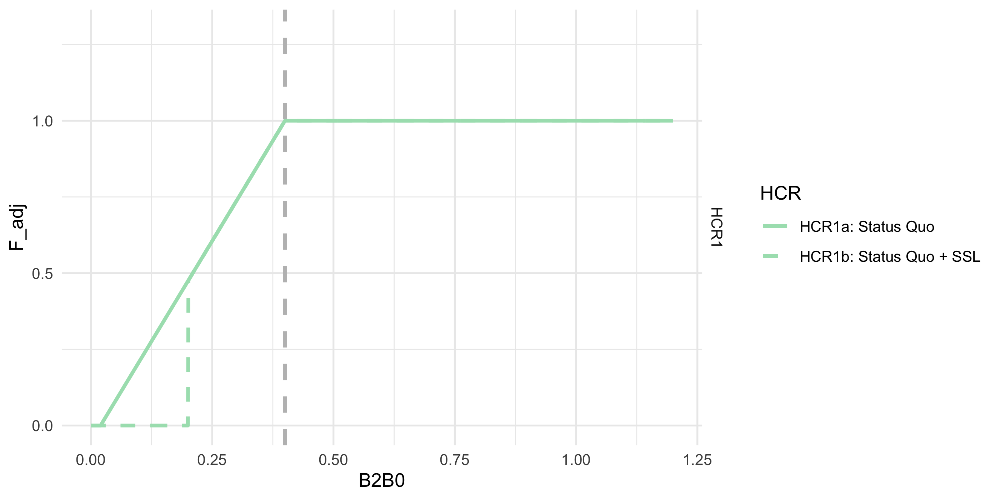
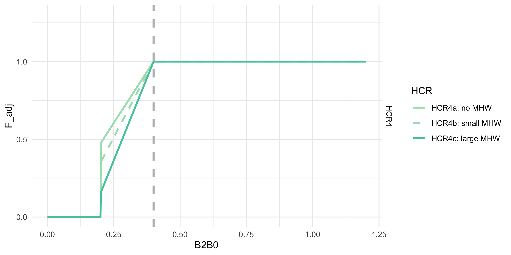
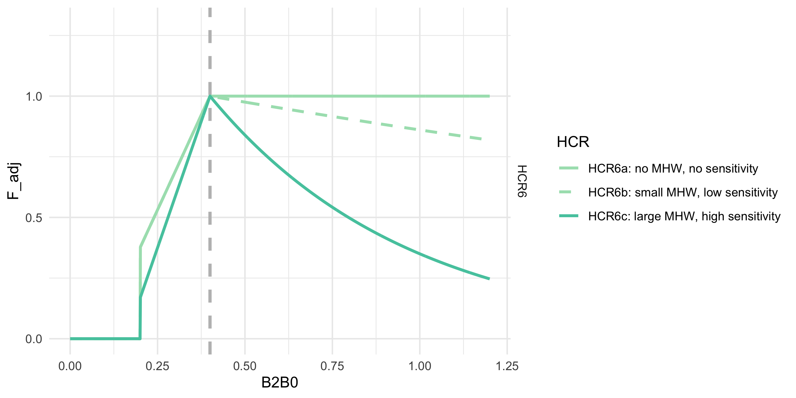

```{r setup, include=F, eval = TRUE, echo =F, results=F}

rootpth <- getwd()
 #setwd("D:/GitHub_cloud/ACLIM2")
 setwd("../../")
 source("R/make.R")       # loads packages, data, setup, etc.
setwd(rootpth)
 knitr::opts_chunk$set(echo = TRUE)
library(ggplot2)
library(dplyr)
 library(viridis)

 plot_fn <- file.path(rootpth,"..","..","Figs","HCR_figs")
if(!dir.exists(plot_fn)) dir.create(plot_fn)

 
w     <- 4
hbase <- 2
sclr  <- 2
sclr2 <- .75

B0    <- 3e6  # hypothetical B0 from the stock assessment in 2015
B     <- seq(0,1.2,.001)*B0
B2B0  <- B/B0
Fabc  <- .3 # hypothetical F ABC as determined from the model


HCR_levels <-  c("HCR1a: Status Quo",
                 "HCR1b: Status Quo + SSL", 
                 "HCR2a: decline",
                 "HCR2b: lagged recovery",
                 "HCR3a: B50", 
                 "HCR3b: B50 + SSL", 
                 "HCR4a: no MHW",
                 "HCR4b: small MHW",
                 "HCR4c: large MHW",
                 "HCR5a: no sensitivity",
                 "HCR5b: low sensitivity",
                 # "HCR5c: medium sensitivity",
                 "HCR5c: high sensitivity",
                 "HCR6a: no MHW, no sensitivity",
                 "HCR6b: small MHW, low sensitivity",
                 "HCR6c: large MHW, high sensitivity",
                 "HCR7a: max productivity",
                 "HCR7b: SR cov effects",
                 "HCR7c: SR cov effects uneven omega")
HCRscen_levels <- paste0("HCR",1:7)
subtxt_levels <- c("a","b","c","d")
colset        <- viridis(length(HCRscen_levels), option = "mako", direction = -1,  begin = .15, end = .9)
lineset       <- c("solid","dashed","dotted","solid")
linesize      <- c(1,1,1,.7)

col_line <- data.frame(HCR = factor(HCR_levels,levels=HCR_levels),
                       HCRscen = factor(substr(HCR_levels,1,4),levels=HCRscen_levels),
                       subtxt  =  factor(substr(HCR_levels,5,5),levels=subtxt_levels))

col_line$col  <- colset[as.numeric(col_line$HCRscen)]
col_line$line <- lineset[as.numeric(col_line$subtxt)]
col_line$size <- linesize[as.numeric(col_line$subtxt)]

col_in  <- col_line$HCR; names(col_in)<-col_line$col  
line_in <- col_line$HCR; names(line_in)<-col_line$line  

plot_HCR <- function(dataIN, ylim = c(0,1.3) ){
  
  plotout <- 
    ggplot(dataIN)+
    geom_vline(aes(xintercept=B2B0_target),linetype="dashed",size=1.1, color="gray")+
    geom_line(aes(x=B2B0,y=F_adj,color=HCR,linetype = HCR),size=1)+
    facet_grid(HCRscen~.)+
    coord_cartesian(ylim = c(ylim[1],ylim[2]))+   
    theme_minimal()+    
    scale_color_manual(values = col_line$col)+   
    scale_size_manual(values = col_line$size)+   
    scale_linetype_manual(values = col_line$line)
  
  return(plotout)
}


```

**Overview**

During ACLIM phase 2 (2019-2022), modelers evaluated a suite of Harvest Control Scenarios (1-5), in 2025 we added two addition HCRs to the set. Below is a list of those standardized harvest control rules and the equations used to derive the curves. 

  ABC+HCR 1: Status quo  
  ABC+HCR 2: Lagged recovery to estimate emergency relief financing needs  
  ABC+HCR 3: Long-term resilience (stronger reserve) $F_{target}$  
  ABC+HCR 4: CE informed sloping rate, e.g., MHW category alpha  
  ABC+HCR 5: climate sensitivity reserve (buffer shocks)  
  ABC+HCR 6: MHW slope + climate sensitivity reserve (buffer shocks)  
  ABC+HCR 6: Recruit per spawner biomass variability adjusted HCR based on analyses by Spencer et al. in prep  

# ABC+HCR 1: Status quo

This is the basic sloping harvest control rule for groundfish in the EBS. There is a B20% cut-off for SSL (Atka, pollock, P. cod). $F_{ABC_{max}}$ is the HCR adjusted F rate that corresponds to ABC. The Tier three approach is to set the slope of the sloping HCR to $\alpha = 0.05$ and $B_{lim} = 0$ and $B_{target} = B_{40\%}$ or $B_{target} = 0.4B_{100\%}$ (i.e., 40\% of unfished biomass $B_{100\%}$, as an MSY proxy) for most species except $B_{lim} = B_{20\%}$ for pollock and Pacific cod.

Eq. 1 $$F_{ABC_{max}} = \begin{array}{ll}  
 F_{ABC} &~~~~~~~~ \frac{B_y}{B_{target}}>1 \\  
 F_{ABC}((\frac{B_y}{B_{target}}-\alpha)/(1-\alpha)) &~~~~~~~~ \frac{B_y}{B_{target}} < 1 \leq B_{lim} \\  
 0 &~~~~~~~~ \frac{B_y}{B_{target}} < B_{lim}  
 \end{array}$$  


```{r HCR1, include=F,Eval=T, echo=F, results =F}

typeIN <- 1
# Fadjustment to F_abc, i.e., sloping HCR
F_adj <- unlist(lapply(B2B0, ACLIM_HCR, type=typeIN, alpha = 0.05, B2B0_lim = 0.2, B2B0_target=0.4))

plotdat1 <- rbind(data.frame(B2B0=B2B0,
                      F_adj =unlist(lapply(B2B0, ACLIM_HCR, type=typeIN,
                      alpha = 0.05, B2B0_lim = 0.0, B2B0_target=0.4)), 
                      alpha = 0.05, B2B0_lim = 0.0, B2B0_target=0.4, 
                      HCR = "HCR1a: Status Quo" , HCRscen="HCR1", subtxt = "a"),
                 data.frame(B2B0=B2B0, 
                            F_adj = unlist(lapply(B2B0, ACLIM_HCR, type=typeIN,
                      alpha = 0.05, B2B0_lim = 0.2, B2B0_target=0.4)),
                      alpha = 0.05, B2B0_lim = 0.2, B2B0_target=0.4, 
                      HCR = "HCR1b: Status Quo + SSL", HCRscen="HCR1", subtxt = "b"))%>%
  mutate(HCR = factor(HCR,levels=HCR_levels),
         HCRscen = factor(HCRscen,levels=HCRscen_levels),
         subtxt = factor(subtxt,levels=subtxt_levels))#%>%left_join(col_line)

i <- 1
p_HCR1 <- plot_HCR(plotdat1)

h <- hbase
png(file.path(plot_fn,"HCR1.png"),  width = w*sclr, height = h*sclr, units = "in",res = 350)
print(p_HCR1)
dev.off()


plot_out <- list(p_HCR1)


```

{width="80%"}

# ABC+HCR 2: Lagged recovery to estimate emergency relief financing needs

This simulation set will help us estimate the approximate cost of emergency relief funds by artificially closing the fishery at $B_{25\%}$% (mimicking an enconomic driven closure). During recovery to mimick lagged fishery recovery from a closure shock, we further delay F rate by inducing a stronger alpha during the recovery period. Implementation of this would be to shorten the recovery period following a shock through a "rainy day" fund to supplement the fishery during climate shocks.

This is the same as in HCR 1 except that the fishery shuts down earlier at $B_{lim} = B_{25\%}  $ and during the simulated lagged recovery the alpha is steeper (slower recovery; $\alpha = 0.30$ instead of $\alpha = 0.05$
 
Details: Sloping HCR, $B_{target} = B_{40\%}$  $\alpha = 0.05$, $B_{lim} = B_{25\%}$, i.e., the cutoff to initiate emergency \$ and a steeper $\alpha = 0.30$ during recovery (recovery occurs at $B_{40\%}$). Calculate difference in catch relative to HCR1 to get an estimate of what \$ relief would be needed to supplement the fishery. Apply a steeper slope (alpha) on recovery.

Eq. 1 $$F_{ABC_{max}} = \begin{array}{ll}  
 F_{ABC} &~~~~~~~~ \frac{B_y}{B_{target}}>1 \\  
 F_{ABC}((\frac{B_y}{B_{target}}-\hat\alpha_y)/(1-\hat\alpha_y)) &~~~~~~~~ \frac{B_y}{B_{target}} < 1 \leq B_{lim} \\ 
 0 &~~~~~~~~ \frac{B_y}{B_{target}} < B_{lim}  
 \end{array}$$
 
 and,
 
 $$
 \hat\alpha_y =\{ \begin{array}{ll}  
\alpha & if~~\hat\alpha_{y-1} = \alpha ~~|~~ \frac{B_y}{B_{target}} \geq B_{target} \\  
\alpha_{r} &if ~~\hat\alpha_{y-1} = \alpha_{r} ~~|~~ \frac{B_y}{B_{target}} \lt B_{low} \\  
 \end{array}
 $$  

For ACLIM HCR2 model runs we set $\alpha$ to 0.05 and $\alpha_{r}$ to 0.3, whith $ B_{low}$ = $ B_{lim}$ at 0.25.

```{r HCR2, include=F,Eval=T, echo=F, results =F}

typeIN <- 2
# Fadjustment to F_abc, i.e., sloping HCR
F_adj <- unlist(lapply(B2B0, ACLIM_HCR, type=typeIN, alpha = 0.05, B2B0_lim = 0.2, B2B0_target=0.4))

plotdat2 <- rbind(data.frame(B2B0=B2B0,
                      F_adj =unlist(lapply(B2B0, ACLIM_HCR, type=typeIN,
                      alpha = 0.05, B2B0_lim = 0.25, B2B0_target=0.4)), 
                      alpha = 0.05, B2B0_lim = 0.25, B2B0_target=0.4, 
                      HCR = "HCR2a: decline" , HCRscen="HCR2", subtxt = "a"),
                 data.frame(B2B0=B2B0, 
                            F_adj = unlist(lapply(B2B0, ACLIM_HCR, type=typeIN,
                      alpha = 0.3, B2B0_lim = 0.25, B2B0_target=0.4)),
                      alpha = 0.3, B2B0_lim = 0.25, B2B0_target=0.4, 
                      HCR = "HCR2b: lagged recovery", HCRscen="HCR2", subtxt = "b"))%>%
  mutate(HCR = factor(HCR,levels=HCR_levels),
         HCRscen = factor(HCRscen,levels=HCRscen_levels),
         subtxt = factor(subtxt,levels=subtxt_levels))

                 
i<-2
p <-  plot_HCR(rbind(plotdat1,plotdat2))


h <- hbase*i*.5
png(file.path(plot_fn,"HCR1TO2.png"),  width = w*sclr, height = h*sclr, units = "in",res = 350)
print(p)
dev.off()

p_HCR2 <- plot_HCR(plotdat2)

h <- hbase
png(file.path(plot_fn,"HCR2.png"),  width = w*sclr, height = h*sclr, units = "in",res = 350)
print(p_HCR2)
dev.off()

plot_out <- list(p_HCR1,p_HCR2)


```

{width="80%"}


# ABC+HCR 3: Long-term resilience (stronger reserve) Ftarget

This is the same as in HCR 1 except that the fishery shuts down earlier at $B_{target} = B_{50\%}$ and during the simulated lagged recovey the alpha is steeper (slower recovery; $\alpha = 0.30$ instead of $\alpha = 0.05$.

Details: Set the target to 50% of $B_{100\%}$ instead of 40% B40 ($\alpha = 0.05$, $B_{lim} = B_{20\%}$, $B_{target} = B_{50\%}$). We’re testing whether this would result in more stable biomass levels and catches.

```{r HCR3,include=F,eval=T,echo=F, results=F}


typeIN <- 3


plotdat3 <- rbind(data.frame(B2B0=B2B0,
                      F_adj =unlist(lapply(B2B0, ACLIM_HCR, type=typeIN,
                      alpha = 0.05, B2B0_lim = 0.0, B2B0_target=0.5)), 
                      alpha = 0.05, B2B0_lim = 0.0, B2B0_target=0.5, 
                      HCR = "HCR3a: B50" , HCRscen="HCR3", subtxt = "a"),
                 data.frame(B2B0=B2B0, 
                            F_adj = unlist(lapply(B2B0, ACLIM_HCR, type=typeIN,
                      alpha = 0.05, B2B0_lim = 0.2, B2B0_target=0.5)),
                      alpha = 0.05, B2B0_lim = 0.2, B2B0_target=0.5,
                      HCR = "HCR3b: B50 + SSL", HCRscen="HCR3", subtxt = "b"))%>%
  mutate(HCR = factor(HCR,levels=HCR_levels),
         HCRscen = factor(HCRscen,levels=HCRscen_levels),
         subtxt = factor(subtxt,levels=subtxt_levels))


p <- plot_HCR(rbind(plotdat1,plotdat2,plotdat3))

i <- 3
h <- hbase*i*.5
png(file.path(plot_fn,"HCR1TO3.png"),  width = w*sclr, height = h*sclr, units = "in",res = 350)
print(p)
dev.off()

p_HCR3 <- plot_HCR(plotdat3)

i <- 3
h <- hbase
png(file.path(plot_fn,"HCR3.png"),  width = w*sclr, height = h*sclr, units = "in",res = 350)
print(p_HCR3)
dev.off()

plot_out <- list(p_HCR1,p_HCR2,p_HCR3)


```

{width="80%"}

# ABC+HCR 4: CE informed sloping rate, e.g., MHW category alpha

This is the same as in HCR 1 except that the proposed approach would scale back harvest rates faster below B_target for species that are climate sensitive, or during MHWs. 
Set the target to 40\% of B_{100\%} ($\alpha = 0.05$, $B_{lim} = B_{20\%}$, $B_{target} = B_{40\%}$) for normal conditions/climate resilient species. But for other species, Below $B_{40\%}$ have steeper alphas based on MHW category forecasts for summer conditions ( or alternatively, climate vulnerability ratings). This reduces future harvest intensity when conditions are forecast to be poor and could help rebound stocks faster following MHW. MHWs are characterized as Category 1-4 based on the degree of anomalous conditions above mean climatology (Category 1 = +1 standard deviations above the mean climatology, Category 4 = +4 SD).

Details: Set the target to 40% of $B_{100\%}$, ($\alpha = 0.05+\mathrm{MHW}_{category}*.09$, $B_{lim} = B_{20\%}$, $B_{target} = B_{40\%}$). E.g., shown, Category 2 MHW set the $\alpha = 0.23$, for large MHW set the $\alpha = 0.41$. We’re testing whether this would result in more stable biomass levels and catches.

```{r HCR4,include=F,eval=T,echo=F, results=F}

typeIN <- 4
# Fadjustment to F_abc, i.e., sloping HCR
F_adj <- unlist(lapply(B2B0, ACLIM_HCR, type=typeIN,alpha = 0.05, B2B0_lim = 0.2, B2B0_target=0.4))


plotdat4 <- rbind(data.frame(B2B0=B2B0,
                      F_adj =unlist(lapply(
                        B2B0, ACLIM_HCR, type=typeIN,
                        alpha = 0.05, B2B0_lim = 0.2, B2B0_target=0.4)), 
                        alpha = 0.05, B2B0_lim = 0.2, B2B0_target=0.4, 
                      HCR = "HCR4a: no MHW" , HCRscen="HCR4", subtxt = "a"),
                 data.frame(B2B0=B2B0,
                          F_adj = unlist(lapply(B2B0, ACLIM_HCR, type=typeIN,
                        alpha = 0.23, B2B0_lim = 0.2, B2B0_target=0.4)),
                        alpha = 0.23, B2B0_lim = 0.2, B2B0_target=0.4, 
                        HCR = "HCR4b: small MHW", HCRscen="HCR4", subtxt = "b"),
                   data.frame(B2B0=B2B0,
                          F_adj = unlist(lapply(B2B0, ACLIM_HCR, type=typeIN,
                        alpha = 0.41, B2B0_lim = 0.2, B2B0_target=0.4)),
                        alpha = 0.41, B2B0_lim = 0.2, B2B0_target=0.4, 
                        HCR = "HCR4c: large MHW", HCRscen="HCR4", subtxt = "c"))%>%
  mutate(HCR = factor(HCR,levels=HCR_levels),
         HCRscen = factor(HCRscen,levels=HCRscen_levels),
         subtxt = factor(subtxt,levels=subtxt_levels))


p<-plot_HCR(rbind(plotdat1,plotdat2,plotdat3,plotdat4))

i <- 4
h <- hbase*i*.5
png(file.path(plot_fn,"HCR1TO4.png"),  width = w*sclr, height = h*sclr, units = "in",res = 350)
print(p)
dev.off()

p_HCR4<- plot_HCR(plotdat4)
    


h <- hbase
png(file.path(plot_fn,"HCR4.png"),  width = w*sclr, height = h*sclr, units = "in",res = 350)
print(p_HCR4)
dev.off()

plot_out <- list(p_HCR1,p_HCR2,p_HCR3,p_HCR4)


```

{width="80%"}

# ABC+HCR 5: climate sensitivity reserve (buffer shocks)

{width="85%"}


The general idea here is to combine the HCR 4 MHW category 0-4 scaling factor when below B_target (B40) and a cap-like effect when over $B_{target}$ The steepness of that cap effect could be varied based on vulnerability (or approximated via MSE), more sensitive species might need more reserve in the "bank". Pollock are an example of the HCR 5 in practice (via effects of the 2MT cap + sloping HCR).

Details: Set the target to 40\% of $B_{100\%}$ ($\alpha = 0.05$, $B_{lim} = B_{20\%}$, $B_{target} = B_{40\%}$).After $B_{40\%}$ have a slowly sloping F proportional to climate vulnerability (or MHW category) to mimic realized F rates of pollock under the 2 MT cap, i.e., reserve biomass for climate shocks sensu Holsman et al. 2020. This could use MHW decadal predictions to set the right hand side of the curve above $B_{40\%}$.In this the climate sensitivitiy buffer $\gamma$ is a value 0 to 1 that scales the reserve for biomass above $B_{target}$, i.e., $B_{40\%}$:


Eq. 1 $$F_{ABC_{max}} = \begin{array}{lll}  
 F_{ABC}\ e^{(-\gamma(\frac{B_y}{B_{target}}-1))} &~~~~~~~~\frac{B_y}{B_{target}}>1, ~~\mathrm{and}~~ \gamma < \frac{B_y}{B_{target}}\\ 
 F_{ABC}((\frac{B_y}{B_{target}}-\alpha)/(1-\alpha)) &~~~~~~~~ \frac{B_y}{B_{target}} < 1 \leq B_{lim} \\  
 0 &~~~~~~~~ \frac{B_y}{B_{target}} < B_{lim}  
 \end{array}
 $$  
 
 
Details: Set the target to 40% of $B_{100\%}$, ($\alpha = 0.05$, $B_{lim} = B_{20\%}$, $B_{target} = B_{40\%}$). Shown, for low sensitivity stocks set $\gamma = 0.1$, for highly sensitive stocks set $\gamma = 0.7$. We’re testing whether this would result in more stable biomass levels and catches through shocks.


```{r HCR5,include=F,eval=T,echo=F, results=F}


typeIN <- 5
plotdat5 <- rbind(data.frame(B2B0=B2B0,
                       F_adj = unlist(lapply(B2B0, ACLIM_HCR, type=typeIN,
                      gamma=0, 
                      alpha = 0.05, B2B0_lim = 0.2, B2B0_target=0.4)),
                      alpha = 0.05, B2B0_lim = 0.2, B2B0_target=0.4, 
                      HCR = "HCR5a: no sensitivity" , HCRscen="HCR5", subtxt = "a"),
                   data.frame(B2B0=B2B0, 
                      F_adj = unlist(lapply(B2B0, ACLIM_HCR, type=typeIN,
                      gamma=.1, 
                      alpha = 0.05, B2B0_lim = 0.2, B2B0_target=0.4)),
                      alpha = 0.05, B2B0_lim = 0.2, B2B0_target=0.4, 
                      HCR = "HCR5b: low sensitivity", HCRscen="HCR5", subtxt = "b"),
                   # data.frame(B2B0=B2B0, 
                   #          F_adj = unlist(lapply(B2B0, ACLIM_HCR, type=typeIN,
                   #    gamma=.3, 
                   #    alpha = 0.05, B2B0_lim = 0.2, B2B0_target=0.4)),
                   #    alpha = 0.05, B2B0_lim = 0.2, B2B0_target=0.4, 
                   #    HCR = "HCR5c: medium sensitivity", HCRscen="HCR5", subtxt = "c"),
                 data.frame(B2B0=B2B0, 
                            F_adj = unlist(lapply(B2B0, ACLIM_HCR, type=typeIN,
                      gamma=.7, 
                      alpha = 0.05, B2B0_lim = 0.2, B2B0_target=0.4)),
                      alpha = 0.05, B2B0_lim = 0.2, B2B0_target=0.4, 
                       HCR = "HCR5c: high sensitivity", HCRscen="HCR5", subtxt = "c"))%>%
  mutate(HCR = factor(HCR,levels=HCR_levels),
         HCRscen = factor(HCRscen,levels=HCRscen_levels),
         subtxt = factor(subtxt,levels=subtxt_levels))


p <- plot_HCR(rbind(plotdat1,plotdat2,plotdat3,plotdat4,plotdat5))
    
i <- 5
h <- hbase*i*.5*.5
png(file.path(plot_fn,"HCR1to5.png"),  width = w*sclr, height = h*sclr, units = "in",res = 350)
print(p)
dev.off()

plot_out <- list(p_HCR1,p_HCR2,p_HCR3)

p_HCR5 <-plot_HCR(plotdat5)

i <- 3
h <- hbase
png(file.path(plot_fn,"HCR5.png"),  width = w*sclr, height = h*sclr, units = "in",res = 350)
print(p_HCR5)
dev.off()

plot_out <- list(p_HCR1,p_HCR2,p_HCR3,p_HCR4,p_HCR5)


```
 
{width="80%"}


# ABC+HCR 6: MHW slope + climate sensitivity reserve (buffer shocks)

```{r HCR6,include=F,eval=T,echo=F, results=F}
typeIN <- 6

plotdat6 <- rbind(data.frame(B2B0=B2B0,
                      F_adj = unlist(lapply(B2B0, ACLIM_HCR, type=typeIN,
                      gamma= 0, 
                      alpha = 0.2, B2B0_lim = 0.2, B2B0_target=0.4)),
                      alpha = 0.2, B2B0_lim = 0.2, B2B0_target=0.4, 
                      HCR = "HCR6a: no MHW, no sensitivity" , HCRscen="HCR6", subtxt = "a"),
                   data.frame(B2B0=B2B0, 
                            F_adj = unlist(lapply(B2B0, ACLIM_HCR, type=typeIN,
                      gamma=.1, 
                      alpha = 0.2, B2B0_lim = 0.2, B2B0_target=0.4)),
                      alpha = 0.2, B2B0_lim = 0.2, B2B0_target=0.4, 
                      HCR = "HCR6b: small MHW, low sensitivity", HCRscen="HCR6", subtxt = "b"),
            
                 data.frame(B2B0=B2B0, 
                            F_adj = unlist(lapply(B2B0, ACLIM_HCR, type=typeIN,
                      gamma=.7, 
                      alpha = 0.4, B2B0_lim = 0.2, B2B0_target=0.4)),
                      alpha = 0.4, B2B0_lim = 0.2, B2B0_target=0.4, 
                       HCR = "HCR6c: large MHW, high sensitivity", HCRscen="HCR6", subtxt = "c"))%>%
  mutate(HCR = factor(HCR,levels=HCR_levels),
         HCRscen = factor(HCRscen,levels=HCRscen_levels),
         subtxt = factor(subtxt,levels=subtxt_levels))


p <- plot_HCR(rbind(plotdat1,plotdat2,plotdat3,plotdat4,plotdat5,plotdat6))
    
  
i <- 6
h <- hbase*i*.5*.5
png(file.path(plot_fn,"HCR1to6.png"),  width = w*sclr, height = h*sclr, units = "in",res = 350)
print(p)
dev.off()

p_HCR6 <-plot_HCR(plotdat6)
    
i <- 3
h <- hbase
png(file.path(plot_fn,"HCR6.png"),  width = w*sclr, height = h*sclr, units = "in",res = 350)
print(p_HCR6)
dev.off()

plot_out <- list(p_HCR1,p_HCR2,p_HCR3,p_HCR4,p_HCR5,p_HCR6)


```


Here we are exploring the combination of HCR 4 and HCR 5, values are as specified in those scenarios.

{width="80%"}


# ABC+HCR 7:Recruit per spawner biomass variability adjusted HCR based on analyses by Spencer et al. in prep


$$F_{ABC_{max}} = \begin{array}{ll}  
 F_{ABC} &~~~~~~~~ \hat{B}>1 \\  
 F_{ABC}((\hat{B}-\alpha_)/(1-\alpha)) &~~~~~~~~ \hat{B} < 1 \leq B_{lim} \\ 
 0 &~~~~~~~~ \hat{B} < B_{lim}  
 \end{array}$$
 
 where $F_{ABC}$ is adjusted by covariate $x_y$ according the parameter $\omega_1$ and $\frac{B_y}{B_{target}}$ is adjusted basedon the parameter $\omega_2$ such that:
 
 $$ F_{ABC} =  F_{ABC}e^{(-\omega_1*\mathrm{x_y})}$$   
 and,
 
 $$ \hat{B} = \frac{B_y}{B_{target}}e^{(-\omega_2*\mathrm{x_y})}$$  

For the ACLIM HCR 7 simulations $\omega_1$ and $\omega_2$  were fit using retrospecitve analyses of spawner recruitment relationships across SST ($x_y$) on EBS pollock by Spencer et al. in prep. Values for  $\omega_1$ and $\omega_2$ were set to 0.3 and 0.7, respectively.

 
```{r HCR7,include=F,eval=T,echo=F, results=F}
typeIN <- 7

plotdat7 <- rbind(data.frame(B2B0=B2B0,
                      F_adj = unlist(lapply(B2B0, ACLIM_HCR, type=typeIN,
                      gamma= 0, 
                      omega1  = 0, omega2 = 0, cov =.7,
                      alpha = 0.05, B2B0_lim = 0.2, B2B0_target=0.4)),
                      alpha = 0.05, B2B0_lim = 0.2, B2B0_target=0.4, 
                      HCR = "HCR7a: max productivity" , HCRscen="HCR7", subtxt = "a"),
                data.frame(B2B0=B2B0,
                      F_adj = unlist(lapply(B2B0, ACLIM_HCR, type=typeIN,
                      gamma= 0,
                      omega1  = .7, omega2  = .7, cov =.7,
                      alpha = 0.05, B2B0_lim = 0.2, B2B0_target=0.4)),
                      alpha = 0.05, B2B0_lim = 0.2, B2B0_target=0.4, 
                      HCR = "HCR7b: SR cov effects", HCRscen="HCR7", subtxt = "b"),
                   data.frame(B2B0=B2B0,
                      F_adj = unlist(lapply(B2B0, ACLIM_HCR, type=typeIN,
                      gamma= 0,
                      omega1  = .3, omega2  = .7, cov =.7,
                      alpha = 0.05, B2B0_lim = 0.2, B2B0_target=0.4)),
                      alpha = 0.05, B2B0_lim = 0.2, B2B0_target=0.4, 
                      HCR = "HCR7c: SR cov effects uneven omega", HCRscen="HCR7", subtxt = "c"))%>%
  mutate(HCR = factor(HCR,levels=HCR_levels),
         HCRscen = factor(HCRscen,levels=HCRscen_levels),
         subtxt = factor(subtxt,levels=subtxt_levels))


p <- plot_HCR(rbind(plotdat1,plotdat2,plotdat3,plotdat4,plotdat5,plotdat6,plotdat7))
   
  
i <- 7
h <- hbase*i*.5*.5
png(file.path(plot_fn,"HCR1to7.png"),  width = w*sclr, height = h*sclr, units = "in",res = 350)
print(p)
dev.off()

plot_out <- list(p_HCR1,p_HCR2,p_HCR3)

p_HCR7<-plot_HCR(plotdat7)

  

i <- 3
h <- hbase
png(file.path(plot_fn,"HCR7.png"),  width = w*sclr, height = h*sclr, units = "in",res = 350)
print(p_HCR7)
dev.off()

plot_out <- list(p_HCR1,p_HCR2,p_HCR3,p_HCR4,p_HCR5,p_HCR6,p_HCR7)


```

{width="80%"}

{width="80%"}
