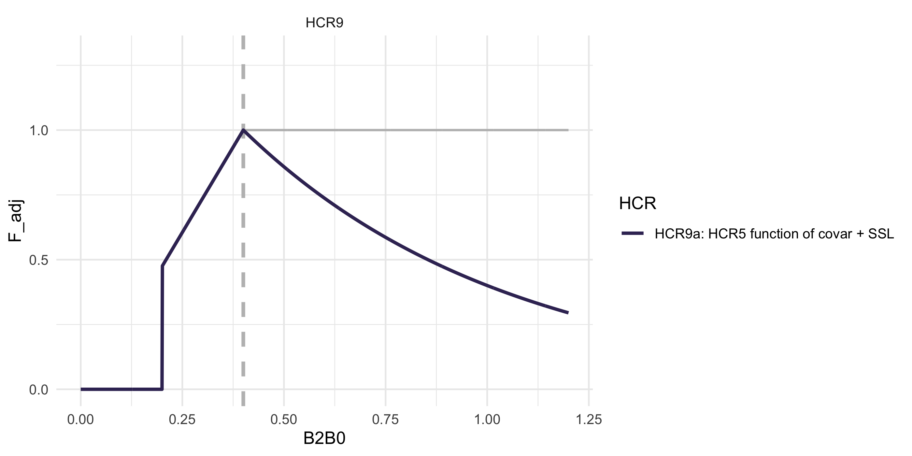
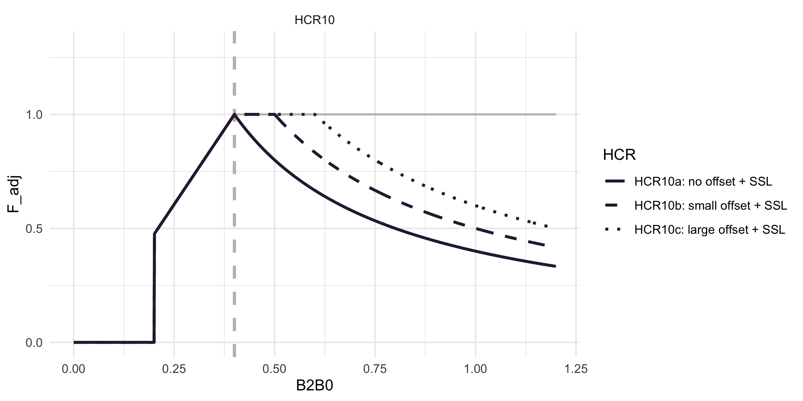
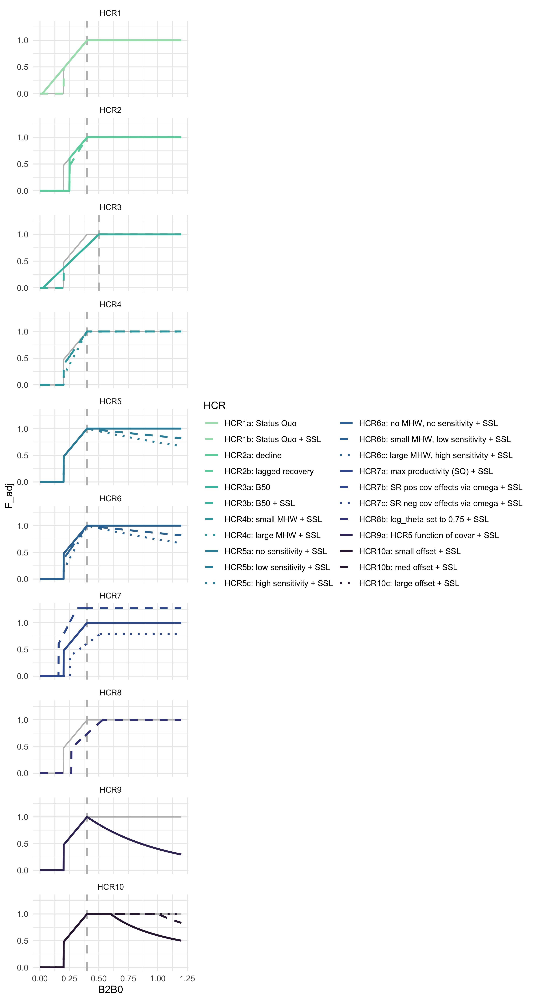

**Overview**

This document serves as an white paper outlining the current set of HCRs under consideration for simulation testing by the ACLIM and GOACLIM teams. This document is informational only and HCRs outlined here are not "recommended HCRs", rather alternative formulations being evaluated for increased performance through coordinated modeling in 2025. Any evaluation of HCRs to be implemented for management purposes would be done by the NPFM Council through the established Council process. The set below builds on previous modeling efforts. During ACLIM phase 2 (2019-2022), modelers evaluated a suite of Harvest Control Scenarios (1-5), in 2025 during phase 3 of the ACLIM project and in collaboration with GOA-CLIM phase 2 we added a number of additional HCRs to the set. Below is a list of those standardized harvest control rules and the equations used to derive the curves. An interactive version of these HCRs is available on line at [https://kholsman.shinyapps.io/HCRshiny/](https://kholsman.shinyapps.io/HCRshiny/)

<!-- ABC+HCR 1: Status quo   -->
<!-- ABC+HCR 2: Lagged recovery to estimate emergency relief financing needs   -->
<!-- ABC+HCR 3: Long-term resilience (stronger reserve) $F_{target}$   -->
<!-- ABC+HCR 4: Environmental index informed sloping rate, e.g., MHW category alpha   -->
<!-- ABC+HCR 5: Maximize productivity/ increased reserve (buffer shocks)   -->
<!-- ABC+HCR 6: Combination of MHW (HCR4) + Maximize productivity (HCR5)   -->
<!-- ABC+HCR 7: Risk Table Bridging: R/S variability covariate adjusted HCR   -->
<!-- ABC+HCR 8: Adjust effective spawning biomass (simulate adjusted B_target)   -->
<!-- ABC+HCR 9: Forecast informed version of HCR 5   -->
<!-- ABC+HCR 10: Maximize productivity/increased reserve (HCR5), linear version (1/ B_target) with offset -->

<table class="table table-striped table-hover" style="width: auto !important; margin-left: auto; margin-right: auto;">
<caption>Overview of ACLIM and GOACLIM 2025 HCR options.</caption>
 <thead>
  <tr>
   <th style="text-align:left;"> HCR </th>
   <th style="text-align:left;"> Goal </th>
  </tr>
 </thead>
<tbody>
  <tr>
   <td style="text-align:left;width: 15em; "> ABC+HCR 1: Status quo </td>
   <td style="text-align:left;width: 25em; "> This HCR is the baseline sloping harvest control rule used for groundfish in Alaska </td>
  </tr>
  <tr>
   <td style="text-align:left;width: 15em; "> ABC+HCR 2: Lagged recovery to estimate emergency relief financing needs </td>
   <td style="text-align:left;width: 25em; "> Simulations with this HCR will mimic economic-driven fishery closures and delayed recovery in order to estimate emergency relief needs. </td>
  </tr>
  <tr>
   <td style="text-align:left;width: 15em; "> ABC+HCR 3: Long-term resilience (stronger reserve) B_target </td>
   <td style="text-align:left;width: 25em; "> This HCR aims to enhance long-term stock resilience by adjusting B_target (as a proportion of unfished biomass) </td>
  </tr>
  <tr>
   <td style="text-align:left;width: 15em; "> ABC+HCR 4: Environmental index informed sloping rate, e.g., MHW category alpha </td>
   <td style="text-align:left;width: 25em; "> Simulations with this HCR will assess whether adjusting harvest intensity based on poor forecasted conditions—such as marine heatwaves—can accelerate stock recovery following climate or environmental disturbances. </td>
  </tr>
  <tr>
   <td style="text-align:left;width: 15em; "> ABC+HCR 5: Maximize productivity/ increased reserve (buffer shocks) </td>
   <td style="text-align:left;width: 25em; "> HCR 5 is designed to maximize ecosystem and spawning biomass productivity by increasing reserves, creating a buffer against environmental shocks and enhancing long-term sustainability. </td>
  </tr>
  <tr>
   <td style="text-align:left;width: 15em; "> ABC+HCR 6: Combination of MHW (HCR4) + Maximize productivity (HCR5) </td>
   <td style="text-align:left;width: 25em; "> This HCR combines the approaches of HCR 4 and HCR 5 to address both immediate and long-term environmental impacts. </td>
  </tr>
  <tr>
   <td style="text-align:left;width: 15em; "> ABC+HCR 7: Risk Table Bridging: R/S variability covariate adjusted HCR </td>
   <td style="text-align:left;width: 25em; "> This HCR provides a way to transition from qualitative risk tables to a more explicit, analytical approach for species whose productivity is known to vary with environmental conditions. </td>
  </tr>
  <tr>
   <td style="text-align:left;width: 15em; "> ABC+HCR 8: Adjust effective spawning biomass (simulate adjusted B_target) </td>
   <td style="text-align:left;width: 25em; "> This HCR adjusts the effective spawning biomass instead of the target biomass threshold, serving as a sensitivity approach to explore variability in spawning stock biomass (SSB) estimates within a given assessment year or to evaluate alternative B_target values. </td>
  </tr>
  <tr>
   <td style="text-align:left;width: 15em; "> ABC+HCR 9: Forecast informed version of HCR 5 </td>
   <td style="text-align:left;width: 25em; "> This HCR builds on HCR 5 by using environmental forecasts to dynamically adjust reserves, enhancing ecosystem productivity and resilience to environmental shocks. </td>
  </tr>
  <tr>
   <td style="text-align:left;width: 15em; "> ABC+HCR 10: Maximize productivity/increased reserve (HCR5), linear version (1/ B_target) with offset </td>
   <td style="text-align:left;width: 25em; "> This HCR builds on HCR 5 by applying a proportional reduction in fishing mortality based on biomass levels, further enhancing stock and environmental productivity through strengthening the buffer against environmental shocks. </td>
  </tr>
</tbody>
</table>

# ABC+HCR 1: Status quo

**Simulation goal:** This HCR is the baseline sloping harvest control rule used for groundfish in Alaska.

This is the basic sloping harvest control rule for groundfish in the EBS (Eq. \@ref(eq:HCR1eq) ). There is a B20% cut-off for SSL (Atka, pollock, P. cod). $F_{ABC_{max}}$ is the HCR adjusted F rate that corresponds to ABC. The Tier three approach is to set the slope of the sloping HCR to $\alpha$ = 0.05 and $B_{lim} = 0$ and $B_{target} = B_{40\%}$ or $B_{target}$ = 0.4 $B_{0}$ (i.e., 40% of unfished biomass $B_{0}$, as an MSY proxy) for most species except $B_{lim} = 0.2B_{0}$ ($B_{20\%}$) for pollock and Pacific cod .

\begin{equation} 
  F_{ABC_{max}} =\Biggl[~
  \begin{array}{ll}  
   F_{ABC} &~~~~~~~~ \frac{B_y}{B_{target}}>1 \\  
   F_{ABC}((\frac{B_y}{B_{target}}-\alpha)/(1-\alpha)) &~~~~~~~~   \frac{B_{lim}}{B_{target}} \le \frac{B_y}{B_{target}} < 1\\  
   0 &~~~~~~~~ \frac{B_y}{B_{target}}< \frac{B_{lim}}{B_{target}} 
   \end{array}(\#eq:HCR1eq)
\end{equation}

{width="80%"}

# ABC+HCR 2: Lagged recovery to estimate emergency relief financing needs

**Simulation goal:** Simulations with this HCR will mimic economic-driven fishery closures and delayed recovery in order to estimate emergency relief needs..

This HCR formulation will help us estimate the approximate cost of needed emergency relief funds by simulating an an economic-driven fishery closure due to increased CPUE at low biomass, in this case $B_{25\%}$  (Eq.\@ref(eq:HCR2eq)). To mimic lagged fishery recovery from a closure shock, we further delay harvest recovery by adjusting F rate using a larger alpha during the recovery period (Eq.\@ref(eq:HCR2beq)). Implementation of this would be used to sum the difference in revenue between HCR2 and HCR1 to shorten the recovery period following a shock, e.g., by using the estimate to build a "rainy day" fund to supplement the fishery during climate shocks.

This is the same as in HCR 1 except that the fishery shuts down earlier at $B_{lim} = B_{25\%}$ and during the simulated lagged recovery the alpha is steeper (slower recovery; $\alpha = 0.30$ instead of $\alpha = 0.05$). 

**Details:** Sloping HCR with $B_{target} = B_{40\%}$ $\alpha = 0.05$, $B\_{lim} = $,0.25 i.e., the cutoff to simulate where one might initiate emergency \$ (i.e., simulate the fishery stopping operations at 0.25 due to CPUE and cost limitations, well before management closes the fishery based on SSB) and a steeper $\alpha = $ 0.3 to simulate a lagged recovery (recovery occurs at $B_{40\%}$). Calculate difference in catch relative to HCR1 to get an estimate of what \$ relief ("rainy day fund") would be needed to supplement the fishery in closures.

\begin{equation}
F_{ABC_{max}} =\Biggl[~
   \begin{array}{ll}  
     F_{ABC} &~~~~~~~~ \frac{B_y}{B_{target}}>1 \\  
     F_{ABC}((\frac{B_y}{B_{target}}-\hat\alpha_y)/(1-\hat\alpha_y)) &~~~~~~~~   \frac{B_{lim}}{B_{target}} \le \frac{B_y}{B_{target}} < 1\\  
     0 &~~~~~~~~ \frac{B_y}{B_{target}}< \frac{B_{lim}}{B_{target}} 
 \end{array}(\#eq:HCR2eq)
\end{equation}

where,

\begin{equation}
\hat{\alpha}_y =\Biggl[~
 \begin{array}{ll}  
     \alpha & if~~\hat{\alpha}_{y-1} = \alpha ~~~\|~~ \frac{B_y}{B_{target}} \geq 1 \\   
     \alpha_{r} & if ~~\hat{\alpha}_{y-1} = \alpha_{r} ~~\|~~ \frac{B_y}{B_{target}} < \frac{B_{low}}{B_{target}} \\
  \end{array}(\#eq:HCR2beq)
\end{equation}

{width="80%"}

# ABC+HCR 3: Long-term resilience (stronger reserve) B_target

**Simulation goal:** This HCR aims to enhance long-term stock resilience by adjusting B_target (as a proportion of unfished biomass).

This is the same as in HCR1 (Eq.\@ref(eq:HCR1eq)) except that $B_{target} = B_{50\%}$.

**Details:** For HCR3a, set parameters to those as in HCR1a ($\alpha$ = 0.05, $B_{lim}$ = 0) except set $B_{target}$ to 50% of $B_{0}$ instead of 40% $B_{0}$ . For HCR3b, use the same approach but set the $B_{lim}$ to 20% of $B_{0}$ for amendment 80 species. Here, we are testing whether this would result in more stable biomass levels and catches over time and under alternative future conditions.

{width="80%"}

# ABC+HCR 4: Environmental index informed sloping rate, e.g., MHW category alpha

**Simulation goal:** Simulations with this HCR will assess whether adjusting harvest intensity based on poor forecasted conditions—such as marine heatwaves—can accelerate stock recovery following climate or environmental disturbances..

This is the same as in HCR1 (Eq.\@ref(eq:HCR1eq)) except that the proposed approach would scale back harvest rates faster below B_target for species that are sensitive to environmental indices of productivity, e.g., those that decline during MHWs. For this we set the target to 40% of $B_{0}$ ($\alpha = 0.05$, $B_{lim} = B_{20\%}$, $B_{target} = B_{40\%}$) for normal conditions or those species that are resilient to environmental and climate driven change. But for other species which exhibit high environmental sensitivity, we evaluate steeper alphas below $B_{40\%}$ based on MHW category forecasts for summer conditions ( or alternatively, climate vulnerability ratings).

**Details:** MHWs are characterized as Category 1-4 based on the degree of anomalous conditions above mean climatology (Category 1 = +1 standard deviations above the mean climatology, Category 4 = +4 SD). Set the target to 40% of $B_{0}$, ($\alpha = 0.05+\mathrm{MHW}_{category}*.09$, $B_{lim} = B_{20\%}$, $B_{target} = B_{40\%}$). E.g., shown, Category 2 MHW set the $\alpha$ = 0.1 \* 2 (for Category 2 MHW) = 0.2, for large MHW (category 4) set the $\alpha$ = 0.1 \* 4 = 0.4. We’re testing whether this would result in more stable biomass levels and catches.

{width="80%"}

# ABC+HCR 5: Maximize productivity/ increased reserve (buffer shocks)

**Simulation goal:** HCR 5 is designed to maximize ecosystem and spawning biomass productivity by increasing reserves, creating a buffer against environmental shocks and enhancing long-term sustainability..

The general idea here is to recreate the realized pollock cap effect on $F_{target}$ when over $B_{target}$ which has the potential effect of maximizing long-term ecosystem and stock productivity. The steepness of that cap effect could be varied based on vulnerability analyses (e.g., @Spencer2019; @Hare2016) (or approximated via MSE), more sensitive species might need more reserve in the "bank". Pollock are an example of the HCR 5 in practice (via effects of the 2MT cap + sloping HCR; @Holsman2020)
{width="85%"}

**Details:**  As in HCR1b (Eq.\@ref(eq:HCR1eq)), set the target to 40% of $B_{0}$ ($\alpha = 0.05$, $B_{lim} = B_{20\%}$, $B_{target} = B_{40\%}$).After $B_{40\%}$ have a slowly sloping F proportional to climate sensitivity to mimic realized F rates of pollock under the 2 MT cap. This approach is designed to maximize ecosystem productivity and build a reserve biomass for environmental or climate shocks (sensu @Holsman2020). In this (Eq.\@ref(eq:HCR5eq)) the climate sensitivity buffer $\gamma$ is a value \> 0 that controls the F decay rate (increase in reserve biomass) above $B_{target}$, i.e., $B_{40\%}$:

\begin{equation}
F_{ABC_{max}} =\Biggl[~ 
\begin{array}{lll}  
 F_{ABC}\ e^{(-\gamma(\frac{B_y}{B_{target}}-1))} &~~~~~~~~\frac{B_y}{B_{target}}>1\\ 
 F_{ABC}((\frac{B_y}{B_{target}}-\alpha)/(1-\alpha)) &~~~~~~~~ \frac{B_{lim}}{B_{target}} \le \frac{B_y}{B_{target}} < 1 \\  
  0 &~~~~~~~~ \frac{B_y}{B_{target}}< \frac{B_{lim}}{B_{target}} 
 \end{array}(\#eq:HCR5eq)
\end{equation}

where, $~~ 0 \le \gamma \le 1$.

Details: Set the biological reference points as in HCR1b, i.e., 40% of $B_{0}$, ($\alpha = 0.05$, $B_{lim} = B_{20\%}$, $B_{target} = B_{40\%}$). Above $B_{target}$ apply the gamma / 2MT cap effects. Shown, for low sensitivity stocks set $\gamma$ = 0.1, for highly sensitive stocks set $\gamma$ = 0.2. We’re testing whether this would result in more stable biomass levels and catches through shocks.

{width="80%"}

# ABC+HCR 6: Combination of MHW (HCR4) + Maximize productivity (HCR5)

**Simulation goal:** This HCR combines the approaches of HCR 4 and HCR 5 to address both immediate and long-term environmental impacts..

The general idea here is to combine the HCR 4 MHW category 0-4 scaling factor when below B_target (e.g., B40) and a cap-like effect when over $B_{target}$ (i.e., HCR 5, Eq.\@ref(eq:HCR5eq)); values are as specified in those scenarios.

**Details:** Set the target to 40% of $B_{0}$, ($\alpha = 0.05$, $B_{lim} = B_{20\%}$, $B_{target} = B_{40\%}$). Shown, for low sensitivity stocks set $\gamma$ = 0.1, for highly sensitive stocks set $\gamma$ = 0.2. Shown as well, category 2 MHW set the $\alpha$ = 0.2, for large MHW set the $\alpha$ = 0.4.

{width="80%"}

# ABC+HCR 7: Risk Table Bridging: R/S variability covariate adjusted HCR

**Simulation goal:** This HCR provides a way to transition from qualitative risk tables to a more explicit, analytical approach for species whose productivity is known to vary with environmental conditions..

This approach is based on recent analyses by P. Spencer (in prep) and translated to Tier 3 HCRs by K. Holsman. The general idea is to bridge Risk Table and ESP informed adjustments to ABC (as is done presently) using a more explicaity analystical solution in the HCR for those species where the relationship between changes in productivity and annual environmental indices are known. To do this we propose adjusting the HCR ref points based on variability in spawner-recruitment relationships using a covariate $X_y$ (e.g., SST) such that:

\begin{equation}
F_{ABC_{max}} =\Biggl[~
\begin{array}{ll}  
 F_{ABC}~e^{(\omega_1*\mathrm{x_y})} &~~~~~~~~ \frac{B_y}{\hat{B}_{target}}>1 \\  
 F_{ABC}((\frac{B_y}{\hat{B}_{target}}-\alpha)/(1-\alpha))~e^{(\omega_1*\mathrm{x_y})} &~~~~~~~~   \frac{B_y}{\hat{B}_{lim}} \le \frac{B_y}{\hat{B}_{target}} < 1\\  
 0 &~~~~~~~~ \frac{B_y}{\hat{B}_{target}}< \frac{\hat{B}_{lim}}{\hat{B}_{target}} 
 \end{array}(\#eq:HCR7eq)
\end{equation}

such that $F_{ABC}$ is adjusted by covariate $x_y$ according the parameter $\omega_1$ and $B_{target}$ and $B_{lim}$ are adjusted based on the parameters $\omega_2$ and $\omega_3$ such that:

$$\hat{B}_{target}  = B_{target}e^{(-\omega_2*\mathrm{x_y})}$$ and

$$\hat{B}_{lim}  = B_{lim}e^{(-\omega_3*\mathrm{x_y})}$$ and $\omega_1,~\omega_2~\mathrm{and}~~\omega_3 \ge0$. 

For the ACLIM HCR 7 simulations $\omega_1$ and $\omega_2$ will eventually be fit using retrospective analyses of spawner-recruitment relationships across scaled (z-scored) SST ($x_y$) on EBS pollock by Spencer et al. in prep. 

**Details:** Set the target to 40% of $B_{0}$ ($\alpha = 0.05$, $B_{lim} = B_{20\%}$, $B_{target} = B_{40\%}$). In the example below ($x_y$) = 2.4 and for case 7a all $\omega$ values were set to 0.0, in case 7b $\omega_1 = \omega_2 = \omega_3$ = 0.1, and in case 7c $\omega_1$ = -0.1, $\omega_2$ = -0.1, $\omega_3$ = -0.1.

{width="80%"}

# ABC+HCR 8: Adjust effective spawning biomass (simulate adjusted B_target)

**Simulation goal:** This HCR adjusts the effective spawning biomass instead of the target biomass threshold, serving as a sensitivity approach to explore variability in spawning stock biomass (SSB) estimates within a given assessment year or to evaluate alternative B_target values..

In this scenario, rather than adjust the target biomass from $B_{40\%}$ (as we do in HCR3), the effective $B_y$ and $B_{y+1}$ is adjusted downward using the following equation:

\begin{equation}
F_{ABC_{max}} =\Biggl[~ 
\begin{array}{ll}  
 F_{ABC} &~~~~~~~~ \frac{\hat{B}_y}{B_{target}}>1 \\  
 F_{ABC}((\frac{\hat{B}_y}{B_{target}}-\alpha)/(1-\alpha)) &~~~~~~~~   \frac{B_{lim}}{B_{target}} \le \frac{\hat{B}_y}{B_{target}} < 1\\  
 0 &~~~~~~~~ \frac{\hat{B}_y}{B_{target}}< \frac{B_{lim}}{B_{target}} 
 \end{array}(\#eq:HCR8eq)
 \end{equation}

where, $\hat{B}_y = \theta{B_y}$ and $\theta$ is a scaler on $B_y$ (could be set to a value or could be a function of environmental covariates).

**Details:** Set the target to 40% of $B_{0}$ ($\alpha = 0.05$, $B_{lim} = B_{20\%}$, $B_{target} = B_{40\%}$). In the example below ($x_y$) = 2.4 and for case 8a all $\theta$ is set to 1, in case 8b $\theta$ = 0.8.

{width="80%"}

# ABC+HCR 9: Forecast informed version of HCR 5

**Simulation goal:** This HCR builds on HCR 5 by using environmental forecasts to dynamically adjust reserves, enhancing ecosystem productivity and resilience to environmental shocks..

As in HCR 5 (Eq.\@ref(eq:HCR5eq)) and 6 the approach here is to recreate the effect on pollock F rates when over $B_{target}$. The steepness of that cap effect here is tied to z-score scaled forecasted conditions $X_y$ (e.g., next year SST, shown below as increased ecosystem productivity or larger age class reserve when SST is warmer than average over a period of time or when an average index for MHW categories forecasted for the next 5 years). In this species that are more closely tied to ecosystem productivity (forage) or those who are more sensitive to environmental changes, might need a stronger gamma to drive a larger age class reserve in the "bank" or more ecosystem productivity to weather environmental events. Pollock are an example of the HCR 5 in practice (via effects of the 2MT cap + sloping HCR).

\begin{equation}
F_{ABC_{max}} =\Biggl[~ 
\begin{array}{lll}  
 F_{ABC}\ e^{(-\gamma(\mathrm{inv.logit}(-X_y)/.5)(\frac{B_y}{B_{target}}-1))} &~~~~~~~~\frac{B_y}{B_{target}}>1\\ 
 F_{ABC}((\frac{B_y}{B_{target}}-\alpha)/(1-\alpha)) &~~~~~~~~ \frac{B_{lim}}{B_{target}} \le \frac{B_y}{B_{target}} < 1 \\  
  0 &~~~~~~~~ \frac{B_y}{B_{target}}< \frac{B_{lim}}{B_{target}} 
 \end{array}(\#eq:HCR9eq)
 \end{equation}

where, $~~ 0 \le \gamma \le 1$.

**Details:** As in HCR1b (Eq.\@ref(eq:HCR1eq)), set the target to 40% of $B_{0}$, ($\alpha = 0.05$, $B_{lim} = B_{20\%}$ for amendment80 species, $B_{target} = B_{40\%}$). Shown, set $\gamma$ = 3.7. We’re testing whether this would result in more stable biomass levels and catches through upcoming shocks. In the example below ($x_y$) = 2.4

{width="80%"}

# ABC+HCR 10: Maximize productivity/increased reserve (HCR5), linear version (1/ B_target) with offset

**Simulation goal:** This HCR builds on HCR 5 by applying a proportional reduction in fishing mortality based on biomass levels, further enhancing stock and environmental productivity through strengthening the buffer against environmental shocks..

As in HCR 5 (Eq.\@ref(eq:HCR5eq)), 6, and 9 (Eq.\@ref(eq:HCR9eq)) the approach here is to recreate the cap effect on pollock F rates when over $B_{target}$. The steepness of that cap effect here is inverse to SSB, with an optional B_target offset ($\gamma$, i.e. the point at which F reduction starts), more sensitive species might need a lower gamma ($\gamma$) to drive a larger age class reserve or surplus of ecosystem productivity sooner. Pollock are an example of the HCR 10 in practice (via effects of the 2MT cap + sloping HCR).

\begin{equation}
F_{ABC_{max}} =\Biggl[~ 
\begin{array}{lll}  
 F_{ABC}/(\frac{B_y}{B_{target}}\frac{1}{(1+\gamma)})&~~~~~~~~\frac{B_y}{B_{target}}>(1+\gamma)\\ 
 F_{ABC}\ &~~~~~~~~1<\frac{B_y}{B_{target}}<(1+\gamma)\\ 
 F_{ABC}((\frac{B_y}{B_{target}}-\alpha)/(1-\alpha)) &~~~~~~~~ \frac{B_{lim}}{B_{target}} \le \frac{B_y}{B_{target}} < 1 \\  
  0 &~~~~~~~~ \frac{B_y}{B_{target}}< \frac{B_{lim}}{B_{target}} 
 \end{array}(\#eq:HCR10eq)
 \end{equation}

where, $~~ 0 \le \gamma \le 1$.

**Details:** As in HCR1b (Eq.\@ref(eq:HCR1eq)), set the target to 40% of $B_{0}$, ($\alpha = 0.05$, $B_{lim} = B_{20\%}$ for amendment80 species, $B_{target} = B_{40\%}$). Shown, no offset ("a") where $\gamma$ = 0.5, small offset ("b") $\gamma$ = 1.5, and ("c") large offset $\gamma$ = 3. We’re testing whether this would result in more stable biomass levels and catches through upcoming shocks. In the example below ($x_y$) = 2.4

{width="80%"}

# Full set of HCR scenarios

{width="80%"}

# References

