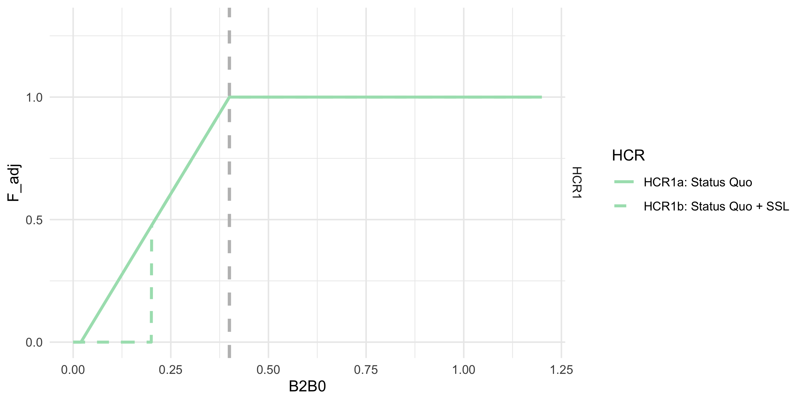
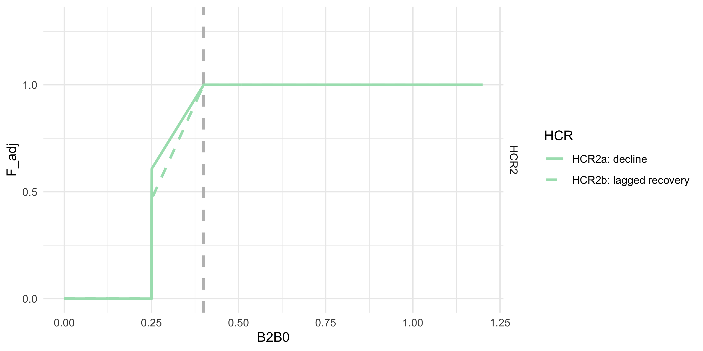
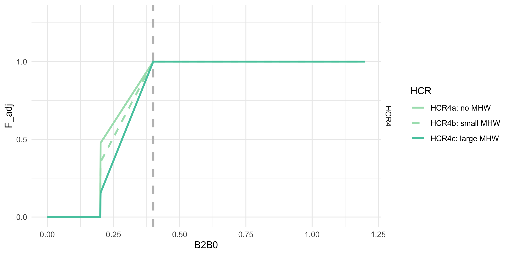
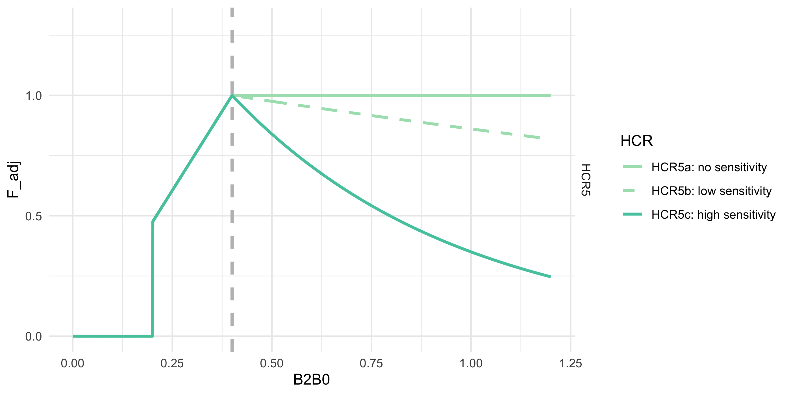
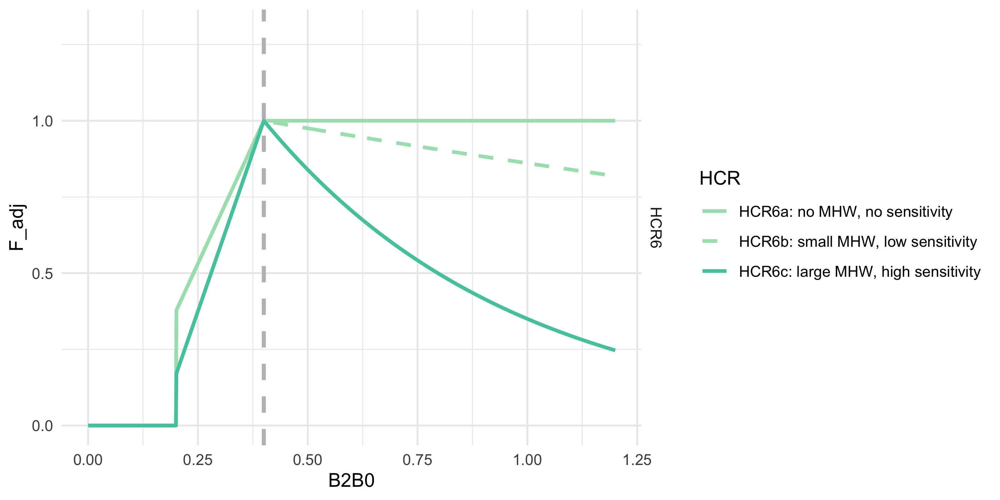

# Overview

During ACLIM phase 2 (2019-2022), modelers evaluated a suite of Harvest Control Scenarios (1-5). Below is a list of those standardized harvest control rules and the equations used to derive the curves.

# ABC+HCR 1: Status quo

This is the basic sloping harvest control rule for groundfish in the EBS. There is a B20% cut-off for SSL (Atka, pollock, P. cod). $F_{ABC_{max}}$ is the HCR adjusted F rate that corresponds to ABC. The Tier three approach is to set the slope of the sloping HCR to $\alpha = 0.05$ and $B_{lim} = 0$ and $B_{target} = B_{40\%}$ or $B_{target} = 0.4B_{100\%}$ (i.e., 40\% of unfished biomass $B_{100\%}$, as an MSY proxy) for most species except $B_{lim} = B_{20\%}$ for pollock and Pacific cod.

Eq. 1 $$F_{ABC_{max}} = \begin{array}{ll}  
 F_{ABC} &~~~~~~~~ \frac{B}{B_{target}}>1 \\  
 F_{ABC}((\frac{B}{B_{target}}-\alpha)/(1-\alpha)) &~~~~~~~~ \frac{B}{B_{target}} < 1 \leq B_{lim} \\  
 0 &~~~~~~~~ \frac{B}{B_{target}} < B_{lim}  
 \end{array}$$  

{width="80%"}

# ABC+HCR 2: Lagged recovery to estimate emergency relief financing needs

This simulation set will help us estimate the approximate cost of emergency relief funds by artificially closing the fishery at $B_{25\%}$% (mimicking an enconomic driven closure). During recovery to mimick lagged fishery recovery from a closure shock, we further delay F rate by inducing a stronger alpha during the recovery period. Implementation of this would be to shorten the recovery period following a shock through a "rainy day" fund to supplement the fishery during climate shocks.

This is the same as in HCR 1 except that the fishery shuts down earlier at $B_{lim} = B_{25\%}  $ and during the simulated lagged recovery the alpha is steeper (slower recovery; $\alpha = 0.30$ instead of $\alpha = 0.05$
 
Details: Sloping HCR, $B_{target} = B_{40\%}$  $\alpha = 0.05$, $B_{lim} = B_{25\%}$, i.e., the cutoff to initiate emergency \$ and a steeper $\alpha = 0.30$ during recovery (recovery occurs at $B_{40\%}$). Calculate difference in catch relative to HCR1 to get an estimate of what \$ relief would be needed to supplement the fishery. Apply a steeper slope (alpha) on recovery.

{width="80%"}

# ABC+HCR 3: Long-term resilience (stronger reserve) Ftarget

This is the same as in HCR 1 except that the fishery shuts down earlier at $B_{target} = B_{50\%}$ and during the simulated lagged recovey the alpha is steeper (slower recovery; $\alpha = 0.30$ instead of $\alpha = 0.05$.

Details: Set the target to 50% of $B_{100\%}$ instead of 40% B40 ($\alpha = 0.05$, $B_{lim} = B_{20\%}$, $B_{target} = B_{50\%}$). We’re testing whether this would result in more stable biomass levels and catches.

{width="80%"}

# ABC+HCR 4: CE informed sloping rate, e.g., MHW category alpha

This is the same as in HCR 1 except that the proposed approach would scale back harvest rates faster below B_target for species that are climate sensitive, or during MHWs. 
Set the target to 40\% of B_{100\%} ($\alpha = 0.05$, $B_{lim} = B_{20\%}$, $B_{target} = B_{40\%}$) for normal conditions/climate resilient species. But for other species, Below $B_{40\%}$ have steeper alphas based on MHW category forecasts for summer conditions ( or alternatively, climate vulnerability ratings). This reduces future harvest intensity when conditions are forecast to be poor and could help rebound stocks faster following MHW. MHWs are characterized as Category 1-4 based on the degree of anomalous conditions above mean climatology (Category 1 = +1 standard deviations above the mean climatology, Category 4 = +4 SD).

Details: Set the target to 40% of $B_{100\%}$, ($\alpha = 0.05+\mathrm{MHW}_{category}*.09$, $B_{lim} = B_{20\%}$, $B_{target} = B_{40\%}$). E.g., shown, Category 2 MHW set the $\alpha = 0.23$, for large MHW set the $\alpha = 0.41$. We’re testing whether this would result in more stable biomass levels and catches.

{width="80%"}

# ABC+HCR 5: climate sensitivity reserve (buffer shocks)

{width="85%"}

The general idea here is to combine the HCR 4 MHW category 0-4 scaling factor when below B_target (B40) and a cap-like effect when over $B_{target}$ The steepness of that cap effect could be varied based on vulnerability (or approximated via MSE), more sensitive species might need more reserve in the "bank". Pollock are an example of the HCR 5 in practice (via effects of the 2MT cap + sloping HCR).

Details: Set the target to 40\% of $B_{100\%}$ ($\alpha = 0.05$, $B_{lim} = B_{20\%}$, $B_{target} = B_{40\%}$).After $B_{40\%}$ have a slowly sloping F proportional to climate vulnerability (or MHW category) to mimic realized F rates of pollock under the 2 MT cap, i.e., reserve biomass for climate shocks sensu Holsman et al. 2020. This could use MHW decadal predictions to set the right hand side of the curve above $B_{40\%}$.In this the climate sensitivitiy buffer $\gamma$ is a value 0 to 1 that scales the reserve for biomass above $B_{target}$, i.e., $B_{40\%}$:

Eq. 1 $$F_{ABC_{max}} = \begin{array}{lll}  
 F_{ABC}\ e^{(-\gamma(\frac{B}{B_{target}}-1))} &~~~~~~~~\frac{B}{B_{target}}>1, ~~\mathrm{and}~~ \gamma < \frac{B}{B_{target}}\\ 
 F_{ABC}((\frac{B}{B_{target}}-\alpha)/(1-\alpha)) &~~~~~~~~ \frac{B}{B_{target}} < 1 \leq B_{lim} \\  
 0 &~~~~~~~~ \frac{B}{B_{target}} < B_{lim}  
 \end{array}
 $$  
 
 
Details: Set the target to 40% of $B_{100\%}$, ($\alpha = 0.05$, $B_{lim} = B_{20\%}$, $B_{target} = B_{40\%}$). Shown, for small MHW set the $\alpha = 0.2$, for large MHW set the $\alpha = 0.4$. We’re testing whether this would result in more stable biomass levels and catches.

 
{width="80%"}

# ABC+HCR 6: MHW slope + climate sensitivity reserve (buffer shocks)

{width="80%"}

{width="80%"}
