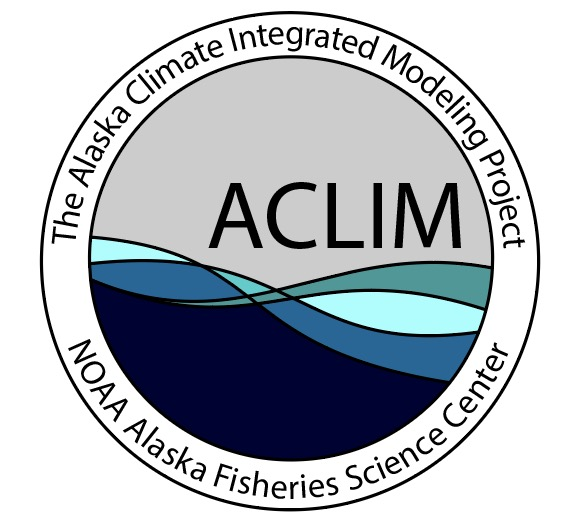
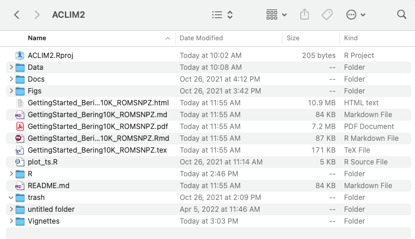

```{r startup, eval=TRUE, echo=FALSE, results='hide',message=FALSE}
 
 #source("R/make.R")       # loads packages, data, setup, etc.
 knitr::opts_chunk$set(echo = T, fig.align="center",warning = FALSE, message = FALSE)
 #knitr::opts_knit$set(root.dir = '../')
 #options(knitr.table.format = "latex")
 thisYr <- format(Sys.time(), "%Y")
 today  <- format(Sys.time(), "%b %d, %Y")
 
```


<center>

{ height=50%, width=50%}

</center>

# Welcome {.tabset}

 is maintained by **[Kirstin Holsman](mailto:kirstin.holsman@noaa.gov)**, Alaska Fisheries Science Center, NOAA Fisheries, Seattle WA. Multiple programs and projects have supported the production and sharing of the suite of Bering10K hindcasts and projections. *Last updated: `r today`*. ACLIM is supported through various funding and academic partnerships](Figs/logo3.png){ width=100%}


## ACLIM overview

### What is ACLIM?
The Alaska Climate Integrated Modeling project (ACLIM) represents a comprehensive effort by NOAA Fisheries and partners to describe and project responses of the Bering Sea ecosystem— both the physical environment and human communities—to varying climate conditions. It connects research on global climate and socioeconomic projections to regional circulation, climate enhanced biological models, and socio-economic and harvest scenarios. This effort informs managers of the risks of climate change on fish and fisheries and enables the evaluation of a range of adaptation strategies.

ACLIM is a collaboration between 50+ scientists and decision makers including physical oceanographers, ecosystem modelers, economists, social scientists, and fishery, Alaskan community partners, the NPFMC, and living marine resource managers.

ACLIM is focusing on key species (fish, crabs and marine mammals) where changes in productivity have been linked to climate variability. A subset of scientists in ACLIM are also looking at impacts on other species in the food web and the broader ecosystem. To evaluate a range of possible future conditions, scientists are evaluating the effectiveness of existing fishery management actions under different climate scenarios (spanning high and low CO2 futures expected to lead to different degrees of warming). We also explore how human fishing fleets and Alaskan communities can adapt to climate change through climate-informed management.


### Who we are

### What we plan to do in phase 3

## Clone the ACLIM2 repo

To run this tutorial first clone the ACLIM2 repository to your local drive:

### Option 1: Use R  

This set of commands, run within R, downloads the ACLIM2 repository and unpacks it, with the ACLIM2 directory structrue being located in the specified `download_path`.  This also performs the folder renaming mentioned in Option 2.

```{r gitdwnld, eval = FALSE,echo =T}

    # Specify the download directory
    main_nm       <- "ACLIM2"

    # Note: Edit download_path for preference
    download_path <-  path.expand("~")
    dest_fldr     <- file.path(download_path,main_nm)
    url           <- "https://github.com/kholsman/ACLIM2/archive/main.zip"
    dest_file     <- file.path(download_path,paste0(main_nm,".zip"))
    
    download.file(url=url, destfile=dest_file)
    
    # unzip the .zip file (manually unzip if this doesn't work)
    setwd(download_path)
    unzip(dest_file, exdir = download_path,overwrite = T)
    
    #rename the unzipped folder from ACLIM2-main to ACLIM2
    file.rename(paste0(main_nm,"-main"), main_nm)
    setwd(main_nm)
    
```

### Option 2: Download the zipped repo  
Download the full zip archive directly from the [**ACLIM2 Repo**](https://github.com/kholsman/ACLIM2) using this link: [**https://github.com/kholsman/ACLIM2/archive/main.zip**](https://github.com/kholsman/ACLIM2/archive/main.zip), and unzip its contents while preserving directory structure. 

**Important!** If downloading from zip, please **rename the root folder** from `ACLIM2-main` (in the zipfile) to `ACLIM2` (name used in cloned copies) after unzipping, for consistency in the following examples.

<!-- Your final folder structure should look like this: -->

<!-- { width=100%} -->

### Option 3: Use git commandline

If you have git installed and can work with it, this is the preferred method as it preserves all directory structure and can aid in future updating. Use this from a **terminal command line, not in R**, to clone the full ACLIM2 directory and sub-directories:

```{bash, eval = FALSE,echo =T}
    git clone https://github.com/kholsman/ACLIM2.git
```

---

## Get the data


### ACLIM bias corrected indices: AKFIN Server

https://github.com/kholsman/ACLIM2/blob/main/ACLIM2_quickStart.html

[**Larger raw data: ACLIM PMEL Threads Server **](https://github.com/kholsman/ACLIM2/GettingStarted_Bering10K_ROMSNPZ.html)


### Larger raw data: ACLIM PMEL Threads Server


